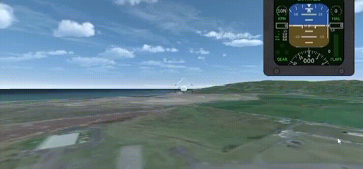

# 🚀 TensorAeroSpace

<div align="center">

[](./readme.md)
[](./README.ru-ru.md)
[](https://tensoraerospace.readthedocs.io/en/latest/?badge=latest)
[](https://deepwiki.com/TensorAeroSpace/TensorAeroSpace)
[](https://www.python.org/downloads/)
[](LICENSE)
[](https://github.com/tensoraerospace/tensoraerospace/stargazers)


**Open-source аэрокосмический симулятор + каталог адаптивного управления**

*Pure-NumPy 6-DoF динамика · Gymnasium-native среды · Classical / ADP / Deep RL агенты · 894 теста*

[📖 Документация](https://tensoraerospace.readthedocs.io/) • [🚀 Быстрый старт](#-быстрый-старт) • [💡 Примеры](./example/) • [🤝 Участие в разработке](CONTRIBUTING.md)

</div>

---

## 🌟 Обзор

**TensorAeroSpace** содержит **12+ моделей самолётов и космических аппаратов** (7 из них — полные нелинейные 6-DoF планеры с рецензированными исходными данными), **20 алгоритмов управления** от классического PID/MPC через семейство incremental-ADP до современного deep RL, и **101 исполняемый example-notebook** с trim, крейсом, координированными поворотами, повреждениями в полёте и восстановлением — всё связано через стандартный Gymnasium API.

Чем выделяется:

- 🎯 **Реальные самолёты, не игрушки.** B-747 транскрибирован из NASA CR-2144, X-15 из NASA TM X-1669, Skywalker X8 из CEAS Aeronautical Journal 2025, B-737 из JSBSim + Roskam, RQ-7 Shadow из Beard & McLain. Trim-точки достигают машинной точности.
- ⚡ **Ядро — чистый NumPy.** Никаких проприетарных симуляторов, MATLAB-лицензий, скомпилированных бинарников. На порядок быстрее JSBSim для свипов синтеза управления.
- 🧠 **Уникальный каталог адаптивного управления.** Стандартный RL-стек (PPO, SAC, DDPG, DQN, A2C, A3C, GAIL) **плюс** полная семья incremental-ADP (IHDP, IM-GDHP, ET-DHP, iADP, AA-INDI, AIDI) — редко в одном OSS-пакете.
- 💥 **Подсистема повреждений из коробки.** Per-surface потеря эффективности, hard-overs, jam-события, асимметричная тяга при отказе двигателя, override flap-jam — всё в `DamageProfile`.
- 🧪 **894 unit-теста.** Сходимость trim, конвенции знаков, время выгорания топлива — всё под регрессионным покрытием.

## 🧭 Направления прикладного использования

1. **Автоматическое управление летательными аппаратами** — стабилизация, следование траектории, управление угловым положением для самолётов, БПЛА и экспериментальных аппаратов.
2. **Управление ракетно-космическими системами** — моделирование и управление ракетами-носителями, спутниками различных классов орбит, оптимизация траекторий выведения.
3. **Гибридные системы управления** — проектирование и настройка контуров, сочетающих классические и интеллектуальные методы управления.
4. **Оптимизация и сравнительный анализ алгоритмов** — автоматизированный подбор гиперпараметров, бенчмаркинг, визуализация метрик качества.
5. **Интеграция с симуляционными платформами** — Unity ML-Agents, MATLAB/Simulink, SimInTech, экспорт и импорт моделей между средами.
6. **Анализ надёжности и диагностика** — исследование отказных режимов, оценка устойчивости, FTC-исследования, подготовка данных для обучения.

Каждое направление имеет рабочие примеры и документацию (см. раздел [📚 Примеры и руководства](#-примеры-и-руководства)).

## 🚀 Быстрый старт

> 💡 **Интерактивный walkthrough**: откройте блокнот [quickstart.ipynb](./example/quickstart.ipynb), чтобы запустить SAC‑бенчмарк для B-747 от начала до конца прямо в Jupyter / VS Code.

### ✅ Минимальные технические требования

| Компонент | Минимум | Рекомендовано |
| --- | --- | --- |
| **ОС** | Linux x86_64, Windows 10, macOS 13 | Ubuntu 22.04 LTS / Windows 11 |
| **CPU** | 4 ядра, AVX | 8+ ядер, AVX2/FMA |
| **RAM** | 8 ГБ | 16–32 ГБ для RL/Simulink |
| **GPU** | Необязательно | NVIDIA RTX с ≥8 ГБ VRAM для SAC/DSAC/PPO, поддержка CUDA 12.2 |
| **Python** | 3.10–3.13 | 3.11/3.12 |
| **Доп. ПО** | Git, Poetry или pip, Docker | MATLAB/Simulink R2022b+ (Simulink-примеры), Unity 2021.3.5f1/2023.2.20f1 |

### 📦 Установка

#### Установка Poetry (1 раз)

```bash
curl -sSL https://install.python-poetry.org | python3 -
# Windows (PowerShell):
(Invoke-WebRequest -Uri https://install.python-poetry.org -UseBasicParsing).Content | python -
poetry --version
```

#### Использование Poetry (рекомендуется)

```bash
git clone https://github.com/tensoraerospace/tensoraerospace.git
cd tensoraerospace
poetry install
poetry shell        # активация виртуального окружения
poetry run pytest   # быстрая проверка (894 теста)
```

#### Использование pip

```bash
pip install tensoraerospace
```

#### 🐳 Docker

Образ **по умолчанию запускает JupyterLab** (см. `Dockerfile`).

```bash
docker pull ghcr.io/tensoraerospace/tensoraerospace:latest
docker run --rm -it -p 8888:8888 \
  -v "$(pwd)/projects:/workspace/projects" \
  ghcr.io/tensoraerospace/tensoraerospace:latest

# GPU (NVIDIA Container Toolkit)
docker run --rm -it --gpus all -p 8888:8888 \
  -v "$(pwd)/projects:/workspace/projects" \
  ghcr.io/tensoraerospace/tensoraerospace:latest
```

> Откройте выданную ссылку (обычно `http://127.0.0.1:8888`) и перейдите к `examples/quickstart.ipynb`.

### 🏃‍♂️ Быстрый пример — PID + линейная F-16

```python
import gymnasium as gym
import numpy as np
from tensoraerospace.agent.pid import PID
from tensoraerospace.utils import generate_time_period
from tensoraerospace.signals.standard import unit_step

dt = 0.01
tp = generate_time_period(tn=10, dt=dt)
N = len(tp)
reference = unit_step(degree=5, tp=tp, time_step=100, output_rad=True).reshape(1, -1)

env = gym.make('LinearLongitudinalF16-v0',
               number_time_steps=N, initial_state=[[0], [0]],
               reference_signal=reference, use_reward=False)
pid = PID(env, kp=-14.290, ki=-8.240, kd=-1.299, dt=dt)

obs, _ = env.reset()
for t in range(N - 1):
    u = pid.select_action(reference[0, t], float(obs[0]))
    obs, *_ = env.step(np.array([[float(u)]], dtype=np.float32))
```

### 💥 Моделирование повреждений в полёте

Запланируйте отказы декларативно — потерю законцовки, заклинивание поверхностей, остановку двигателя — и среда пересчитает массу, инерцию, аэродинамику в реальном времени. Управляющий агент с момента события сталкивается уже с другим объектом управления.

```python
import numpy as np
from tensoraerospace.aerospacemodel.f16.nonlinear.damage import WING_STRIKE_LEFT_TIP
from tensoraerospace.envs.f16.nonlinear_angular import NonlinearAngularF16

env = NonlinearAngularF16(
    initial_state=np.zeros(14),
    number_time_steps=2000,
    damage_profile=WING_STRIKE_LEFT_TIP,  # потеря левой законцовки на t=10 с
    split_stab=True,
)
obs, _ = env.reset()
for _ in range(2000):
    obs, r, term, trunc, info = env.step(np.zeros(4))
    if info.get("damage_events_triggered"):
        print(info["damage_events_triggered"])  # → ['left_tip_full_loss']
```

Что моделируется: **потеря секции** (m, S, b, MAC, ЦМ, J, аэро-коэффициенты пересчитываются через теорему Гюйгенса-Штейнера), **отказ рулевой поверхности** (jam / efficiency_loss / lost), **отказ двигателя** (масштабирование/обнуление тяги), **структурные изменения** (сброс груза, обледенение).

- **Потеря секции** (крыло/стабилизатор/киль): масса *m*, площадь крыла *S*, размах *b*, MAC, ЦМ, тензор инерции **J**, аэродинамические коэффициенты — всё пересчитывается из посекционных вкладов через теорему Гюйгенса-Штейнера.
- **Отказ рулевой поверхности** (`jam` / `efficiency_loss` / `lost`): команда **u**<sub>cmd</sub> → **u**<sub>eff</sub> перед интегратором.
- **Отказ двигателя** (частичный/полный): эффективная тяга масштабируется или зануляется.
- **Структурные изменения** (сброс груза, обледенение): Δ массы / ЦМ / инерции.

📖 [Полный референс по моделированию повреждений ЛА](https://tensoraerospace.readthedocs.io/ru/latest/model/aircraft-damage-modeling/)

## 🤖 Поддерживаемые алгоритмы

### Классическое управление

| Алгоритм | Описание |
|---|---|
| **PID** | Пропорционально-интегрально-дифференциальный регулятор с anti-windup и автонастройкой в стиле MATLAB. Сильный baseline для state-space задач; автотюнер извлекает матрицы `(A, B, C, D)` среды и оптимизирует PID-коэффициенты дифференциальной эволюцией. |
| **MPC** | Модельно-предиктивное управление с тремя сменными вариантами модели объекта — MLP, NARX и Transformer — поверх QP/численной оптимизации с уходящим горизонтом. |

### Глубокое RL — on-policy

| Алгоритм | Описание |
|---|---|
| **PPO** | Proximal Policy Optimization — стабильный «just works» старт для непрерывных и дискретных задач. |
| **A2C** | Advantage Actor-Critic — синхронный on-policy, удобен как референс. |
| **A2C-NARX** | A2C с NARX-критиком вместо MLP — лучше захватывает временную структуру. |
| **A3C** | Asynchronous Advantage Actor-Critic — несколько воркеров на общую сеть; лучший выбор для CPU-параллельного обучения (Unity-окружения). |

### Глубокое RL — off-policy

| Алгоритм | Описание |
|---|---|
| **SAC** | Soft Actor-Critic — off-policy с максимизацией энтропии. Эффективный по данным дефолт для непрерывного управления; интеграция HuggingFace через `from_pretrained` / `publish_to_hub`. |
| **DSAC** | Distributional SAC с квантильными (IQN-стиль) сдвоенными критиками + CAPS-регуляризацией. Лучшая динамика слежения по сравнению с обычным SAC. |
| **DDPG** | Deep Deterministic Policy Gradient — основополагающий, но SAC превосходит его в большинстве случаев. |
| **DQN** | Deep Q-Learning — value-based для дискретных пространств действий; используется для Unity-окружений. |

### Имитационное обучение

| Алгоритм | Описание |
|---|---|
| **GAIL** | Generative Adversarial Imitation Learning — обучение по экспертным демонстрациям без явного reward'а. |

### Adaptive Dynamic Programming (модельные критики)

| Алгоритм | Описание |
|---|---|
| **HDP** | Heuristic Dynamic Programming — актор-критик с предобученной оффлайн plant-сетью, дающей градиент политики через `∂f/∂u`. |
| **ADHDP** | Action-Dependent HDP — функция ценности зависит от пары `(состояние, действие)`. |
| **ADP** | Базовое Adaptive Dynamic Programming — value-iteration без явной модели ОУ. |
| **IHDP** | Incremental HDP — актор-критик с **онлайн инкрементальной линеаризацией** ОУ. Сильный baseline для онлайн-управления полётом. |
| **NARX** | Нелинейная авторегрессионная сеть — используется и как plant-модель для MPC, и как критик в `A2C-NARX`. |

### Онлайн-адаптивные критики для отказоустойчивого полёта

| Алгоритм | Описание |
|---|---|
| **iADP** | Incremental Approximate Dynamic Programming — онлайн RLS-идентификация локальной инкрементальной модели `(F̃, G̃)` плюс замкнутая квадратичная политика. Восстанавливается за десятки миллисекунд. |
| **IM-GDHP** | Incremental-Model GDHP — онлайн RLS-идентификатор объекта в паре с GDHP-критиком. Лёгкий, интерпретируемый. |
| **ET-DHP** | Event-Triggered Dual HDP — Lipschitz event-trigger запускает обновления actor/critic только при превышении порога. Bandwidth-aware для embedded. |
| **AIDI** | Adaptive Incremental Dynamic Inversion — INDI с поканальным VFF-RLS. Отказоустойчив, model-agnostic. |
| **AA-INDI** | Adaptive Augmented INDI — для асимметричных отказов приводов и flying-wing с связанными управляющими поверхностями. |

## ✈️ Модели самолётов и космических аппаратов

### 🛩️ Самолёты с неподвижным крылом (нелинейные 6-DoF, рецензированные исходники)

| Самолёт | Класс | Источник аэродинамики | Особенность |
|---|---|---|---|
| **F-16 Fighting Falcon** | Истребитель | NASA / Stevens-Lewis | Cubic-spline aero, полная damage-подсистема (linear longitudinal · nonlinear longitudinal · 6-DoF angular) |
| **Boeing 747-100** | Тяжёлый транспорт | NASA CR-2144 (Heffley & Jewell) | Помоторная асимметричная тяга + flap jam (3 конфигурации: NOMINAL, POWER_APPROACH, LANDING) |
| **Boeing 737-100/800** | Средний транспорт | JSBSim + Roskam Vol VI | Бенчмарки координированного поворота, JT8D / CFM56-7B engines |
| **X-15** | Гиперзвуковой research | NASA TM X-1669 + Thompson 2000 | Mach 0.4–6.7 tabulated, ракета XLR99, переменная масса |
| **Skywalker X8** | Малый UAV (3.4 кг) | CEAS Aeronautical Journal 2025 | Рецензированная flight-test ID, flying-wing |
| **AAI RQ-7 Shadow** | UAV класса II (170 кг) | Beard & McLain + NASA TM-2014-218686 | V-tail mixed control, 4-канальное |
| **F-4C Phantom II** | Военный истребитель-бомбардировщик | Roskam | Linear longitudinal + improved env |

### 🚁 БПЛА и дроны

- **LAPAN LSU-05** — индонезийский разведывательный БПЛА
- **Ultrastick-25e** — модель радиоуправляемого самолёта
- **Универсальный БПЛА** — настраиваемая state-space динамика
- **Quadrotor** — полная нелинейная 6-DoF + per-rotor damage subsystem + X-config allocator

### 🚀 Ракеты и спутники

- **ELV (Expendable Launch Vehicle)** — динамика ракеты-носителя
- **Универсальная модель ракеты** — настраиваемая симуляция
- **GeoSat** — геостационарная орбитальная механика
- **ComSat** — динамика и управление спутника связи

## 🎮 Среды моделирования

### 🎯 Интеграция с Unity ML-Agents

<div align="center">



</div>

- 🎮 **3D визуализация** в реальном времени
- 🔄 **Реалистичное обучение** — агенты в физически богатых сценах
- 📊 **Сенсорный набор** — камера, LiDAR, физические сенсоры
- 🌍 **Пользовательские сценарии** — создавайте свои аэрокосмические задачи

> 📁 Пример среды: [UnityAirplaneEnvironment](https://github.com/TensorAeroSpace/UnityAirplaneEnvironment)

### 🔧 Поддержка MATLAB Simulink


- 📐 **Импорт моделей** Simulink в Python
- ⚡ **Высокая производительность** через скомпилированный C++
- 🔄 **Двунаправленный** workflow MATLAB ↔ Python
- 📊 **Кросс-платформенная валидация**

### 📊 Матрицы пространства состояний

Математическая основа для проектирования систем управления:

- 🧮 **Линейные модели** — представление в state-space
- 🎛️ **Синтез управления** — современная теория управления
- 📈 **Инструменты анализа** — устойчивость, управляемость, наблюдаемость
- 🔄 **Линеаризация** нелинейных моделей

## 📚 Примеры и руководства

В директории [`./example`](./example/) — **101 исполняемый notebook**, организованных по классу регулятора. Папка недавно реструктуризирована для предсказуемой навигации — см. [`example/README.md`](./example/README.md) для полной карты.

| Категория | Папка | Highlights |
|---|---|---|
| 🚀 **Быстрый старт** | [`quickstart.ipynb`](./example/quickstart.ipynb) | Минимальный end-to-end pipeline |
| 🎮 **Среды** | [`environments/`](./example/environments/) | Все самолётные среды (без агента) |
| 🎛️ **Классическое** | [`pid_controllers/`](./example/pid_controllers/), [`mpc_controllers/`](./example/mpc_controllers/) | PID + MPC (MLP / NARX / Transformer) |
| 🧠 **Классическое ADP** | [`dynamic_programming/`](./example/dynamic_programming/) | HDP, DHP, GDHP, AD-HDP, AD-GDHP, AD-DHP |
| 🔄 **Online ADP** | [`reinforcement_learning/incremental_adp/`](./example/reinforcement_learning/incremental_adp/) | IHDP, IM-GDHP, ET-DHP, iADP, AA-INDI, AIDI |
| 🤖 **Deep RL** | [`reinforcement_learning/deep_rl/`](./example/reinforcement_learning/deep_rl/) | A2C, A3C, PPO, DQN, SAC, DSAC, DDPG, GAIL |
| 📊 **Сравнения** | [`comparison/`](./example/comparison/) | PID vs RL head-to-head benchmarks |
| 💥 **Failure-демо** | [`failure_demos/`](./example/failure_demos/) | F-16 dogfight с повреждением, IHDP failure recovery |
| 📖 **Cookbook** | [`cookbook/`](./example/cookbook/) | Step-by-step рецепты от "hello world" до FTC |
| 🔧 **Оптимизация** | [`optimization/`](./example/optimization/) | Optuna hyperparameter search |

### 🆕 Новые избранные примеры

| Пример | Самолёт | Результат |
|---|---|---|
| [**ET-DHP heading hold под отказом двигателя**](./example/reinforcement_learning/incremental_adp/example_etdhp_b747_engine_failure.ipynb) | B-747 | ψ-error **0.28°** vs open-loop −85.5° |
| [**MIMO IHDP координированный поворот 90°**](./example/reinforcement_learning/incremental_adp/example_ihdp_nonlinear_b737_turn.ipynb) | B-737 | финальная ψ-error **0.98°**, max сайдслип 0.11° |
| [**IHDP θ-step tracking на нелинейном B-747**](./example/reinforcement_learning/incremental_adp/example_ihdp_nonlinear_b747.ipynb) | B-747 | late-half MAE **0.043°** |
| [**X-15 hypersonic boost-burnout демо**](./example/aircraft/example_b747_nonlinear.py) | X-15 | выгорание 79.8 с vs Thompson 2000: 80 с |

### Быстрые команды запуска

```bash
# Запуск pretrained SAC на B-747
poetry run python example/reinforcement_learning/deep_rl/sac-b747-render.py --render --dt 0.1

# Запуск pretrained DDPG
poetry run python example/reinforcement_learning/deep_rl/ddpg-b747-render.py --repo TensorAeroSpace/ddpg-b747

# Обучение DSAC step-response
poetry run python example/reinforcement_learning/deep_rl/train_dsac_b747_step_response.py
```

📖 Подробные walkthrough в документации:
- [Example SAC F-16](https://tensoraerospace.readthedocs.io/ru/latest/example/agent/sac/example-sac-f16.html)
- [B-737 координированный поворот (IHDP)](https://tensoraerospace.readthedocs.io/ru/latest/example/agent/ihdp/example_ihdp_nonlinear_b737_turn.html)
- [B-747 удержание курса при отказе двигателя (ET-DHP)](https://tensoraerospace.readthedocs.io/ru/latest/example/agent/et_dhp/example_etdhp_b747_engine_failure.html)
- [Optuna optimization](https://tensoraerospace.readthedocs.io/ru/latest/example/optimization/example_optimization.html)
- [Unity Guide](https://tensoraerospace.readthedocs.io/ru/latest/guide/unity_env.html)

## 🛠️ Разработка

```bash
git clone https://github.com/tensoraerospace/tensoraerospace.git
cd tensoraerospace
poetry install --with dev
poetry run pytest                       # все 894 теста
poetry run pytest tests/aerospacemodel  # конкретная категория
poetry run mkdocs serve -a 0.0.0.0:8000 # preview документации
```

См. [CONTRIBUTING.md](CONTRIBUTING.md) для рекомендаций.

## 📖 Документация

- 📚 **Полная документация**: [tensoraerospace.readthedocs.io](https://tensoraerospace.readthedocs.io/)
- 🚀 **API reference** — детальная документация по модулям
- 📝 **16-рецептовый cookbook** — от "hello world" до FTC под повреждением
- 💡 **11-урочный туториал** — state-space → controllability → RL fundamentals → XFLR5 / Simulink hands-on
- ❓ **Q&A**: [DeepWiki AI assistant](https://deepwiki.com/TensorAeroSpace/TensorAeroSpace)

## 🤝 Сообщество и поддержка

- 💬 [GitHub Discussions](https://github.com/tensoraerospace/tensoraerospace/discussions)
- 🐛 [Issue tracker](https://github.com/tensoraerospace/tensoraerospace/issues)
- 📧 [Email support](mailto:support@tensoraerospace.org)

## 📄 Лицензия

MIT — см. [LICENSE](LICENSE).

## 🙏 Благодарности

- Команде Gymnasium / OpenAI Gym за каноничный RL environment API
- Команде Unity ML-Agents за инфраструктуру 3D-симуляции
- Аэрокосмическому исследовательскому сообществу за десятилетия открытых опубликованных производных — NASA CR-2144 (Heffley & Jewell), NASA TM X-1669 (Walker & Wolowicz), CEAS Aeronautical Journal 2025 (Løw-Hansen et al.), JSBSim, Roskam, Beard & McLain, Mattingly
- Каждому контрибьютору, делающему этот проект возможным

---

<div align="center">

**⭐ Поставьте звезду на GitHub, если TensorAeroSpace полезен для вашей работы! ⭐**

Сделано с ❤️ командой TensorAeroSpace

</div>
