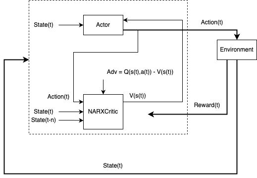

A2C c NARXСritic
================

Алгоритм A2C основан на методе градиента политики, где актер представляет собой сеть, генерирующую действия для управления объектом, а критик оценивает эти действия, вычисляя функцию преимущества A(s,a)=Q(s,a)-V(s), где Q(s,a) - функция оценки действия, V(s) - функция состояния

Применение NARX-сети в роли критика позволяет значительно улучшить качество оценки действий актера благодаря высокой способности NARX к моделированию нелинейных и динамических систем.

Идентификация объекта управления происходит за счет обучения NARX-сети предсказывать поведение объекта управления на основе его предыдущих состояний и выполненных действий. Это достигается путем минимизации разницы между предсказанными и реальными значениями выходных данных системы. 

Документация
------------

.. autoclass:: tensoraerospace.agent.a2c.narx.A2CLearner
  :members:
  :inherited-members:

.. autoclass:: tensoraerospace.agent.a2c.narx.Runner
  :members:
  :inherited-members: