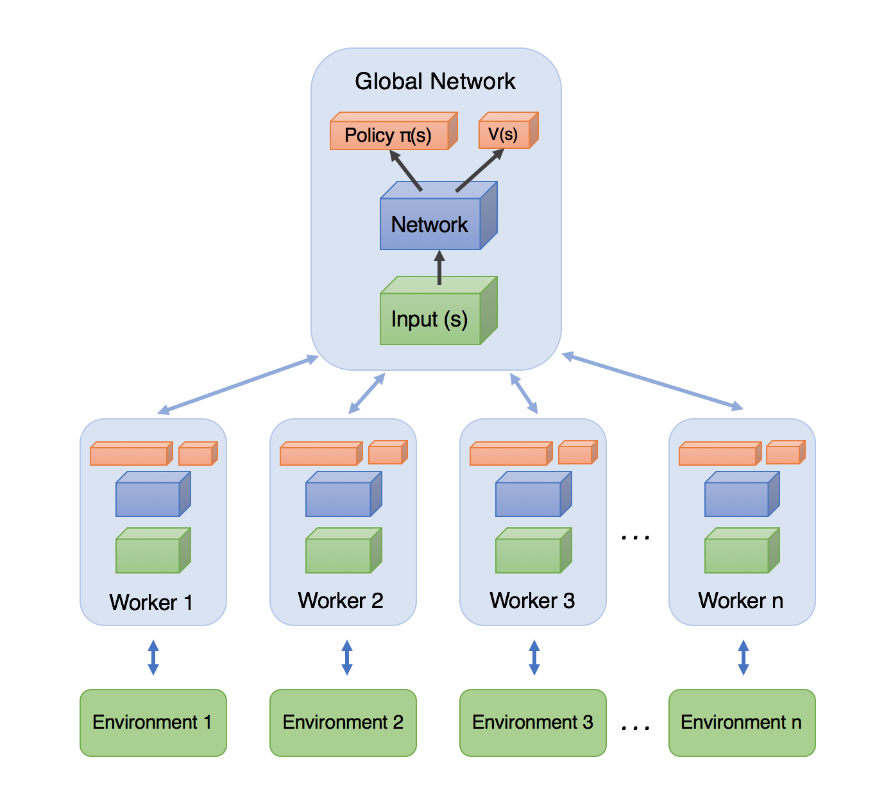

A3C
================================================================
Алгоритм A3C (Asynchronous Advantage Actor-Critic) представляет собой один из прогрессивных методов в области обучения с подкреплением. Этот метод объединяет преимущества метода actor-critic с асинхронными методами обучения.

Алгоритм Asynchronous Advantage Actor Critic использует advantage функцию для обновления агентов.
Также в данном алгоритме используются асинхронные агенты для исследования среды и в качестве замены реплей буфера.

Основные особенности A3C 

**Асинхронность**: В отличие от традиционных методов, в которых обучение происходит по последовательным эпизодам, A3C запускает несколько независимых процессов в параллельных окружениях. Каждый из этих процессов исследует свое окружение и обновляет глобальную сеть независимо. Это уменьшает корреляцию между различными сэмплами и улучшает обучение.

**Actor-Critic Архитектура**: A3C использует структуру Actor-Critic, где Actor определяет текущую политику действий, а Critic оценивает эту политику. При этом Actor и Critic могут быть представлены одной нейронной сетью с разделяемыми слоями. Эта структура позволяет A3C использовать преимущества как policy-based, так и value-based подходов.

**Преимущество (Advantage) функция**: A3C использует функцию преимущества для оценки качества действия, а не просто ожидаемое вознаграждение. Функция преимущества позволяет учесть не только среднее вознаграждение, но и то, насколько действие лучше или хуже, чем обычно. Это помогает агенту лучше оценить качество действий и ускоряет обучение.

**Устойчивость и эффективность**: A3C демонстрирует более стабильное и эффективное обучение по сравнению с другими методами, такими как DQN. Он быстрее сходится к оптимальной стратегии и менее подвержен проблемам, таким как переоценка Q-значений.

Документация
------------

.. autoclass:: tensorairspace.agent.a3c.model.Agent
  :members:

.. autoclass:: tensorairspace.agent.a3c.model.Worker
  :members:

.. autoclass:: tensorairspace.agent.a3c.model.Actor
  :members:

.. autoclass:: tensorairspace.agent.a3c.model.Critic
  :members:

Источники
---------
- `Asynchronous Methods for Deep Reinforcement Learning <https://arxiv.org/abs/1602.01783>`_

На каких средах протестили:
--------------------------------------------
- Unity среда