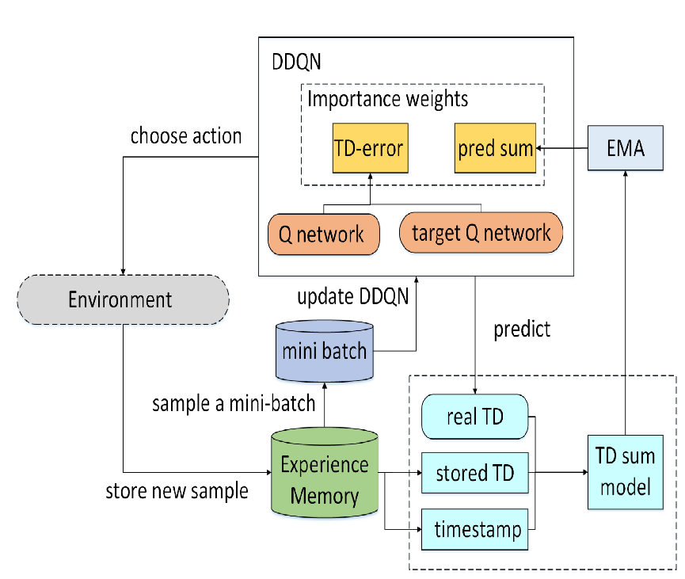

DQN
================================================================
Алгоритм DQN с приоритезированным буффером - алгоритм обучения с подкреплением.
В нём используется основная сеть, целевая и дерево для буфера. Основная сеть используется
для совершения действий в среде. Целевая сеть используется для более мягких обновлений
основной сети. Приоритезированный буфер используется для того чтобы выбирать наиболее
полезные для обучения состояния из буфера.

.. autoclass:: tensorairspace.agent.dqn.model.Model
  :members:
  :inherited-members:

.. autoclass:: tensorairspace.agent.dqn.model.SumTree
  :members:
  :inherited-members:

.. autoclass:: tensorairspace.agent.dqn.model.PERAgent
  :members:
  :inherited-members:
