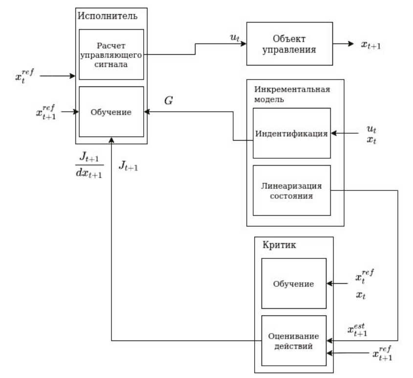

Incremental Heuristic Dynamic Programming
==========================================

Для синтеза закона управления продольным движением СПС используется
алгоритм IHDP, то есть инкрементный вариант алгоритма HDP, входящего в
семейство методов на основе понятия адаптивного критика (ACD). Как уже
отмечалось выше, метод HDP относится к числу наиболее широко
используемых методов семейства ACD. Он, однако, малоэффективен в случае
неполного и неточного знания объекта управления. Схема IHDP 
включает такие три основных элемента, как:

1.	Инкрементная модель предназначенная для определения линеаризованной динамики системы для выбранного состояния.
2.	Исполнитель предназначен для создания управляющего сигнала.
3.	Критик предназначен для оценки действий исполнителя

Источники:

- `Incremental Model Based Heuristic Dynamic Programming for Nonlinear Adaptive Flight Control <https://www.researchgate.net/publication/313696777_Incremental_Model_Based_Heuristic_Dynamic_Programming_for_Nonlinear_Adaptive_Flight_Control>`_