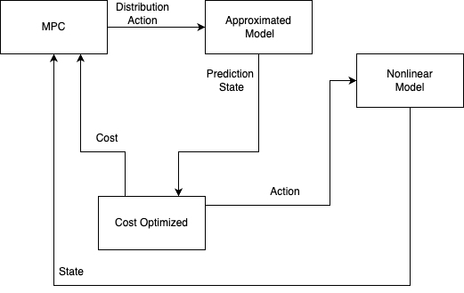

Model Predictive Control
========================

Модель предсказательного управления (MPC) — это метод управления, который использует модель системы для предсказания будущих состояний и оптимизации управляющих воздействий с целью достижения желаемых характеристик поведения системы. MPC рассчитывает оптимальную траекторию управления, минимизируя заданную целевую функцию за предсказанный горизонт времени, при этом учитывая возможные ограничения на управляющие сигналы и состояния системы.

Алгоритм MPC основан на идее оптимизации последовательности управляющих действий на основе предсказания будущих состояний системы. Основные шаги алгоритма включают в себя:

1. Предсказание будущих состояний системы на основе текущего состояния и модели системы.
2. Оптимизация управляющих действий с целью минимизации заранее определенной целевой функции, которая может включать такие критерии, как минимизация ошибки управления, энергопотребления и т.д.
3. Применение первого управляющего действия из оптимизированной последовательности к системе.
4. Повторение процесса на следующем шаге времени с учетом нового текущего состояния системы.

Документация
------------

.. autoclass:: tensoraerospace.agent.mpc.base.AircraftMPC
  :members:
  :inherited-members:

.. autoclass:: tensoraerospace.agent.mpc.dynamics.DynamicsNN
  :members:
  :inherited-members:
