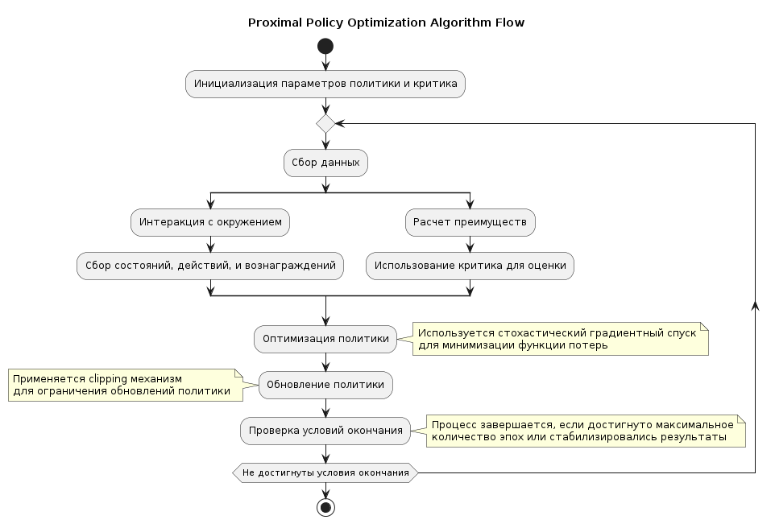

Proximal Policy Optimization (PPO)
================================================================

Proximal Policy Optimization (PPO) — это алгоритм обучения с подкреплением, разработанный для улучшения стабильности и эффективности процесса обучения политики (стратегии принятия решений). PPO является одним из семейства алгоритмов оптимизации политики, который использует некоторые идеи из предшествующего алгоритма TRPO (Trust Region Policy Optimization) для достижения баланса между простотой реализации и сильной производительностью в разнообразных задачах.

Как работает PPO
----------------
PPO работает, оптимизируя "суррогатную" целевую функцию, которая максимизирует прибыль, одновременно ограничивая степень изменения политики на каждом шаге обновления. Это обеспечивает стабильность обучения и предотвращает проблемы, возникающие при больших обновлениях политики. Рассмотрим ключевые шаги PPO:

- **Сбор данных**: Используя текущую политику, агент взаимодействует с окружением и собирает данные о состояниях, действиях и вознаграждениях.

- **Оценка преимуществ**: Оценка функции преимущества для каждого действия, основанная на разнице между полученным вознаграждением и ожидаемым вознаграждением согласно оценочной функции состояния.

- **Оптимизация суррогатной функции**: Вычисляется суррогатная функция прибыли, которая измеряет ожидаемую эффективность действий по сравнению с базовой политикой. Затем оптимизируется эта функция с использованием методов градиентного подъема для обновления параметров политики.

- **Введение клиппинга**: Чтобы избежать слишком больших изменений в политике, PPO вводит механизм клиппинга. Если отношение новой и старой политики выходит за пределы заданного интервала, прибыль клипируется, что ограничивает эффект обновления.

- **Повторение**: Процесс повторяется с обновленной политикой, собирая новые данные и повторяя оптимизацию.

Документация
------------

.. autoclass:: tensoraerospace.agent.ppo.model.PPO
  :members:

Источники
---------
- `Proximal Policy Optimization Algorithms <https://arxiv.org/abs/1707.06347>`_

На каких средах протестили:
--------------------------------------------
- Unity среда