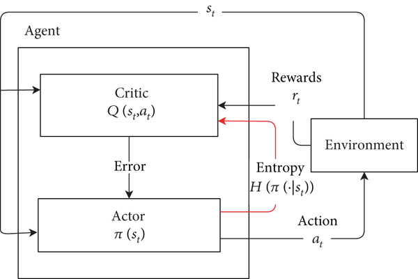

Soft Actor-Critic (SAC) 
=======================

Soft Actor-Critic (SAC) - это алгоритм обучения с подкреплением (reinforcement learning), который объединяет в себе идеи
из актор-критик методов и стохастического градиента стратегии. Он используется для решения задачи обучения с подкреплением,
где агент взаимодействует с окружающей средой и научится принимать оптимальные действия для максимизации некоторой награды.

В SAC актор и критик являются нейронными сетями. Актор отвечает за выбор действий в соответствии с текущим состоянием среды, 
а критик оценивает значение состояния-действия. Однако, в отличие от других алгоритмов, SAC использует стохастический подход 
к выбору действий, представляя стратегию как вероятностное распределение над действиями. Это позволяет агенту исследовать более
широкий набор действий и учитывать неопределенность окружающей среды.

Применение SAC в системах управления самолетом:
SAC может быть применен для обучения системы управления самолетом с целью достижения оптимальных режимов полета и выполнения заданных миссий.
Агентом в этом случае является система управления самолетом, которая взаимодействует с окружающей средой (атмосферой, другими самолетами, навигационными точками и т.д.).
Алгоритм SAC позволяет системе управления самолетом научиться выбирать оптимальные действия, такие как управление поворотами, скоростью, высотой и т.д., чтобы достичь
заданных целей, таких как безопасность, экономичность и эффективность полета.

Документация
------------

.. autoclass:: tensorairspace.agent.sac.SAC
  :members:

.. autoclass:: tensorairspace.agent.sac.ReplayMemory
  :members:

.. autoclass:: tensorairspace.agent.sac.ValueNetwork
  :members:

.. autoclass:: tensorairspace.agent.sac.QNetwork
  :members:

.. autoclass:: tensorairspace.agent.sac.GaussianPolicy
  :members:

.. autoclass:: tensorairspace.agent.sac.DeterministicPolicy
  :members: