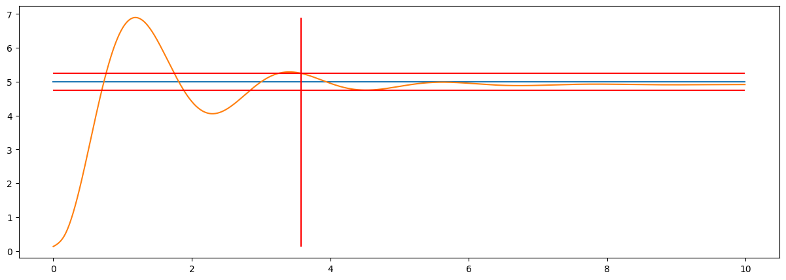

Benchmark
=========

Benchmark представляет собой процесс сравнения производительности системы управления с одной или несколькими другими системами, используя набор стандартных критериев и метрик. В контексте автоматического управления, benchmark важен по нескольким причинам:

- **Оценка производительности:** Benchmark позволяет оценить производительность системы управления, проверив её на стандартном наборе задач или условий. Это помогает определить, насколько хорошо система справляется с её задачами по сравнению с другими системами.

- **Идентификация областей для улучшений:** Процесс сравнения может помочь выявить области, где система управления может быть улучшена. Это может включать как отдельные компоненты системы, так и общую стратегию управления.

- **Проверка устойчивости и надежности:** Benchmark также может использоваться для проверки устойчивости и надежности системы управления. Это особенно важно в ситуациях, где система должна работать в сложных или непредсказуемых условиях.

- **Обеспечение повторяемости:** Использование стандартных benchmark-тестов помогает обеспечить повторяемость результатов, что важно для научных исследований и при сравнении различных подходов.

Использование benchmark в автоматическом управлении помогает обеспечить объективное и систематическое сравнение различных систем и подходов, что содействует развитию этой области.

Benchmark оценивает качество систем управления про помощи таких метрик, как: 

- Перерегулирование системы управления
- Время переходного процесса системы управления
- Степень затухания переходного процесса системы управления 
- Статическая ошибка системы управления

Документация
~~~~~~~~~~~~

.. autoclass:: tensorairspace.benchmark.ControlBenchmark
  :members:

Пример использования
~~~~~~~~~~~~~~~~~~~~

.. code:: python

    from tensorairspace.benchmark import ControlBenchmark
    bench = ControlBenchmark()
    res = bench.becnchmarking_one_step(control_signal_orig, system_signal_orig, 1, dt)

    print("Статическая ошибка: ", res['static_error'])
    print("Время переходного процесса: ", res['settling_time'], "сек")
    print("Степень затухания: ", res['damping_degree'])
    print("Перерегулирование: ", res['overshoot'])

.. parsed-literal::

    Статическая ошибка:  0.08338255502023273
    Время переходного процесса:  3.58 сек
    Степень затухания:  0.07645081312669308
    Перерегулирование:  37.95489807703046

.. code:: python
    
    bench.plot(control_signal_orig, system_signal_orig, 1, dt, tps, figsize=(15,5))

