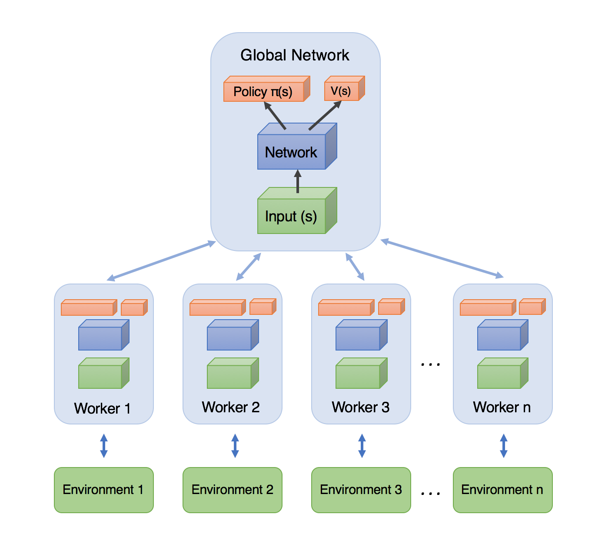

# A3C (Asynchronous Advantage Actor‑Critic)

A3C combines the strengths of policy-based and value-based methods: multiple asynchronous workers explore the environment in parallel and update a shared (global) network using the advantage function. This PyTorch implementation uses multiprocessing with a shared global network and SharedAdam optimizer.

{ width=800 }

## Components

- **Global Network**: Shared parameters for both Actor (policy) and Critic (value) in a single `Net` module
- **Workers**: Independent processes, each with its own environment and local network copy
- **SharedAdam**: Optimizer with shared state across processes for consistent parameter updates
- **Advantage**: TD-error used to weight policy gradients and update value function

## Theory (based on the implementation)

### Network Architecture

The `Net` module combines both Actor and Critic:

**Actor branch:**
- Input → Linear(s_dim, 256) → ReLU6
- → mu: Linear(256, a_dim) → Tanh → scale by 2 (action range: [-2, 2])
- → sigma: Linear(256, a_dim) → Softplus + 0.001 (for numerical stability)

**Critic branch:**
- Input → Linear(s_dim, 256) → ReLU6
- → value: Linear(256, 1)

### Policy (Actor) — Gaussian Distribution

The actor outputs mean \(\mu(s)\) and standard deviation \(\sigma(s)\). Actions are sampled from:

$$
a \sim \mathcal{N}\big(\mu(s),\ \sigma^2(s)\big)
$$

For multidimensional actions, an `Independent` distribution wraps the base Normal distribution.

Log-probability:

$$
\log \pi_\theta(a|s) = -\tfrac{1}{2}\,\frac{(a-\mu)^2}{\sigma^2} - \tfrac{1}{2}\,\log(2\pi\sigma^2)
$$

### Value Function (Critic)

The critic estimates state value \(V_\phi(s)\). The temporal difference error is:

$$
\text{TD} = R_t^{(n)} - V_\phi(s_t)
$$

Value loss (mean squared error):

$$
\mathcal{L}_\text{value} = \mathbb{E}[\text{TD}^2]
$$

### N-Step Returns with Bootstrapping

The implementation uses proper n-step returns with bootstrapping:

$$
R_t^{(n)} = \sum_{k=0}^{n-1} \gamma^k r_{t+k} + \gamma^n V_\phi(s_{t+n})
$$

If the episode terminates, \(V_\phi(s_{t+n}) = 0\).

### Loss Function

**Policy loss** (with entropy regularization):

$$
\mathcal{L}_\text{policy} = -\mathbb{E}\big[\log \pi_\theta(a_t|s_t) \cdot \text{TD} + 0.005 \cdot H[\pi]\big]
$$

where \(H[\pi]\) is the entropy of the policy.

**Total loss**:

$$
\mathcal{L}_\text{total} = \mathbb{E}[\mathcal{L}_\text{policy} + \mathcal{L}_\text{value}]
$$

The advantage (TD-error) is detached when computing policy loss to prevent backpropagation through the value function.

### Asynchrony and Synchronization

The implementation uses `torch.multiprocessing` for parallel training:

1. **Gradient computation**: Each worker computes gradients on its local network
2. **Push gradients**: Local gradients are transferred to global network parameters (`gp._grad = lp.grad`)
3. **Gradient clipping**: Global gradients are clipped (max_norm=40.0) for stability
4. **Optimizer step**: SharedAdam updates global network parameters
5. **Pull parameters**: Local network loads updated global parameters (`load_state_dict`)

This push-and-pull happens every `update_global_iter` steps or when an episode ends.

### Hyperparameters

- `lr`: Learning rate for SharedAdam (default: 1e-4)
- `gamma`: Discount factor (default: 0.99)
- `n_workers`: Number of parallel workers (default: CPU count)
- `max_episodes`: Total episodes to run (default: 10)
- `max_ep_step`: Maximum steps per episode (default: 200)
- `update_global_iter`: Frequency of global updates (default: 10)
- Entropy coefficient: 0.005 (hardcoded in loss function)
- Hidden layer size: 256 (hardcoded in Net architecture)

## Training Algorithm (Pseudocode)

```python
# Global setup
global_net = Net(s_dim, a_dim).share_memory()
optimizer = SharedAdam(global_net.parameters(), lr)

# Each worker runs in parallel:
def worker_process(worker_id):
    local_net = Net(s_dim, a_dim)
    local_net.load_state_dict(global_net.state_dict())  # Initial sync
    env = env_function(worker_id)
    
    while global_episodes < max_episodes:
        s = env.reset()
        buffer_s, buffer_a, buffer_r = [], [], []
        episode_reward = 0
        
        for t in range(max_ep_step):
            # Select action
            a = local_net.choose_action(s)
            s', r, done = env.step(clip(a, action_space))
            
            # Store transition
            buffer_s.append(s)
            buffer_a.append(a)
            buffer_r.append(r)
            episode_reward += r
            
            # Update condition
            if t % update_global_iter == 0 or done:
                # Compute n-step returns with bootstrapping
                if done:
                    v_s_ = 0
                else:
                    v_s_ = local_net.forward(s')[2]  # value estimate
                
                # Reverse accumulation
                returns = []
                for r in reversed(buffer_r):
                    v_s_ = r + gamma * v_s_
                    returns.insert(0, v_s_)
                
                # Compute loss
                loss = local_net.loss_func(buffer_s, buffer_a, returns)
                
                # Push gradients to global, pull updated parameters
                optimizer.zero_grad()
                loss.backward()
                transfer_gradients(local_net, global_net)
                clip_grad_norm(global_net.parameters(), max_norm=40.0)
                optimizer.step()
                local_net.load_state_dict(global_net.state_dict())
                
                # Clear buffers
                buffer_s, buffer_a, buffer_r = [], [], []
                
                if done:
                    record_episode(episode_reward)
                    break
            
            s = s'
```

## Quick Start

Here's a complete example training A3C on the B747 environment to track a sinusoidal pitch angle:

```python
import numpy as np
import torch
from tensoraerospace.envs.b747 import ImprovedB747Env
from tensoraerospace.signals.standard import sinusoid_vertical_shift
from tensoraerospace.utils import convert_tp_to_sec_tp, generate_time_period
from tensoraerospace.agent.a3c import Agent, setup_global_params

# Set random seed
SEED = 42
np.random.seed(SEED)
torch.manual_seed(SEED)

# Create time base and reference signal
dt = 0.1
_tp = generate_time_period(tn=20, dt=dt)
tps = convert_tp_to_sec_tp(_tp, dt=dt)
number_time_steps = len(_tp)

reference_signals = np.reshape(
    sinusoid_vertical_shift(
        tp=np.asarray(tps),
        frequency=0.05,
        amplitude=np.deg2rad(1.0),
        vertical_shift=0.0,
    ),
    [1, -1],
)

# Initial state: [u, w, q, theta]
init_state = np.array([0.0, 0.0, 0.0, 0.0], dtype=np.float32)

# Configure hyperparameters
setup_global_params(
    max_episodes=3000,
    max_ep_step=number_time_steps,
    gamma=0.99,
    update_global_iter=10,
    lr=1e-4,
)

# Environment factory
def make_env(worker_id: int):
    return ImprovedB747Env(
        initial_state=init_state,
        reference_signal=reference_signals,
        number_time_steps=number_time_steps,
        dt=dt,
        initial_elevator_deg=0.0,
    )

# Create and train agent
agent = Agent(
    env_function=make_env,
    gamma=0.99,
    n_workers=4,
    lr=1e-4,
    max_episodes=3000,
    max_ep_step=number_time_steps,
    update_global_iter=10,
    render=False,
    run_in_main=True,  # Set False for multiprocessing
    log_dir="runs/a3c_b747",
)

# Train
agent.train()

# Evaluate
eval_env = make_env(0)
obs, _ = eval_env.reset()
agent.gnet.eval()
episode_reward = 0.0

with torch.no_grad():
    terminated = truncated = False
    while not (terminated or truncated):
        obs_tensor = torch.from_numpy(np.array(obs).reshape(1, -1).astype(np.float32))
        mu, _, _ = agent.gnet.forward(obs_tensor)
        action = mu.cpu().numpy().reshape(-1)
        obs, reward, terminated, truncated, _ = eval_env.step(action)
        episode_reward += reward

print(f"Evaluation reward: {episode_reward:.4f}")
eval_env.close()
agent.close()
```

### Monitoring with TensorBoard

```bash
tensorboard --logdir=runs/a3c_b747
```

Metrics include:
- **Loss/w*/total**: Total loss per worker
- **Loss/w*/value**: Value loss (TD error)
- **Loss/w*/policy**: Policy loss
- **Loss/w*/entropy**: Policy entropy
- **Performance/w*/episode_reward**: Episode rewards
- **Performance/w*/moving_avg_reward**: Moving average

!!! tip "Best Practices"
    - Use `run_in_main=True` for notebooks/debugging
    - Set `run_in_main=False` and `n_workers=8` for production training
    - Actions are automatically clipped to `env.action_space.low/high`
    - Sigma has minimum value 0.001 for numerical stability
    - Monitor TensorBoard for entropy collapse or value loss divergence

---

## Advanced Example: Training on B747 Environment

This complete example demonstrates training an A3C agent on the `ImprovedB747Env` to track a sinusoidal pitch angle reference.

### Setup and Environment Creation

```python
import numpy as np
import torch
import matplotlib.pyplot as plt
from queue import Empty

from tensoraerospace.envs.b747 import ImprovedB747Env
from tensoraerospace.signals.standard import sinusoid_vertical_shift
from tensoraerospace.utils import convert_tp_to_sec_tp, generate_time_period
from tensoraerospace.agent.a3c import Agent, setup_global_params

# Set random seed for reproducibility
SEED = 42
np.random.seed(SEED)
torch.manual_seed(SEED)

# Create time base
dt = 0.1  # seconds
_tp = generate_time_period(tn=20, dt=dt)
tps = convert_tp_to_sec_tp(_tp, dt=dt)
number_time_steps = len(_tp)

print(f"Episode length: {number_time_steps} steps ({number_time_steps * dt:.1f} seconds)")

# Generate sinusoidal reference signal for pitch angle (theta)
reference_signals = np.reshape(
    sinusoid_vertical_shift(
        tp=np.asarray(tps),
        frequency=0.05,             # Hz
        amplitude=np.deg2rad(1.0),  # 1 degree amplitude
        vertical_shift=0.0,
    ),
    [1, -1],
)

# Define initial state: [u, w, q, theta]
init_state = np.array([0.0, 0.0, 0.0, 0.0], dtype=np.float32)

# Create environment
env = ImprovedB747Env(
    initial_state=init_state,
    reference_signal=reference_signals,
    number_time_steps=number_time_steps,
    dt=dt,
    initial_elevator_deg=0.0,
)

print(f"Observation space: {env.observation_space}")
print(f"Action space: {env.action_space}")
```

### Configure and Create Agent

```python
# Configure hyperparameters
setup_global_params(
    max_episodes=3000,
    max_ep_step=number_time_steps,
    gamma=0.99,
    update_global_iter=10,
    lr=1e-4,
)

# Environment factory function
def make_env(worker_id: int):
    """Create environment for each worker."""
    return ImprovedB747Env(
        initial_state=init_state,
        reference_signal=reference_signals,
        number_time_steps=number_time_steps,
        dt=dt,
        initial_elevator_deg=0.0,
    )

# Create A3C agent
agent = Agent(
    env_function=make_env,
    gamma=0.99,
    n_workers=4,              # Use 4 parallel workers
    lr=1e-4,
    max_episodes=3000,
    max_ep_step=number_time_steps,
    update_global_iter=10,
    render=False,
    run_in_main=True,         # Set to False for true multiprocessing
    log_dir="runs/a3c_b747",
)

print("A3C Agent created successfully!")
```

### Train the Agent

```python
import time

print("Starting A3C training...\n")

episode_rewards = []
start_time = time.time()

# Start training (synchronous if run_in_main=True)
agent.train()

# Collect rewards from queue
while True:
    try:
        r = agent.res_queue.get_nowait()
    except Empty:
        break
    if r is None:
        break
    episode_rewards.append(float(r))

training_time = time.time() - start_time
print(f"\nTraining completed in {training_time:.2f} seconds")
print(f"Total episodes: {len(episode_rewards)}")
print(f"Final reward (moving avg): {episode_rewards[-1]:.4f}")
```

### Plot Training Progress

```python
plt.figure(figsize=(12, 5))
plt.plot(episode_rewards, label='Moving avg reward', alpha=0.7)

# Add smoothed trend
window = 50
if len(episode_rewards) >= window:
    smoothed = np.convolve(episode_rewards, np.ones(window)/window, mode='valid')
    plt.plot(range(window-1, len(episode_rewards)), smoothed, 
             'r-', linewidth=2, label=f'Smoothed (MA{window})')

plt.grid(True, alpha=0.3)
plt.xlabel('Episode')
plt.ylabel('Reward (moving average)')
plt.title('A3C Training Progress on B747 Environment')
plt.legend()
plt.tight_layout()
plt.show()
```

### Evaluate Trained Policy

```python
# Deterministic evaluation using policy mean
eval_env = make_env(0)
obs, info = eval_env.reset()

agent.gnet.eval()
episode_reward = 0.0
terminated = False
truncated = False

with torch.no_grad():
    while not (terminated or truncated):
        obs_tensor = torch.from_numpy(np.array(obs).reshape(1, -1).astype(np.float32))
        mu, sigma, value = agent.gnet.forward(obs_tensor)
        
        # Use mean for deterministic policy
        action = mu.cpu().numpy().reshape(-1)
        
        obs, reward, terminated, truncated, info = eval_env.step(action)
        episode_reward += float(reward)

print(f"Deterministic evaluation reward: {episode_reward:.4f}")

# Plot pitch angle tracking
eval_env.unwrapped.model.plot_transient_process(
    'theta',
    tps,
    reference_signals[0],
    to_deg=True,
    figsize=(15, 4)
)

eval_env.close()
agent.close()
```

### Monitor with TensorBoard

```bash
tensorboard --logdir=runs/a3c_b747
```

Available metrics:
- **Loss/w*/total**: Total loss per worker
- **Loss/w*/value**: Value function loss (TD error squared)
- **Loss/w*/policy**: Policy loss (negative expected advantage)
- **Loss/w*/entropy**: Policy entropy (exploration measure)
- **Performance/w*/episode_reward**: Raw episode rewards
- **Performance/w*/moving_avg_reward**: Exponentially weighted moving average

### Expected Results

After 3000 episodes of training:
- Agent learns to track sinusoidal pitch reference with ~1° amplitude
- Final moving average reward: approximately -1.6 to -2.0
- Pitch tracking error: < 0.5° RMS

### Tips for Better Performance

1. **Increase training duration**: 10000+ episodes for better convergence
2. **Tune hyperparameters**:
   - Lower `lr` (5e-5) for more stable learning
   - Increase `update_global_iter` (20-30) for smoother gradients
3. **Use multiple workers**: Set `run_in_main=False` and `n_workers=8` for faster training
4. **Adjust reference signal**: Try different frequencies and amplitudes
5. **Monitor TensorBoard**: Watch for entropy collapse or value loss divergence

---

## Unified training interface

A3C follows the shared unified `train()` signature from `BaseRLModel`:

```python
agent.train(
    num_episodes=500,   # optional: overrides self.max_episodes
    max_steps=200,      # optional: overrides self.max_ep_step
)
```

Calling `agent.train()` with no arguments still works and preserves
the values passed to the `Agent` constructor (`max_episodes`,
`max_ep_step`). The method returns a dict with `global_ep`,
`global_step` and `global_ep_r`.

---

## API Reference

### Agent

::: tensoraerospace.agent.a3c.pytorch.Agent

### Worker

::: tensoraerospace.agent.a3c.pytorch.Worker

### Network

::: tensoraerospace.agent.a3c.pytorch.Net

### Optimizer

::: tensoraerospace.agent.a3c.shared_optim.SharedAdam

### Utilities

::: tensoraerospace.agent.a3c.pytorch.setup_global_params

## Implementation Details

### Key Features

1. **Unified Network**: Single `Net` module with shared layers, reducing memory overhead
2. **ReLU6 Activation**: More stable gradients compared to standard ReLU
3. **Gradient Clipping**: Max norm of 40.0 prevents exploding gradients
4. **Entropy Regularization**: Coefficient of 0.005 encourages exploration
5. **SharedAdam**: Optimizer state shared across processes for consistent updates
6. **Proper Bootstrapping**: N-step returns include terminal state value when episode continues

### Advantages over Synchronous Methods

- **Parallel Experience Collection**: Multiple workers explore simultaneously
- **Decorrelated Samples**: Different workers in different states reduce correlation
- **No Replay Buffer**: Online learning reduces memory requirements
- **Natural Exploration**: Asynchrony provides diversity without ε-greedy

### Debugging Tips

- Use `run_in_main=True` to run single worker without multiprocessing
- Check TensorBoard for loss divergence or entropy collapse
- Reduce `lr` if training is unstable
- Increase `update_global_iter` for more stable gradients
- Ensure environment is properly seeded for reproducibility

## References

- [Asynchronous Methods for Deep Reinforcement Learning](https://arxiv.org/abs/1602.01783) (Mnih et al., 2016)
- [PyTorch Multiprocessing Best Practices](https://pytorch.org/docs/stable/notes/multiprocessing.html)

## Tested Environments

- Unity ML-Agents environments
- Gymnasium continuous control tasks
- TensorAeroSpace LinearLongitudinal* environments
- Custom aerospace control environments
