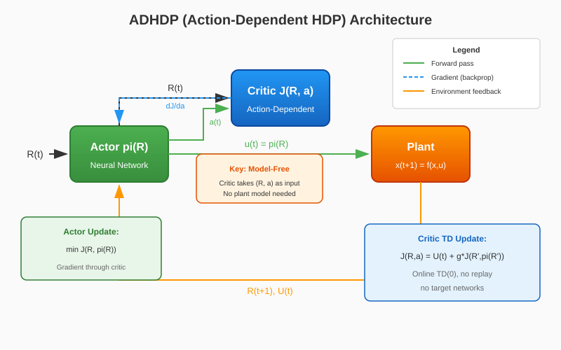

# Action-Dependent Heuristic Dynamic Programming (ADHDP)

ADHDP (Action-Dependent Heuristic Dynamic Programming) is a **model-free** member of the Adaptive Critic Designs (ACD) family. Unlike HDP which requires a plant model, ADHDP learns an action-dependent cost-to-go function \( J(R, a) \) that directly takes both state and action as inputs. The actor is improved by minimizing this critic output via backpropagation through the critic network.

{ width=800 }

## Key Ideas

1. **Action-Dependent Critic**: The critic \( J(R, a) \) estimates cost-to-go as a function of both observable state \( R(t) \) and action \( a(t) \)
2. **Model-Free**: No plant model (A, B matrices) required — the critic learns directly from environment transitions
3. **Online TD Learning**: Critic trained via TD(0) on \( J(R_t, a_t) \approx U_t + \gamma J(R_{t+1}, \pi(R_{t+1})) \)
4. **Actor Improvement**: Actor minimizes \( J(R, \pi(R)) \) by backpropagating gradients through the critic

## Key Difference: HDP vs ADHDP

| Aspect | HDP (Model-Based) | ADHDP (Model-Free) |
|--------|-------------------|-------------------|
| Critic Input | \( J(R) \) — state only | \( J(R, a) \) — state and action |
| Actor Update | Model-based lookahead | Gradient through critic |
| Requires Model | Yes (A, B matrices) | No |
| Sample Efficiency | Higher (uses model) | Lower (learns from data) |

## Architecture

| Component | Role | Implementation |
|-----------|------|----------------|
| Actor \( \pi(R) \) | Generates control signal \( u(t) \) | `DeterministicActor` (MLP with tanh output) |
| Critic \( J(R, a) \) | Estimates action-dependent cost-to-go | `QCritic` (MLP: concat[R, a] → scalar) |

## Algorithm

### Training Loop

```
For each episode:
    Reset environment → R(0)
    For each step t:
        1. Actor: a(t) = pi(R(t)) [+ exploration noise]
        2. Execute a(t) in environment → R(t+1), U(t)
        
        # Critic Update (TD Learning)
        3. a'(t+1) = pi(R(t+1))  [next action from actor]
        4. J_target = U(t) + g * J(R(t+1), a'(t+1))
        5. L_critic = MSE(J(R(t), a(t)), J_target)
        6. Update critic via gradient descent
        
        # Actor Update
        7. a_pi = pi(R(t))
        8. L_actor = J(R(t), a_pi)  [minimize critic output]
        9. Update actor via gradient descent through critic
```

### Mathematical Formulation

**Critic Loss (TD Target):**

$$
\mathcal{L}_{\text{critic}} = \mathbb{E}\left[ \left( J(R_t, a_t) - \left( U_t + \gamma J(R_{t+1}, \pi(R_{t+1})) \right) \right)^2 \right]
$$

**Actor Loss:**

$$
\mathcal{L}_{\text{actor}} = \mathbb{E}\left[ J(R_t, \pi(R_t)) \right]
$$

Where:
- \( U_t \) is the immediate cost (negative reward)
- \( \gamma \) is the discount factor
- \( \pi(R) \) is the actor policy

## Quick Start

```python
import numpy as np
from tensoraerospace.agent import ADHDP
from tensoraerospace.envs.b747 import ImprovedB747Env

def sine_reference(steps: int, amp_deg: float = 2.0, freq_hz: float = 0.05, dt: float = 0.1):
    """Generate sine reference signal for pitch tracking."""
    t = np.arange(steps) * dt
    ref = np.deg2rad(amp_deg) * np.sin(2 * np.pi * freq_hz * t)
    return ref.reshape(1, -1).astype(np.float32)

num_steps = 300
dt = 0.1

env = ImprovedB747Env(
    initial_state=np.array([0.0, 0.0, 0.0, 0.0], dtype=float),
    reference_signal=sine_reference(num_steps, amp_deg=2.0, freq_hz=0.05, dt=dt),
    number_time_steps=num_steps,
    dt=dt,
    include_reference_in_obs=True,
)

agent = ADHDP(
    env,
    gamma=0.99,
    actor_lr=1e-4,
    critic_lr=1e-4,
    hidden_size=128,
    exploration_std=0.02,
    device="cpu",
    # Paper-strict mode: canonical ADHDP without residual baseline
    paper_strict=True,
)

# Train the agent
agent.train(num_episodes=200, max_steps=num_steps)

# Save the trained model
agent.save("./adhdp_b747_model")
```

## Hyperparameters

### Core Parameters

| Parameter | Default | Description |
|-----------|---------|-------------|
| `gamma` | 0.99 | Discount factor for future costs |
| `actor_lr` | 1e-4 | Actor network learning rate |
| `critic_lr` | 1e-4 | Critic network learning rate |
| `hidden_size` | 256 | Hidden layer size for both networks |
| `exploration_std` | 0.02 | Gaussian noise std for exploration |
| `device` | "cpu" | Torch device ('cpu', 'cuda', 'mps') |

### Policy Mode

| Parameter | Default | Description |
|-----------|---------|-------------|
| `paper_strict` | False | If True, use canonical ADHDP without baseline |
| `policy_mode` | "direct" | "direct" (pure actor) or "residual" (baseline + actor) |
| `residual_scale` | 0.2 | Scale of residual policy when using baseline |

### Action Selection

| Parameter | Default | Description |
|-----------|---------|-------------|
| `action_selection` | "actor" | "actor" (use actor network) or "critic_gradient" (HDPy-style optimization) |
| `action_grad_steps` | 0 | Gradient steps for critic-based action optimization |
| `action_grad_lr` | 0.0 | Learning rate for action optimization |
| `action_momentum` | 0.0 | Momentum for action smoothing: u = m*u_prev + (1-m)*u_new |
| `action_max_abs` | 1.0 | Maximum action magnitude (safety envelope) |

### Baseline Controller

| Parameter | Default | Description |
|-----------|---------|-------------|
| `baseline_type` | "pid" | Baseline type: "pd" or "pid" |
| `baseline_kp` | -24.6295 | Proportional gain (tuned for B747) |
| `baseline_ki` | -0.2486 | Integral gain |
| `baseline_kd` | -7.8179 | Derivative gain |
| `pid_i_clip` | 1.0 | Anti-windup integral clipping |

### Training Schedule (Paper Section III)

| Parameter | Default | Description |
|-----------|---------|-------------|
| `baseline_warmup_episodes` | 0 | Episodes running only baseline for critic warmup |
| `critic_warmup_episodes` | 0 | Episodes with frozen actor (critic-only training) |
| `critic_cycle_episodes` | 0 | Episodes per critic-only cycle (alternating) |
| `action_cycle_episodes` | 0 | Episodes per actor-only cycle (alternating) |
| `warmstart_actor_episodes` | 0 | Episodes to imitate baseline (supervised warmstart) |

### Trajectory Randomization

| Parameter | Default | Description |
|-----------|---------|-------------|
| `initial_state_noise_std` | 0.0 | Noise std for initial state randomization |
| `reference_roll_steps` | 0 | Max random roll of reference signal |
| `reference_noise_std` | 0.0 | Noise std added to reference signal |

!!! tip "Persistent Excitation"
    The paper (Section III) emphasizes **persistent excitation** for stable learning. Instead of relying heavily on action noise, use trajectory randomization (`initial_state_noise_std`, `reference_roll_steps`) to expose the agent to diverse conditions.

## Stabilization Strategies

ADHDP offers several strategies to stabilize training:

### 1. Paper-Strict Mode
```python
agent = ADHDP(env, paper_strict=True)
```
Canonical ADHDP: pure actor policy, no baseline mixing, no BC regularizer.

### 2. Residual Policy
```python
agent = ADHDP(env, policy_mode="residual", residual_scale=0.2)
```
Actor learns a residual correction on top of PID baseline: `u = u_pid + 0.2 * pi(R)`.

### 3. Warm-Start Actor
```python
agent = ADHDP(env, warmstart_actor_episodes=10, warmstart_actor_epochs=2)
```
Pre-train actor to imitate baseline via supervised learning before ACD updates.

### 4. Alternating Training
```python
agent = ADHDP(env, critic_cycle_episodes=5, action_cycle_episodes=5)
```
Train critic for 5 episodes (actor frozen), then actor for 5 episodes (critic frozen).

## Comparison with Other Methods

| Method | Critic | Model | Training |
|--------|--------|-------|----------|
| **ADHDP** | \( J(R, a) \) | Not needed | Online TD |
| HDP | \( J(R) \) | Required | Model-based lookahead |
| DHP | \( \lambda = \partial J / \partial R \) | Required | Gradient-based |
| DDPG | \( Q(s, a) \) | Not needed | Replay + target networks |

!!! note "ADHDP vs DDPG"
    ADHDP is the canonical, paper-style actor-critic without modern stabilization tricks (replay buffer, target networks). For better sample efficiency and stability in practice, consider DDPG or SAC. ADHDP is valuable for research and understanding the foundations of ACD.

## Supported Environments

- `ImprovedB747Env` — Boeing 747 longitudinal dynamics with tracking reference

## Unified training interface

ADHDP implements the shared unified `train()` signature from
`BaseRLModel`:

```python
agent.train(num_episodes=200, max_steps=500)
```

ADHDP-specific options accepted via `**kwargs`:

- `show_progress` (`bool`, legacy alias for `verbose`) — controls the
  tqdm progress bar.
- `progress_desc` (`str`) — tqdm description label.

## API Reference

::: tensoraerospace.agent.adhdp.model.ADHDP

::: tensoraerospace.agent.adp.networks.QCritic

::: tensoraerospace.agent.adp.networks.DeterministicActor

## References

- Prokhorov D.V., Wunsch D.C. "Adaptive Critic Designs." IEEE Transactions on Neural Networks, vol. 8, no. 5, pp. 997-1007, 1997.
- Werbos P.J. "A menu of designs for reinforcement learning over time." Neural Networks for Control, MIT Press, 1990.
- Si J., et al. "Handbook of Learning and Approximate Dynamic Programming." Wiley-IEEE Press, 2004.
