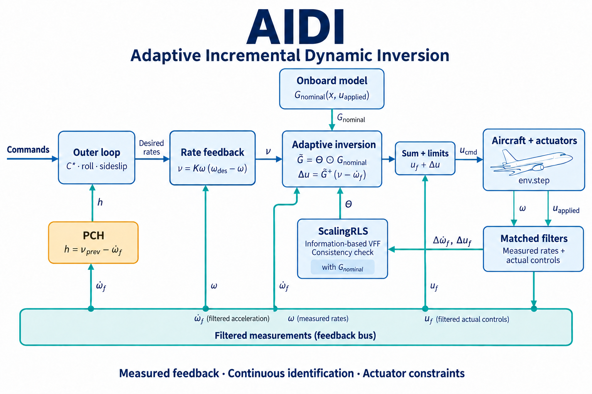

# Adaptive Incremental Dynamic Inversion (AIDI)

AIDI is a **fault-tolerant flight controller** built on Incremental Nonlinear Dynamic Inversion. It adapts the **control-effectiveness matrix** online via a per-row VFF-RLS that estimates a multiplicative scaling \\(\\Theta\\) over a known onboard \\(G_{\\text{nominal}}\\). Recovery depends on excitation, actuator authority, flight condition and controller tuning; adaptation alone is not a stability guarantee. See also the nonlinear F-16 angular model: [NonlinearAngularF16](../model/f16_nonlinear_angular.md).

**Reference**: Ul Haq, Atmaca & van Kampen, *"Adaptive Incremental Dynamic Inversion for Fault-tolerant Flight Control of a Flying Wing"*, AIAA SciTech 2026, [10.2514/6.2026-1744](https://doi.org/10.2514/6.2026-1744).

## Key ideas

- **INDI inner law:** \\(\\Delta u = \\tilde{G}^{+} \\cdot (\\nu_{\\text{des}} - \\dot{\\omega}_{\\text{meas}})\\), where \\(\\tilde{G} = \\Theta \\odot G_{\\text{nominal}}\\). Only the linearised onboard CE is needed; the rest is absorbed by \\(\\Theta\\).
- **Information-content VFF:** \\(\\lambda_i = 1 - (1 - \\phi_i^{\\top} K_i)\\, \\varepsilon_i^2 / \\Sigma_0\\) with \\(\\Sigma_0 = \\sigma_0^2 N_0\\). Per-paper Eq. 26-27.
- **Cross-axis consistency check:** column-mean averaging across rows when per-row updates agree, useful when surfaces are redundantly mapped to the same axes (Flying-V style). Default `consistency_threshold = 10` ⇒ effectively off; tighten only on truly redundant plants.
- **Pseudo-control hedging (PCH):** the gap \\(\\nu_{\\text{des}} - \\dot{\\omega}_{\\text{meas}}\\) is fed back to the reference models so they freeze under saturation.
- **Onboard CE protocol:** \\(G_{\\text{nominal}}(x, u)\\) is queried each tick from an `OnboardCEModel` instance (`F16NonlinearOnboardCE` for the F-16, `LinearOnboardCE(B)` for any plant with a known linearisation).

## Architecture



This diagram shows the current `AIDIAgent`: `predict` generates the command, while `learn` updates the filters and identification from the next measurement and actual applied control. PCH uses the acceleration demand from the previous tick. The `SpeedController` output is not yet connected to thrust control.

## Components

| Component | Role | Implementation |
| --- | --- | --- |
| `ScalingRLS` | Per-row VFF-RLS over Θ; observability mask + covariance trace bound | `tensoraerospace.agent.aidi.ScalingRLS` |
| `OnboardCEModel` | Protocol returning \\(G_{\\text{nominal}}(x, u)\\) | `tensoraerospace.agent.aidi.OnboardCEModel` |
| `LinearOnboardCE` | Constant-matrix CE | `tensoraerospace.agent.aidi.LinearOnboardCE` |
| `F16NonlinearOnboardCE` | FD adapter over the F-16 angular ODE; remaps `(wx, wy, wz)` to `(p, q, r)` | `tensoraerospace.agent.aidi.F16NonlinearOnboardCE` |
| `MoorePenroseAllocator` | Pseudo-inverse with conditioning guard | `tensoraerospace.agent.aidi.MoorePenroseAllocator` |
| `PseudoControlHedge` | Hedge signal with per-axis freeze counter | `tensoraerospace.agent.aidi.PseudoControlHedge` |
| `CStarController`, `RollReferenceModel`, `SideslipCompensator`, `SpeedController`, `LinearController` | Outer-loop blocks | `tensoraerospace.agent.aidi.ref_models` |
| `AIDIAgent` / `AIDIConfig` | Orchestrator + persistence | `tensoraerospace.agent.aidi.AIDIAgent` |

## Quick start (F-16)

```python
import numpy as np
from tensoraerospace.agent.aidi import AIDIAgent, AIDIConfig, F16NonlinearOnboardCE
from tensoraerospace.aerospacemodel.f16.nonlinear.angular.params import default_parameters
from tensoraerospace.envs.f16.nonlinear_angular import NonlinearAngularF16
from tensoraerospace.scripts.benchmark_aidi import _solve_trim

params = default_parameters()
alpha, stabilator = _solve_trim()
x0 = np.zeros(14)
x0[0] = x0[7] = alpha
x0[8] = stabilator
env = NonlinearAngularF16(x0, number_time_steps=1002, dt=0.01,
                          integrator="rk4", airspeed=params.V)
agent = AIDIAgent(3, 3, F16NonlinearOnboardCE(params), AIDIConfig(dt=0.01))
state, _ = env.reset()
agent.reset(initial_action=state[[8, 10, 12]])

def observe(x):
    return {"omega": x[[2, 4, 3]] * [1, 1, -1],  # (p, q, r) = (wx, wz, -wy)
            "alpha": x[0], "beta": x[1], "theta": x[7], "phi": x[5],
            "V": params.V, "state": x.copy()}

ref = {"C_star": 1.0, "phi_cmd": 0.0, "beta_cmd": 0.0, "V_cmd": params.V}
command_rad = agent.predict(observe(state), ref)
next_state, _, terminated, truncated, _ = env.step(np.rad2deg(command_rad))
mean_deflection = (state[[8, 10, 12]] + next_state[[8, 10, 12]]) / 2
metrics = agent.learn(observe(next_state), ref, applied_action=mean_deflection)
```

The agent keeps the same save/load/Hugging-Face round-trip API as `aa_indi`/`et_dhp`/`im_gdhp`.

## Measurement and rate-loop contract

- Use conventional body rates `(p, q, r) = (wx, wz, -wy)` with the native F-16 state. Both the yaw observation and the yaw row of `F16NonlinearOnboardCE` use this sign; native plant equations are unchanged.
- Call `reset(initial_action=state[[8, 10, 12]])` at an episode boundary to initialize the measured trim deflection (radians). Reset retains learned `Theta` and covariance.
- `predict(obs, refs)` primes the first rate measurement. Each command is followed by exactly one `learn(next_obs, refs, applied_action=...)`.
- `applied_action` is the mean measured actuator deflection over that transition, in the same units as the command. With sampled F-16 servo positions, use `(previous_positions + next_positions) / 2`, a trapezoidal approximation. Smaller physics steps improve this approximation. Omitting feedback assumes ideal actuator tracking.
- Acceleration and applied input share a first-order low-pass filter. The filtered input is the incremental baseline; successive **commands** obey the configured slew limit. The plant independently enforces physical servo limits. This simpler sensor model is not an exact implementation of the paper's second-order filter and transport delay.
- The rate loop computes `nu = rate_kp * (omega_des - omega)` in rad/s²; gains are in s⁻¹ and default to `(1, 1, 1)`. A constant achieved rate requires zero acceleration. Zero gains disable feedback. Old gain settings must be reviewed after this correction.
- `learn(..., adapt=False)` advances measurement history without modifying the identifier. It is intended for fixed-controller diagnostics, not fault-triggered freezing of an adaptive controller.

New checkpoints preserve synchronized filter history and pending transitions. Legacy checkpoints retain learned parameters but reinitialize measurement history. They cannot exactly replay the old, incorrect rate loop or yaw convention.

Reproducible multi-axis and long-horizon checks are available in `scripts/validate_aidi_measurements.py`. Inspect completion status and attitude bounds together with tracking errors; a finite identifier alone does not establish stability.

## Worked example

`example/reinforcement_learning/incremental_adp/example_aidi_damage_f16.ipynb` — a full fault-recovery walkthrough on the nonlinear F-16: trim, baseline, 25 % loss of stabilator command gain at t = 8 s, side-by-side adaptive vs frozen-Θ runs.

## Benchmark CLI

```bash
python -m tensoraerospace.scripts.benchmark_aidi \
    --env f16_nonlinear_angular \
    --baselines frozen \
    --scenarios nominal,stab_50,stab_25,stab_lost,rudder_lost \
    --episodes 5 --steps 1500 \
    --out report.md --csv report.csv
```

Produces a Markdown table and CSV of body-rate RMSE (rad/s), sampled from t = 2 s. This is a rate-hold diagnostic, not a reproduction of Table 8 or a full assessment of attitude tracking. `stab_25` means 25% remaining command gain. This differs from the aerodynamic-coefficient damage in the paper. `frozen` disables identification for the entire episode; it does not use fault timing. Repeated episodes use the same deterministic initial condition.

## Hyperparameters

### Inner-loop / actuator bounds

| Parameter | Default | Description |
| --- | --- | --- |
| `dt` | 0.01 | Control step (s) |
| `u_magnitude_limit` | `radians(25)` | Magnitude clamp (same units as `OnboardCEModel`'s `u`) |
| `u_rate_limit` | `radians(60)` | Max Δu per second |
| `pinv_rcond` | 1e-6 | Cutoff for `np.linalg.pinv(G)` |
| `cond_threshold` | 1e12 | Falls back to `Δu = 0` when `cond(G)` exceeds this |
| `sensor_cutoff_hz` | 15.0 | Low-pass cutoff for ω̇ |

### Scaling-RLS

| Parameter | Default | Description |
| --- | --- | --- |
| `rls_lambda_min` | 0.7 | Forgetting-factor lower bound (fast adaptation) |
| `rls_lambda_max` | 0.999 | Forgetting-factor upper bound (noise rejection) |
| `rls_sigma0` | 1e-3 | Sensor-noise std σ₀ used in Σ₀ = σ₀²·N₀ |
| `rls_memory_length` | 100 | Nominal memory length N₀ (samples) |
| `rls_cov_init` | 1.0 | Initial scale of P_i |
| `rls_consistency_threshold` | 10.0 | Cross-axis consistency check (≤ 1e-6 for redundant plants) |

### PCH

| Parameter | Default | Description |
| --- | --- | --- |
| `pch_freeze_after` | 30 | Saturation ticks before reference rate is hard-frozen |
| `pch_gap_tol` | 1e-3 | `|ν_h|` below which the axis is considered tracked |

### Outer loop

| Parameter | Default | Description |
| --- | --- | --- |
| `cstar_kp` / `cstar_ki` | 1.5 / 0.5 | C\\* PI gains |
| `cstar_V_co` | 122.6 | C\\* crossover speed (m/s) |
| `roll_omega_n` / `roll_zeta` | 2.5 / 0.7 | Roll reference 2nd-order |
| `sideslip_kp` / `sideslip_ki` | 1.5 / 0.1 | Sideslip PI |
| `speed_*`, `speed_enabled` | 0 / False | Auto-throttle (off by default) |

## Supported environments

- Any Gymnasium env that exposes \\((p, q, r)\\) plus \\(\\alpha, \\beta, \\theta, \\phi, V\\). Optional `n_z` is reconstructed from \\((\\alpha, \\dot{\\alpha}, q, V, \\theta, \\phi)\\) when missing.
- F-16 nonlinear angular env wired through `F16NonlinearOnboardCE` (axis remap built in).
- Any plant with a constant linearised CE: pass `LinearOnboardCE(B)`.

## Persistence

```python
run_dir = agent.save("./checkpoints")           # creates <date>_AIDIAgent/
restored = AIDIAgent.from_pretrained(run_dir, onboard_ce=F16NonlinearOnboardCE(...))
agent.publish_to_hub("me/my-aidi", folder_path=run_dir, access_token="hf_...")
```

Saved artefacts:

- `config.json` — full `AIDIConfig` + `n_state` / `n_control`.
- `scaling_rls.npz` — `theta`, `P`, `last_lambda`, `last_residual`, `num_updates`.
- `outer_state.npz` — C\\*/sideslip/speed integrators + roll-ref state.
- `pch_state.npz` — hedge, saturation counter, freeze flags.
- `deriv_state.npz` — low-pass differentiator state.
- `loop_state.npz` — `u_prev`, `omega_prev`, `omega_dot_cached`, last command, last `G_nominal`, step counter.

## API reference

::: tensoraerospace.agent.aidi.model.AIDIAgent

::: tensoraerospace.agent.aidi.model.AIDIConfig

::: tensoraerospace.agent.aidi.scaling_rls.ScalingRLS

::: tensoraerospace.agent.aidi.onboard_ce.OnboardCEModel

::: tensoraerospace.agent.aidi.onboard_ce.F16NonlinearOnboardCE

::: tensoraerospace.agent.aidi.allocator.MoorePenroseAllocator

::: tensoraerospace.agent.aidi.pch.PseudoControlHedge

## Sources

- Ul Haq, Atmaca, van Kampen. *"Adaptive Incremental Dynamic Inversion for Fault-tolerant Flight Control of a Flying Wing"*, AIAA SciTech 2026, [10.2514/6.2026-1744](https://doi.org/10.2514/6.2026-1744).
- Atmaca, van Kampen. *"Fault Tolerant Control for the Flying-V Using Adaptive Incremental Nonlinear Dynamic Inversion"*, AIAA SciTech 2025, [10.2514/6.2025-0081](https://doi.org/10.2514/6.2025-0081).
- Fortescue, Kershenbaum, Ydstie. *"Implementation of Self-Tuning Regulators with Variable Forgetting Factors"*, Automatica, 1981.
