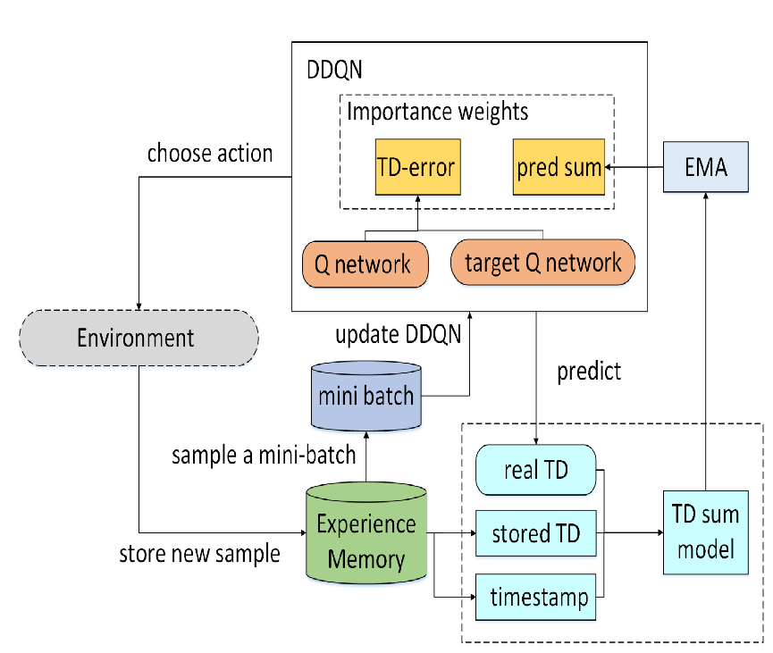

# DQN (Deep Q-Network)

DQN is the classic reinforcement learning method approximating the Q-function with a neural network. The implementation uses a target network for stability and prioritized experience replay (PER) for more informative updates.

{ width=800 }

## Components

- Main Q-network: estimates \(Q_\theta(s,a)\) and selects actions
- Target network: \(Q_{\theta^-}\) provides target values, updated less frequently
- Replay buffer (PER): stores transitions and returns prioritized mini-batches
- Action selection: \(\epsilon\)-greedy strategy

## Theory

### 1) Уравнение оптимальности Беллмана

The optimal Q-function satisfies:

$$
Q^*(s,a) = \mathbb{E}\Big[r + \gamma \max_{a'} Q^*(s', a')\,\Big|\, s,a\Big]
$$

Stochastic gradient descent on an MSE objective solves:

$$
\min_\theta \;\mathbb{E}_{(s,a,r,s')}\big[\big(y - Q_\theta(s,a)\big)^2\big],\quad
\text{где } y = r + \gamma\, \max_{a'} Q_{\theta^-}(s', a')
$$

### 2) Double DQN vs classical DQN

- Vanilla DQN overestimates because the \(\max\) uses the same network. Double DQN decouples selection and evaluation:

$$
 y = r + \gamma\, Q_{\theta^-}\Big(s', \operatorname*{argmax}\limits_{a'} Q_{\theta}(s', a')\Big)
$$

This reduces overestimation and stabilizes training.

### 3) Target network update

- The target network \(Q_{\theta^-}\) copies the online network every `target_update_iter` steps:

$$
\theta^- \leftarrow \theta \quad \text{(периодически)}
$$

A fixed target over a short horizon reduces target drift.

### 4) Prioritized experience replay (PER) and SumTree

- Transition priority i:

$$
 p_i = |\delta_i| + \varepsilon_{\text{margin}} \quad \text{(далее может быть отсечён сверху: } p_i \le \text{abs\_error\_upper)}
$$

- Sampling probability:

$$
 P(i) = \frac{p_i^{\alpha}}{\sum_j p_j^{\alpha}}, \quad \alpha \in [0,1]
$$

- Importance-sampling weights:

$$
 w_i = \Big( \frac{1}{N\, P(i)} \Big)^{\beta}, \quad \tilde{w}_i = \frac{w_i}{\max_j w_j}, \quad \beta \nearrow 1
$$

- Priority update after training: \(p_i \leftarrow |\delta_i| + \varepsilon_{\text{margin}}\)

- The SumTree structure enables \(\mathcal{O}(\log N)\) priority updates/sampling.

### 5) \(\epsilon\)-greedy policy and schedule

- With probability \(\epsilon\) pick a random action; otherwise \(\arg\max_a Q_\theta(s,a)\).
- Exploration decays: \(\epsilon \leftarrow \max(\text{min\_epsilon}, \epsilon \cdot \text{epsilon\_decay})\).

### 6) Training loop

1. Collect experience (first K steps without training).
2. Every `replay_period` steps sample a PER mini-batch, compute \(y\), TD errors \(\delta\), IS weights, and update \(\theta\) via weighted MSE.
3. Update priorities \(p_i\) and the parameter \(\beta\).
4. Every `target_update_iter` steps: \(\theta^- \leftarrow \theta\).

Псевдокод:

```text
predict_q = Q_theta(s_batch)
best_action = argmax_a predict_q
target_q = Q_theta_minus(s_next_batch)
y = r_batch + gamma * target_q[range, best_action]

# TD-ошибка и приоритеты
delta = y - predict_q[range, a_batch]
priority = clip(|delta| + margin, 0, abs_error_upper) ** alpha

# веса важности и взвешенная MSE
w = ((buffer_size * P(i)) ** -beta) / max_w
loss = mean(w * (y - Q_theta(s_batch, a_batch))^2)
update theta by SGD

# обновить приоритеты, увеличить beta, периодически обновить target
```

### 7) Stabilization tricks

- Gradient normalization/clipping
- Limit TD error (`abs_error_upper` in code)
- Prefer Huber loss over MSE (here we use weighted MSE)
- Regular target updates, sufficiently large buffer

### 8) Mapping to implementation parameters

- `alpha` — prioritization exponent (0 → uniform, 1 → pure TD error)
- `beta`, `beta_increment_per_sample` — IS weight strength and annealing
- `target_update_iter` — target network sync period
- `replay_period` — training frequency
- `epsilon`, `epsilon_decay`, `min_epsilon` — \(\epsilon\) schedule
- `margin` (`\varepsilon`), `abs_error_upper` — priority shaping

## Quick start

```python
import gymnasium as gym
import numpy as np

from tensoraerospace.agent.dqn.model import PERAgent

env = gym.make('LinearLongitudinalF16-v0', number_time_steps=2000)
state, info = env.reset()

agent = PERAgent(
    state_dim=len(state),
    action_dim=env.action_space.shape[0] if hasattr(env.action_space, 'shape') else env.action_space.n,
)

epsilon = 1.0
for t in range(10000):
    if np.random.rand() < epsilon:
        action = env.action_space.sample()
    else:
        action = agent.select_action(state)

    next_state, reward, terminated, truncated, info = env.step(action)
    agent.remember(state, action, reward, next_state, terminated or truncated)
    agent.train_step()

    state = next_state
    if terminated or truncated:
        state, info = env.reset()
    epsilon = max(0.05, epsilon * 0.995)
```

!!! tip
    For continuous action spaces use discretization or switch to DDPG/SAC.

## API reference

::: tensoraerospace.agent.dqn.model.Model

::: tensoraerospace.agent.dqn.model.SumTree

::: tensoraerospace.agent.dqn.model.PERAgent
