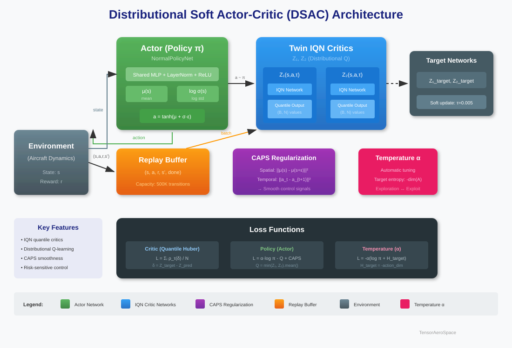
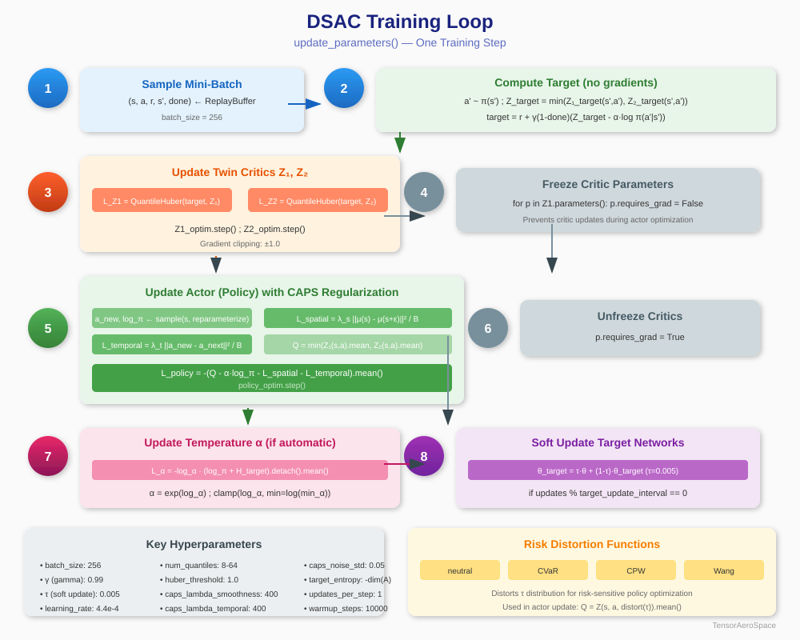

# Distributional Soft Actor-Critic (DSAC)

DSAC is a state-of-the-art off-policy reinforcement learning algorithm that combines the benefits of **Soft Actor-Critic (SAC)** with **distributional RL** using Implicit Quantile Networks (IQN). It was specifically designed for robust control in aerospace applications where uncertainty estimation and smooth control signals are critical.

## Architecture Overview



DSAC extends the standard SAC framework with several key innovations:

1. **Distributional Critics (IQN)**: Instead of predicting a single Q-value, DSAC learns the full return distribution using twin Implicit Quantile Networks
2. **CAPS Regularization**: Conditional Action Policy Smoothness ensures smooth, flight-safe control commands
3. **Risk-Sensitive Control**: Supports risk distortion functions (CVaR, CPW, Wang) for conservative or aggressive policies

## Key Components

### Twin IQN Critics

The core innovation of DSAC is the use of **Implicit Quantile Networks (IQN)** as critics. Each critic predicts a distribution of possible Q-values rather than a single point estimate:


Key features of the IQN critic:

- **Cosine Embedding**: Quantile levels τ ∈ (0,1) are embedded using cosine basis functions: φ(τ)ᵢ = cos(π · i · τ)
- **Hadamard Product**: State-action features are combined with quantile embeddings via element-wise multiplication
- **Quantile Huber Loss**: Robust loss function that handles the asymmetric nature of quantile regression

### Training Loop

The DSAC training loop follows the SAC structure with modifications for distributional learning:



**Training Steps:**

1. **Sample Mini-Batch**: Draw (s, a, r, s', done) from replay buffer
2. **Compute Target**: Calculate distributional Bellman target with entropy bonus
3. **Update Critics**: Minimize quantile Huber loss for both Z₁ and Z₂
4. **Freeze Critics**: Temporarily disable critic gradients
5. **Update Actor**: Maximize expected Q-value with CAPS regularization
6. **Unfreeze Critics**: Re-enable critic gradients
7. **Update Temperature**: Adjust entropy coefficient α (if automatic)
8. **Soft Update Targets**: Polyak averaging for target networks

### CAPS Regularization

CAPS (Conditional Action Policy Smoothness) is critical for aerospace applications:

- **Spatial Smoothness**: Penalizes policy sensitivity to small state perturbations
  
  $L_{spatial} = \lambda_s \cdot \frac{1}{B} \|\mu(s) - \mu(s + \epsilon)\|^2$

- **Temporal Smoothness**: Encourages consistent actions over time
  
  $L_{temporal} = \lambda_t \cdot \frac{1}{B} \|a_t - a_{t+1}\|^2$

### Risk Distortion Functions

DSAC supports risk-sensitive control through distortion of quantile levels:

| Function | Formula | Use Case |
|----------|---------|----------|
| **Neutral** | τ | Standard expected value |
| **CVaR** | clamp(τ · ξ, 0, 1) | Conservative (worst-case) |
| **CPW** | τ^ξ / (τ^ξ + (1-τ)^ξ)^{1/ξ} | Probability weighting |
| **Wang** | Φ(Φ⁻¹(τ) + ξ) | Normal transform |

## Key Differences vs SAC

| Feature | SAC | DSAC |
|---------|-----|------|
| Critic Output | Single Q-value | N quantile values |
| Loss Function | MSE | Quantile Huber |
| Uncertainty | None | Full distribution |
| Smoothness | None | CAPS regularization |
| Risk Sensitivity | None | Distortion functions |

## Quick Start

```python
import numpy as np
import torch
from tensoraerospace.agent import DSAC
from tensoraerospace.envs.b747 import ImprovedB747Env

def step_reference(steps: int, deg: float = 5.0) -> np.ndarray:
    ref = np.zeros((1, steps), dtype=np.float32)
    ref[:, steps // 5 :] = np.deg2rad(deg)
    return ref

device = "cuda" if torch.cuda.is_available() else "cpu"
num_steps = 800

env = ImprovedB747Env(
    initial_state=np.array([0.0, 0.0, 0.0, 0.0], dtype=float),
    reference_signal=step_reference(num_steps, deg=5.0),
    number_time_steps=num_steps,
    dt=0.02,
    reward_mode="step_response",
)

agent = DSAC(
    env,
    batch_size=256,
    memory_capacity=500_000,
    learning_starts=10_000,
    updates_per_step=1,
    num_quantiles=32,
    embedding_dim=64,
    hidden_layers=[64, 64],
    huber_threshold=1.0,
    lr=4.4e-4,
    policy_lr=4.4e-4,
    gamma=0.99,
    tau=0.005,
    caps_lambda_smoothness=400.0,
    caps_lambda_temporal=400.0,
    caps_noise_std=0.05,
    device=device,
    log_every_updates=50,
    automatic_entropy_tuning=True,
)

# Training
agent.train(num_episodes=100, save_best=True, save_path="./runs")
agent.close()
```

## Hyperparameters

### Critical Parameters

| Parameter | Default | Description |
|-----------|---------|-------------|
| `num_quantiles` | 8 | Number of quantile samples (16-64 recommended) |
| `embedding_dim` | 64 | Cosine embedding dimension |
| `huber_threshold` | 1.0 | Huber loss threshold κ |
| `batch_size` | 256 | Mini-batch size |
| `learning_starts` | 10,000 | Steps before training starts |

### CAPS Parameters

| Parameter | Default | Description |
|-----------|---------|-------------|
| `caps_lambda_smoothness` | 400.0 | Spatial smoothness weight |
| `caps_lambda_temporal` | 400.0 | Temporal smoothness weight |
| `caps_noise_std` | 0.05 | Noise for spatial perturbation |

### Optimization Parameters

| Parameter | Default | Description |
|-----------|---------|-------------|
| `lr` | 4.4e-4 | Critic learning rate |
| `policy_lr` | 4.4e-4 | Actor learning rate (defaults to lr) |
| `gamma` | 0.99 | Discount factor |
| `tau` | 0.005 | Soft update coefficient |
| `target_update_interval` | 1 | Target network update frequency |

### Risk Control

| Parameter | Default | Description |
|-----------|---------|-------------|
| `risk_distortion` | "neutral" | Distortion function name |
| `risk_measure` | 1.0 | Distortion parameter ξ |

!!! tip "Training Tips"
    - Keep `num_quantiles` between 16-64 for stable training
    - Higher `caps_lambda` values produce smoother but potentially slower-converging policies
    - Use `risk_distortion="cvar"` with `risk_measure < 1.0` for conservative flight control
    - Reduce `updates_per_step` if actions become overly smooth or training unstable

## Vectorized Training

For environments with parallel simulation (e.g., GPU-accelerated):

```python
agent.train_vector(
    total_steps=500_000,
    warmup_steps=10_000,
    log_every=2_000,
    reward_window=200,
    save_best=True,
    save_path="./runs",
)
```

## API Reference

::: tensoraerospace.agent.dsac.dsac.DSAC

::: tensoraerospace.agent.dsac.flight_critic.ZNet

::: tensoraerospace.agent.dsac.flight_critic.IQN

::: tensoraerospace.agent.dsac.flight_actor.NormalPolicyNet

::: tensoraerospace.agent.dsac.risk_distortions

## Acknowledgements

The DSAC implementation in TensorAeroSpace was inspired by and partially based on the excellent work by **Peter Seres** on risk-sensitive distributional reinforcement learning for flight control:

- **Repository**: [peter-seres/dsac-flight](https://github.com/peter-seres/dsac-flight)
- **Description**: Risk-sensitive Distributional Reinforcement Learning for Flight Control (MSc thesis project)

We gratefully acknowledge Peter Seres's contribution to the field of distributional RL for aerospace applications. His implementation of DSAC with IQN critics for the PH-LAB (Cessna Citation II) research aircraft provided valuable insights and architectural decisions that informed our implementation.

!!! note "Citation"
    If you use the DSAC agent in your research, please consider citing both TensorAeroSpace and the original dsac-flight repository.
