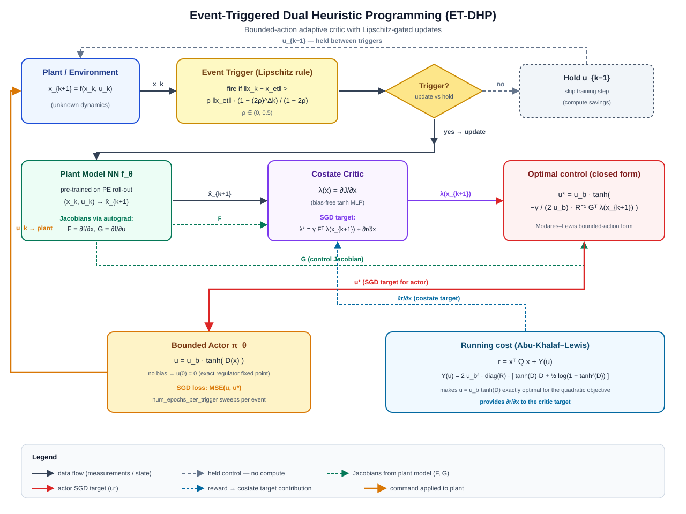

# Event-Triggered Dual Heuristic Programming (ET-DHP)

ET-DHP is an adaptive optimal controller from the Dual Heuristic Programming family extended with an **event-triggered** sampling scheme. Between triggers the actuator simply holds the last control and no actor/critic updates run, so the controller's computational rate is decoupled from the sensor/simulation rate — the computational saving can reach an order of magnitude on stabilisation tasks while preserving closed-loop regulation quality. See also the nonlinear F-16 model: [NonlinearLongitudinalF16](../model/f16_nonlinear_longitudinal.md).

## Key ideas

- **Event-triggered supervisor**: a Lipschitz-style rule compares the measured state against the state captured at the last trigger; updates fire only when the deviation exceeds a growing, saturating threshold
- **Neural plant model**: a pre-trained two-layer MLP predicts \(x_{k+1} = f(x_k, u_k)\); autograd through it yields the Jacobians \(F = \partial f/\partial x\) and \(G = \partial f/\partial u\) used by the actor and critic targets
- **Bounded actor**: deterministic policy \(u = u_b \cdot \tanh(D(x))\) respects a per-channel actuator bound even during the early random-search phase; \(u(0)=0\) by construction (no bias layers), so the regulator fixed point is exact
- **Costate critic**: the critic directly regresses \(\lambda(x) = \partial J/\partial x\) (DHP form), enabling a clean matrix-vector actor update without a scalar \(J\)-head
- **Abu-Khalaf–Lewis bounded-control cost**: integral term \(Y(u)\) added to the running cost makes \(u = u_b \cdot \tanh(D)\) the exact optimum of the underlying quadratic regulator

{ width=900 }

The diagram traces one control step: the measured state \(x_k\) is compared against the last triggered state \(x_{\mathrm{et}}\); on a trigger the plant model provides \(F\) and \(G\) via autograd, the critic computes \(\lambda(x_{k+1})\), a closed-form \(u^{*}\) is assembled, and the actor/critic take SGD steps. Between triggers the last command \(u_{k-1}\) is simply held and no gradients are evaluated.

## Differences from related agents

| Aspect | HDP | DHP | **ET-DHP** |
| --- | --- | --- | --- |
| Critic output | \(J(x)\) | \(\lambda(x) = \partial J/\partial x\) | \(\lambda(x)\) |
| Plant model | Known / none | Analytical or NN | Pre-trained NN |
| Sampling | Time-triggered | Time-triggered | **Event-triggered** |
| Actor bounds | Often unbounded | Often unbounded | \(u_b \cdot \tanh(D)\) |
| Cost function | Quadratic | Quadratic | Quadratic + bounded-control integral |

## ET-DHP components

| Component | Role | Implementation |
| --- | --- | --- |
| PlantModelNN | One-step predictor \(x_{k+1} = f(x_k, u_k)\); source of \(F\), \(G\) Jacobians | `tensoraerospace.agent.et_dhp.PlantModelNN` |
| ETDHPActor | Bounded deterministic policy \(u_b \cdot \tanh(D(x))\) | `tensoraerospace.agent.et_dhp.ETDHPActor` |
| ETDHPCritic | Costate network \(\lambda(x) = \partial J/\partial x\) | `tensoraerospace.agent.et_dhp.ETDHPCritic` |
| EventTrigger | Lipschitz rule deciding when updates fire | `tensoraerospace.agent.et_dhp.EventTrigger` |
| ETDHPAgent | Orchestrates all components, predict/learn interface | `tensoraerospace.agent.et_dhp.ETDHPAgent` |

## Algorithm

At every discrete step \(k\) with measurement \(x_k\):

1. **Event check.** Compare \(\|x_k - x_{\mathrm{et}}\|\) against the Lipschitz threshold

\[
\rho \, \|x_{\mathrm{et}}\| \, \frac{1 - (2\rho)^{k - k_{\mathrm{trig}}}}{1 - 2\rho}
\]

   where \(x_{\mathrm{et}}\) and \(k_{\mathrm{trig}}\) are the state and step captured at the most recent trigger, and \(\rho \in (0, 0.5)\). If the bound is exceeded — trigger; otherwise hold the last control and skip training.

2. **Plant Jacobians.** Forward pass \((x, u)\) through the pre-trained plant network and row-wise autograd to extract \(F = \partial f/\partial x\), \(G = \partial f/\partial u\).

3. **Closed-form optimal control** (Modares–Lewis bounded-action form):

\[
u^{*} = u_b \cdot \tanh\!\left(-\frac{\gamma}{2 u_b} R^{-1} G^{\top} \lambda(x_{k+1})\right)
\]

4. **Costate target.** Using the running cost \(r = x^{\top} Q x + Y(u)\) with the bounded-control integral cost

\[
Y(u) = 2 u_b^2 \, \mathrm{diag}(R) \cdot \bigl[\tanh(D)\cdot D + \tfrac{1}{2}\log(1 - \tanh^2 D)\bigr],
\]

the costate target is \(\lambda_{\mathrm{target}} = \gamma F^{\top} \lambda(x_{k+1}) + \partial r/\partial x\).

5. **Gradient steps.** SGD on the actor against \(\mathrm{MSE}(u, u^{*})\) and on the critic against \(\mathrm{MSE}(\lambda(x), \lambda_{\mathrm{target}})\).

## Quick start

```python
import numpy as np
from tensoraerospace.agent.et_dhp import ETDHPAgent, ETDHPConfig

# Regulation-state transform: convert raw env observation into x_tilde
# that drives to zero at the desired operating point.
def state_transform(obs, reference_signal, time_step):
    return np.degrees(np.asarray(obs).reshape(-1))  # example: deg units

cfg = ETDHPConfig(
    actor_hidden=(24, 24),
    critic_hidden=(24, 24),
    model_hidden=(24, 24),
    actor_lr=5e-3,
    critic_lr=5e-3,
    model_lr=5e-3,
    model_epochs=300,
    Q=[10.0, 0.2, 0.0, 0.0],
    R=[0.5],
    gamma=0.95,
    num_epochs_per_trigger=5,
    u_bound=5.0,
    rho=0.15,
    trigger_floor=0.05,
    weight_init_scale=0.3,
    seed=0,
)

agent = ETDHPAgent(
    n_state=4,
    n_control=1,
    state_transform=state_transform,
    config=cfg,
)

# 1. Pre-train the plant model on an offline PE roll-out.
agent.fit_plant_model(states_arr, actions_arr, next_states_arr,
                      batch_size=128, verbose=True)

# 2. Online event-triggered closed-loop control.
obs, _ = env.reset()
agent.reset()
for k in range(number_time_steps - 2):
    agent.predict(obs, reference_signal, k)
    u_cmd = agent.last_action()
    obs_next, _, done, _, _ = env.step(u_cmd)
    metrics = agent.learn(obs_next, reference_signal, k, dt=dt)
    obs = obs_next
    if done:
        break
```

!!! tip
    The actor's fixed point is \(u(0) = 0\). For tracking tasks, design `state_transform` so that perfect tracking corresponds to the zero regulation state (e.g. subtract the reference signal from the measured state).

## Hyperparameters

### General

| Parameter | Default | Description |
| --- | --- | --- |
| `gamma` | 1.0 | Discount factor |
| `num_epochs_per_trigger` | 10 | Inner SGD sweeps per triggered step |
| `weight_init_scale` | 0.5 | Uniform-init bound for all network weights |
| `seed` | None | RNG seed for reproducibility |
| `device` | `"cpu"` | PyTorch device |

### Actor

| Parameter | Default | Description |
| --- | --- | --- |
| `actor_hidden` | (10, 10) | Hidden layer sizes |
| `actor_lr` | 1e-3 | SGD learning rate |
| `u_bound` | 1.0 | Per-channel absolute actuator bound |

### Critic

| Parameter | Default | Description |
| --- | --- | --- |
| `critic_hidden` | (10, 10) | Hidden layer sizes |
| `critic_lr` | 1e-3 | SGD learning rate |

### Plant model

| Parameter | Default | Description |
| --- | --- | --- |
| `model_hidden` | (10, 10) | Hidden layer sizes |
| `model_lr` | 1e-3 | Adam learning rate for offline fit |
| `model_epochs` | 200 | Epochs of offline pre-training |
| `online_model_fit` | False | Keep adapting the plant model after the offline phase |

### Cost function

| Parameter | Default | Description |
| --- | --- | --- |
| `Q` | (1.0,) | Diagonal weights of state cost \(x^{\top} Q x\); length must equal `n_state` |
| `R` | (1.0,) | Diagonal weights of control cost; length must equal `n_control` |

### Event trigger

| Parameter | Default | Description |
| --- | --- | --- |
| `rho` | 0.1 | Lipschitz constant \(\in (0, 0.5)\); smaller ⇒ more triggers, tighter tracking |
| `trigger_floor` | 1e-3 | Minimum threshold (state units) to suppress noise-induced firings |

### Exploration

| Parameter | Default | Description |
| --- | --- | --- |
| `exploration_fn` | None | Optional callable `(time_sec) -> array` injecting PE into the actor target |

## Supported environments

- `NonlinearLongitudinalF16-v0`
- `LinearLongitudinalF16-v0`

## API reference

::: tensoraerospace.agent.et_dhp.model.ETDHPAgent

::: tensoraerospace.agent.et_dhp.model.ETDHPConfig

::: tensoraerospace.agent.et_dhp.networks.ETDHPActor

::: tensoraerospace.agent.et_dhp.networks.ETDHPCritic

::: tensoraerospace.agent.et_dhp.networks.PlantModelNN

::: tensoraerospace.agent.et_dhp.event_trigger.EventTrigger

## Sources

- Sun, B., Liu, C., Dally, K., van Kampen, E.-J. (2022). *Intelligent Aircraft Stabilization Control with Event-Triggered Scheme*. CEAS EuroGNC 2022.
- Abu-Khalaf, M., Lewis, F. L. (2005). *Nearly optimal control laws for nonlinear systems with saturating actuators using a neural network HJB approach*. Automatica, 41(5), 779–791.
- Modares, H., Lewis, F. L. (2014). *Optimal tracking control of nonlinear partially-unknown constrained-input systems using integral reinforcement learning*. Automatica, 50(7), 1780–1792.
