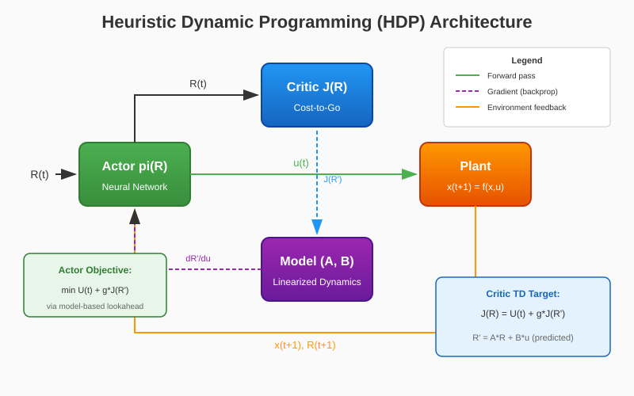

# Heuristic Dynamic Programming (HDP)

HDP (Heuristic Dynamic Programming) is a **model-based** member of the Adaptive Critic Designs (ACD) family. Unlike model-free approaches (like DDPG or SAC), HDP leverages a known or learned **linearized system model** (matrices A, B) to perform one-step lookahead for actor improvement. The critic network learns the scalar cost-to-go function \( J(R) \), and the actor is optimized by backpropagating through the model to minimize expected future cost.

{ width=800 }

## Key Ideas

1. **Model-Based Critic**: The critic \( J(R) \) estimates the cost-to-go as a function of the observable state \( R(t) = [x(t), \theta_{ref}(t), q_{ref}(t)] \)
2. **One-Step Lookahead**: The actor is improved by minimizing \( U(t) + \gamma J(R_{t+1}) \) where \( R_{t+1} \) is predicted using the linearized model
3. **Temporal Difference Learning**: The critic is trained via TD(0) on \( J(R_t) \approx U_t + \gamma J(R_{t+1}) \)
4. **No Action Input to Critic**: Unlike ADHDP or DDPG, HDP's critic does not take the action as input — it only depends on the state \( R \)

## Architecture

| Component | Role | Implementation |
|-----------|------|----------------|
| Actor \( \pi(R) \) | Generates control signal \( u(t) \) | `DeterministicActor` (MLP with tanh output) |
| Critic \( J(R) \) | Estimates scalar cost-to-go | `JCritic` (MLP → scalar) |
| Model \( (A, B) \) | Linearized dynamics for lookahead | Matrices from `env.model.filt_A`, `env.model.filt_B` |

## Algorithm

### Training Loop

```
For each episode:
    Reset environment → x(0)
    For each step t:
        1. Construct R(t) = [x(t), θ_ref(t), q_ref(t)]
        2. Actor: u(t) = π(R(t)) [+ exploration noise]
        3. Execute u(t) in environment → x(t+1), U(t)
        4. Construct R(t+1) = [x(t+1), θ_ref(t+1), q_ref(t+1)]
        
        # Critic Update (TD Learning)
        5. J_target = U(t) + γ · J(R(t+1))   [bootstrap if not terminal]
        6. L_critic = MSE(J(R(t)), J_target)
        7. Update critic via gradient descent
        
        # Actor Update (Model-Based Lookahead)
        8. R'(t+1) = A · R(t) + B · π(R(t))   [model prediction]
        9. L_actor = U(t) + γ · J(R'(t+1))
        10. Update actor via gradient descent (through model & critic)
```

### Mathematical Formulation

**Critic Loss (TD Target):**

$$
\mathcal{L}_{\text{critic}} = \mathbb{E}\left[ \left( J(R_t) - \left( U_t + \gamma J(R_{t+1}) \right) \right)^2 \right]
$$

**Actor Loss (One-Step Lookahead):**

$$
\mathcal{L}_{\text{actor}} = \mathbb{E}\left[ U_t + \gamma J\left( A \cdot R_t + B \cdot \pi(R_t) \right) \right]
$$

Where:
- \( U_t \) is the immediate cost (negative reward)
- \( \gamma \) is the discount factor
- \( A, B \) are the linearized system matrices

### Cost Function

The utility \( U(t) \) is typically a quadratic tracking cost:

$$
U(t) = w_\theta (\theta - \theta_{ref})^2 + w_q (q - q_{ref})^2 + w_u \|u\|^2 + w_{\Delta u} \|\Delta u\|^2
$$

| Weight | Meaning |
|--------|---------|
| \( w_\theta \) | Pitch angle tracking penalty |
| \( w_q \) | Pitch rate tracking penalty |
| \( w_u \) | Control effort penalty |
| \( w_{\Delta u} \) | Control smoothness penalty |

## Quick Start

```python
import numpy as np
from tensoraerospace.agent.hdp import HDP
from tensoraerospace.envs.b747 import ImprovedB747Env

def step_reference(steps: int, deg: float = 5.0) -> np.ndarray:
    """Generate step reference signal for pitch tracking."""
    ref = np.zeros((1, steps), dtype=np.float32)
    ref[:, steps // 5:] = np.deg2rad(deg)
    return ref

num_steps = 800

env = ImprovedB747Env(
    initial_state=np.array([0.0, 0.0, 0.0, 0.0], dtype=float),
    reference_signal=step_reference(num_steps, deg=5.0),
    number_time_steps=num_steps,
    dt=0.02,
)

agent = HDP(
    env,
    gamma=0.99,
    actor_lr=3e-4,
    critic_lr=3e-4,
    hidden_size=256,
    exploration_std=0.1,
    device="cpu",
    # Tracking cost weights
    dhp_w_theta=5.0,
    dhp_w_q=0.2,
    dhp_w_u=0.01,
    dhp_w_du=0.02,
    # Optional: use a PD baseline for stability
    dhp_use_baseline=False,
)

# Train the agent
agent.train(num_episodes=100, max_steps=num_steps)

# Save the trained model
agent.save("./hdp_b747_model")
```

## Hyperparameters

### Core Parameters

| Parameter | Default | Description |
|-----------|---------|-------------|
| `gamma` | 0.99 | Discount factor for future costs |
| `actor_lr` | 3e-4 | Actor network learning rate |
| `critic_lr` | 3e-4 | Critic network learning rate |
| `hidden_size` | 256 | Hidden layer size for both networks |
| `exploration_std` | 0.1 | Gaussian noise std for exploration |

### Tracking Cost Weights

| Parameter | Default | Description |
|-----------|---------|-------------|
| `dhp_w_theta` | 5.0 | Weight for pitch tracking error |
| `dhp_w_q` | 0.2 | Weight for pitch rate tracking error |
| `dhp_w_u` | 0.01 | Weight for control magnitude |
| `dhp_w_du` | 0.02 | Weight for control rate (smoothness) |
| `dhp_use_env_cost` | True | Use environment cost if available |

### Stabilization Options

| Parameter | Default | Description |
|-----------|---------|-------------|
| `dhp_use_baseline` | False | Use PD/PID baseline controller |
| `dhp_baseline_type` | "pd" | Baseline type: "pd" or "pid" |
| `dhp_baseline_kp` | 0.6 | Proportional gain |
| `dhp_baseline_kd` | 0.2 | Derivative gain |
| `dhp_residual_scale` | 1.0 | Scale of learned residual policy |

### Training Schedule

| Parameter | Default | Description |
|-----------|---------|-------------|
| `dhp_warmstart_actor_episodes` | 0 | Episodes to warmstart actor from baseline |
| `dhp_critic_cycle_episodes` | 0 | Episodes to train critic only (alternating) |
| `dhp_action_cycle_episodes` | 0 | Episodes to train actor only (alternating) |

## Comparison with Other ACD Designs

| Design | Critic Output | Actor Improvement | Model Needed |
|--------|--------------|-------------------|--------------|
| **HDP** | \( J(R) \) | Model-based lookahead | Yes |
| DHP | \( \lambda = \partial J / \partial R \) | Direct gradient | Yes |
| GDHP | \( J(R), \lambda \) | Both J and gradients | Yes |
| ADHDP | \( J(R, a) \) | Critic gradients w.r.t action | No |

!!! tip "When to Use HDP"
    Use HDP when you have access to a reasonably accurate linearized model of the plant. It typically converges faster than model-free methods for systems where the linear approximation holds well around the operating point.

## Supported Environments

- `ImprovedB747Env` — Boeing 747 longitudinal dynamics with tracking reference

## Example: Step Response Tracking

The HDP agent can be trained to track step reference signals for pitch angle:

```python
# Evaluate trained agent
obs, _ = env.reset()
done = False
theta_history = []

while not done:
    action = agent.select_action(obs, evaluate=True)
    obs, reward, terminated, truncated, info = env.step(action)
    done = terminated or truncated
    theta_history.append(obs[3])  # pitch angle

import matplotlib.pyplot as plt
plt.plot(theta_history, label='Actual θ')
plt.plot(env.reference_signal[0, :len(theta_history)], '--', label='Reference')
plt.xlabel('Time step')
plt.ylabel('Pitch angle (rad)')
plt.legend()
plt.title('HDP Pitch Tracking')
plt.show()
```

## API Reference

::: tensoraerospace.agent.hdp.model.HDP

::: tensoraerospace.agent.adp.networks.JCritic

::: tensoraerospace.agent.adp.networks.DeterministicActor

## References

- Prokhorov D.V., Wunsch D.C. "Adaptive Critic Designs." IEEE Transactions on Neural Networks, vol. 8, no. 5, pp. 997-1007, 1997.
- Werbos P.J. "Approximate dynamic programming for real-time control and neural modeling." Handbook of Intelligent Control, 1992.
- Si J., et al. "Handbook of Learning and Approximate Dynamic Programming." Wiley-IEEE Press, 2004.
