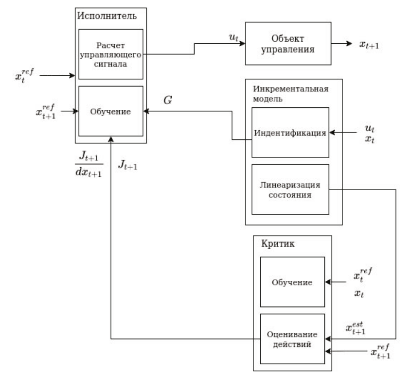

# Incremental Heuristic Dynamic Programming (IHDP)

IHDP is an incremental variant of Heuristic Dynamic Programming from the Adaptive Critic Designs (ACD) family for controlling nonlinear systems with partial model knowledge. In aerospace tasks it is used for longitudinal control synthesis. See also the F‑16 model: [LinearLongitudinalF16](../model/f16.md).

## Key ideas

- The incremental model linearizes the dynamics locally using online data
- The actor produces the control signal based on tracking error
- The critic estimates the cost function and provides gradients to the actor

{ width=800 }

## IHDP components

| Component | Role | Implementation |
| --- | --- | --- |
| Incremental model | Online identification and linearization of dynamics | `tensoraerospace.agent.ihdp.Incremental_model.IncrementalModel` |
| Actor | Generates the control signal (NN) | `tensoraerospace.agent.ihdp.Actor` |
| Critic | Estimates J(x) and gradient dJ/dx (NN) | `tensoraerospace.agent.ihdp.Critic` |
| IHDPAgent | Orchestrates modules, prediction step and training | `tensoraerospace.agent.ihdp.model.IHDPAgent` |

## Quick start

Example agent initialization and a single prediction step:

<!-- markdownlint-disable MD046 -->
```python
import numpy as np
from tensoraerospace.agent.ihdp.model import IHDPAgent

actor_settings = {
    "start_training": 100,
    "layers": (64, 32, 1),
    "activations": ("tanh", "tanh", "tanh"),
    "learning_rate": 0.01,
    "learning_rate_exponent_limit": 8,
    "type_PE": "3211",
    "amplitude_3211": 1,
    "pulse_length_3211": 15,
    "maximum_input": 25,
    "maximum_q_rate": 20,
    "WB_limits": 30,
    "NN_initial": None,
    "cascade_actor": False,
    "learning_rate_cascaded": 0.01,
}

critic_settings = {
    "Q_weights": np.eye(2),
    "start_training": 100,
    "gamma": 0.99,
    "learning_rate": 0.01,
    "learning_rate_exponent_limit": 8,
    "layers": (64, 32, 1),
    "activations": ("tanh", "tanh", "tanh"),
    "indices_tracking_states": [0, 1],
    "WB_limits": 30,
    "NN_initial": None,
}

incremental_settings = {
    "number_time_steps": 1000,
    "dt": 0.02,
    "input_magnitude_limits": 25,
    "input_rate_limits": 20,
}

tracking_states = ["alpha", "wz"]
selected_states = ["alpha", "wz"]
selected_input = ["elevator"]
number_time_steps = 1000
indices_tracking_states = [0, 1]

agent = IHDPAgent(
    actor_settings,
    critic_settings,
    incremental_settings,
    tracking_states,
    selected_states,
    selected_input,
    number_time_steps,
    indices_tracking_states,
)

# Single prediction step
xt = np.zeros((len(selected_states), 1))
reference = np.zeros((len(selected_states), number_time_steps))
ut = agent.predict(xt, reference, time_step=0)
```
<!-- markdownlint-enable MD046 -->

!!! tip
    Ensure `indices_tracking_states` align with the environment state ordering.

## Hyperparameters

### Actor

| Parameter | Description |
| --- | --- |
| layers, activations | NN architecture and activations |
| learning_rate, learning_rate_exponent_limit | Learning rate and scaling limit |
| type_PE, amplitude_3211, pulse_length_3211 | Persistent excitation parameters |
| maximum_input, maximum_q_rate, WB_limits | Limits and saturations |
| cascade_actor, learning_rate_cascaded | Cascade mode |

### Critic

| Parameter | Description |
| --- | --- |
| Q_weights | Cost-function weight matrix |
| gamma | Discount factor |
| learning_rate, learning_rate_exponent_limit | Learning settings |
| layers, activations | Architecture |
| indices_tracking_states | Tracking-state indices |
| WB_limits, NN_initial | Limits/initialization |

### Incremental model

| Parameter | Description |
| --- | --- |
| number_time_steps, dt | Horizon and integration step |
| input_magnitude_limits | Control magnitude limit |
| input_rate_limits | Control rate limit |

## Supported environments

- `LinearLongitudinalF16-v0`

## Examples

- Detailed F‑16 walkthrough: [IHDP ↔ LinearLongitudinalF16](../example/agent/ihdp/example_ihdp.md)

## API reference

::: tensoraerospace.agent.ihdp.model.IHDPAgent

::: tensoraerospace.agent.ihdp.Actor

::: tensoraerospace.agent.ihdp.Critic

::: tensoraerospace.agent.ihdp.IncrementalModel

## Sources

- [Incremental Model Based Heuristic Dynamic Programming for Nonlinear Adaptive Flight Control](https://www.researchgate.net/publication/313696777_Incremental_Model_Based_Heuristic_Dynamic_Programming_for_Nonlinear_Adaptive_Flight_Control)
- [IHDP (reference implementation)](https://github.com/joigalcar3/IHDP)

## Paper audit and learning-rate migration

Reference: [Zhou, van Kampen and Chu (2016), Incremental Model Based Heuristic Dynamic Programming for Nonlinear Adaptive Flight Control](https://www.imavs.org/papers/2016/25.pdf), especially Eq. (12). The actor minimizes `0.5 * J_next**2`. For `u = maximum_input * tanh(z)`, the weight gradient must include `maximum_input`; sigmoid output scaling contributes twice that factor.

The former SISO implementation omitted that factor. The linked [TensorFlow reference implementation](https://github.com/joigalcar3/IHDP/tree/bddfeb7736f32ec158b6b3f6fa3044b19c12b0e0) has the same omission; it is not an error introduced solely by the PyTorch port. This repository belongs to José Ignacio de Alvear Cárdenas, not the authors of the 2016 paper.

Divide previously tuned SISO actor rates and their floors by the output gain as a starting point, then validate the closed loop. `learning_rate_min` controls the alpha-decay schedule floor (default 0.001). MIMO gradients already included their output gains. The nonlinear F16 lesson further retunes the actor rate to `2 / 15 * 2` and floor to `0.001 / 15 * 2`; B737 uses `1.5 / 4 * 1.01` and `0.001 / 4 * 1.01`.

Incremental least squares now solves the measured design matrix directly, avoiding the squared condition number of normal equations. Unavailable initial samples contribute zeros instead of random fabricated measurements. `Q_weights` accepts a diagonal vector or a full symmetric positive-semidefinite matrix and preserves cross terms.

The nonlinear F16 accuracy is for **IHDP with inverse-model feedforward**; the B737 example includes **integral correction**. These additions are explicitly outside the basic paper algorithm.
