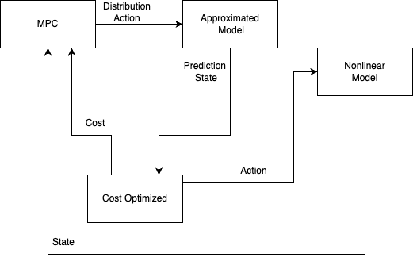

# Model Predictive Control (MPC)

MPC uses a dynamics model to predict system behavior and choose an optimal control sequence under constraints. At each step it solves an optimization problem, applies the first control input from the optimal sequence, and repeats with a shifted horizon.

{ width=800 }

## Theory (brief)

- Discrete dynamics: \(x_{k+1} = f(x_k, u_k)\)
- Horizon cost \(N\):

$$
J = \sum_{i=0}^{N-1} (x_{k+i} - x^{\mathrm{ref}}_{k+i})^\top Q (x_{k+i} - x^{\mathrm{ref}}_{k+i})
    + u_{k+i}^\top R\, u_{k+i} + \Delta u_{k+i}^\top S\, \Delta u_{k+i}
    + (x_{k+N}-x^{\mathrm{ref}}_{k+N})^\top P (x_{k+N}-x^{\mathrm{ref}}_{k+N})
$$

- Control increment:

$$
\Delta u_{k+i} = u_{k+i} - u_{k+i-1}
$$

- Constraints:

$$
\begin{aligned}
u_{\min} \le u_{k+i} \le u_{\max}, &\quad \|\Delta u_{k+i}\|_\infty \le \Delta u_{\max}, \\
x_{k+i} \in \mathcal{X}, &\quad i = 0,\dots,N-1
\end{aligned}
$$

- Receding horizon: solve → apply \(u_k\) → shift window → repeat
- Stability: terminal weight/set \(P, \mathcal{X}_f\), sufficient \(N\), feasibility
- Linear dynamics \(x_{k+1} = A x_k + B u_k\) with quadratic \(J\) yield a convex QP

In `AircraftMPC` the weights are set via `weights`, constraints via `u_max`, `delta_u_max`, and violations penalized with `penalty_weight`.

### How this maps to `AircraftMPC`

- Dynamics: user-defined `dynamics_model(xu)` is iterated in `predict_trajectory`:
  - input: concatenated state/control \([x_t, u_t]\)
  - output: predicted \(x_{t+1}\)
- Cost: `cost_function` sums three weighted terms (`weights`):
  - `theta_tracking` — state tracking (example uses index 3)
  - `control_effort` — control energy \(\sum u_t^2\)
  - `delta_control` — smoothness \(\sum (u_t - u_{t-1})^2\)
- Constraints: enforced softly through `penalty_function` with `penalty_weight`:
  - saturation \(|u_t| \le u_{\max}\)
  - rate limit \(|u_t - u_{t-1}| \le \Delta u_{\max}\)
- Optimization: `optimize_control` uses numerical gradients over \(U\) with step `learning_rate` and projection onto bounds.

Thus the practical setup mirrors classical quadratic MPC with hard bounds, implemented via penalties plus projections for numerical convenience.

## Components

| Component | Role | Implementation |
| --- | --- | --- |
| Dynamics | Predict next state from \(x_t, u_t\) | Custom model or `DynamicsNN` |
| Cost | Balance tracking/effort/smoothness | `AircraftMPC.cost_function` |
| Constraints | Control and rate limits | `u_max`, `delta_u_max` + `penalty_weight` |
| Optimizer | Search over control sequence \(U\) | Numerical gradient + `learning_rate`, `iterations` |

## Quick start

=== "Линейная модель (A, B)"

    ```python
    import numpy as np
    import torch
    from tensoraerospace.agent.mpc.base import AircraftMPC

    # Simple linear dynamics x_{t+1} = A x_t + B u_t
    A = np.array([[1, 0, 0, 0],
                [0, 1, 0, 0],
                [0, 0, 1, 0],
                [0, 0, 0, 1]], dtype=np.float32)
    B = np.array([[0], [0], [0], [1]], dtype=np.float32)

    def dyn_model(xu: torch.Tensor) -> torch.Tensor:
        x = xu[..., :4].numpy()
        u = xu[..., 4:].numpy()
        x_next = A @ x.T + B @ u.T
        return torch.tensor(x_next.T, dtype=torch.float32)

    mpc = AircraftMPC(dynamics_model=dyn_model, horizon=10, dt=0.05)

    x0 = np.zeros(4, dtype=np.float32)
    # Reference trajectory for theta (last component in cost_function)
    theta_ref = np.zeros(mpc.horizon + 1, dtype=np.float32)

    u0, X_pred = mpc.optimize_control(x0, theta_ref)
    ```

=== "NN dynamics model (example)"

    ```python
    import numpy as np
    import torch
    import torch.nn as nn
    import gymnasium as gym
    from tensoraerospace.agent.mpc.base import AircraftMPC
    from tensoraerospace.agent.mpc.dynamics import DynamicsNN
    from tensoraerospace.signals.standart import unit_step
    from tensoraerospace.utils import generate_time_period

    # 1) Environment and matrices A, B (F-16 example)
    dt = 0.1
    tp = generate_time_period(tn=20, dt=dt)
    number_time_steps = len(tp)

    env = gym.make(
        'LinearLongitudinalF16-v0',
        number_time_steps=number_time_steps,
        initial_state=[[0],[0]],
        reference_signal=unit_step(degree=2, tp=tp, time_step=int(5/dt), output_rad=True).reshape(1, -1),
    )
    state, info = env.reset()
    A = np.array(env.unwrapped.model.A, dtype=np.float32)
    B = np.array(env.unwrapped.model.B, dtype=np.float32)

    # 2) NN dynamics model f([x,u]) -> x_{t+1}
    model = nn.Sequential(
        nn.Linear(4 + 1, 64), nn.ReLU(),
        nn.Linear(64, 64), nn.ReLU(),
        nn.Linear(64, 4)
    )
    dyn = DynamicsNN(model)

    # 3) Generate training data (as in examples)
    state_ranges = [(-1, 1), (-1, 1), (-1, 1), (-1, 1)]
    states, controls, next_states = dyn.generate_training_data(
        num_samples=30000,
        state_dim=4,
        control_dim=1,
        state_ranges=state_ranges,
        control_signals=["sine", "step", "sine_09", "sine_07", "gaussian_noise", "linear_up", "linear_down"],
        A=A, B=B,
    )

    dyn.train_and_validate(states, controls, next_states, epochs=20, batch_size=512, verbose_epoch=5)

    # 4) MPC on top of NN dynamics
    def dyn_model(xu: torch.Tensor) -> torch.Tensor:
        return model(xu)

    mpc = AircraftMPC(dynamics_model=dyn_model, horizon=2, dt=dt)

    x0 = np.zeros(4, dtype=np.float32)
    # Theta reference trajectory
    theta_ref = unit_step(degree=2, tp=np.arange(mpc.horizon+1)*dt, time_step=0, output_rad=True).astype(np.float32)

    u0, X_pred = mpc.optimize_control(x0, theta_ref)
    ```

Full walkthrough with plots: [MPC example](../example/agent/mpc/example_mpc.md)

## MPC variants

- **Gradient MPC agent** (`MPCOptimizationAgent`): optimizes action sequences with gradient methods over learned dynamics; suitable for deterministic tracking.
- **Stochastic MPC agent** (`MPCAgent`): handles action distributions/uncertainty with stochastic sampling and regularization; useful under noise and constraints.
- **Dynamics models**:
  - `DynamicsNN`: baseline NN approximation f([x,u]) → x′
  - `NARX`: nonlinear autoregression with exogenous inputs
  - `TransformerDynamicsModel`: transformer-based sequence model

!!! note
    Choose the variant based on system properties: determinism, noise, dimensionality, data availability.

## Hyperparameters and tips

- `horizon`: longer horizon improves quality (higher compute cost)
- `weights.theta_tracking`: prioritize theta tracking
- `weights.control_effort`, `weights.delta_control`: limit energy and control jitter
- `u_max`, `delta_u_max`: physical limits; raise `penalty_weight` if violations persist
- `learning_rate`, `iterations`: optimization speed vs. accuracy

!!! tip
    For real systems normalize features and regularize the NN dynamics model.

## Документация API

::: tensoraerospace.agent.mpc.base.AircraftMPC

::: tensoraerospace.agent.mpc.dynamics.DynamicsNN

::: tensoraerospace.agent.mpc.gradient.MPCOptimizationAgent

::: tensoraerospace.agent.mpc.stochastic.MPCAgent

::: tensoraerospace.agent.mpc.narx.NARX

::: tensoraerospace.agent.mpc.transformers.TransformerDynamicsModel
