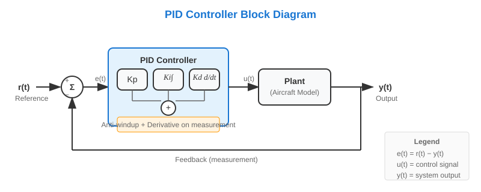

# PID Controller

The PID (Proportional-Integral-Derivative) controller is a classic feedback control algorithm widely used in aerospace, robotics, and industrial automation. Our implementation follows MATLAB/Simulink conventions and includes automatic MATLAB-style coefficient tuning.

{ width=700 }

## Theory

A PID controller computes the control signal \(u(t)\) based on the error \(e(t) = r(t) - y(t)\) between the reference \(r(t)\) and the measured output \(y(t)\):

$$
u(t) = K_p e(t) + K_i \int_0^t e(\tau)\,d\tau + K_d \frac{de(t)}{dt}
$$

### Components

| Term | Role | Effect |
|------|------|--------|
| **Proportional (P)** | Reacts to current error | Fast response, may cause steady-state error |
| **Integral (I)** | Accumulates past error | Eliminates steady-state error, can cause overshoot |
| **Derivative (D)** | Predicts future error | Dampens oscillations, sensitive to noise |

### Discrete Implementation

In discrete time with step \(\Delta t\):

$$
u_k = K_p e_k + K_i \sum_{j=0}^{k} e_j \Delta t + K_d \frac{y_{k-1} - y_k}{\Delta t}
$$

!!! note "Derivative on Measurement"
    Our implementation uses **derivative on measurement** (not on error), as is default in Simulink. This avoids "derivative kick" when the setpoint changes suddenly.

### Anti-Windup

When the control output saturates (hits actuator limits), the integral term can "wind up" causing large overshoot. Our implementation includes **conditional integration anti-windup**: the integral is frozen when output is saturated.

## Quick Start

```python
import gymnasium as gym
from tensoraerospace.agent.pid import PID

# Create environment
env = gym.make('LinearLongitudinalB747-v0', number_time_steps=2000)

# Create PID controller
pid = PID(env=env, kp=-0.1, ki=-0.01, kd=-0.05, dt=0.01)

# Control loop
obs, info = env.reset()
for _ in range(2000):
    reference = info['reference']
    measurement = obs[3]  # theta (pitch angle)
    action = pid.select_action(reference, measurement)
    obs, reward, done, truncated, info = env.step([action])
```

## MATLAB-Style Automatic Tuning

The `tune_matlab_style()` method automatically finds optimal PID coefficients using global optimization, similar to MATLAB's PID Tuner in Simulink.

### How It Works

1. **Extracts state-space model** (A, B, C, D matrices) from the environment
2. **Determines loop sign** automatically using DC gain analysis
3. **Runs differential evolution** to minimize a cost function
4. **Optimizes for robustness**: considers both step response AND tracking performance

### Tuning Modes

=== "Step Response Mode"

    Optimizes for clean step response with fast settling and minimal overshoot.

    ```python
    pid = PID(env=env)
    result = pid.tune_matlab_style(
        track_state_idx=3,      # Index of theta state
        mode="step_response",
        target_settling_time=5.0,
        target_overshoot=10.0,
        n_iterations=100
    )
    print(result)
    # MATLABTuneResult(Kp=-0.1234, Ki=-0.0456, Kd=-0.0789, ...)
    ```

    **Cost function minimizes:**
    - Settling time (time to reach ±2% of final value)
    - Overshoot above target threshold
    - Steady-state error
    - Integral Squared Error (ISE)
    - Control effort and saturation

    **Also considers** tracking performance as secondary objective (25% weight) to ensure the tuned PID doesn't fail on sinusoidal signals.

=== "Tracking Mode"

    Optimizes for accurate following of time-varying signals (sinusoids, ramps).

    ```python
    pid = PID(env=env)
    result = pid.tune_matlab_style(
        track_state_idx=3,
        mode="tracking",
        n_iterations=100
    )
    ```

    **Cost function minimizes:**
    - Root Mean Square Error (RMSE)
    - Integral Absolute Error (IAE)
    - Phase lag
    - Control effort and saturation

    **Also considers** step response as secondary objective (25% weight) to ensure stability on sudden reference changes.

### Usage Example with B747

```python
import gymnasium as gym
import numpy as np
from tensoraerospace.agent.pid import PID
from tensoraerospace.signals.standard import unit_step
from tensoraerospace.utils import generate_time_period

# Setup
dt = 0.01
tp = generate_time_period(tn=20, dt=dt)
n_steps = len(tp)

# Create step reference signal (5 degrees)
reference = unit_step(degree=5, tp=tp, time_step=100, output_rad=False)

env = gym.make(
    'LinearLongitudinalB747-v0',
    number_time_steps=n_steps,
    initial_state=np.array([[0], [0], [0], [0]]),
    reference_signal=reference.reshape(1, -1),
    track_state='theta'
)

# Create and tune PID
pid = PID(env=env, dt=dt)
result = pid.tune_matlab_style(
    track_state_idx=3,        # theta index
    mode="step_response",
    target_settling_time=5.0,
    target_overshoot=10.0,
    n_iterations=150,
    verbose=True
)

print(f"Tuned PID: Kp={pid.kp:.4f}, Ki={pid.ki:.4f}, Kd={pid.kd:.4f}")
print(f"Settling time: {result.settling_time:.2f}s")
print(f"Overshoot: {result.overshoot:.1f}%")
```

### Output Example

```
📊 MATLAB-Style PID Optimization (Step Response)
------------------------------------------------------------
   System dimension: 4 states
   Matrices: A=(4, 4), B=(4, 1), C=(4, 4), D=(4, 1)
   Simulation steps: 2000, dt: 0.01s
   Mode: Step Response
   Target settling time: 5.0s
   Target overshoot: 10.0%
   DC Gain: -0.0421

   🔄 Running optimization (150 iterations)...
   Optimization: 100%|██████████| 150/150 [00:45<00:00]

   ✅ Optimization completed!
   Kp=-0.1523, Ki=-0.0234, Kd=-0.0891
   [Primary step] Settling time: 4.32s
   [Primary step] Overshoot: 8.45%
   [Primary step] Static error: 0.0012
   [Secondary sine] RMSE: 0.3421
```

## Key Parameters

| Parameter | Description | Default |
|-----------|-------------|---------|
| `kp` | Proportional gain | 1.0 |
| `ki` | Integral gain | 1.0 |
| `kd` | Derivative gain | 0.5 |
| `dt` | Time step (seconds) | 0.01 |
| `env` | Gymnasium environment | None |

### `tune_matlab_style()` Parameters

| Parameter | Description | Default |
|-----------|-------------|---------|
| `track_state_idx` | Index of state to control | Required |
| `mode` | `"step_response"` or `"tracking"` | `"step_response"` |
| `target_settling_time` | Desired settling time (s) | Auto |
| `target_overshoot` | Max acceptable overshoot (%) | 10.0 |
| `n_iterations` | Optimization iterations | 100 |
| `verbose` | Print progress | True |

## Comparison with Other Methods

| Method | Pros | Cons | Best For |
|--------|------|------|----------|
| **PID** | Simple, fast, well-understood | Limited performance on complex dynamics | Linear systems, quick prototyping |
| **MPC** | Handles constraints, optimal | Computationally expensive | Constrained systems, trajectories |
| **RL (SAC/PPO)** | Adapts to nonlinear dynamics | Requires training, less interpretable | Complex nonlinear systems |

## Practical Tips

!!! tip "When to Use PID vs Other Methods"
    - **Use PID** when the system is approximately linear and you need a simple, interpretable controller
    - **Use MPC** when you have explicit constraints on states or controls
    - **Use RL** when the dynamics are highly nonlinear or unknown

!!! warning "Unit Consistency"
    Ensure your reference signal and observations use the same units. Our tuner automatically handles degree/radian conversion for B747 environments.

!!! tip "Starting Point"
    For most aerospace systems, start with `mode="step_response"` and `target_overshoot=10.0`. This gives a good balance between speed and stability.

## API Reference

::: tensoraerospace.agent.pid.PID

::: tensoraerospace.agent.pid.MATLABTuneResult

::: tensoraerospace.agent.pid.StateSpaceNotAvailable

