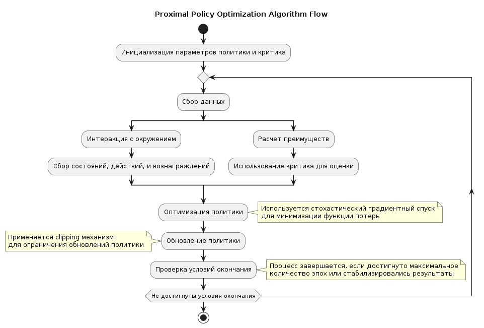

# Proximal Policy Optimization (PPO)

PPO is a reliable policy-gradient method that balances implementation simplicity with stable learning. Our implementation trains the actor and critic on batches of collected rollouts, using a clipped surrogate objective, policy entropy, and GAE-style advantage estimation.

{ width=800 }

## Components

- Actor (Gaussian policy): parameters \(\mu, \sigma\) define \(\mathcal{N}(\mu, \sigma^2)\)
- Critic: scalar value estimate \(V(s)\)
- Experience collection: rollout of length `rollout_len` storing \(s,a,\log\pi(a|s), r, d, V(s)\)
- Training: mini-batches across `num_epochs` with clipped probability ratios

## Theory

- Probability ratio:

$$
 r_t(\theta) = \frac{\pi_\theta(a_t|s_t)}{\pi_{\theta_{\text{old}}}(a_t|s_t)} = \exp\big(\log \pi_\theta - \log \pi_{\theta_{\text{old}}}\big)
$$

- Clipped surrogate (Actor):

$$
\mathcal{L}_\text{actor} = -\,\mathbb{E}\Big[\min\big( r_t\,A_t,\ \mathrm{clip}(r_t,\ 1-\varepsilon,\ 1+\varepsilon)\,A_t \big) \Big]
$$

- Critic loss (Value):

$$
\mathcal{L}_\text{critic} = \mathbb{E}\big[ (R_t - V_\phi(s_t))^2 \big]
$$

- Entropy regularization:

$$
\mathcal{L}_\text{entropy} = -\beta\,\mathbb{E}\big[\mathcal{H}[\pi_\theta(\cdot|s_t)]\big]
$$

- Total loss: \(\mathcal{L} = \mathcal{L}_\text{actor} + \mathcal{L}_\text{critic} + \mathcal{L}_\text{entropy}\)

- Advantage (GAE-like): `preprocess1` returns \(\text{return} = V + \sum\gamma\lambda\,\delta\), with \(A = \text{return} - V\)

$$
\delta_t = r_t + \gamma V(s_{t+1}) - V(s_t),\quad
\hat{A}_t \approx \sum_{l=0}^{\infty} (\gamma\lambda)^l\, \delta_{t+l}
$$

### Implementation details

- Policy: `Actor.forward(...)` outputs `mu = tanh(Wx)` and `log_std = tanh(Wx)` stretched to `[log_std_min, log_std_max]`; \(\sigma = e^{\log \sigma}\). Actions are sampled from `Normal(mu, sigma)`.
- Probability ratios: computed as `torch.exp(new_probs - old_probs)` for stability versus dividing densities.
- Entropy: `actor_loss` uses `-new_distr.entropy().mean()` and later adds `+ entropy_coef * entropy`, effectively subtracting entropy with a coefficient to encourage stochastic policies.
- GAE & bootstrap: `preprocess1` appends `next_value` to `values`, then iterates backward computing \(\delta\) and accumulating \(g\) with \(\lambda=0.8\); final `returns = V + g`, `advantages = returns - V`.
- Mini-batches: `ppo_iter` samples `mini_batch_size` indices repeatedly each epoch.
- Auxiliary head: with `auxiliary_coef > 0`, `actor.predict_reward(states)` predicts immediate rewards through `self.r`; its MSE is added to the actor objective automatically.

### Training pseudocode

```text
for episode in range(max_episodes):
  rollout = collect(rollout_len)
  next_value = V(s_T)
  returns, advantages = GAE(rollout.rewards, rollout.values, dones, gamma, lambda)
  for epoch in range(num_epochs):
    for batch in mini_batches(rollout, returns, advantages):
      ratios = exp(new_logp - old_logp)
      a_loss = -mean(min(ratios*A, clip(ratios)*A)) + entropy_coef * (-entropy)
      c_loss = mse(returns - V(s))
      update(actor, critic)
  log TensorBoard metrics
```

### Hyperparameters and mapping

- `clip_pram = ε` — clipping threshold for probability ratios
- `num_epochs`, `batch_size` — epochs and mini-batch size per update
- `rollout_len` — rollout length prior to updates
- `entropy_coef` — weight of the entropy term (watch sign in code)
- `actor_lr`, `critic_lr` — Adam learning rates
- `gamma`, `lambda(=0.8)` — discount and GAE parameter inside `preprocess1`

## Quick start

```python
import gymnasium as gym
from tensoraerospace.agent.ppo.model import PPO

# Create environment (F-16 example)
env = gym.make('LinearLongitudinalF16-v0', number_time_steps=2000)

# Initialize PPO
agent = PPO(
    env=env,
    gamma=0.99,
    max_episodes=50,
    rollout_len=2048,
    clip_pram=0.2,
    num_epochs=64,
    batch_size=64,
    entropy_coef=0.005,
    actor_lr=1e-3,
    critic_lr=5e-3,
)

# Train
agent.train()

# Save, then release the original agent's resources
checkpoint_dir = agent.save('./runs')
agent.close()
env.close()

# Load the directory returned by save()
agent = PPO.from_pretrained(str(checkpoint_dir))
```

!!! tip
    For continuous actions use the Gaussian policy; clamp `log_std` (as in code) and normalize features.

## Practical tips

- Increase `rollout_len` for stabler advantage estimates
- Balance `clip_pram` (typically 0.1–0.3) and `entropy_coef` for exploration
- Multiple epochs (`num_epochs`) with smaller `batch_size` help convergence—watch for overfitting

## Reproducibility and cleanup

`seed` controls the initial actor and critic weights, including an enabled reward
head. Seed the environment separately when comparing training runs.

Both synchronous (`save_best_async=False`) and background best checkpoints save
network weights, Adam optimizer states, the best reward, and enabled normalization
statistics. Load the checkpoint directory with `PPO.from_pretrained(...)` to
continue training with those states.

Call `agent.close()` after use to finish pending checkpoint writes and close the
TensorBoard/W&B writers. It is safe to call more than once. Close the environment
separately with `agent.env.close()`.

## Auxiliary Tasks {#auxiliary-tasks}

Set `auxiliary_coef > 0` when creating `PPO` to enable immediate-reward prediction.
An optional linear head `actor.r` shares the actor's two hidden layers and predicts
one reward per observation. Both the head and those shared layers receive
gradients from the auxiliary loss:

```text
auxiliary_loss = mean((predicted_reward - immediate_reward) ** 2)
actor_objective = actor_loss + auxiliary_coef * auxiliary_loss
```

`learn()` adds this term automatically, including when called by `train()` with
a single or batched environment. Targets are the immediate rewards stored in
the rollout, not discounted returns; `normalize_reward` only normalizes returns.
The default `auxiliary_coef=0.0` creates no reward-head parameters and keeps
existing checkpoints loadable. The coefficient and reward-head weights are
saved and restored by `save()`, best checkpoints, and `from_pretrained()`.
`save()` and asynchronous best checkpoints also preserve optimizer state.

### Usage

```python
agent = PPO(env=env, auxiliary_coef=0.1)
agent.train(num_episodes=2, max_steps=128)
```

The unweighted MSE is returned as `metrics["auxiliary_loss"]` by `learn()` and
logged as `loss/auxiliary` in TensorBoard/WandB. `actor_loss` continues to report
the policy objective without the auxiliary term.

For a custom training loop, `agent.auxiliary_task(states, rewards)` returns a
differentiable, unweighted scalar loss without stepping the optimizer.
`states` must be a non-empty `(batch_size, obs_dim)` tensor with the same
preprocessing as the policy inputs; `rewards` must be `(batch_size,)` or
`(batch_size, 1)`. Targets are detached, and both tensors are moved to the
agent's device. The previously documented spelling `auxillary_task` is an
alias. Calling either method on an agent created with `auxiliary_coef=0` raises
a clear error.

`Actor.forward(states)` still returns exactly `(action, distribution)`.
Use `actor.predict_reward(states)` for reward predictions on the actor's device;
it does not sample actions.

### F-16 example

Run the short example from the repository root:

```bash
poetry run python example/reinforcement_learning/deep_rl/example_ppo_auxiliary_tasks.py \
  --episodes 2 --steps 128 --log-dir runs/ppo_auxiliary_f16
```

The script trains on the linear F-16, prints the reward-head weight change and
saves a checkpoint. This is a demonstration that the task trains, not a claim
that two rollouts produce a converged controller. The appropriate coefficient
depends on the reward scale; reward prediction does not guarantee better control.

## Unified training interface

PPO follows the shared unified `train()` API from `BaseRLModel`:

```python
stats = agent.train(
    num_episodes=200,   # optional: overrides self.max_episodes
    max_steps=1024,     # optional: overrides self.rollout_len
)
```

Calling `agent.train()` with no arguments is still supported and uses
the hyperparameters set at construction time. Note that PPO's
`learn(states, actions, adv, old_probs, returns, rewards, old_values)`
method is an internal per-batch gradient update helper and is kept
untouched by the unified interface.

## API reference

::: tensoraerospace.agent.ppo.model.PPO

::: tensoraerospace.agent.ppo.model.Actor

::: tensoraerospace.agent.ppo.model.Critic

::: tensoraerospace.agent.ppo.model.ppo_iter

## References

- [Proximal Policy Optimization Algorithms](https://arxiv.org/abs/1707.06347)

## Tested on

- Unity environment
