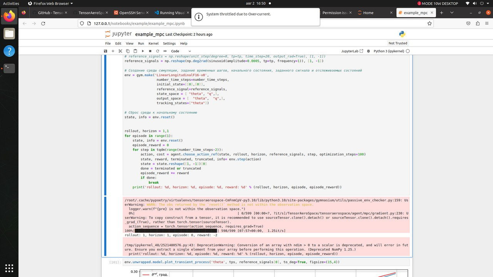

# Testing on ARM Processors

> :material-chip: Performance comparison of TensorAeroSpace on ARM and x64 architectures.

!!! info "ARM Support"
    TensorAeroSpace is fully compatible with ARM64 architecture and can be deployed on embedded systems like NVIDIA Jetson for real-time control systems.

## ARM vs x64 Architecture Comparison

The choice between ARM and x64 depends on use case: ARM is optimal for embedded systems with power constraints, x64 — for high-performance computing.

| Characteristic | ARM (RISC) | x64 (CISC) |
|---------------|------------|------------|
| Instruction Set | Reduced (RISC) | Complex (CISC) |
| Power Consumption | Low (10–20 W) | High (45–65 W) |
| CPU Performance | Optimized for parallelism | High single-thread performance |
| Software Compatibility | Requires native builds | Wide x86/x64 ecosystem |
| Typical Use Case | Edge devices, drones, satellites | Workstations, servers |

## Test Configurations

### :material-robot: ARM: NVIDIA Jetson Xavier NX 16GB

Embedded platform for edge AI computing.

| Parameter | Value |
|-----------|-------|
| **CPU** | 6-core NVIDIA Carmel ARM®v8.2 64-bit |
| **CPU Frequency** | Up to 1.9 GHz |
| **GPU** | 384-core NVIDIA Volta™ with 48 Tensor Cores |
| **AI Performance** | Up to 21 TOPS (INT8) |
| **Memory** | 16 GB LPDDR4x (59.7 GB/s) |
| **Storage** | 16 GB eMMC 5.1 |
| **TDP** | 10–20 W |
| **Dimensions** | 69.6 × 45 mm (module) |

!!! tip "Applications in Aerospace Systems"
    Jetson Xavier NX is ideal for:
    
    - Onboard UAV control systems
    - Ground control stations for drones
    - Satellite data processing
    - Edge inference for autopilot systems

### :material-laptop: x64: GIGABYTE A7 (AMD Ryzen™ 5000 Series)

High-performance laptop for development and model training.

| Parameter | Value |
|-----------|-------|
| **CPU** | AMD Ryzen™ 9 5900HX / Ryzen™ 7 5800H |
| **Cores/Threads** | 8 cores / 16 threads |
| **CPU Frequency** | 3.3–4.6 GHz (boost) |
| **GPU** | NVIDIA GeForce RTX 3060/3070 |
| **Memory** | Up to 64 GB DDR4-3200 |
| **Storage** | NVMe SSD (up to 2 TB) |
| **CPU TDP** | 45 W |
| **Display** | 17.3" FHD 144Hz |

## Benchmark Results

### MPC Controller on LinearLongitudinalF16-v0

Test: 599 simulation steps of `LinearLongitudinalF16-v0` with MPC agent (`example_mpc.ipynb`).

| Metric | Jetson Xavier NX 16GB | PC (x64 + CUDA) |
|--------|----------------------|-----------------|
| **Episode time** | **7 min 57 sec** | **22 sec** |
| Speed (it/s) | 1.25 | 26.25 |
| Time per step | ~800 ms | ~37 ms |
| Speed difference | 1x (baseline) | **21.7x faster** |

#### Results on Jetson Xavier NX



*Jupyter Notebook on Jetson Xavier NX: 598/599 steps in 7:57 (1.25 it/s)*

#### Results on PC (x64 + NVIDIA GPU)


*VS Code + Docker (nvidia/cuda:12.1.0-cudnn8) on PC: 598/599 steps in 22 sec (26.25 it/s)*

!!! warning "Important"
    MPC controller performs optimization at each step (`optimization_steps=100`), which is a computationally intensive operation. For ARM platforms, we recommend:
    
    - Reduce `optimization_steps` for real-time applications
    - Use pre-trained RL agents (SAC, PPO) for inference
    - Apply model quantization

### Energy Efficiency Analysis

| Metric | Jetson Xavier NX | PC (Ryzen + RTX) |
|--------|-----------------|------------------|
| System TDP | ~15 W | ~150 W |
| Episode time | 477 sec | 22 sec |
| Energy per episode | ~2.0 Wh | ~0.9 Wh |
| **Performance per watt** | 0.08 step/(W·s) | 1.75 step/(W·s) |

!!! note "Recommendation"
    - **For training and MPC**: x64 systems with discrete GPUs (21x faster)
    - **For inference with RL agents**: ARM platforms (lower power consumption, sufficient speed)
    - **For edge devices**: Jetson Xavier NX with pre-trained models

## Installation on ARM

!!! warning "Limited ARM Support"
    Testing was performed only on **NVIDIA Jetson Xavier NX 16GB**. We do not guarantee compatibility with other ARM processors and platforms.
    
    If you encounter issues running on ARM:
    
    - Check PyTorch version compatibility with your platform
    - Create an [Issue in our GitHub repository](https://github.com/TensorAeroSpace/TensorAeroSpace/issues) with platform description and error details
    - Attach logs and version information (`python --version`, `pip list`)

### NVIDIA Jetson (JetPack)

=== "Jetson Xavier NX / AGX Xavier"

    ```bash
    # Install base dependencies
    sudo apt update && sudo apt install -y python3-pip python3-venv
    
    # Create virtual environment
    python3 -m venv ~/.venv/tas
    source ~/.venv/tas/bin/activate
    
    # Install PyTorch for Jetson
    pip install --upgrade pip setuptools wheel
    pip install numpy
    
    # PyTorch wheel for JetPack 5.x (ARM64)
    pip install torch torchvision --index-url https://download.pytorch.org/whl/cu121
    
    # Install TensorAeroSpace
    pip install tensoraerospace
    ```

=== "Raspberry Pi 4/5"

    ```bash
    # Python and venv
    sudo apt update && sudo apt install -y python3-pip python3-venv
    
    python3 -m venv ~/.venv/tas
    source ~/.venv/tas/bin/activate
    
    pip install --upgrade pip setuptools wheel
    pip install tensoraerospace
    ```

### Verify GPU on Jetson

```python
import torch

print(f"CUDA available: {torch.cuda.is_available()}")
print(f"Device: {torch.cuda.get_device_name(0) if torch.cuda.is_available() else 'CPU'}")

# Example with TensorAeroSpace
import gymnasium as gym

env = gym.make('LinearLongitudinalF16-v0')
print(f"Environment loaded: {env.spec.id}")
```

## Optimization for ARM

### Quantization

For faster inference on ARM, INT8 quantization is recommended:

```python
import torch

# Load trained model
model = torch.load("policy.pth")
model.eval()

# Dynamic quantization for CPU
quantized_model = torch.quantization.quantize_dynamic(
    model,
    {torch.nn.Linear},
    dtype=torch.qint8
)

# Save optimized model
torch.save(quantized_model.state_dict(), "policy_quantized.pth")
```

### TensorRT (for Jetson)

```python
import torch
import torch_tensorrt

model = torch.load("policy.pth").cuda().eval()

# Compile with TensorRT
trt_model = torch_tensorrt.compile(
    model,
    inputs=[torch_tensorrt.Input(shape=[1, 2], dtype=torch.float32)],
    enabled_precisions={torch.float16},  # FP16 for Volta
)

# Inference
with torch.no_grad():
    output = trt_model(torch.randn(1, 2).cuda())
```

!!! warning "Compatibility"
    TensorRT requires JetPack SDK. Ensure your JetPack version is compatible with your Jetson model.

## Deployment Recommendations

<div class="grid cards" markdown>

-   :material-memory: **Memory Management**

    ARM devices have limited memory. Use:
    
    - Batch size = 1 for inference
    - Models with fewer parameters
    - Cache clearing: `torch.cuda.empty_cache()`

-   :material-thermometer: **Thermal Management**

    Embedded systems are sensitive to overheating:
    
    - Ensure cooling (heatsink, fan)
    - Monitor: `tegrastats` (Jetson)
    - Use power modes: `nvpmodel`

-   :material-clock-fast: **Real-time Requirements**

    For real-time control systems:
    
    - Use PREEMPT_RT kernel
    - Disable CPU frequency scaling
    - Pin process to core: `taskset`

-   :material-battery-charging: **Power Consumption**

    Battery life optimization:
    
    - Jetson: `nvpmodel -m 0` (MAX-N) / `-m 1` (15W)
    - Disable unused interfaces
    - Use sleep between inferences

</div>

## Platform Comparison Table

| Platform | Architecture | TDP | AI TOPS | Price (USD) | Use Case |
|----------|-------------|-----|---------|-------------|----------|
| Jetson Nano | ARM Cortex-A57 | 5–10 W | 0.5 | ~150 | Prototyping |
| Jetson Xavier NX | ARM Carmel | 10–20 W | 21 | ~400 | Edge AI, UAV |
| Jetson AGX Orin | ARM Cortex-A78AE | 15–60 W | 275 | ~1000 | Autonomous systems |
| Raspberry Pi 5 | ARM Cortex-A76 | 5–12 W | — | ~80 | Hobby, education |
| AMD Ryzen 7 5800H | x86-64 Zen 3 | 45 W | — | ~350 | Development, training |

## Next Steps

[:material-chart-line: Benchmark Metrics](metrics.md){ .md-button .md-button--primary }
[:material-cog: Hyperparameter Optimization](../optimization/optuna_based.md){ .md-button }
[:material-robot: Agent Examples](../example/agent/sac/example-sac-f16.md){ .md-button }

