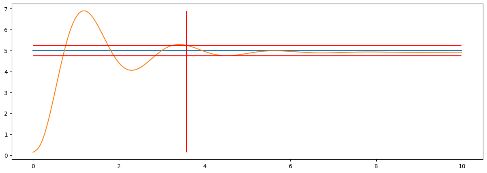

Benchmark
=========

A benchmark is the process of comparing the performance of a control system with one or more other systems using a set of standard criteria and metrics. In the context of automatic control, benchmarking is important for several reasons:

- **Performance evaluation:** A benchmark assesses how well a control system performs by testing it on a standard set of tasks or conditions. This helps determine how effectively the system fulfills its objectives relative to alternatives.

- **Identifying areas for improvement:** Comparing systems can highlight where a control system can be enhanced, whether in specific components or within the overall control strategy.

- **Stability and reliability verification:** Benchmarking can be used to verify the stability and reliability of a control system, which is critical when systems must operate in complex or unpredictable environments.

- **Ensuring reproducibility:** Employing standard benchmark tests ensures that results are reproducible, which is essential for research and objective comparisons between approaches.

Benchmarking enables objective and systematic comparison of various control systems and methods, fostering progress in the field of automatic control.

The benchmark evaluates control-system quality using metrics such as:

- Overshoot of the control system
- Settling time of the control system
- Damping degree of the transient response
- Steady-state error of the control system

Documentation
~~~~~~~~~~~~

.. autoclass:: tensoraerospace.benchmark.ControlBenchmark
  :members:

Usage Example
~~~~~~~~~~~~~

.. code:: python

    from tensoraerospace.benchmark import ControlBenchmark
    bench = ControlBenchmark()
    res = bench.benchmarking_one_step(control_signal_orig, system_signal_orig, 1, dt)

    print("Steady-state error:", res['static_error'])
    print("Settling time:", res['settling_time'], "s")
    print("Damping degree:", res['damping_degree'])
    print("Overshoot:", res['overshoot'])

.. parsed-literal::

    Steady-state error:  0.08338255502023273
    Settling time:  3.58 s
    Damping degree:  0.07645081312669308
    Overshoot:  37.95489807703046

.. code:: python
    
    bench.plot(control_signal_orig, system_signal_orig, 1, dt, tps, figsize=(15,5))

.. note::

    The old method name ``becnchmarking_one_step`` still works as an alias for
    ``benchmarking_one_step`` for backward compatibility.
