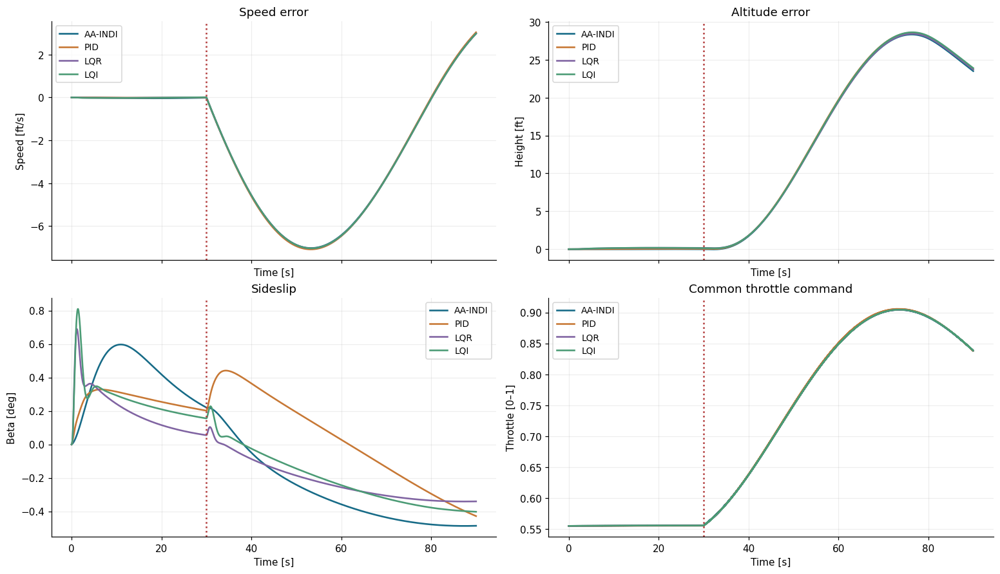
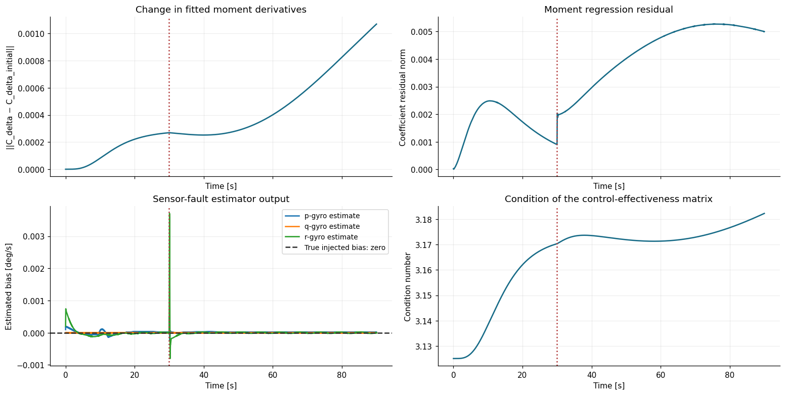

# AA-INDI vs PID, LQR and LQI: B747 engine failure

AA-INDI achieves the lowest combined roll/heading error in this nonlinear B747
experiment. After a complete engine failure at 30 s, its combined RMSE over the
remaining 60 s is **0.032433°**: **97.0% lower than PID, 91.0% lower than LQR and
89.2% lower than LQI**. Both angles return to and stay within ±0.05° after **8.68 s**.

This result describes the configurations below. AA-INDI uses more control-surface
activity than LQR and LQI. In the longer 500 s experiment, PID and LQI also recover.

[Executed notebook](https://github.com/TensorAeroSpace/TensorAeroSpace/blob/develop/example/reinforcement_learning/incremental_adp/example_aaindi_vs_pid_lqr_b747.ipynb)
· [Controller and simulation code](https://github.com/TensorAeroSpace/TensorAeroSpace/blob/develop/tensoraerospace/benchmark/engine_failure.py)

## Scenario and reference signals

The plant is the [nonlinear 6-DoF B747](../model/b747_nonlinear.md) with 12 states.
The task is to hold **roll = 0° and heading = 0° throughout the flight**. Initial
attitude errors produce the first transient; asymmetric thrust produces the second.

| Parameter | Value |
|---|---|
| Initial altitude / airspeed | 20,000 ft / 674 ft/s (6,096 m / 205.44 m/s) |
| Initial roll / heading | 0.3° / 1° |
| Duration / sample interval | 90 s / 0.02 s (50 Hz) |
| Failure | Complete loss of engine 1, left outer engine, at 30 s |
| Aileron and rudder limits | ±8° and 20°/s for every controller |
| Longitudinal control | Shared measured-state PI/PD speed and altitude hold |
| Sensors | Ideal IMU, independent navigation and surface-position feedback |

The native `EngineFailureEvent` removes one engine's thrust and creates a yawing
moment toward the failed engine. At unchanged throttle and flight condition, the
four-engine total thrust becomes **75% of the healthy value**. The longitudinal
controller subsequently adjusts throttle and elevator from measurements.

The event is applied at the start of its physical integration interval. Each
controller's healthy and faulty state/action histories match exactly before the
failure. Fault time, engine number and remaining thrust are unavailable to the
controllers. AA-INDI's observer and identifier run continuously, including through
the event, without a scheduled reset or freeze.


*Left: healthy aircraft. Right: engine failure. Roll is above and heading below;
matching rows use the same scale. The dashed horizontal lines show the zero
commands, and the vertical line marks 30 s for evaluation.*

## Controller design and healthy-aircraft tuning

| Controller | Configuration |
|---|---|
| PID | Separate roll and heading loops; derivative of the measured angle; conditional anti-windup for magnitude and slew limits. |
| LQR | Discrete Riccati design from the healthy local model, using sideslip, roll/yaw rates, roll and heading. |
| LQI | LQR augmented with two bounded angle-error integrals and its own weight selection. |
| [AA-INDI](../agent/aa_indi.md) | Attitude-to-rate outer loop, acceleration feedback, observer and continuously updated moment derivatives. |

PID, LQR and LQI candidates are ranked on a **separate healthy 60 s run** starting
with 1° roll and 2° heading error. Seven PID candidates and five weight settings
for each Riccati design are evaluated using the same objective (angles in degrees):

\[
J_{\mathrm{healthy}} = \operatorname{mean}\left(
 e_\phi^2 + e_\psi^2 + 0.002(\delta_a^2 + \delta_r^2)\right).
\]

No fault trajectory enters this baseline selection. All 17 trials are displayed
in the notebook; the finite search does not establish globally optimal baselines.
LQI includes integral disturbance rejection, making it a useful additional
comparison alongside standard LQR.

AA-INDI starts from a one-time healthy-model estimate of aileron/rudder derivatives
and the aircraft's geometry and inertia. Its outer-loop gain is 0.15 s⁻¹, rate
feedback is 0.5 s⁻¹, acceleration-filter cutoff is 5 Hz, and initial parameter
covariance is 0.001. Angular HOSM drift scales are 10⁻⁴ rad to reduce finite-step
chattering at 50 Hz. These are explicit application settings; the case does not
assess sensor-fault identification. All controller-side measurements use SI units.

## Post-failure accuracy and control effort

Let \(e_\phi\) and \(e_\psi\) be roll and heading errors in degrees. The assessment
window is **(30, 90] s**, with \(N\) samples and \(\Delta t = 0.02\) s:

\[
\mathrm{RMSE}_{\phi,\psi} =
\sqrt{\frac{1}{N}\sum_k(e_{\phi,k}^2 + e_{\psi,k}^2)},\qquad
\mathrm{IAE}_{\phi,\psi} =
\Delta t\sum_k\left(|e_{\phi,k}|+|e_{\psi,k}|\right).
\]

Combined RMSE is the root mean square of the two-dimensional error norm. Combined
IAE accumulates absolute error across **both commanded angles**. Recovery time is
measured from the failure until both errors enter ±0.05° and stay there through
the end of the run. “Not reached” means this condition was not met by 90 s.

| Controller | Roll RMSE, ° | Heading RMSE, ° | Combined RMSE, ° | Combined IAE, °·s | Recovery, s |
|---|---:|---:|---:|---:|---:|
| **AA-INDI** | **0.018095** | **0.026916** | **0.032433** | **2.03693** | **8.68** |
| PID | 0.116834 | 1.079879 | 1.086181 | 67.48585 | Not reached |
| LQR | 0.157841 | 0.323500 | 0.359953 | 26.10714 | Not reached |
| LQI | 0.218396 | 0.206304 | 0.300430 | 24.43503 | Not reached |

This is a disturbance-rejection experiment at constant references. Step-response
overshoot normalized by a zero command is undefined; the absolute error and
recovery band above describe this task directly.


*The accumulated-error curve sums roll and heading errors after the failure.
The other panels show actual surface angles and post-failure control activity.*

| Controller | Surface RMS, ° | Total surface variation, ° |
|---|---:|---:|
| AA-INDI | 3.0300 | 16.8900 |
| PID | 3.1658 | 19.6881 |
| LQR | 2.1685 | 9.7475 |
| LQI | 2.3486 | 11.2320 |

Surface RMS covers both lateral channels in the assessment window. Total variation
sums absolute changes between successive commands within that window. It measures
control activity, without being a calibrated actuator-wear measure. AA-INDI's
accuracy gain over LQR/LQI comes with larger RMS deflection and variation.

## Speed, altitude and adaptation diagnostics



*Top: airspeed and altitude deviations. Bottom: sideslip and the common throttle
command. These channels expose the coupled effect of losing thrust.*

AA-INDI's peak post-failure speed error is 7.023 ft/s and its peak altitude error
is 28.328 ft. All four trajectories complete the episode within the example's
flight-envelope checks. Physical regression checks cover engine-moment direction,
IMU/kinematic consistency, equal actuator limits and RK4 substep refinement.



*The observer and identifier remain active throughout: 4,500 identification updates
per moment axis in 90 s. The injected gyro bias is zero. Changing fitted derivatives
is diagnostic information; it does not establish physical parameter convergence.*

## Longer runs and other failures

The following scenarios were run separately with the **same controller settings**.
All 12 additional trajectories completed their requested horizon.

| Scenario | AA-INDI RMSE, ° | PID RMSE, ° | LQR RMSE, ° | LQI RMSE, ° |
|---|---:|---:|---:|---:|
| Engine 4 completely out at 20 s; 90 s total | 0.019028 | 0.978606 | 0.389380 | 0.188419 |
| Engine 1 retains 50% thrust from 45 s; 90 s total | 0.013813 | 0.495463 | 0.138020 | 0.161126 |
| Engine 1 completely out at 30 s; 500 s total | 0.011691 | 0.472303 | 0.418473 | 0.113656 |

Each entry is combined roll/heading RMSE from that scenario's failure to its end;
windows differ, so these values should not be used as equal-duration comparisons.
At 500 s, each controller has completed 25,000 transitions:

| Controller | Recovery after failure, s | Final roll error, ° | Final heading error, ° |
|---|---:|---:|---:|
| AA-INDI | 8.68 | 0.000096 | −0.000009 |
| PID | 186.10 | −0.000334 | 0.001436 |
| LQR | Not reached | 0.197511 | −0.376866 |
| LQI | 88.34 | 0.000266 | −0.000179 |

PID and LQI converge on the longer interval. Their missing recovery in the 90 s
run therefore does not imply instability. Standard LQR retains a disturbance offset.

## Reproduce the comparison

Open the linked notebook in the project environment and run all cells. It repeats
the healthy-only baseline search, then runs each controller on the healthy and
failed-engine aircraft. Figures and metric tables are already saved in its outputs.
For the extra scenarios, set `RUN_EXTENDED_VALIDATION = True` in the last cell.

The same experiment can be run using only the installed `tensoraerospace` package:

```python
from tensoraerospace.benchmark import B747EngineFailureBenchmark

experiment = B747EngineFailureBenchmark(
    duration=90.0, dt=0.02, fault_time=30.0,
    engine_fraction=0.0, engine_id=1,
    initial_heading_deg=1.0, initial_roll_deg=0.3, seed=11,
)
settings, trials = experiment.tune_baselines()
for name in experiment.algorithms:
    result = experiment.run(name, fault=True, **settings.get(name, {}),
    )
    print(name, result["after"])

# Optional: right-engine, partial-loss and 500 s cases.
# validation = experiment.validate_additional_cases(settings)
```

## Interpretation limits

The failure changes propulsion and airspeed while the aileron and rudder remain
intact. AA-INDI's control-only moment regression omits other aerodynamic and engine
moments; its fitted coefficients can absorb those contributions and drift. They
are not engine-health estimates. The observed tracking advantage belongs to the
complete acceleration-feedback, observer and adaptive controller. This experiment
does not isolate parameter learning as its sole cause.

The model uses simplified aerodynamics, ideal sensors, zero-order-held surfaces
and quasi-steady thrust. Servo lag and engine spool dynamics are absent. Nominal
model initialization and the stated tuning are part of the result. The evidence
supports this local simulator comparison, with the control-effort tradeoff shown
above; it is not a reproduction of published flight tests. See the
[AA-INDI implementation and paper discussion](../agent/aa_indi.md) for the algorithm's
measurement contract and remaining interpretation choices.
