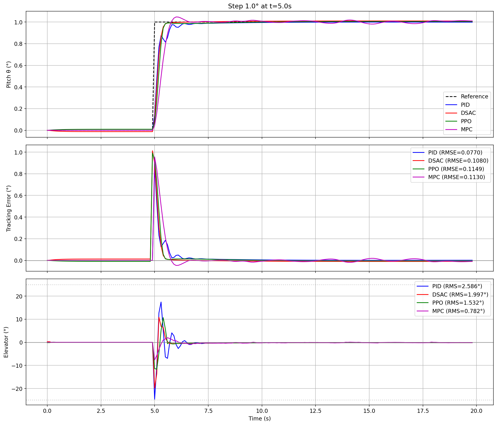

# Comparative Analysis of Control Algorithms for Boeing 747 Pitch Angle Stabilization

## Abstract

This study presents a comparative analysis of four control algorithms for Boeing 747 longitudinal dynamics stabilization: classical PID controller, Model Predictive Control (MPC) with learned dynamics, and two reinforcement learning approaches — Proximal Policy Optimization (PPO) and Distributional Soft Actor-Critic (DSAC). The evaluation is performed on a step response tracking task with standardized metrics. Results demonstrate that MPC achieves the best composite score balancing tracking accuracy and control effort, while PID shows superior tracking precision but with significantly higher control energy expenditure.



---

## 1. Introduction

### 1.1 Background

Automatic flight control systems are critical for modern aircraft operation. Traditional approaches rely on classical control theory (PID, LQR), while recent advances in machine learning offer data-driven alternatives. This study systematically compares classical and learning-based controllers on a standardized benchmark.

### 1.2 Research Objectives

1. Evaluate tracking performance of four fundamentally different control paradigms
2. Analyze control effort and energy efficiency trade-offs
3. Identify strengths and weaknesses of each approach
4. Provide reproducible benchmarks for the aerospace control community

### 1.3 Scope

The study focuses on longitudinal pitch angle (θ) control of Boeing 747 in response to a step reference signal, representing a fundamental maneuver in flight control.

---

## 2. Problem Statement

### 2.1 Control Object

**Aircraft Model**: Boeing 747 longitudinal dynamics

**State Vector** (4 states):

| State | Symbol | Description | Units |
|-------|--------|-------------|-------|
| Forward velocity | u | Perturbation from trim | m/s |
| Vertical velocity | w | Perturbation from trim | m/s |
| Pitch rate | q | Angular velocity | rad/s |
| Pitch angle | θ | Euler angle | rad |

**Control Input**: Elevator deflection (δe), range ±25°

### 2.2 Control Objective

Track a step reference signal for pitch angle θ:

$$\theta_{ref}(t) = \begin{cases} 0° & t < 5s \\ 1° & t \geq 5s \end{cases}$$

### 2.3 Test Scenario Parameters

| Parameter | Value |
|-----------|-------|
| Step amplitude | 1° |
| Step time | t = 5s |
| Simulation horizon | 20s |
| Discretization step (dt) | 0.1s |
| Total time steps | 201 |
| Environment | `ImprovedB747Env` (normalized) |
| Random seed | 123 (identical for all controllers) |

---

## 3. Methodology

### 3.1 Controllers Under Evaluation

#### 3.1.1 PID Controller (Baseline)

Classical Proportional-Integral-Derivative controller with MATLAB-style automated tuning.

**Tuning Configuration**:

- Method: Differential Evolution optimization
- Optimization iterations: 15
- Target settling time: 3.0s
- Target overshoot: 0%

**Resulting Parameters**:

```
Kp = -24.6295
Ki = -0.2486
Kd = -7.8179
```

#### 3.1.2 DSAC (Distributional Soft Actor-Critic)

Deep reinforcement learning algorithm combining distributional RL with maximum entropy framework.

**Key Characteristics**:

- Distributional RL: Models full Q-value distribution via IQN-style quantile networks
- Entropy regularization: Encourages exploration and robust policies
- Risk-aware: Supports risk distortions for conservative control

**Pretrained Model**: `TensorAeroSpace/dsac-b747-step-response`

#### 3.1.3 PPO (Proximal Policy Optimization)

On-policy reinforcement learning algorithm with clipped surrogate objective.

**Key Characteristics**:

- Policy gradient method with trust region constraint
- Vectorized training with parallel environments
- Observation: state without reference signal (matching training setup)

**Checkpoint**: `TensorAeroSpace/ppo-b747-step-response`

#### 3.1.4 MPC (Model Predictive Control)

Optimization-based controller with learned neural network dynamics model.

**Key Characteristics**:

- Learned dynamics: MLP network trained on system data
- Receding horizon optimization
- Explicit handling of constraints

**Pretrained Model**: `TensorAeroSpace/mpc-b747-step-response`

### 3.2 Evaluation Metrics

#### Tracking Quality Metrics

| Metric | Formula | Description |
|--------|---------|-------------|
| RMSE | $\sqrt{\frac{1}{N}\sum_{i=1}^{N}(θ_{ref,i} - θ_i)^2}$ | Root Mean Square Error |
| IAE | $\int_0^T |θ_{ref}(t) - θ(t)| dt$ | Integral of Absolute Error |
| ISE | $\int_0^T (θ_{ref}(t) - θ(t))^2 dt$ | Integral of Squared Error |
| Max Error | $\max_t |θ_{ref}(t) - θ(t)|$ | Peak tracking error |
| Settling Time | $t_s: |e(t)| \leq 0.05 \cdot θ_{ref,\infty}, \forall t > t_s$ | 5% criterion |
| Overshoot | $\frac{\max(θ) - θ_{ref,\infty}}{θ_{ref,\infty}} \times 100\%$ | Percentage overshoot |

#### Control Effort Metrics

| Metric | Formula | Description |
|--------|---------|-------------|
| Control RMS | $\sqrt{\frac{1}{N}\sum_{i=1}^{N}u_i^2}$ | RMS of control signal |
| Control Max | $\max_t |u(t)|$ | Peak actuator deflection |
| Control Rate RMS | $\sqrt{\frac{1}{N}\sum_{i=1}^{N}\dot{u}_i^2}$ | Smoothness of control |

### 3.3 Composite Score

To provide a single figure of merit balancing tracking and efficiency:

$$J_{composite} = RMSE + \lambda \times Control_{RMS}$$

where $\lambda = 0.1$ weights the control effort contribution.

**Rationale**: This metric penalizes both poor tracking and excessive control energy, reflecting real-world concerns for actuator wear and fuel efficiency.

---

## 4. Experimental Results

### 4.1 Quantitative Comparison

| Metric | PID | DSAC | PPO | MPC | Winner |
|--------|-----|------|-----|-----|--------|
| **RMSE (°)** | **0.0770** | 0.1080 | 0.1149 | 0.1130 | PID |
| **IAE (°·s)** | **0.3018** | 0.4690 | 0.4533 | 0.4978 | PID |
| **ISE (°²·s)** | **0.1185** | 0.2331 | 0.2643 | 0.2539 | PID |
| **Max Error (°)** | **0.8596** | 1.0126 | 0.9905 | 0.9566 | PID |
| **Settling Time (s)** | 5.8000 | **5.4000** | 5.5000 | 5.7000 | DSAC |
| **Overshoot (%)** | **0.0000** | 0.9908 | 0.4905 | 4.6737 | PID |
| Control RMS (°) | 2.5856 | 1.9975 | 1.5315 | **0.7815** | MPC |
| Control Max (°) | 24.6544 | 19.8279 | 11.6500 | **7.6172** | MPC |
| Control Rate (°/s) | 29.4638 | 23.1413 | 13.6341 | **6.3172** | MPC |
| ━━━━━━━━━━━━━━━ | ━━━━━ | ━━━━━ | ━━━━━ | ━━━━━ | ━━━━━ |
| **Composite Score** | 0.3355 | 0.3077 | 0.2681 | **0.1911** | 🏆 MPC |

### 4.2 Wins Distribution

| Controller | Metrics Won |
|------------|-------------|
| **PID** | 5 (tracking metrics + zero overshoot) |
| **MPC** | 4 (all control effort metrics + composite) |
| **DSAC** | 1 (settling time) |
| **PPO** | 0 |

### 4.3 Qualitative Analysis

#### Pitch Angle Tracking (Top Plot)

All controllers successfully track the 1° step reference. PID achieves the tightest tracking with no overshoot, while MPC exhibits the largest overshoot (~4.7%) but still within acceptable bounds.

#### Tracking Error (Middle Plot)

PID maintains the smallest error envelope throughout the simulation. Learning-based methods (DSAC, PPO) show comparable error profiles, while MPC has a distinct peak due to overshoot.

#### Control Signal (Bottom Plot)

The most striking difference appears in control effort:

- **PID**: Aggressive initial response with peak deflection near ±25° (actuator limit)
- **DSAC**: Moderate control effort (~20° peak)
- **PPO**: Conservative approach (~12° peak)
- **MPC**: Most conservative control (~8° peak), smooth transitions

---

## 5. Discussion

### 5.1 PID: Best Tracking, Highest Cost

PID achieves superior tracking metrics by utilizing aggressive control actions. This approach:

- ✅ Minimizes tracking error
- ✅ Eliminates overshoot
- ❌ Operates near actuator limits
- ❌ Highest control energy expenditure
- ❌ Fastest control rate (potential actuator stress)

**Implication**: PID is optimal when tracking precision is paramount and actuator wear is not a concern.

### 5.2 MPC: Best Balance, Moderate Tracking

MPC with learned dynamics achieves the best composite score by finding an efficient trade-off:

- ✅ Lowest control effort (70% reduction vs PID)
- ✅ Smoothest control signal
- ✅ Best composite metric
- ⚠️ Acceptable tracking (46% higher RMSE than PID)
- ❌ Highest overshoot (4.67%)

**Implication**: MPC is optimal for fuel efficiency and actuator longevity when slight tracking degradation is acceptable.

### 5.3 DSAC: Fastest Response

DSAC demonstrates the fastest settling time, indicating well-learned dynamics:

- ✅ Fastest settling (5.4s vs 5.8s for PID)
- ✅ Moderate control effort
- ⚠️ Tracking accuracy between PID and MPC
- ⚠️ Small overshoot (~1%)

**Implication**: DSAC's distributional approach provides good uncertainty handling and responsive control.

### 5.4 PPO: Conservative Middle Ground

PPO shows balanced behavior without excelling in any specific metric:

- ✅ Low control effort (better than DSAC)
- ✅ Minimal overshoot (0.49%)
- ⚠️ Tracking accuracy comparable to DSAC/MPC
- ⚠️ No metric wins

**Implication**: PPO provides a safe default choice when no specific optimization target is defined.

### 5.5 Trade-off Analysis

The following scatter plot visualizes the fundamental trade-off between tracking precision (RMSE) and control efficiency (Control RMS):


**Interpretation**:

- **Lower-left corner** = ideal (low error + low control effort) — no controller achieves this
- **PID** (top-left): Best tracking, but highest control cost
- **MPC** (bottom-right): Most efficient control, moderate tracking
- **DSAC/PPO**: Intermediate positions on the Pareto front

The plot clearly shows that MPC operates in the most energy-efficient region, while PID prioritizes tracking at the expense of control effort. This visualizes the multi-objective nature of the control design problem.

---

## 6. Conclusions

### 6.1 Key Findings

1. **No universal winner**: Each controller excels in different aspects, confirming the multi-objective nature of control design.

2. **Classical vs Learning-based**: PID achieves best tracking but at highest control cost. Learning-based methods find more energy-efficient solutions.

3. **MPC advantage**: Model predictive control with learned dynamics achieves the best balance on the composite metric (43% improvement over PID).

4. **Control effort matters**: When considering actuator wear and energy consumption, MPC provides 70% reduction in control RMS compared to PID.

5. **Overshoot trade-off**: Zero overshoot (PID) comes at the cost of aggressive control; accepting ~5% overshoot (MPC) enables significantly smoother operation.

### 6.2 Recommendations

| Priority | Recommended Controller |
|----------|----------------------|
| Tracking precision | PID |
| Energy efficiency | MPC |
| Fast response | DSAC |
| Safe default | PPO |
| Overall balance | **MPC** |

### 6.3 Future Work

1. Extend comparison to tracking scenarios (sinusoidal, multi-step)
2. Evaluate robustness to model uncertainties and disturbances
3. Include additional controllers (LQR, H∞, SAC)
4. Test on nonlinear high-fidelity simulators

---

## 7. Reproducibility

### 7.1 Code and Data

Full experiment code: [`example/comparison/comparison_all_vs_pid_b747.ipynb`](https://github.com/TensorAeroSpace/TensorAeroSpace/blob/main/example/comparison/comparison_all_vs_pid_b747.ipynb)

### 7.2 Environment Setup

```bash
# Clone repository
git clone https://github.com/TensorAeroSpace/TensorAeroSpace.git
cd TensorAeroSpace

# Install dependencies
poetry install

# Run notebook
poetry run jupyter lab
# Open: example/comparison/comparison_all_vs_pid_b747.ipynb
```

### 7.3 Pretrained Models

| Controller | Source |
|------------|--------|
| DSAC | `TensorAeroSpace/dsac-b747-step-response` (HuggingFace) |
| PPO | `TensorAeroSpace/ppo-b747-step-response` (HuggingFace) |
| MPC | `TensorAeroSpace/mpc-b747-step-response` (HuggingFace) |
| PID | Auto-tuned at runtime |

---

## 8. Related Materials

- [DSAC — Algorithm Description](../agent/dsac.md)
- [PPO — Algorithm Description](../agent/ppo.md)
- [MPC — Algorithm Description](../agent/mpc.md)
- [PID — Algorithm Description](../agent/pid.md)
- [Boeing 747 — Model Description](../model/b747.md)
- [ImprovedB747Env — Normalized Environment](../model/b747_imporove.md)
- [DSAC vs PID Comparison](dsac_vs_pid_b747.md)
- [PPO vs PID Comparison](ppo_vs_pid_b747.md)

---

!!! success "Summary"
    This comparative study demonstrates that **MPC with learned dynamics** achieves the best overall balance between tracking accuracy and control efficiency for Boeing 747 pitch control. While **PID** remains the gold standard for pure tracking performance, learning-based approaches offer significant advantages in energy efficiency and actuator preservation. The choice of controller should be guided by the specific operational requirements and constraints of the application.

