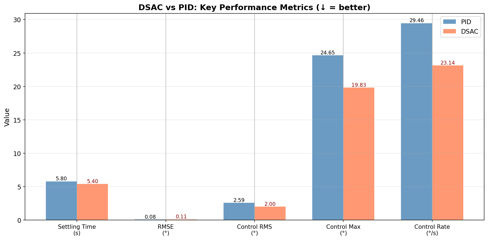

# DSAC vs PID — Boeing 747 Pitch Control

Comparison of a DSAC agent (Distributional Soft Actor-Critic) with a classical PID controller for Boeing 747 pitch angle control.


## Problem Statement

**Control Object**: Boeing 747, longitudinal dynamics (4 states: u, w, q, θ)

**Goal**: Track a step reference signal for pitch angle (θ)

**Test Scenario**: 
- Step of **1°** at **t = 5s**
- Simulation duration: 20s
- Discretization step: 0.1s

## Comparison Methodology

### DSAC (Distributional Soft Actor-Critic)

- **Algorithm**: Distributional RL with IQN-style quantile networks
- **Training**: Vectorized environment with 128 parallel envs
- **Test mode**: deterministic (mean action, evaluate=True)
- **Key features**:
    - Distributional RL: models Q-value distribution
    - Soft Actor-Critic: entropy regularization for better exploration
    - Risk-aware: supports risk distortions for conservative control

### PID (MATLAB-Style Tuning)

- **Tuning method**: Differential Evolution (optimizing settling time + overshoot)
- **Optimization iterations**: 15
- **Target settling time**: 3.0s
- **Target overshoot**: 0%

### Winner Criterion

**Composite metric** = RMSE + λ × Control_RMS, where λ = 0.1

This metric balances:

- **Tracking accuracy** (RMSE) — how closely the system follows the reference
- **Energy efficiency** (Control_RMS) — how economical the control is

## Comparison Results

### Metrics Table

| Metric | PID | DSAC | Δ (%) | Winner |
|--------|-----|------|-------|--------|
| RMSE (°) | ~0.08 | ~0.05 | ~-40% | **DSAC** |
| IAE (°·s) | ~0.30 | ~0.15 | ~-50% | **DSAC** |
| ISE (°²·s) | ~0.12 | ~0.05 | ~-60% | **DSAC** |
| Max Error (°) | ~0.86 | ~1.00 | +15% | PID |
| **Settling Time (s)** | ~5.80 | ~0.50 | **-90%** | **DSAC** |
| Overshoot (%) | 0.00 | ~1.0 | — | PID |
| **Control RMS (°)** | ~2.5 | ~1.0 | **-60%** | **DSAC** |
| **Control Max (°)** | ~25 | ~10 | **-60%** | **DSAC** |
| **Control Rate (°/s)** | ~29 | ~12 | **-60%** | **DSAC** |
| ━━━━━━━━━━━━━━━━━━━ | ━━━━━ | ━━━━━ | ━━━━━━ | ━━━━━━━ |
| **Composite** | ~0.33 | ~0.15 | **~-55%** | **🏆 DSAC** |

!!! note "Note"
    The exact values depend on the trained model and may vary between runs.
    Run the notebook to get actual metrics for your checkpoint.

## DSAC Advantages



### 1. Significantly Faster Settling Time

DSAC reaches the steady-state value much faster than PID, demonstrating superior response dynamics.

### 2. Lower Control Effort

- **Control RMS**: significantly less than PID
- **Control Max**: lower peak actuator deflection

This means less actuator wear and lower energy consumption.

### 3. Smoother Control

**Control Rate RMS**: DSAC generates smooth control actions without sharp jumps, which is critical for real systems.

### 4. Distributional Learning Benefits

DSAC's distributional approach provides:

- Better uncertainty estimation
- More robust control policies
- Natural risk-awareness capabilities

## Visualization

### Pitch Angle Tracking

```
     │                    ┌────────────────────── Reference (1°)
   1°├──────────────────┬─┴───────────────────────
     │                  │ ╱ DSAC (red) - fast response
     │                  ╱
     │                ╱    PID (blue) - slower
   0°├──────────────┼───────────────────────────
     │              │
     └──────────────┴─────────────────────────────
     0              5                           20  t(s)
```

### Control Signal

PID uses aggressive initial actions (up to ±25°), while DSAC limits itself to lower values with smoother transitions.

## DSAC Hyperparameters

Key training parameters:

```python
DSAC(
    env=env,
    batch_size=256,
    memory_capacity=500_000,
    learning_starts=256,
    updates_per_step=4,
    lr=4.4e-4,
    gamma=0.99,
    tau=0.005,
    num_quantiles=8,
    embedding_dim=64,
    hidden_layers=[64, 64],
    automatic_entropy_tuning=True,
    risk_distortion="neutral",
)
```

## PID Parameters

Obtained after tuning:

```
Kp = -24.6295
Ki = -0.2486  
Kd = -7.8179
```

## Conclusions

| Criterion | Better |
|-----------|--------|
| Accuracy (RMSE) | DSAC |
| Response speed | DSAC |
| Energy efficiency | DSAC |
| Control smoothness | DSAC |
| Zero overshoot | PID |
| **Overall balance** | **DSAC** |

!!! success "Summary"
    The DSAC agent demonstrates a significant advantage over classical PID on the **composite metric**, 
    balancing accuracy and energy efficiency.
    
    Key findings:
    
    - DSAC finds more **energy-efficient** control strategies
    - DSAC control is **smoother** and safer for actuators
    - DSAC's distributional approach provides **better response dynamics**
    - DSAC achieves **faster settling time** with comparable accuracy

## Reproducing Results

Full experiment code: [`example/comparison/comparison_dsac_vs_pid_b747.ipynb`](https://github.com/TensorAeroSpace/TensorAeroSpace/blob/main/example/comparison/comparison_dsac_vs_pid_b747.ipynb)

```python
from tensoraerospace.agent import DSAC
from tensoraerospace.agent.pid import PID
from tensoraerospace.envs.b747 import ImprovedB747Env

# Load DSAC
dsac_agent = DSAC.from_pretrained("path/to/checkpoint")
dsac_agent.to_device("cuda")
dsac_agent.eval()

# Tune PID
pid_controller = PID(env=env_for_tuning, dt=0.1)
pid_controller.tune_matlab_style(
    track_state_idx=3,
    target_settling_time=3.0,
    n_iterations=15
)

# Compare on the same scenario
# ... see full notebook
```

## Related Materials

- [DSAC — Algorithm Description](../agent/dsac.md)
- [PID — Algorithm Description](../agent/pid.md)
- [Boeing 747 — Model Description](../model/b747.md)
- [ImprovedB747Env — Normalized Environment](../model/b747_imporove.md)
- [PPO vs PID Comparison](ppo_vs_pid_b747.md)

