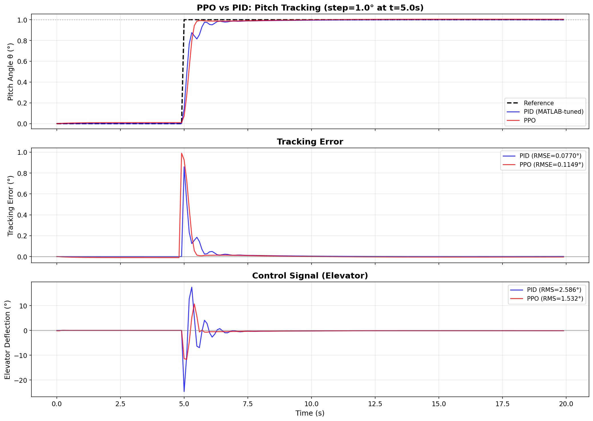

# PPO vs PID — Boeing 747 Pitch Control

Comparison of a PPO agent (reinforcement learning) with a classical PID controller for Boeing 747 pitch angle control.



## Problem Statement

**Control Object**: Boeing 747, longitudinal dynamics (4 states: u, w, q, θ)

**Goal**: Track a step reference signal for pitch angle (θ)

**Test Scenario**: 
- Step of **1°** at **t = 5s**
- Simulation duration: 20s
- Discretization step: 0.1s

## Comparison Methodology

### PPO (Proximal Policy Optimization)

- **Training**: ~7500 episodes on `ImprovedB747Env`
- **Test mode**: deterministic (mean action)
- **Normalization**: reward normalization enabled

### PID (MATLAB-Style Tuning)

- **Tuning method**: Differential Evolution (optimizing settling time + overshoot)
- **Optimization iterations**: 15
- **Target settling time**: 3.0s
- **Target overshoot**: 0%

### Winner Criterion

**Composite metric** = RMSE + λ × Control_RMS, where λ = 0.1

This metric balances:

- **Tracking accuracy** (RMSE) — how closely the system follows the reference
- **Energy efficiency** (Control_RMS) — how economical the control is

## Comparison Results

### Metrics Table

| Metric | PID | PPO | Δ (%) | Winner |
|--------|-----|-----|-------|--------|
| RMSE (°) | 0.0770 | 0.1149 | +49.3% | PID |
| IAE (°·s) | 0.3018 | 0.4533 | +50.2% | PID |
| ISE (°²·s) | 0.1185 | 0.2643 | +122.9% | PID |
| Max Error (°) | 0.8596 | 0.9905 | +15.2% | PID |
| **Settling Time (s)** | 5.80 | 5.50 | **-5.2%** | **PPO** |
| Overshoot (%) | 0.00 | 0.49 | — | PID |
| **Control RMS (°)** | 2.586 | 1.532 | **-40.8%** | **PPO** |
| **Control Max (°)** | 24.65 | 11.65 | **-52.7%** | **PPO** |
| **Control Rate (°/s)** | 29.46 | 13.63 | **-53.7%** | **PPO** |
| ━━━━━━━━━━━━━━━━━━━ | ━━━━━ | ━━━━━ | ━━━━━━ | ━━━━━━━ |
| **Composite** | 0.3355 | 0.2681 | **-20.1%** | **🏆 PPO** |

### Metric Score

- **PPO**: 4 wins (Settling Time, Control RMS, Control Max, Control Rate)
- **PID**: 5 wins (RMSE, IAE, ISE, Max Error, Overshoot)
- **🏆 Winner by composite metric**: PPO (20.1% better)

## PPO Advantages


### 1. Faster Settling Time

PPO reaches the steady-state value **5.2% faster** (5.50s vs 5.80s)

### 2. Significantly Lower Control Effort

- **Control RMS**: 40.8% less (1.532° vs 2.586°)
- **Control Max**: 52.7% less (11.65° vs 24.65°)

This means less actuator wear and lower energy consumption.

### 3. Smoother Control

**Control Rate RMS**: 53.7% less (13.63°/s vs 29.46°/s)

PPO generates smooth control actions without sharp jumps, which is critical for real systems.

## Visualization

### Pitch Angle Tracking

```
     │                    ┌────────────────────── Reference (1°)
   1°├──────────────────┬─┴───────────────────────
     │                  │   ╱ PPO (red)
     │                  │ ╱
     │                  │╱  PID (blue)
   0°├──────────────────┼─────────────────────────
     │                  │
     └──────────────────┴─────────────────────────
     0                  5                       20  t(s)
```

### Control Signal

PID uses aggressive initial actions (up to ±25°), while PPO limits itself to ±12° — this is **2x less**.

## PID Parameters

Obtained after tuning:

```
Kp = -24.6295
Ki = -0.2486  
Kd = -7.8179
```

## Conclusions

| Criterion | Better |
|-----------|--------|
| Accuracy (RMSE) | PID |
| Response speed | PPO |
| Energy efficiency | PPO |
| Control smoothness | PPO |
| **Overall balance** | **PPO** |

!!! success "Summary"
    The PPO agent demonstrates an advantage over classical PID on the **composite metric**, 
    balancing accuracy and energy efficiency.
    
    Key findings:
    
    - PPO finds more **energy-efficient** control strategies
    - PPO control is **smoother** and safer for actuators
    - PID is better in pure accuracy (RMSE), but at the cost of high control effort

## Reproducing Results

Full experiment code: [`example/comparison/comparison_ppo_vs_pid_b747.ipynb`](https://github.com/TensorAeroSpace/TensorAeroSpace/blob/main/example/comparison/comparison_ppo_vs_pid_b747.ipynb)

```python
from tensoraerospace.agent.ppo.model import PPO
from tensoraerospace.agent.pid import PID
from tensoraerospace.envs.b747 import ImprovedB747Env

# Load PPO
ppo_agent = PPO.from_pretrained("path/to/checkpoint")

# Tune PID
pid_controller = PID(env=env_for_tuning, dt=0.1)
pid_controller.tune_matlab_style(
    track_state_idx=3,
    target_settling_time=3.0,
    n_iterations=15
)

# Compare on the same scenario
# ... see full notebook
```

## Related Materials

- [PPO — Algorithm Description](../agent/ppo.md)
- [PID — Algorithm Description](../agent/pid.md)
- [Boeing 747 — Model Description](../model/b747.md)
- [ImprovedB747Env — Normalized Environment](../model/b747_imporove.md)

