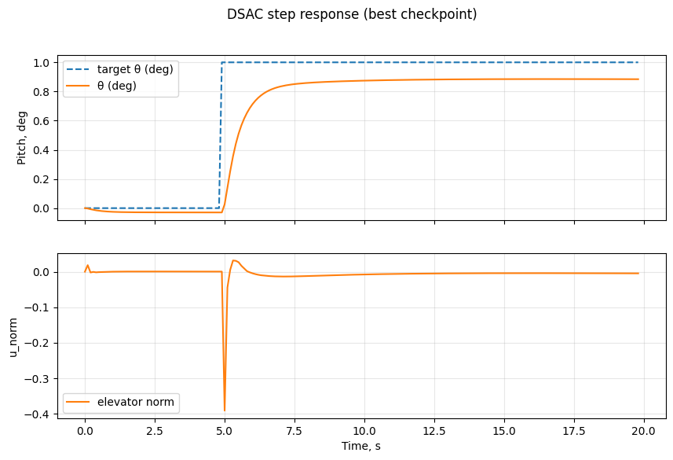

# Recipe 05 — Training a deep-RL agent end-to-end

Step-by-step skeleton of a PPO / SAC / DSAC run on one of the library's envs. We point to the three complete worked notebooks already shipped in the repo, and show the short version you can paste into a new script.

**Related.** [Recipe 04](04_choosing_agent.md) to pick which family; [Recipe 07](07_optuna_search.md) for tuning; [Recipe 08](08_huggingface.md) for publishing.

## The five steps

1. Prepare the training env (`use_reward=True`).
2. Construct the agent with hyperparameters.
3. Train for `n_episodes` rollouts.
4. Evaluate deterministically on a held-out reference.
5. Save / publish.

## Step 1 — Training env

```python
import gymnasium as gym
import numpy as np

import tensoraerospace  # registers envs
from tensoraerospace.utils import generate_time_period
from tensoraerospace.signals.standart import unit_step

dt = 0.01
tp = generate_time_period(tn=20, dt=dt)

def make_train_env():
    ref = np.reshape(unit_step(tp=tp, degree=5, time_step=2.0, output_rad=True), (1, -1))
    return gym.make(
        'LinearLongitudinalF16-v0',
        number_time_steps=len(tp),
        use_reward=True,                  # ← required for RL
        initial_state=[[0], [0], [0]],
        reference_signal=ref,
        state_space=['theta', 'alpha', 'q'],
        output_space=['theta', 'alpha', 'q'],
        tracking_states=['alpha'],
    )
```

**Tip.** Randomise `initial_state` and step time across episodes inside `make_train_env`; agents trained on a single trajectory overfit fast.

## Step 2 — Construct the agent

```python
from tensoraerospace.agent.ppo import PPO

agent = PPO(
    env=make_train_env(),
    gamma=0.99,
    max_episodes=200,
    rollout_len=2048,
    clip_pram=0.2,
    actor_lr=1e-3,
    critic_lr=5e-3,
    seed=0,
)
```

SAC and DSAC take the same positional `env=` and similar hyperparameters. See the agent pages under [Agents](../agent/ppo.md) for full knob lists.

## Step 3 — Train

The simplest path:

```python
agent.learn()          # runs the PPO training loop for max_episodes
```

Training on the F-16 from scratch is unforgiving — the reward landscape is flat for most of the parameter space and entropy collapses before the policy has explored. The most reliably-converged deep-RL demo in the repo is **DSAC on the normalised B747**, where the reward is denser and the action space pre-normalised:



That plot is the eval output of [`eval_dsac_b747_step_response.ipynb`](../example/agent/dsac/example-dsac-b747.md), evaluating an agent trained for ~1000 episodes with `train-dsac-b747-step-response.py`. Reproducing it yourself needs ~30 min on a CPU; a CUDA GPU cuts that to ~5 min.

If SAC / PPO don't converge for your env, the usual culprits are:

- **Reward too sparse.** Shape a dense tracking reward like `-||y - y_r||²` instead of thresholded signals.
- **Action not normalised.** The `_improved` envs (`LinearB747Improved-v0`, etc.) pre-normalise the action to `[-1, 1]`. Prefer them when you can.
- **Training horizon too short.** `max_episodes = 30` in the PPO default gets you a warm-up, not a policy. Raise to 200+ for anything non-trivial.

## Step 4 — Evaluate

Hold out a reference the agent hasn't seen:

```python
eval_env = make_eval_env()               # different step time or amplitude
obs, _ = eval_env.reset()
returns = 0.0
for _ in range(len(tp) - 2):
    action = agent.select_action(obs, deterministic=True)
    obs, r, terminated, truncated, _ = eval_env.step(action)
    returns += r
print(f'eval return: {returns:.2f}')
```

Use `tensoraerospace.benchmark.function` for `overshoot`, `settling_time`, `static_error` so agents are comparable.

## Step 5 — Save / reload

```python
agent.save('./checkpoints/ppo_f16')
# later
from tensoraerospace.agent.ppo import PPO
agent2 = PPO.load('./checkpoints/ppo_f16', env=make_eval_env())
```

For the five online-adaptive agents (IHDP, IM-GDHP, ET-DHP, AA-INDI, iADP) the persistence API is richer (full HuggingFace Hub round-trip) — see [Recipe 08](08_huggingface.md).

## Worked notebooks to copy from

| Task | Notebook |
|---|---|
| **DSAC on B747 step response (source of plot above)** | [`example/agent/dsac/example-dsac-b747.md`](../example/agent/dsac/example-dsac-b747.md) |
| DSAC on B747 sinusoid tracking | [`example/agent/dsac/train-dsac-b747-tracking.md`](../example/agent/dsac/train-dsac-b747-tracking.md) |
| PPO on B747 (normalised env) | `example/reinforcement_learning/example_a2c_b747_improved.ipynb` and adjacent PPO notebooks |
| SAC on linear F-16 | [`example/agent/sac/example-sac-f16.md`](../example/agent/sac/example-sac-f16.md) — slower to converge, useful for architecture reference |
| SAC on B747 | [`example/agent/sac/example-sac-b747.md`](../example/agent/sac/example-sac-b747.md) |

## Pitfalls

- **Training signal is too narrow.** Always randomise the reference across episodes.
- **Episode length = `number_time_steps - 2`.** The env pads two ticks at the end.
- **Action magnitude mismatch.** PPO/SAC output normalised [-1, 1]; env wraps to physical units automatically. If you write a custom agent, respect `env.action_space.low / high`.

## Where to go next

- **[Recipe 06 — Online-adaptive agents](06_online_adaptive.md)** — when you can't afford full training.
- **[Recipe 07 — Optuna hyperparameter search](07_optuna_search.md)** — automate the tuning.
- **[Recipe 08 — Save/load/publish to HuggingFace](08_huggingface.md)** — ship the trained model.
