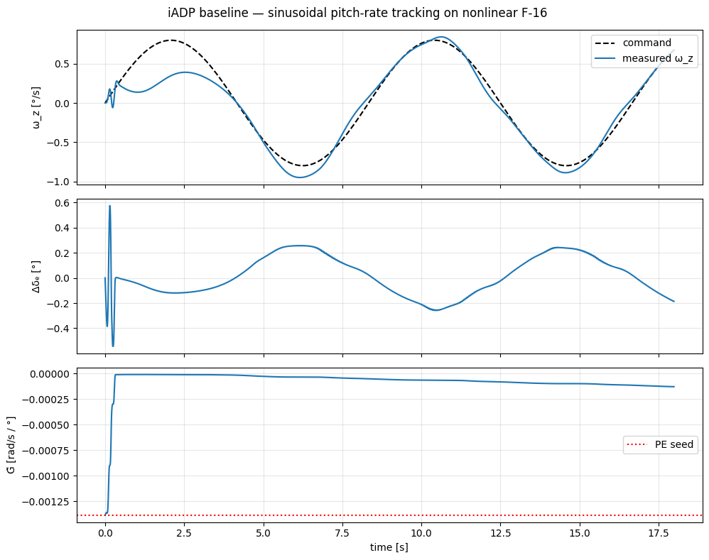

# Recipe 06 — Online-adaptive agents

Deploy IHDP, IM-GDHP, ET-DHP, AA-INDI, or iADP. All five share the same three-step lifecycle: **warm-start → predict/learn loop → save/reload**. This recipe gives you the skeleton and points at the worked notebook for each agent.

**Related.** [Recipe 04](04_choosing_agent.md) (decision tree) · [iADP](../agent/iadp.md) · [AA-INDI](../agent/aa_indi.md) · [IHDP](../agent/ihdp.md) · [IM-GDHP](../agent/imgdhp.md) · [ET-DHP](../agent/et_dhp.md).

## The three-step lifecycle

1. **Warm-start** the incremental model (and the kernel matrix, for iADP) from a short offline identification.
2. **Step-wise online loop** — `agent.predict(x, ref, k)` → `env.step(u)` → `agent.learn(x_next, ref, k)`.
3. **Save / reload** at any moment; the saved state is bit-identical on reload ([Recipe 08](08_huggingface.md)).

**No training phase in the deep-RL sense.** The "learning" happens inside `learn()` every control tick.

## Step 1 — Warm-start F̃, G̃ via a short PE excitation

The one trap all five agents share: they depend on a non-trivial control-effectiveness estimate `G̃`. With `G̃ ≈ 0`:

- INDI-style (AA-INDI): `G_pinv = pinv(0)` explodes — actuator saturates.
- LQR-style (iADP): `γ·G^T P X` vanishes — no control applied.

**Solution.** 300-step multi-sine, fit scalar `G` via LS:

```python
env_pe = make_env(300); obs, _ = env_pe.reset()
wz_hist, u_hist = [float(obs[1])], [0.0]
for t in range(300):
    u = 2.0*math.sin(2*math.pi*0.7*t*dt) + 1.0*math.sin(2*math.pi*1.5*t*dt)
    obs, *_ = env_pe.step(np.array([u]))
    wz_hist.append(float(obs[1])); u_hist.append(float(u))

dwz, du = np.diff(wz_hist), np.diff(u_hist)
A_pe = np.column_stack([dwz[:-1], du[:-1]])
F_wz, G_wz = np.linalg.lstsq(A_pe, dwz[1:], rcond=None)[0]

F_init = np.array([[F_wz, 0.0], [0.0, 1.0]])   # reference row stationary
G_init = np.array([[G_wz], [0.0]])             # elevator drives only wz row
```

On the nonlinear F-16 you should get `F_wz ≈ 1.00, G_wz ≈ -0.0014` (per ° elevator, discrete-time).

## Step 2 — (iADP only) DARE warm-start for P̃

The single biggest accuracy win after the `(Q, R, γ)` tune:

```python
from scipy.linalg import solve_discrete_are

Q, R, gamma = 30_000.0, 0.1, 0.9
Q_aug = Q * np.array([[1.0, -1.0], [-1.0, 1.0]])
P_init = solve_discrete_are(
    np.sqrt(gamma) * F_init, np.sqrt(gamma) * G_init,
    Q_aug, np.array([[R]]),
)
```

See [the iADP F-16 example](../example/agent/iadp/example_iadp_nonlinear.md) for the full story (why the discount needs the √γ substitution, why it beats ad-hoc block initials).

## Step 3 — Step loop

Identical for all five agents:

```python
agent = IADPAgent(n_state=1, n_control=1, config=cfg)   # or AAINDIAgent, IHDPAgent, …
env.reset()

for k in range(n_steps):
    obs = env.get_state()
    u = agent.predict(obs[controlled_channels], ref[:, k], k)
    obs, *_ = env.step(u)
    agent.learn(obs[controlled_channels], ref[:, k], k)
```

`predict(obs, ref, k)` returns the commanded action and caches state for `learn()`. `learn(next_obs, ref, k)` does the RLS step and, on stride, the policy update.

**Expected behaviour (iADP on nonlinear F-16, 0.12 Hz sinusoid):**



The measured ω_z tracks the command to within ~12 % of amplitude (`0.09 °/s` RMSE on a `0.8 °/s` sinusoid). Elevator command stays well inside ±0.5°. `G̃` drifts from the PE seed toward the locally valid gain.

## Step 4 — Save / reload

```python
run_dir = agent.save('./checkpoints')
restored = IADPAgent.from_pretrained(run_dir)
agent.publish_to_hub('me/my-iadp', folder_path=run_dir, access_token='hf_…')
```

Details in [Recipe 08](08_huggingface.md).

## When to pick which

| Scenario | Pick |
|---|---|
| Abrupt actuator damage during flight | **AA-INDI** — VFF-RLS contracts forgetting factor on large residuals, fastest abrupt-fault recovery. |
| Interpretable LQT cost, few hyperparams | **iADP** — `(Q, R, γ)` knobs + DARE warm-start + soft-update blend. |
| Neural actor with dual critic `(J, λ)` | **IM-GDHP** — richer critic, needs more compute. |
| Event-triggered updates for embedded | **ET-DHP** — Lipschitz-based trigger rule. |
| Classical ADP | **IHDP** — historical baseline. |

## Tuning pointers

- **`gamma_rls`** — closer to 1 means longer memory. Start at `0.995` for unnoisy sim; `0.9999` for noisy real-world.
- **`phi_init`** — initial RLS covariance. Default `1.0` is safe. Too small → slow adapt; too large → noisy first ticks.
- **(iADP) `policy_eval_regularization`** — scale with state magnitude². Default `1e-4` for O(1) states; for rad/s states use `1e-10`.
- **(iADP) `policy_eval_blend`** — `0.1` removes the per-LS-tick sawtooth on the elevator trace.

## Fault-tolerance in practice

Online-adaptive agents recover from plant changes **only when the input keeps them excited**. A constant reference yields no Δx/Δu data for the RLS. Mitigate with a small command dither, or freeze the RLS (`gamma_rls = 1.0`) when the residual is quiet.

See [Recipe 09](09_fault_tolerance.md) for a head-to-head iADP-vs-AA-INDI walkthrough with an actual 50 % elevator loss.

## Where to go next

- **[Recipe 07 — Optuna hyperparameter search](07_optuna_search.md)** — automate the tuning.
- **[Recipe 08 — Save/load/publish to HuggingFace](08_huggingface.md)** — the persistence contract in depth.
- **[Recipe 09 — Fault-tolerance](09_fault_tolerance.md)** — comparing adaptive agents on a common fault profile.
