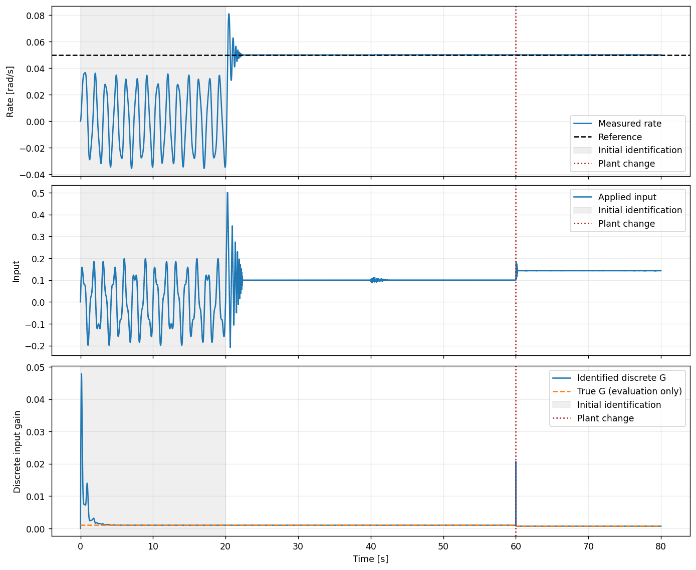

# Recipe 06 — Run and inspect an online-adaptive controller

**Goal:** run iADP from identification through closed-loop control, keep adaptation
active during an unknown plant change, and inspect both tracking and the learned
model. The example below is complete: execute the Python blocks in order from the
repository root in the installed project environment.

Start with this small plant to understand the time sequence before moving to
[B737 with AA-INDI](14_aaindi.md) or the [B747 fault comparison](09_fault_tolerance.md).
The scalar experiment runs for 80 simulated seconds; its 1 ms step is a simulation
setting, not a claim of Python real-time throughput.

## 1. Choose the measurements and the interface

Online-adaptive agents share an idea: **measure → command → apply → measure again
→ update**. Their input contracts differ:

| Agent | Controller input and update |
|---|---|
| [iADP](../agent/iadp.md) | Plant-state vector and reference-generator state; RLS model and quadratic critic. |
| [AA-INDI](../agent/aa_indi.md) | `FlightMeasurement` with SI IMU, independent navigation and actual surfaces; physical moment identification and sensor observer. |
| [IHDP](11_ihdp.md) / [IM-GDHP](12_imgdhp.md) | State/reference input with neural actor/critic and identified model; see the corresponding constructors. |
| [ET-DHP](13_etdhp.md) | State and reference with event-triggered actor/critic updates; see its own scheduling contract. |

For iADP, `n_state` is the number of measured plant states, not the number of
actuators. Reference states can have a different size using `n_reference` and
output maps. For AA-INDI, a pitch-rate scalar cannot replace the independent
velocity/attitude observations required by the observer.

## 2. Define a known plant and an identification phase

Use the exact sampled solution of
\(\dot{x}=-2x+\eta u\). Here \(x\) is a rate in rad/s, \(u\) is a scalar input,
and the plant effectiveness \(\eta\) changes from 1 to 0.7 at 60 s. The command
is a constant 0.05 rad/s. The plant change is part of the simulator only.

With no initial input gain, iADP needs informative input variation before it can
control effectively. Two sinusoids excite the plant for 20 s. A smaller periodic
excitation remains active afterward. The controller never receives the true
coefficients `a`, `b`, effectiveness or failure time.


```python
import numpy as np
import matplotlib.pyplot as plt
from tensoraerospace.agent.iadp import IADPAgent, IADPConfig

dt, duration = 0.001, 80.0
steps = round(duration / dt)
time = np.arange(steps + 1) * dt
identification_time = np.arange(round(20.0 / dt)) * dt
excitation = (
    0.15 * np.sin(2 * np.pi * 0.7 * identification_time)
    + 0.05 * np.sin(2 * np.pi * 1.7 * identification_time)
)[:, None]
period = np.arange(round(10.0 / dt)) * dt
ongoing_excitation = (0.015 * np.sin(2 * np.pi * 0.7 * period))[:, None]

config = IADPConfig.paper(
    excitation_signal=excitation, dt=dt, learning_mode="continuous",
    Q=np.array([[100.0]]), R=np.array([[0.0001]]),
    gamma=0.95, gamma_rls=0.999, phi_init=1e6,
    u_magnitude_limit=0.5, u_rate_limit=2.0,
    continuous_excitation_signal=ongoing_excitation,
)
agent = IADPAgent(n_state=1, n_control=1, config=config)
reference = np.array([0.05])
x = np.zeros(1)
a = np.exp(-2 * dt)
b = -np.expm1(-2 * dt) / 2
```


`IADPConfig.paper` supplies the algorithm's initial identification and critic
schedule: 20 s of model learning, a 20 s transition window and critic evaluation
at 20 Hz. The values of Q, R, covariance and excitation above belong to this scalar
verification example. They are not universal aircraft tuning.

| Setting | Meaning in this example |
|---|---|
| `Q`, `R` | Weights on tracking error and applied input. Changing units requires changing the weights. |
| `gamma` | Bellman discount used in the policy and critic. |
| `gamma_rls` | RLS forgetting per sample; 1 removes forgetting but **does not freeze identification**. |
| `phi_init` | Initial RLS covariance; larger values allow stronger early parameter updates. |
| `learning_mode="continuous"` | Keeps model and critic updates available after initialization. |
| `u_rate_limit` | Input change per second; multiplied by `dt` for each sample. |

The periodic excitation is added to the policy increment and passes through the
same input limits. Removing it changes the experiment. A constant reference can
still generate informative transient data, but a settled unchanging trajectory
usually cannot identify every model coefficient.

## 3. Execute one update per physical transition

`predict` returns a limited **input command**, although its policy internally
computes an increment. Apply this command once. Then pass the next observation and
actual input to `learn`. In this plant the actuator follows its command exactly;
the effectiveness change is downstream in the dynamics.


```python
states, actions, estimates = [x[0]], [], []
for k in range(steps):
    command = agent.predict(x, reference, k)
    actual_input = command.copy()
    # Plant-only effectiveness change; the agent never receives this schedule.
    effectiveness = 1.0 if time[k] < 60.0 else 0.7
    x = a * x + b * effectiveness * actual_input
    diagnostics = agent.learn(x, reference, k, applied_action=actual_input)
    if not np.isfinite(x).all() or not np.isfinite(agent.P).all():
        raise RuntimeError(f"Non-finite state or critic at step {k}")
    states.append(x[0])
    actions.append(actual_input[0])
    estimates.append(agent.G[0, 0])

states, actions, estimates = map(np.asarray, (states, actions, estimates))
assert agent.rls.num_updates == steps - 1
print("RLS updates:", agent.rls.num_updates, "phase:", agent.phase)
print("Identified / true final G:", estimates[-1], 0.7 * b)
```


The first transition has no previous state increment, so it does not update RLS.
The expected count is therefore **79,999** updates for 80,000 transitions. Critic
updates happen at their configured cadence, after sufficient history is available.

For a changing reference schedule, pass the full schedule and the same `k` to
both calls: `predict` uses reference `k`, and `learn` selects reference `k + 1`.
Supply a final reference sample for the final observation. If your controller
works with deviations from trim, apply and remove the trim offset consistently
at the plant/feedback boundary.

## 4. Inspect tracking, control and identification together


```python
# Select transitions by their start time.
transition_time = time[:-1]
for label, start, stop in [("Healthy", 40, 60), ("Faulty", 65, 80)]:
    selected = (transition_time >= start) & (transition_time < stop)
    error = states[1:][selected] - reference[0]
    print(label, "RMSE [rad/s]:", np.sqrt(np.mean(error**2)))

fig, axes = plt.subplots(3, 1, figsize=(11, 9), sharex=True,
                         constrained_layout=True)
axes[0].plot(time, states, label="Measured rate")
axes[0].axhline(reference[0], color="black", linestyle="--", label="Reference")
axes[0].set_ylabel("Rate [rad/s]")
axes[1].step(time[:-1], actions, where="post", label="Applied input")
axes[1].set_ylabel("Input")
axes[2].plot(time[1:], estimates, label="Identified discrete G")
axes[2].plot(time[1:], b * np.where(time[:-1] < 60, 1.0, 0.7),
             linestyle="--", label="True G (evaluation only)")
axes[2].set(ylabel="Discrete input gain", xlabel="Time [s]")
for ax in axes:
    ax.axvspan(0, 20, color="grey", alpha=0.12, label="Initial identification")
    ax.axvline(60, color="firebrick", linestyle=":", label="Plant change")
    ax.grid(alpha=0.25)
    ax.legend(loc="best")
plt.show()
```




The initial open-loop excitation deliberately produces tracking error. Measure
closed-loop performance after that phase, and retain the full trajectory so this
initial behavior remains visible.

| Verification window / quantity | Reference result |
|---|---:|
| Healthy RMSE, transitions starting in [40, 60) s | 2.762 × 10⁻⁵ rad/s |
| Faulty RMSE, transitions starting in [65, 80) s | 1.153 × 10⁻⁵ rad/s |
| Final identified discrete input gain | 0.000699300466138 |
| True damaged discrete input gain | 0.000699300466433 |

These windows have different adaptation histories and omit the first 5 s after
the change in the second RMSE. A lower late-window error does not mean damage
improves the plant. The [interactive notebook](https://github.com/TensorAeroSpace/TensorAeroSpace/blob/develop/example/reinforcement_learning/incremental_adp/example_iadp_paper.ipynb)
contains the same direct SDK learning loop with its executed metrics and plots.
Change the excitation or weights there and rerun all cells to compare results.

## 5. Checkpoint and continue

```python
run_dir = agent.save("./checkpoints/recipe06")
restored = IADPAgent.from_pretrained(run_dir)
np.testing.assert_array_equal(
    agent.predict(x, reference), restored.predict(x, reference),
)
print("Controller checkpoint:", run_dir)
```

This checks the next command from the same observation. To resume an entire
experiment, also save the plant state, time, reference schedule and any random
generator or actuator state. [Recipe 08](08_huggingface.md) shows a complete local
continuation check and explains the different checkpoint formats.

## 6. Move from a scalar model to an aircraft

Use a healthy trim and a locally consistent input-effectiveness estimate. A DARE
solution can initialize iADP's quadratic kernel when a suitable augmented nominal
model is available; it is an application choice. The current critic then uses the
unregularized update described in the [agent documentation](../agent/iadp.md).

- [B737 iADP pitch-step notebook](https://github.com/TensorAeroSpace/TensorAeroSpace/blob/develop/example/reinforcement_learning/incremental_adp/example_iadp_nonlinear_b737.ipynb): explicit outer pitch loop, trim and nominal initialization.
- [Recipe 14](14_aaindi.md): complete AA-INDI loop with physical sensor packets on B737.
- [Recipe 09](09_fault_tolerance.md): compare controllers on identical healthy/faulty B747 episodes.

## Troubleshooting

| Symptom | What to inspect |
|---|---|
| Zero control with a zero initial `G` | Supply varying initial excitation or a justified nominal gain. |
| Wrong-direction response | Check the input sign, units, state order and trim convention. |
| Growing critic norm or singular policy solve | Inspect state/feature scales, excitation, model residuals and the full trajectory; sample count alone does not ensure an informative critic fit. |
| Good tracking but drifting parameters | Check omitted dynamics and excitation; tracking is not proof of parameter convergence. |
| AA-INDI rejects the observation | Use `FlightMeasurement` and its unit/timestamp contract from Recipe 14. |

`pinv(0)` is zero, not an infinite gain. Near-singular nonzero effectiveness can
still produce large requested increments, which is why gain conditioning and
actual actuator limits matter. No adaptation setting alone establishes aircraft
stability; carry out the physical and tracking checks on each target scenario.
