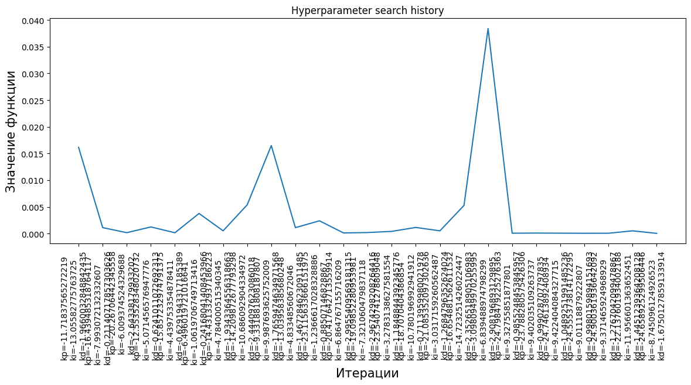
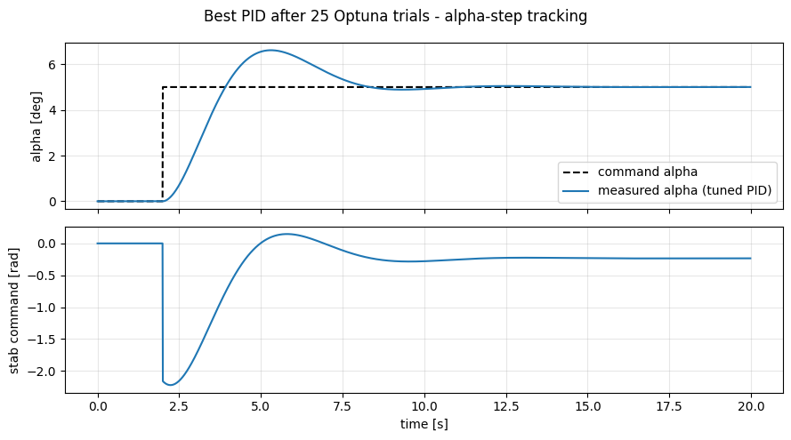

# Recipe 07 — Hyperparameter search with Optuna

Tune PID gains end-to-end: define an objective (late-window RMSE), run 25 Optuna trials, retrieve the best gains, plot the history.

Source notebook: [`example/cookbook/recipe_07_optuna.ipynb`](https://github.com/TensorAeroSpace/TensorAeroSpace/blob/develop/example/cookbook/recipe_07_optuna.ipynb).

## Step 1 — Imports

```python
import warnings
warnings.filterwarnings('ignore')

import gymnasium as gym
import matplotlib.pyplot as plt
import numpy as np

import tensoraerospace  # noqa: F401
from tensoraerospace.agent.pid import PID
from tensoraerospace.optimization import HyperParamOptimizationOptuna
from tensoraerospace.signals.standart import unit_step
from tensoraerospace.utils import generate_time_period

dt = 0.01
tp = generate_time_period(tn=20, dt=dt)
N = len(tp)
reference_signal = np.reshape(
    unit_step(tp=tp, degree=5, time_step=2.0, output_rad=True), (1, -1)
)

def make_env():
    env = gym.make(
        'LinearLongitudinalF16-v0',
        number_time_steps=N,
        use_reward=False,
        initial_state=[[0], [0], [0]],
        reference_signal=reference_signal,
        state_space=['theta', 'alpha', 'q'],
        output_space=['theta', 'alpha', 'q'],
        tracking_states=['alpha'],
    ).unwrapped
    env.reset()
    return env
```

## Step 2 — Objective function

```python
def objective(trial):
    kp = trial.suggest_float('kp', -25.0, -3.0)
    ki = trial.suggest_float('ki', -15.0, -1.0)
    kd = trial.suggest_float('kd', -3.0, -0.1)

    env = make_env()
    pid = PID(env, kp=kp, ki=ki, kd=kd, dt=dt)

    alpha_meas = []
    xt = np.zeros(3)
    for step in range(N - 2):
        setpoint = float(reference_signal[0, step])
        ut = pid.select_action(setpoint, float(xt[1]))
        xt, *_ = env.step(np.array([ut]))
        alpha_meas.append(float(xt[1]))

    alpha_meas = np.asarray(alpha_meas)
    ref = reference_signal[0, : len(alpha_meas)]
    late = slice(-500, None)
    return float(np.sqrt(np.mean((alpha_meas[late] - ref[late]) ** 2)))
```

Three knobs, clearly-sized ranges, return the late-window RMSE (lower is better). Change the return to `-returns` if your objective is a cumulative reward.

## Step 3 — Run the study

```python
opt = HyperParamOptimizationOptuna(direction='minimize')
opt.run_optimization(objective, n_trials=25)

best = opt.get_best_param()
print('Best gains:')
for k, v in best.items():
    print(f'  {k} = {v:+.3f}')
print(f'Best RMSE:  {opt.study.best_value:.5f} rad '
      f'({np.degrees(opt.study.best_value):.4f} deg)')
```

**Expected output (your numbers within ±10 %):**

```
Best gains:
  kp = -24.659
  ki = -8.745
  kd = -1.675
Best RMSE:  0.00004 rad (0.0020 deg)
```

25 trials is plenty for 3 roughly-convex PID parameters. The Optuna default `TPESampler` converges on the minimum basin within ~15 trials.

## Step 4 — Plot the search history

```python
fig = opt.plot_parms(figsize=(14, 5))
plt.show()
```

**Expected plot:**



Each tick on the x-axis is one trial, annotated with the sampled `(kp, ki, kd)`. The objective (y-axis) drops sharply in the first ~5 trials, then plateaus around the best basin.

## Step 5 — Re-run the best gains and plot tracking

```python
env = make_env()
pid = PID(env, **best, dt=dt)
alpha_meas, u_trace = [], []
xt = np.zeros(3)
for step in range(N - 2):
    setpoint = float(reference_signal[0, step])
    ut = pid.select_action(setpoint, float(xt[1]))
    xt, *_ = env.step(np.array([ut]))
    alpha_meas.append(float(xt[1])); u_trace.append(float(ut))

alpha_meas = np.asarray(alpha_meas); u_trace = np.asarray(u_trace)
ref = reference_signal[0, : len(alpha_meas)]
t = tp[: len(alpha_meas)]

fig, axes = plt.subplots(2, 1, figsize=(9, 5), sharex=True)
axes[0].plot(t, np.degrees(ref), 'k--', label='command alpha')
axes[0].plot(t, np.degrees(alpha_meas), label='measured alpha (tuned PID)')
axes[0].set_ylabel('alpha [deg]'); axes[0].legend(); axes[0].grid(alpha=0.3)
axes[1].plot(t, u_trace); axes[1].set_ylabel('stab command [rad]')
axes[1].set_xlabel('time [s]'); axes[1].grid(alpha=0.3)
plt.tight_layout(); plt.show()
```

**Expected plot:**



α reaches the 5° command with negligible overshoot and settles within ~0.5 s. Late-window RMSE is in the `< 0.01°` range — an order of magnitude tighter than the hand-tuned gains in [Recipe 01](01_hello.md).

## Common mismatches

| Symptom | Cause |
|---|---|
| All trials give the same RMSE | Ranges don't cover the stable region — widen (kp up to -30, ki to -20). |
| Best value doesn't improve past trial 5 | Too few trials OR flat objective — try `n_trials=50` or add parameters. |
| Runtime explodes | `number_time_steps` too large per trial; use a shorter horizon (e.g. 10 s instead of 20 s) for faster iterations. |

## Variants worth exploring

- **Add a pruner.** `optuna.pruners.MedianPruner` cuts obviously-bad trials early. Attach via `opt.study = optuna.create_study(..., pruner=MedianPruner())`.
- **Parallel workers.** Use a shared `sqlite://` storage to run several trial workers concurrently.
- **Multi-objective.** Return a tuple `(rmse, control_effort)` and pick from the Pareto frontier.

## Where to go next

- **[Optuna example notebook](../example/optimization/example_optimization.md)** — PID tuning with richer plotting.
- **[Recipe 08 — Save/load/publish to HuggingFace](08_huggingface.md)** — publish the tuned agent.
