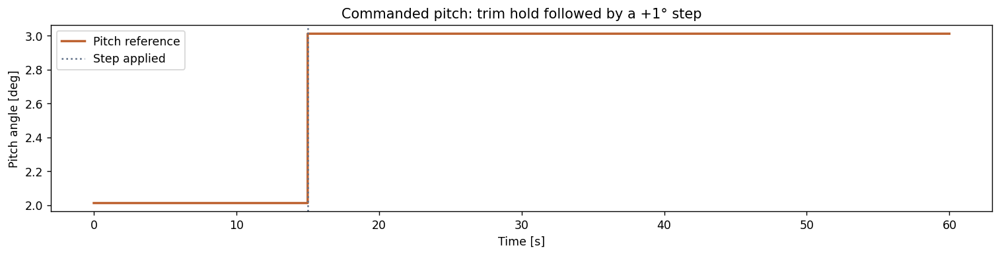
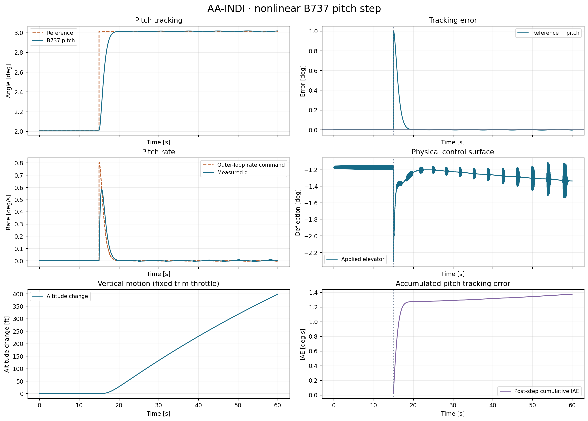
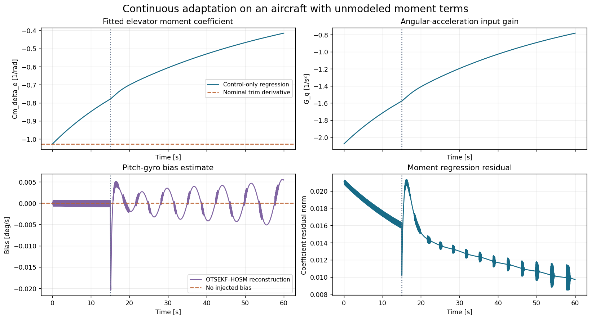
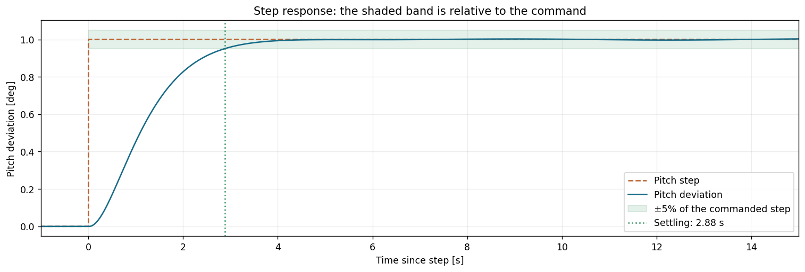

# Recipe 14 — AA-INDI on nonlinear B737, from sensors to step response

**Goal:** construct a physically consistent AA-INDI controller, track a +1° pitch
step on B737, inspect continuous identification, and evaluate the transient with
`ControlBenchmark`. You can then repeat the same flight with a 50% elevator-authority
loss. Execute the Python blocks in order with this version of `tensoraerospace` installed.

**Complete notebooks:** [healthy B737](https://github.com/TensorAeroSpace/TensorAeroSpace/blob/develop/example/reinforcement_learning/incremental_adp/example_aaindi_nonlinear_b737.ipynb)
· [B737 with elevator fault](https://github.com/TensorAeroSpace/TensorAeroSpace/blob/develop/example/reinforcement_learning/incremental_adp/example_aaindi_fault_b737.ipynb).
[Agent theory and API](../agent/aa_indi.md) explain the OTSEKF–HOSM observer and
physical moment identification used here.

## 1. Understand the two control loops

The outer loop turns pitch error into a desired pitch rate:

\[
q_{\mathrm{ref}} = \operatorname{clip}\left(
0.8(\theta_{\mathrm{trim}}+\Delta\theta_{\mathrm{ref}}-\theta),
-3^\circ/\mathrm{s},\;3^\circ/\mathrm{s}\right).
\]

AA-INDI's `predict(measurement, rate_reference)` then converts the rate error to a
virtual angular acceleration and applies incremental dynamic inversion. If your
application already supplies virtual acceleration, use `predict_acceleration`
instead; do not apply both outer rate laws to the same command.

The controller uses reconstructed angular acceleration and actual surfaces to
identify moment derivatives online. It also uses independent navigation to
estimate IMU faults. These are distinct estimation tasks; low tracking error alone
does not show that either parameter estimate is correct.

## 2. Create the aircraft, trim and reference

The example uses the nonlinear B737-800 configuration at 20,000 ft and 650 ft/s,
RK4 integration and a 0.02 s control interval. The pitch command is the trim angle
until 15 s, then trim +1°. Elevator is the only adapted control channel; ailerons,
rudder and throttle remain at their trim commands. Speed and altitude are monitored
but have no dedicated hold controller in this recipe.


```python
import numpy as np
import matplotlib.pyplot as plt
from tensoraerospace.benchmark import B737PitchStepBenchmark, ControlBenchmark
from tensoraerospace.agent.aa_indi import AircraftGeometry, FlightMeasurement
from tensoraerospace.aerospacemodel.b737.nonlinear import ElevatorEffectiveness
from tensoraerospace.agent.aa_indi import AAINDIAgent, AAINDIConfig, ObserverConfig

USE_ELEVATOR_FAULT = False
fault = ElevatorEffectiveness(time=30.0, effectiveness=0.5) if USE_ELEVATOR_FAULT else None

experiment = B737PitchStepBenchmark(elevator_fault=fault, duration=60.0, dt=0.02, step_time=15.0, step_deg=1.0)
env, trim_result, trim_action = experiment.make_env()
state, _ = env.reset(seed=experiment.seed)
params = env.unwrapped.model.param
theta_trim = trim_result.alpha_rad
reference = experiment.reference
OUTER_PITCH_GAIN = 0.8
print("Trim residual:", trim_result.residual)
print("Trim pitch/elevator [deg]:", np.rad2deg([theta_trim, trim_action[0]]))
experiment.plot_reference(theta_trim)
plt.show()
```




`B737PitchStepBenchmark.reference` contains **3,001 samples** for **3,000 transitions**, including
the final observation. `B737PitchStepBenchmark.make_env()` finds a converged trim before creating the
environment. Its action order is `[elevator, aileron, rudder, throttle]`; the first
three values are radians and throttle is normalized.

The state order is `[u, v, w, p, q, r, phi, theta, psi, x_N, y_E, z_D]`.
Body velocities and positions use ft/s and ft in this model; angular states use
radians and rad/s. The sensor adapter converts to SI for AA-INDI.

## 3. Supply the physical measurement packet

The SDK method [`FlightMeasurement.from_model`](https://github.com/TensorAeroSpace/TensorAeroSpace/blob/develop/tensoraerospace/agent/aa_indi/kinematics.py)
constructs `FlightMeasurement` from the simulated sensors:

| Field | Units and meaning |
|---|---|
| `time` | Seconds, advancing by `ObserverConfig.dt` per control transition |
| `angular_rate` | Body `[p, q, r]`, rad/s |
| `specific_force` | Accelerometer output, m/s²; gravity excluded |
| `ground_velocity` | Independent NED navigation velocity, m/s |
| `attitude` | Independent roll, pitch, heading in radians |
| `surface_position` | Actual elevator angle over the preceding interval, radians |
| `airspeed`, `density` | Air-relative speed in m/s; air density in kg/m³ |

With body velocities \(v_b\), body rates \(\omega\), and body-to-NED rotation \(R\),
the synthetic accelerometer is
\(f_b=\dot v_b+\omega\times v_b-R^T[0,0,g]^T\), converted from ft/s² to m/s².
This prevents counting gravity or rotating-frame terms twice. The ODE is used to
simulate the accelerometer, not to provide true moments or angular acceleration
to the identifier.

In a real system, independent navigation must be independent of the faulty IMU.
At initialization both velocity and attitude are required. Later they can be
`None` when slower sensors have no new sample; do not resend stale observations as
new independent measurements. This B737 case supplies ideal navigation every tick
and assumes no wind, so airspeed equals the norm of body velocity.

## 4. Initialize the moment model and controller

The healthy trim supplies a one-time local derivative `b = ∂q_dot/∂elevator`.
`AircraftGeometry.from_parameters` converts the full inertia tensor, including the product of
inertia, to SI. `geometry.coefficients` converts angular acceleration to a
nondimensional moment derivative using inertia and dynamic pressure. The resulting
array has shape **(3, 1)**: three moment axes, one elevator input.


```python
from tensoraerospace.agent.aa_indi import AAINDIAgent, AAINDIConfig, ObserverConfig

geometry = AircraftGeometry.from_parameters(params)
measurement = FlightMeasurement.from_model(env.model, applied_action=trim_action, surface_indices=(0,))
A_cont, B_cont = env.model.linearize(state, trim_action)
b = B_cont[4, 0]
nominal_derivatives = geometry.coefficients(
    np.zeros(3), np.array([0.0, b, 0.0]), measurement.density, measurement.airspeed,
)[:, None]
agent = AAINDIAgent(AAINDIConfig(
    geometry=geometry, nominal_derivatives=nominal_derivatives,
    observer=ObserverConfig(dt=experiment.dt, gravity=params.g_ft_s2 * 0.3048),
    sigma0=15.0, forgetting_min=0.25, covariance_init=1.0,
    rate_feedback=np.full(3, 3.0), acceleration_cutoff_hz=5.0,
    magnitude_limit=params.elevator_max_rad, rate_limit=np.deg2rad(20.0),
    enable_sensor_correction=True,
))
print(f"Nominal Cm_delta_e: {nominal_derivatives[1, 0]:.6f} 1/rad")
print(f"Trim airspeed: {measurement.airspeed:.3f} m/s; density: {measurement.density:.6f} kg/m³")
print("Trim specific force [m/s²]:", measurement.specific_force)
```


| Choice | Purpose |
|---|---|
| `rate_feedback = [3, 3, 3]` | Proportional rate-to-acceleration application loop |
| `acceleration_cutoff_hz = 5` | Common filtering for reconstructed moment and surface regressors |
| `covariance_init = 1` | Initial uncertainty of moment-derivative identification |
| `sigma0 = 15`, `forgetting_min = 0.25` | Variable-forgetting identification settings |
| `rate_limit = 20°/s` | Surface slew limit; configuration value is converted to rad/s |
| `enable_sensor_correction = True` | Use the observer-corrected rates throughout the run |

This nominal initialization is explicit model knowledge. The one-elevator model
cannot command three independent angular accelerations; the symmetric pitch
experiment uses zero roll/yaw rate references. Its outer-loop gains and sensor
tuning are application choices, not a reproduction of an aircraft flight-test setup.

## 5. Run the complete predict → step → learn loop


```python
states, actions, rate_commands, learning = [state.copy()], [], [], []
try:
    for k in range(experiment.steps):
        q_ref = float(np.clip(OUTER_PITCH_GAIN * (theta_trim + reference[k] - state[7]),
                              -np.deg2rad(3.0), np.deg2rad(3.0)))
        command = agent.predict(measurement, np.array([0.0, q_ref, 0.0]))
        action = trim_action.copy()
        action[0] = command[0]  # AA-INDI returns the absolute surface angle.
        action = np.clip(action, env.action_space.low, env.action_space.high)
        next_state, _, terminated, truncated, _ = env.step(action)
        applied = env.model.applied_action
        experiment.validate_transition(next_state, terminated, truncated, k)
        measurement = FlightMeasurement.from_model(env.model, surface_indices=(0,))
        diagnostics = agent.learn(measurement, applied_action=applied[:1])
        learning.append([
            agent.identifier.derivatives[1, 0], agent.G[1, 0],
            agent.observer.faults[4], diagnostics["moment_residual_norm"],
        ])
        states.append(next_state.copy())
        actions.append(applied)
        rate_commands.append(q_ref)
        state = next_state
finally:
    env.close()
states, actions, rate_commands, learning = map(np.asarray, (states, actions, rate_commands, learning))
assert np.isfinite(learning).all()
update_counts = [estimator.num_updates for estimator in agent.identifier.estimators]
assert update_counts == [experiment.steps] * 3
print(f"Completed {experiment.duration:.1f} s; VFF-RLS updates per moment axis: {update_counts}")
print(f"Final fitted Cm_delta_e: {learning[-1, 0]:.6f} 1/rad")
print(f"Final reconstructed q-gyro bias: {np.rad2deg(learning[-1, 2]):.6f} deg/s (true bias: zero)")
```


Several details in this loop matter:

1. `predict` returns the **absolute elevator angle in radians**. Replace `action[0]`;
   adding the trim angle again would double-count it.
2. Read the actual action from the model history after clipping and integration.
   Pass the same physical elevator angle to the packet and `applied_action`.
3. The next sensor packet describes the new state at `time[k + 1]`. `learn` consumes
   it once; the next `predict` reuses that identical packet at the same timestamp.
4. Learning remains active at every transition. The expected identifier counts are
   `[3000, 3000, 3000]`, one estimator for each moment axis.
5. Check the full finite flight and the configured horizon. A short trajectory
   that terminated early must not receive the metrics of a completed flight.

The loop closes its environment in `finally`. During interactive configuration,
close an unused environment before recreating it after an error.

## 6. Plot tracking and estimator diagnostics


```python
experiment.plot_response(states, actions, rate_commands, "AA-INDI · nonlinear B737 pitch step")
plt.show()

fig, axes = plt.subplots(2, 2, figsize=(13, 7), sharex=True, constrained_layout=True)
axes[0, 0].plot(experiment.time[1:], learning[:, 0], color="#176b87", label="Control-only regression")
axes[0, 0].axhline(nominal_derivatives[1, 0], color="#bd6230", linestyle="--", label="Nominal trim derivative")
axes[0, 0].set(title="Fitted elevator moment coefficient", ylabel="Cm_delta_e [1/rad]")
axes[0, 0].legend(fontsize=9)
axes[0, 1].plot(experiment.time[1:], learning[:, 1], color="#176b87")
axes[0, 1].set(title="Angular-acceleration input gain", ylabel="G_q [1/s²]")
axes[1, 0].plot(experiment.time[1:], np.rad2deg(learning[:, 2]), color="#8064a2", label="OTSEKF–HOSM reconstruction")
axes[1, 0].axhline(0, color="#bd6230", linestyle="--", label="No injected bias")
axes[1, 0].set(title="Pitch-gyro bias estimate", ylabel="Bias [deg/s]")
axes[1, 0].legend(fontsize=9)
axes[1, 1].plot(experiment.time[1:], learning[:, 3], color="#176b87")
axes[1, 1].set(title="Moment regression residual", ylabel="Coefficient residual norm")
for axis in axes.ravel():
    axis.axvline(experiment.step_time, color="#64748b", linestyle=":")
    axis.set_xlabel("Time [s]")
    axis.grid(alpha=0.22)
fig.suptitle("Continuous adaptation on an aircraft with unmodeled moment terms", fontsize=16)
plt.show()
```




Read the pitch reference and response together, then inspect the rate command,
actual elevator, accumulated error and altitude. Airspeed change is reported in
the physical summary below. The absence of a speed/height hold matters when
interpreting the pitch result.



The regression uses only surface-related moments. Full B737 moments also depend
on angle of attack, damping and other terms. A drifting fitted elevator coefficient
can absorb these omitted contributions; it is not a direct measurement of elevator
health. The actual gyro bias is zero in this ideal-sensor case, which gives a useful
reference for the observer plot.

## 7. Evaluate the step with the library benchmark


```python
windows, physical_metrics = experiment.evaluate(states, actions)
print(experiment.metric_table(windows).to_string(na_rep="Not reached"))
for name, value in physical_metrics.items():
    print(f"{name}: {value:.6f}")
experiment.plot_step(states, windows)
plt.show()
```


`evaluate_step` calls the project's `ControlBenchmark.benchmarking_one_step` and
returns two assessment windows: the first 15 s after the command and the full
post-step interval. `B737PitchStepBenchmark.evaluate` passes angles in radians and reports angular
errors in degrees in the physical summary.

The benchmark's settling and overshoot calculations use the final output as their
reference level. Therefore `ControlBenchmark.benchmarking_step_response` also reports **command settling time** within
±5% of the requested 1° step and **command overshoot** relative to that request.
A controller with a remaining offset can settle around its own output while still
missing the command. Check final error and command-based metrics alongside the
library's native metrics.



For the healthy 60 s run, the executed example gives:

| Quantity | Result |
|---|---:|
| Post-step pitch RMSE | 0.135474° |
| Final reference-minus-pitch error | −0.005090° |
| Command settling time, ±5% | 2.88 s |
| Final altitude change | +397.753 ft |
| Final airspeed change | −18.840 ft/s |

The full post-step RMSE includes the initial step error. Good pitch regulation
coexists with a climb and speed loss here because throttle remains at trim;
this is a pitch-control example, not simultaneous attitude/altitude/speed hold.

## 8. Repeat with an elevator fault

Set `USE_ELEVATOR_FAULT = True` in the first block and rerun **all blocks with a
fresh agent**. At 30 s the native B737 fault model feeds half the physical
elevator angle to the original aerodynamic table, consistently recomputing lift,
drag and pitch moment. The encoder still reports the physical angle. The fault
schedule reaches only the plant and synthetic sensor generator.


```python
if USE_ELEVATOR_FAULT:
    fault_metrics = ControlBenchmark().tracking_metrics(
        np.rad2deg(reference), np.rad2deg(states[:, 7] - theta_trim),
        experiment.dt, start=fault.time, tolerance=0.05,
    )
    print("Post-fault RMSE [deg]:", fault_metrics["combined_rmse"])
    print("Post-fault IAE [deg·s]:", fault_metrics["iae"])
    print("Final error [deg]:", fault_metrics["final_error"][0])
    print("Recovery to ±0.05° [s]:", fault_metrics["recovery_time"])
```


The saved fault example gives post-failure pitch RMSE **0.003756°**, peak error
**0.012846°** and final reference-minus-pitch error **−0.002334°**. These values
refer to `(30, 60]` s and this configuration. Do not mix the command transient at
15 s with the disturbance transient at 30 s when discussing recovery.

For a combined sensor/actuator fault, open the
[complete rigid-body notebook](https://github.com/TensorAeroSpace/TensorAeroSpace/blob/develop/example/reinforcement_learning/incremental_adp/example_aaindi_sensor_actuator_faults.ipynb).
Its cells show `AAINDIAgent` construction, measured `FlightMeasurement` packets,
the physical plant transition and `learn`, followed by library metrics and plots.
Compare `enable_sensor_correction=True` and `False` using fresh controllers and
paired seeds. At 20 s this scenario injects 30% pitch-actuator loss and a
+0.02 rad/s pitch-gyro bias. Its plant and bandwidth differ from B737, so assess
its two arms together instead of ranking their errors against this pitch task.

## Troubleshooting and model limits

| Symptom | What to check |
|---|---|
| Immediate large elevator request | Absolute vs trim-relative angle, radians/degrees, derivative sign and dynamic-pressure units. |
| Timestamp or packet mismatch | Exactly one new sensor packet per physical transition; reuse the packet after `learn`. |
| Drift despite zero injected gyro bias | Navigation independence, accelerometer gravity convention and observer tuning. |
| Good pitch tracking but changing fitted coefficients | Omitted aerodynamic terms and parameter excitation; inspect residuals instead of claiming convergence. |
| Loss of speed or height | This pitch-only example holds throttle at trim; add and assess a longitudinal hold for a different task. |

The B737-800 configuration reuses B737-100 aerodynamic derivatives with changed
geometry/inertia. Sensors are ideal and the surfaces have no servo lag. The local
elevator fault is a parametric authority loss, not a validated structural-damage
model. Results establish this simulator behavior within the checked envelope.

**Next:** [Recipe 09 — Engine-out comparison with PID/LQR/LQI](09_fault_tolerance.md)
· [Recipe 08 — Save the complete controller state](08_huggingface.md).
