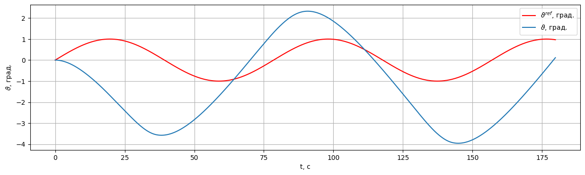

# Example: A2C with NARX Critic

Trains an **Advantage Actor-Critic (A2C)** agent whose actor/critic networks use a **NARX (Nonlinear AutoRegressive with eXogenous inputs)** layout to track a sinusoidal pitch-angle reference on `LinearLongitudinalF16-v0`.

Source notebook: `example/reinforcement_learning/deep_rl/example_narx.ipynb`.

## 1. Imports and device

```python
import gymnasium as gym
from tqdm import tqdm
import numpy as np
import torch

from tensoraerospace.envs.f16.linear_longitudinal import LinearLongitudinalF16
from tensoraerospace.utils import generate_time_period, convert_tp_to_sec_tp
from tensoraerospace.signals.standard import sinusoid
from tensoraerospace.agent.a2c.narx import Actor, Mish, Critic, A2CLearner, Runner

DEVICE = torch.device(
    "cuda"
    if torch.cuda.is_available()
    else ("mps" if torch.backends.mps.is_available() else "cpu")
)
print("Using device:", DEVICE)

# FAST_PRESET shortens the time horizon and episode count so the notebook
# finishes in minutes. Set to False for the full 5000-episode training.
FAST_PRESET = True
```

## 2. Environment and reference signal

Sinusoidal pitch-angle reference (low amplitude, high frequency). The env exposes the two longitudinal modes `[theta, q]`.

```python
dt = 0.1
tn = 30 if FAST_PRESET else 180
tp = generate_time_period(tn=tn, dt=dt)
tps = convert_tp_to_sec_tp(tp, dt=dt)
number_time_steps = len(tp)

reference_signals = np.reshape(
    np.deg2rad(sinusoid(amplitude=0.008, tp=tp, frequency=1 / dt)),
    [1, -1],
)

env = gym.make(
    'LinearLongitudinalF16-v0',
    number_time_steps=number_time_steps,
    initial_state=[[0], [0]],
    reference_signal=reference_signals,
    output_space=["theta", "q"],
    state_space=["theta", "q"],
    tracking_states=["theta"],
)
state, info = env.reset()
```

## 3. Actor, critic, learner, runner

```python
state_dim = env.observation_space.shape[0]
n_actions = env.action_space.shape[0]

actor = Actor(state_dim, n_actions, activation=Mish)
critic = Critic(state_dim, activation=Mish)

learner = A2CLearner(actor, critic, entropy_beta=0.3, device=DEVICE)
runner = Runner(env, learner.actor, writer=learner.writer)
```

## 4. Training loop

```python
steps_on_memory = 10 if FAST_PRESET else 1
episodes = 10 if FAST_PRESET else 5000
episode_length = number_time_steps
total_steps = (episode_length * episodes) // steps_on_memory

for _ in tqdm(range(total_steps)):
    memory = runner.run(steps_on_memory)
    learner.learn(memory, runner.steps, discount_rewards=False)
```

## 5. Deterministic roll-out

```python
actor.eval()
for episode in range(3 if FAST_PRESET else 5):
    state, info = env.reset()
    done = False
    total_reward = 0.0
    while not done:
        state_t = torch.as_tensor(state, dtype=torch.float32, device=DEVICE).flatten().unsqueeze(0)
        with torch.no_grad():
            dists = actor(state_t)
            actions = dists.sample().cpu().numpy()
        actions = np.clip(actions, env.action_space.low.min(), env.action_space.high.max())
        state, reward, terminated, truncated, info = env.step(actions[0])
        done = terminated or truncated
        total_reward += reward
    print(f"Demo Episode {episode}, Total Reward: {total_reward:.3f}")
```

## 6. Results

Tracking of the sinusoidal pitch-angle reference after training:

```python
env.unwrapped.model.plot_transient_process('theta', tps, reference_signals[0], to_deg=True, figsize=(15, 4))
```



The trained A2C-NARX agent follows the low-amplitude sinusoid; the elevator command stays within the linear-model envelope throughout the episode.
