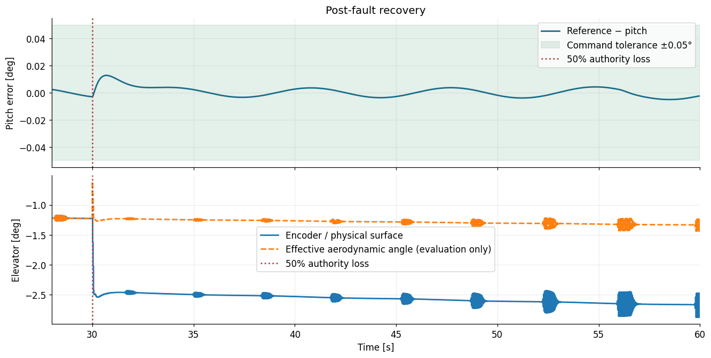
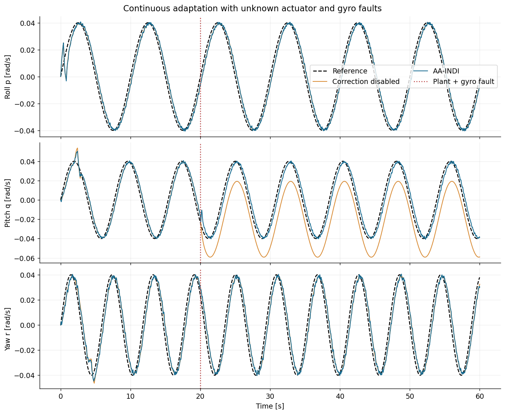
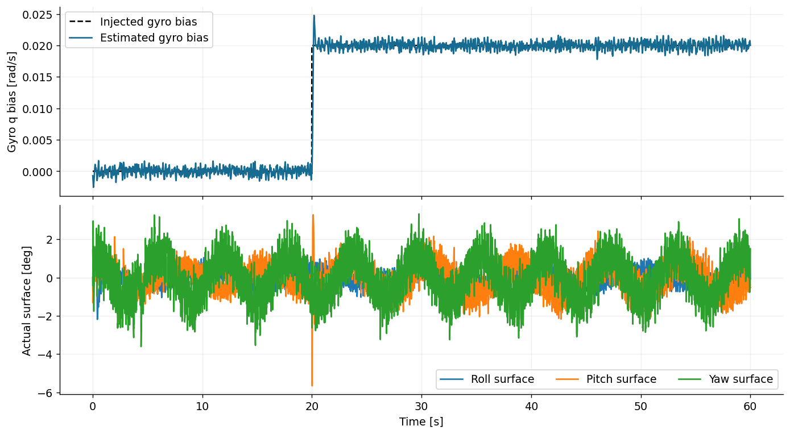

# Example: AA-INDI on nonlinear B737 — pitch tracking, online adaptation and faults

This walkthrough builds a physical SI measurement packet, initializes the
AA-INDI moment model, runs the complete `predict → step → learn` loop and measures
the response to a pitch step. It also explains elevator-authority loss and a
separate actuator/gyro-fault experiment.

**Executed notebooks:** [healthy B737](https://github.com/TensorAeroSpace/TensorAeroSpace/blob/develop/example/reinforcement_learning/incremental_adp/example_aaindi_nonlinear_b737.ipynb) · [B737 with elevator fault](https://github.com/TensorAeroSpace/TensorAeroSpace/blob/develop/example/reinforcement_learning/incremental_adp/example_aaindi_fault_b737.ipynb).

The [AA-INDI algorithm page](../../../agent/aa_indi.md) documents the current
implementation and its source papers. This is aircraft-specific tuning with a
nominal-model initialization; it does not reproduce the published flight tests.

The complete example below uses the public `tensoraerospace` API. Run its Python
blocks in order in a notebook or Python session with this revision installed.
In Jupyter, `%matplotlib inline` may be added to the first cell. The code imports
models, agents and benchmarks directly from the library; no adjacent example
module or `sys.path` modification is needed.

| Setting | Value |
|---|---|
| Aircraft | Nonlinear, 12-state B737 with B737-800 geometry/inertia |
| Cruise condition | 20,000 ft, 650 ft/s |
| Duration / control interval | 60 s / 0.02 s; 3,000 transitions |
| Integrator | RK4 |
| Pitch command | Trim until 15 s, then trim +1° |
| Outer pitch-to-rate gain | 0.8 s⁻¹; rate command limited to ±3°/s |
| Other controls | Aileron/rudder zero; throttle fixed at trim |
| Optional fault | 50% elevator aerodynamic effectiveness from 30 s |

The command, measured pitch and accumulated error are all displayed. Set
`USE_ELEVATOR_FAULT = False` for the healthy run; set it to `True` and rerun **all
blocks with a fresh environment and agent** for the fault case. The schedule is
passed only to the model, and adaptation stays active throughout.

The outer loop is

\[
q_{\mathrm{ref},k}=\operatorname{clip}
\left[0.8(\theta_{\mathrm{trim}}+\Delta\theta_{\mathrm{ref},k}-\theta_k),
-3^\circ/\mathrm{s},\;3^\circ/\mathrm{s}\right].
\]

It supplies the inner controller's reference. It does not separately control
altitude or airspeed.

### Imports and experiment selection


```python
import numpy as np
import pandas as pd
import matplotlib.pyplot as plt
from IPython.display import display
from tensoraerospace.benchmark import B737PitchStepBenchmark, ControlBenchmark
from tensoraerospace.agent.aa_indi import AircraftGeometry, FlightMeasurement
from tensoraerospace.aerospacemodel.b737.nonlinear import ElevatorEffectiveness

plt.rcParams.update(
    {
        "figure.dpi": 110,
        "font.size": 11,
        "axes.titlesize": 13,
        "axes.spines.top": False,
        "axes.spines.right": False,
        "lines.linewidth": 1.8,
        "savefig.bbox": "tight",
    }
)

USE_ELEVATOR_FAULT = False
fault = (
    ElevatorEffectiveness(time=30.0, effectiveness=0.5) if USE_ELEVATOR_FAULT else None
)
```

## 1. Trim, reference and nonlinear environment

The scenario follows [the IHDP B737 example](https://github.com/TensorAeroSpace/TensorAeroSpace/blob/develop/example/reinforcement_learning/incremental_adp/example_ihdp_nonlinear_b737.ipynb):
B737-800 configuration, 20,000 ft, 650 ft/s, 60 s, RK4 at 50 Hz, and a +1° pitch step at 15 s.
The initial 15 s are included in every full-flight plot. The step reference is shown explicitly.

The 12 states are body velocities `[u,v,w]` (ft/s), body rates `[p,q,r]` (rad/s),
Euler angles `[roll,pitch,yaw]` (rad), and NED position `[x,y,z]` (ft).
Virtual actions are **physical radians** `[elevator, aileron, rudder, throttle]`;
throttle is dimensionless. Aileron/rudder stay zero and throttle stays at trim.
These examples add a pitch-to-rate outer loop; its gain is separate from the adaptive inner loop.

This B737 runtime applies clipped surfaces with zero-order hold and has **no servo lag**.
Command slew limits below belong to the controllers. The B737-800 option scales geometry
and inertia while reusing the model's B737-100 aerodynamic tables. It is a simplified
cruise simulation, not a validated B737NG flight-test model.

```python
experiment = B737PitchStepBenchmark(
    elevator_fault=fault, duration=60.0, dt=0.02, step_time=15.0, step_deg=1.0
)
env, trim_result, trim_action = experiment.make_env()
state, _ = env.reset(seed=experiment.seed)
params = env.unwrapped.model.param
theta_trim = trim_result.alpha_rad
reference = experiment.reference
OUTER_PITCH_GAIN = 0.8  # q_ref = gain * (theta_ref - theta), clipped to ±3 deg/s

print(f"Trim residual: {trim_result.residual:.3e}")
print(
    f"Pitch: {np.rad2deg(theta_trim):.4f} deg; "
    f"elevator: {np.rad2deg(trim_action[0]):.4f} deg; "
    f"throttle: {trim_action[3]:.4f}"
)
print(
    f"{experiment.steps} transitions; {experiment.steps + 1} state samples; "
    f"final time {experiment.time[-1]:.1f} s"
)
experiment.plot_reference(theta_trim)
plt.show()
```


## 2. SI sensors, aircraft geometry and controller setup

The model uses feet, slugs and radians; AA-INDI uses SI throughout. `AircraftGeometry.from_parameters` includes
B737's product of inertia with the same sign convention as the nonlinear equations.
`FlightMeasurement.from_model` synthesizes ideal accelerometer, gyro, navigation and air-data measurements:

`f_body = (v_dot_body + omega × v_body - R_body_to_NED.T @ g_NED) * 0.3048`.

Navigation velocity and attitude come independently from simulated aircraft truth, not
from integrating the gyro. No noise or sensor fault is injected. The healthy run has no actuator fault;
the optional `ElevatorEffectiveness` changes the plant only.
The ODE is used to synthesize accelerometers; its true angular acceleration and moment
are **not** supplied to the observer or online identifier. Surface feedback is the actual
held elevator from the preceding interval. Sampling is 50 Hz for every channel.

The controller starts from a **one-time nominal elevator derivative at trim**. It controls
only pitch; the symmetric initial state and zero lateral inputs keep roll/yaw unforced.
The angle loop produces `q_ref`; `predict` applies rate feedback
`nu_q = 3 * (q_ref - corrected_q)` before the AA-INDI acceleration loop.
Its 20°/s command limit and 5 Hz acceleration filter are example settings.

```python
from tensoraerospace.agent.aa_indi import AAINDIAgent, AAINDIConfig, ObserverConfig

geometry = AircraftGeometry.from_parameters(params)
measurement = FlightMeasurement.from_model(
    env.model, applied_action=trim_action, surface_indices=(0,)
)
A_cont, B_cont = env.model.linearize(state, trim_action)
b = B_cont[4, 0]
nominal_derivatives = geometry.coefficients(
    np.zeros(3),
    np.array([0.0, b, 0.0]),
    measurement.density,
    measurement.airspeed,
)[:, None]
agent = AAINDIAgent(
    AAINDIConfig(
        geometry=geometry,
        nominal_derivatives=nominal_derivatives,
        observer=ObserverConfig(dt=experiment.dt, gravity=params.g_ft_s2 * 0.3048),
        sigma0=15.0,
        forgetting_min=0.25,
        covariance_init=1.0,
        rate_feedback=np.full(3, 3.0),
        acceleration_cutoff_hz=5.0,
        magnitude_limit=params.elevator_max_rad,
        rate_limit=np.deg2rad(20.0),
        enable_sensor_correction=True,
    )
)
print(f"Nominal Cm_delta_e: {nominal_derivatives[1, 0]:.6f} 1/rad")
print(
    f"Trim airspeed: {measurement.airspeed:.3f} m/s; density: {measurement.density:.6f} kg/m³"
)
print("Trim specific force [m/s²]:", measurement.specific_force)
```

### What the online coefficient estimate means here

The paper's control-only regression fits total reconstructed moment coefficients against
absolute surface positions. B737's pitching moment also depends on angle of attack and
pitch rate; at trim, its nonzero elevator balances other aerodynamic moments. Consequently,
a fitted `Cm_delta_e` can drift even without a fault. It is an **effective coefficient of
this reduced regression**, not a verified physical elevator derivative or a fault percentage.

The nominal prior and `covariance_init=1` are explicit experimental choices. All three
VFF-RLS estimators and the sensor observer continue updating every interval. This step
scenario does not provide enough independent excitation to validate parameter identification.

## 3. Run all 3,000 plant transitions

The next sensor packet is constructed after `env.step` from the new state and actual
applied elevator. `learn` consumes it once; the next `predict` reuses the identical packet
at that timestamp. Environment clipping is included in the feedback. No trim offset is
subtracted from the AA-INDI surface measurement or moment-identification regressor.

```python
states, actions, rate_commands, learning = [state.copy()], [], [], []
try:
    for k in range(experiment.steps):
        q_ref = float(
            np.clip(
                OUTER_PITCH_GAIN * (theta_trim + reference[k] - state[7]),
                -np.deg2rad(3.0),
                np.deg2rad(3.0),
            )
        )
        command = agent.predict(measurement, np.array([0.0, q_ref, 0.0]))
        action = trim_action.copy()
        action[0] = command[0]  # AA-INDI returns the absolute surface angle.
        action = np.clip(action, env.action_space.low, env.action_space.high)
        next_state, _, terminated, truncated, _ = env.step(action)
        applied = env.model.applied_action
        experiment.validate_transition(next_state, terminated, truncated, k)
        measurement = FlightMeasurement.from_model(env.model, surface_indices=(0,))
        diagnostics = agent.learn(measurement, applied_action=applied[:1])
        learning.append(
            [
                agent.identifier.derivatives[1, 0],
                agent.G[1, 0],
                agent.observer.faults[4],
                diagnostics["moment_residual_norm"],
            ]
        )
        states.append(next_state.copy())
        actions.append(applied)
        rate_commands.append(q_ref)
        state = next_state
finally:
    env.close()
states, actions, rate_commands, learning = map(
    np.asarray, (states, actions, rate_commands, learning)
)
assert np.isfinite(learning).all()
update_counts = [estimator.num_updates for estimator in agent.identifier.estimators]
assert update_counts == [experiment.steps] * 3
print(
    f"Completed {experiment.duration:.1f} s; VFF-RLS updates per moment axis: {update_counts}"
)
print(f"Final fitted Cm_delta_e: {learning[-1, 0]:.6f} 1/rad")
print(
    f"Final reconstructed q-gyro bias: {np.rad2deg(learning[-1, 2]):.6f} deg/s (true bias: zero)"
)
```

## 4. Tracking, accumulated error and observer/identifier diagnostics

The gyro-bias plot is compared with the known **zero injected bias** for evaluation only;
that truth is not fed to the controller. A changing `Cm_delta_e` estimate is not, by itself,
evidence of an actuator fault. `G_q` also changes with airspeed and density.

```python
experiment.plot_response(
    states, actions, rate_commands, "AA-INDI · nonlinear B737 pitch step"
)
plt.show()

fig, axes = plt.subplots(2, 2, figsize=(13, 7), sharex=True, constrained_layout=True)
axes[0, 0].plot(
    experiment.time[1:],
    learning[:, 0],
    color="#176b87",
    label="Control-only regression",
)
axes[0, 0].axhline(
    nominal_derivatives[1, 0],
    color="#bd6230",
    linestyle="--",
    label="Nominal trim derivative",
)
axes[0, 0].set(title="Fitted elevator moment coefficient", ylabel="Cm_delta_e [1/rad]")
axes[0, 0].legend(fontsize=9)
axes[0, 1].plot(experiment.time[1:], learning[:, 1], color="#176b87")
axes[0, 1].set(title="Angular-acceleration input gain", ylabel="G_q [1/s²]")
axes[1, 0].plot(
    experiment.time[1:],
    np.rad2deg(learning[:, 2]),
    color="#8064a2",
    label="OTSEKF–HOSM reconstruction",
)
axes[1, 0].axhline(0, color="#bd6230", linestyle="--", label="No injected bias")
axes[1, 0].set(title="Pitch-gyro bias estimate", ylabel="Bias [deg/s]")
axes[1, 0].legend(fontsize=9)
axes[1, 1].plot(experiment.time[1:], learning[:, 3], color="#176b87")
axes[1, 1].set(title="Moment regression residual", ylabel="Coefficient residual norm")
for axis in axes.ravel():
    axis.axvline(experiment.step_time, color="#64748b", linestyle=":")
    axis.set_xlabel("Time [s]")
    axis.grid(alpha=0.22)
fig.suptitle(
    "Continuous adaptation on an aircraft with unmodeled moment terms", fontsize=16
)
plt.show()
```


## 5. Step-response assessment with `ControlBenchmark`

`experiment.evaluate` calls `ControlBenchmark.benchmarking_step_response` with
**pitch deviations in radians**, a zero pre-step baseline, and one second of pre-step data.
It refuses partial or non-finite trajectories. The table converts angle-based metrics to degrees.
Two windows distinguish the initial transient from later adaptation: the first 15 s after
the step, and the complete 45 s post-step interval.

The benchmark computes overshoot and its ±5% settling band relative to the **estimated
final output**, not the requested pitch. We report those native metrics unchanged and
add separately labelled overshoot/settling metrics relative to the **command**. Settling
requires staying in the corresponding band for the rest of the selected window.
The shaded plot uses the command band. Rise time is the **10–90% duration relative to
the estimated final output**, not a timestamp or a test of reaching the command.
Static error uses the benchmark's steady tail; the separate final error is a single sample.
IAE sums absolute pitch error times `dt` using the benchmark's rectangle rule; the
cumulative plot uses the same convention. ISE integrates squared error; ITAE additionally
weights elapsed time after the step. Rate-loop error is not added to angle error because their units differ.

```python
windows, physical_metrics = experiment.evaluate(states, actions)
display(
    experiment.metric_table(windows).style.format(precision=5, na_rep="Not reached")
)
display(
    pd.Series(physical_metrics, name="Measured result")
    .to_frame()
    .style.format(precision=6)
)
experiment.plot_step(states, windows)
plt.show()
```


## 6. Interpretation

All curves and tables above are generated by the saved run. A full finite episode and
small tracking error support this **selected ideal-sensor, 60 s test only**; they do not
establish global stability or fault tolerance. The default run has no fault; both modes keep learning active.
The altitude increase and airspeed reduction are expected with a sustained nose-up command
and fixed throttle: this experiment controls pitch, not altitude or speed.

The public `tensoraerospace` API supplies model analysis, measurements and
benchmark metrics. This notebook only defines the application reference, agent
configuration and control loop; it does not depend on sibling examples.


## 7. Repeat with 50% elevator-authority loss

Set `USE_ELEVATOR_FAULT = True` in the first block and repeat the complete run.
`ElevatorEffectiveness(time=30, effectiveness=0.5)` scales the elevator angle
seen by the B737 aerodynamic tables, consistently changing force and pitching
moment. The encoder still reports the physical surface angle. At a fault inside
an integration step, the native model splits integration at the event time.
There is no state jump or hidden change to the controller's nominal prior.

Assess the fault separately from the pitch step. The code below selects
**(30, 60] s**, whereas the preceding step metrics start at 15 s. Recovery means
remaining within ±0.05° of the pitch command for the rest of the fault window.
`None` means this criterion was not reached.

```python
if USE_ELEVATOR_FAULT:
    fault_metrics = ControlBenchmark().tracking_metrics(
        np.rad2deg(reference),
        np.rad2deg(states[:, 7] - theta_trim),
        experiment.dt,
        start=fault.time,
        tolerance=0.05,
    )
    print("Post-fault RMSE [deg]:", fault_metrics["combined_rmse"])
    print("Post-fault IAE [deg·s]:", fault_metrics["iae"])
    print("Final command error [deg]:", fault_metrics["final_error"][0])
    print("Recovery to ±0.05° [s]:", fault_metrics["recovery_time"])
```


The saved healthy run has post-step pitch RMSE **0.135474°**, final command error
**−0.005090°** and command-relative settling time **2.88 s**. Its altitude increases
by **397.753 ft** and airspeed decreases by **18.840 ft/s**: these values follow
from the fixed-throttle pitch task and must be reviewed alongside angular error.

With the fault enabled, the saved post-fault RMSE is **0.003756°**, peak absolute
error **0.012846°** and final error **−0.002334°**. The post-fault window excludes
the earlier one-degree step, so its RMSE cannot be directly compared with the
healthy run's full post-step RMSE. Each run performs 3,000 identifier updates per
moment axis. A fitted coefficient changing after the event does not by itself
estimate a physical fault percentage.



## 8. Separate experiment: simultaneous actuator and gyro faults

The [sensor/actuator notebook](https://github.com/TensorAeroSpace/TensorAeroSpace/blob/develop/example/reinforcement_learning/incremental_adp/example_aaindi_sensor_actuator_faults.ipynb) tests a different question:
can the observer compensation improve tracking when an IMU fault accompanies an
actuator loss? Its plant is an analytic rigid body with Euler moment dynamics,
not the B737, F-16 or Flying-V aerodynamic model.

| Setting | Value |
|---|---|
| Duration / sampling | 60 s / 0.01 s |
| Inertia | Diagonal `[100, 150, 200]` kg·m² |
| Area / span / chord | 10 m² / 8 m / 1.5 m |
| Airspeed / density | 40 m/s / 1.2 kg/m³ |
| Fault at 20 s | 30% pitch-actuator loss and +0.02 rad/s pitch-gyro bias |
| Sensors | Noisy IMU/attitude at 100 Hz; independent velocity at 10 Hz |
| Seed | 17 |
| Command slew / acceleration filter | 180°/s / 10 Hz |
| Comparison | Observer correction enabled versus disabled |

Both arms continue online identification. Disabling correction leaves the observer
running but makes control use uncorrected rates. It does not freeze adaptation.
Missing slow-navigation samples are `None`, rather than old samples relabelled
with a fresh timestamp. Fault time and damaged effectiveness never enter the
controller inputs.

Open the [complete sensor/actuator notebook](https://github.com/TensorAeroSpace/TensorAeroSpace/blob/develop/example/reinforcement_learning/incremental_adp/example_aaindi_sensor_actuator_faults.ipynb)
and run its cells in order. It directly creates `AAINDIAgent`, constructs
`FlightMeasurement` packets, applies control to the explicitly shown rigid-body
plant, calls `learn` and draws the comparison. There is no external run function
to import. The setting varied between the two fresh agents is
`AAINDIConfig(enable_sensor_correction=True/False)`.

The notebook prints per-axis tracking RMSE from `ControlBenchmark.tracking_metrics`
and both estimated and true moment derivatives. Its plots show the references,
true body rates, estimated versus injected gyro bias, and actual surfaces.
The RMSE window includes observations from 30 s through 60 s.

| Rate RMSE [rad/s] | Correction enabled | Correction disabled |
|---|---:|---:|
| Roll `p` | 0.004333 | 0.004216 |
| Pitch `q` | 0.005620 | 0.020662 |
| Yaw `r` | 0.007220 | 0.007029 |




The pitch-error improvement supports the correction mechanism in this experiment;
it does not show improvement on every axis or full parameter convergence. For
example, the corrected run's final pitch coefficient is about **0.016363 1/rad**,
while the damaged plant value is **0.021875 1/rad**. Keep tracking accuracy,
sensor-fault reconstruction and moment-parameter accuracy as separate results.

The tested 60°/s actuator limit with the same 10 Hz filter diverged. Changes to
bandwidth, gains or limits require another complete run; the notebook stops on a runtime error so an incomplete run is not reported
as successful tracking.

## 9. Troubleshooting and next examples

| Symptom | Check |
|---|---|
| Wrong control direction or immediate saturation | Nominal derivative sign, inertia units and radians versus degrees. |
| Elevator trim is counted twice | `predict` already returns the absolute surface angle. |
| Bias changes in an ideal-sensor B737 run | Observer transient, model mismatch and sampling; compare against the known zero injected bias. |
| Low angular error but poor speed/altitude | This B737 recipe has fixed throttle and no speed/altitude hold. |
| Coefficients drift without a fault | The control-only regression also absorbs unmodeled aerodynamic moments. |
| Timestamp or update-count error | One `learn` call per new packet; reuse that packet for the next `predict`. |

- [AA-INDI measurement contract and API](../../../agent/aa_indi.md).
- [Cookbook: the complete B737 workflow](../../../cookbook/14_aaindi.md).
- [AA-INDI versus PID, LQR and LQI after a B747 engine loss](../../../comparison/aaindi_vs_pid_lqr_lqi_b747.md).
- [iADP on the same nonlinear B737](../iadp/example_iadp_nonlinear.md).

The earlier F-16 rate-only AA-INDI interface cannot supply the independent-navigation
observer. Its old figures and tuned error values do not describe this implementation;
the examples above show the complete current measurement contract.
