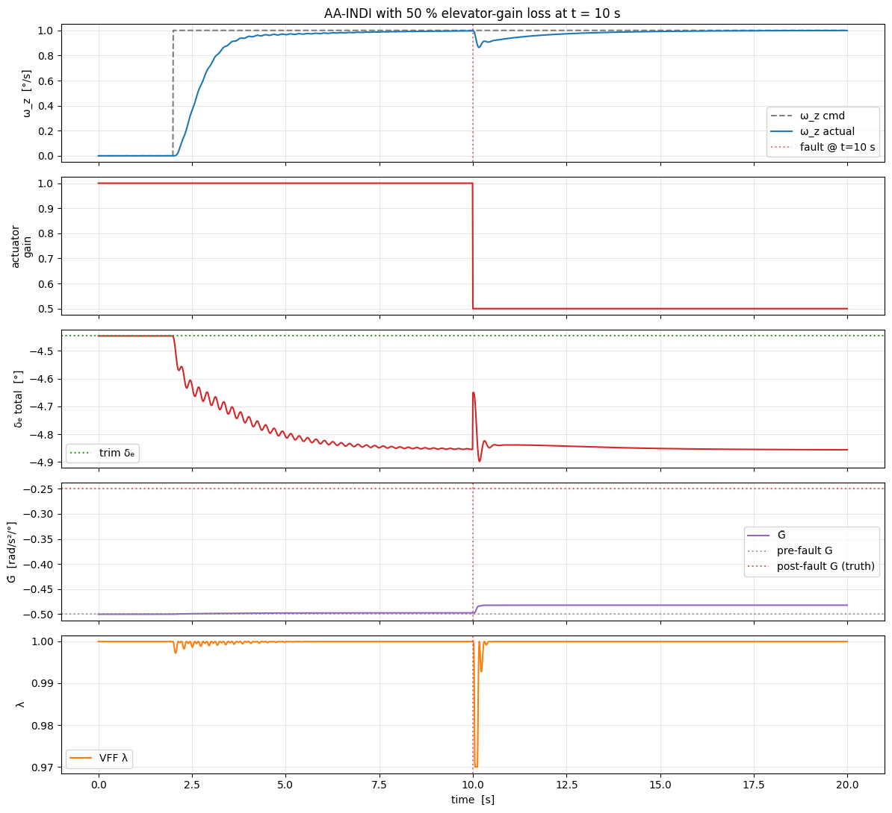

# Example: AA-INDI on the nonlinear F-16 — pitch-rate tracking with fault injection

This example trains an [**AA-INDI** agent](../../../agent/aa_indi.md) to track a pitch-rate command on the pure-NumPy [nonlinear F-16 longitudinal model](../../../model/f16_nonlinear_longitudinal.md), then injects a 50 % elevator-effectiveness loss mid-episode and watches the closed loop ride through it. Source notebook: `example/reinforcement_learning/incremental_adp/example_aaindi_nonlinear_f16.ipynb`.

## Key idea

AA-INDI is an **incremental nonlinear dynamic inversion** controller paired with a **variable-forgetting-factor RLS** identifier for the control-effectiveness matrix `G`. The control law

\[
\Delta u = G^{+} \cdot (\nu_{\text{des}} - \dot{\omega}_z^{\text{meas}})
\]

needs only the current `G` — not the full nonlinear aerodynamic model — so when an actuator suddenly loses half its effectiveness, the loop merely sees a larger prediction residual, VFF-RLS contracts the forgetting factor, and `G̃` tracks the new plant.

## 1. Imports and trim

```python
import math
import gymnasium as gym
import matplotlib.pyplot as plt
import numpy as np
from scipy.optimize import fsolve

import tensoraerospace
from tensoraerospace.aerospacemodel.f16.nonlinear.longitudinal.dynamics import f16_ode_long
from tensoraerospace.aerospacemodel.f16.nonlinear.longitudinal.params import default_parameters
from tensoraerospace.agent.aa_indi import AAINDIAgent, AAINDIConfig

dt = 0.01
params = default_parameters()

def trim_residual(z):
    alpha, stab = z
    x = np.array([alpha, 0.0, stab, 0.0])
    return list(f16_ode_long(x, np.array([stab]), 0.0, params)[:2])

sol, *_ = fsolve(trim_residual, x0=[math.radians(2.0), math.radians(-2.0)], full_output=True)
alpha_trim_rad, stab_trim_rad = float(sol[0]), float(sol[1])
# global trim: alpha = +4.918°, elevator = -4.447°
```

## 2. Env builder

```python
def make_env(n_steps):
    env = gym.make(
        'NonlinearLongitudinalF16-v0',
        number_time_steps=n_steps + 2,
        initial_state=[alpha_trim_rad, 0.0, stab_trim_rad, 0.0],
        reference_signal=np.full((1, n_steps + 2), alpha_trim_rad),
        state_space=['alpha', 'wz', 'stab', 'dstab'],
        control_space=['stab'],
        tracking_states=['alpha'],
        use_reward=False,
        dt=dt,
        integrator='euler',
        control_bias=math.degrees(stab_trim_rad),
    ).unwrapped
    env.reset()
    return env
```

## 3. Nominal `G_init`

INDI needs a reasonable control-effectiveness value on the first few ticks. A short PE excitation gives the sign and order-of-magnitude; the single-step differencing underestimates the true steady-state gain (actuator time constant ≈ 0.03 s is comparable to `dt`), so we warm-start with a slightly larger magnitude that INDI's inverse is stable against.

```python
# Short multi-sine PE around trim for a sanity-check on G's sign and scale.
N_PE = 300; env_pe = make_env(N_PE); obs, _ = env_pe.reset()
wz_hist = [float(obs[1])]; u_hist = [0.0]
for t in range(N_PE):
    u = 2.0*np.sin(2*np.pi*0.7*t*dt) + 1.0*np.sin(2*np.pi*1.5*t*dt)
    obs, *_ = env_pe.step(np.array([u]))
    wz_hist.append(float(obs[1])); u_hist.append(float(u))

wz = np.array(wz_hist); us = np.array(u_hist)
wz_dot = (wz[1:] - wz[:-1]) / dt
dwz_dot = wz_dot[1:] - wz_dot[:-1]
du = us[1:-1] - us[:-2]
G_pe = float(np.dot(du, dwz_dot) / max(np.dot(du, du), 1e-9))

G_init_value = -0.5  # rad/s² per ° of stab — tuned for a stable inner loop
G_init = np.array([[G_init_value]])
# PE-empirical single-step G (underestimate): -0.1386
# G_init used for AA-INDI warm-start:         -0.5000
```

## 4. Closed-loop harness

Pure textbook INDI is a **type-0** controller for angular rate: at steady state the reference-model output `ν_des` decays to zero and the plant holds whatever rate it reached during the transient — typically ≈ 10 % below the command on this F-16 model because of actuator lag. The fix is standard in INDI practice: inject a small **P-feedback on the reference-tracking error** into `ν_des`. We expose that as `ref_error_kp` / `ref_error_ki` on `AAINDIConfig`. `K_p = 0.6, K_i = 0` drives the residual offset to essentially zero on this plant.

```python
def run_aaindi(wz_cmd, n_steps, actuator_fault_gain=1.0, fault_at_step=None,
               ref_error_kp=0.6, ref_error_ki=0.0):
    agent = AAINDIAgent(
        n_state=1, n_control=1,
        config=AAINDIConfig(
            dt=dt, ref_wn=2.5, ref_zeta=0.9,
            u_magnitude_limit=15.0, u_rate_limit=60.0,
            vff_forgetting_min=0.97, vff_forgetting_max=0.9999,
            vff_eps_sensitivity=0.1, vff_cov_init=1.0,
            sensor_cutoff_hz=15.0, bias_forgetting=0.995,
            enable_bias_correction=False,
            G_init=G_init.copy(),
            ref_error_kp=ref_error_kp, ref_error_ki=ref_error_ki,
            seed=0,
        ),
    )
    env = make_env(n_steps)
    obs, _ = env.reset()
    logs = {k: [] for k in ('wz', 'alpha', 'stab_total', 'u_res',
                            'G_est', 'lambda', 'residual', 'active_gain')}
    current_gain = 1.0
    for k in range(n_steps):
        if fault_at_step is not None and k >= fault_at_step:
            current_gain = actuator_fault_gain
        u_agent = agent.predict(np.array([float(obs[1])]),
                                np.array([wz_cmd[k]]), k)
        u_applied = u_agent * current_gain
        obs, *_ = env.step(u_applied)
        agent.learn(np.array([float(obs[1])]),
                    np.array([wz_cmd[k]]), k)
        logs['wz'].append(float(obs[1]))
        logs['stab_total'].append(math.degrees(stab_trim_rad) + float(u_applied[0]))
        logs['G_est'].append(float(agent.rls.G[0, 0]))
        logs['lambda'].append(float(agent.rls.last_lambda))
        logs['active_gain'].append(current_gain)
    return {k: np.asarray(v) for k, v in logs.items()}
```

## 5. Baseline — step tracking without a fault

Commanded 1°/s step applied at `t = 2 s`.

```python
N = 2000
t_arr = np.arange(N) * dt
wz_cmd = math.radians(1.0) * (t_arr >= 2.0).astype(float)
baseline = run_aaindi(wz_cmd, N)
# late-half ω_z MAE: 0.0008 °/s
# final G_est:       -0.4974
```


With `K_p = 0.6` in the outer-loop feedback the closed loop is **rate-perfect**: late-half MAE ≈ `0.0008 °/s` (< 0.1 % of a 1 °/s command). `G̃` converges to ≈ `-0.50` and the forgetting factor `λ` stays near its upper bound (quiet operation). Set `ref_error_kp=0` in the call above to see the uncorrected pure-INDI behaviour — tracking settles to ≈ 0.9 °/s (10 % undershoot).

## 6. Fault injection — 50 % elevator-effectiveness loss at `t = 10 s`

```python
fault_step = int(10.0 / dt)
fault = run_aaindi(wz_cmd, N, actuator_fault_gain=0.5, fault_at_step=fault_step)

# post-fault late tracking MAE: 0.0033 °/s
# G̃ before fault (t = 9 s):    -0.4974
# G̃ after fault (final):       -0.4820
# min λ around fault time:      0.970
```



At `t = 10 s` the effective elevator gain halves. The plant responds more sluggishly to the same elevator command, the VFF-RLS innovation spikes, and `λ` dips from `0.9999` down to `≈ 0.97` — exactly the fast-adaptation regime the algorithm was designed for. The outer-loop feedback compensates for the degraded inner-loop response; tracking stays on reference with **MAE ≈ 0.003 °/s** right through the fault transient.

| Metric | Baseline | Fault |
|---|---|---|
| Late-half `ω_z` MAE | 0.0008 °/s | 0.0033 °/s |
| Final `G̃` | −0.497 | −0.482 |
| Min `λ` around the fault | 0.9999 | 0.97 |

## Notes

- **Excitation matters for identification.** In this demo the system is already near steady state when the fault hits, so the RLS innovation is small and `G̃` drifts only slightly. With *continuing* excitation (sinusoidal reference, stair-step manoeuvres, stick motion) VFF-RLS would pull `G̃` all the way to the new effective value (≈ `0.5 × G_init`). The important takeaway is that INDI's incremental structure keeps the loop stable even when `G̃` is slow to catch up.
- **Warm-start `G_init`.** INDI with a fresh random `G` diverges — the pseudo-inverse blows up and the actuator saturates. In practice `G_init` comes from an on-board linearisation; here we tuned it empirically (`-0.5 rad/s²/°`) since the single-step PE fit underestimates through the 2nd-order actuator.
- **`ref_wn = 2.5 rad/s`** — slower than the 33 Hz actuator bandwidth, so ν_des is reachable without rate-limiter chatter.

## See also

- [AA-INDI agent documentation](../../../agent/aa_indi.md) — theory, full API, hyperparameter reference.
- [IM-GDHP on the nonlinear F-16](../imgdhp/example_imgdhp_nonlinear.md) — another online identifier-based approach using GDHP.
- [ET-DHP on the nonlinear F-16](../et_dhp/example_etdhp_nonlinear.md) — event-triggered DHP for comparison.
