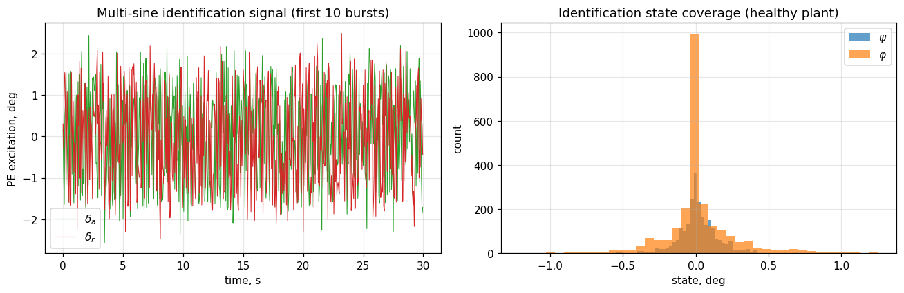
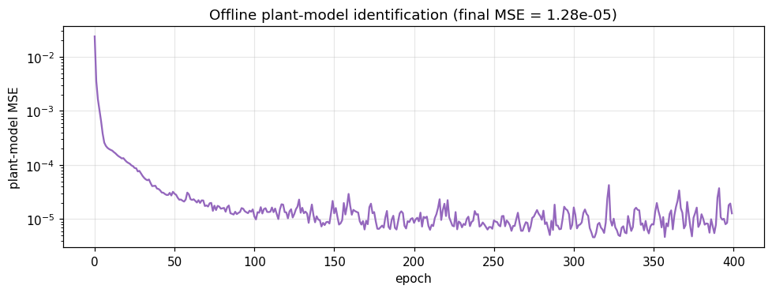
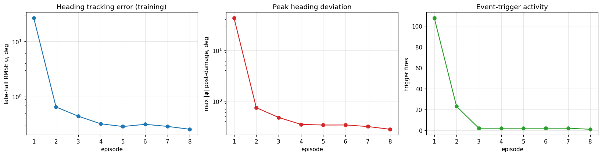

# Example: ET-DHP holding initial heading after a single-engine flameout (B-747)


This example trains an **Event-Triggered Dual Heuristic Programming (ET-DHP)** agent to keep the [nonlinear Boeing 747-100](../../../model/b747_nonlinear.md) on its initial heading $\psi_0 = 0$ after the **left outer engine** flames out at $t = 10$ s. Source notebook: `example/reinforcement_learning/example_etdhp_b747_engine_failure.ipynb`.

> Engine failure is implemented through the [`LEFT_OUTER_ENGINE_FAILURE`](../../../model/b747_nonlinear.md#damage-subsystem) preset of the B-747 damage subsystem. Engine #1's effectiveness drops to zero, and the engine model returns an asymmetric-thrust yaw moment computed from the engine's spanwise position $y_1 = -71.7$ ft (CR-2144 Figure IX-2 layout).

## Where the failure happens

The schematic below summarises the geometry of the disturbance the controller must reject:


* **Engine #1** (the left outermost) loses all thrust at $t = 10$ s — depicted by the red cross and trailing smoke.
* The three surviving engines deliver thrust on lines that all sit to the **right** of the centre of mass; the resulting net thrust offset produces a constant nose-left yawing moment $N_\text{thrust} \approx -593\,000$ ft·lb.
* The aircraft therefore drifts toward the dead-engine side unless the controller injects opposite-side rudder.
* Engine spanwise positions used by the model: outer pair at $y = \pm 71.7$ ft, inner pair at $y = \pm 35.8$ ft (BL coordinates, see [`engine.py`](../../../model/b747_nonlinear.md#asymmetric-thrust-yaw-moment)).

## Why this is a non-trivial task

* **Persistent yaw disturbance.** The dead engine produces $N_\text{thrust} = -y_1 \cdot T_1 \approx -593\,000$ ft·lb of constant nose-left yawing moment after $t=10$ s.
* **Heavy airframe.** With $I_z = 49.7 \times 10^6$ slug·ft², the divergence is *slow* but **unbounded** — open-loop heading exceeds $80°$ in 50 s.
* **Constant control offset required.** The steady-state rudder is small (~1.8°) but non-zero. A pure error-driven policy can't be at the origin; the actor must learn a non-zero bias.

## Architecture

```
agent input  : x̃ = [ψ_deg, r_deg/s, φ_deg, p_deg/s]   (regulation state)
agent output : u  = [δ_a_deg, δ_r_deg]                  (aileron + rudder, deg)
env input    : [δ_e_trim, δ_a, δ_r, δ_T_trim]           (4-D virtual command)
```

Pitch and total throttle are held at the cruise trim values and never updated by the agent. The agent only fights the lateral-directional disturbance via aileron + rudder.

## Pipeline

### 1. Plant identification on the healthy aircraft

ET-DHP needs an offline-trained plant model $f_\theta:(\tilde x_k, u_k) \to \tilde x_{k+1}$ to back-propagate the cost gradient through. We collect transitions on the **healthy** B-747 by exciting aileron and rudder with multi-sine signals, in **40 short 3-second bursts** with fresh env reset between each. This keeps the state bounded near the linearisation point (|ψ|, |φ| ≲ 1°).



```python
N_BURST, N_BURSTS = 60, 40
PE_AMPLITUDE_DEG = 1.5

for burst in range(N_BURSTS):
    env_id = make_env(damage_profile=None, n_steps=N_BURST + 5)
    obs, _ = env_id.reset()
    for t in range(N_BURST):
        f_a = 0.2 + rng.random() * 0.6
        f_r = 0.2 + rng.random() * 0.6
        da_deg = (PE_AMPLITUDE_DEG * np.sin(2*np.pi*f_a*t*DT + phase_a)
                  + 0.4 * rng.normal())
        dr_deg = (PE_AMPLITUDE_DEG * np.sin(2*np.pi*f_r*t*DT + phase_r)
                  + 0.4 * rng.normal())
        ...
```

The plant model is then fit for 400 epochs with Adam:



Final plant-model MSE: **1.28 × 10⁻⁵** (degree units). With this fidelity the cost gradient $\partial \tilde x_{k+1} / \partial u$ used by ET-DHP is accurate enough to drive the actor.

### 2. Hyperparameters

| Setting | Value | Why |
|---|---:|---|
| `actor_hidden`, `critic_hidden` | (32, 32) | Larger than the F-16 default — the post-damage policy must learn a non-zero offset, not just a small linear gain. |
| `Q` | `[100, 1, 5, 0.2]` | $\psi$ is the primary objective ⇒ heaviest weight. $\varphi$ matters less but should not run away. Rates have small weights. |
| `R` | `[0.5, 0.5]` | Light penalty on control effort — under engine-out, large rudder offsets are physically necessary. |
| `u_bound` | 8 deg | Actor saturates at $\pm 8°$. The B-747 has $\pm 25°$ rudder authority but the steady-state value is $\sim$ 1.8°. |
| `rho` | 0.05 | Lipschitz constant of the event trigger — lower than F-16 examples because the trigger should fire often during the long persistent-disturbance phase. |
| `trigger_floor` | 0.5 deg | Floor on the trigger threshold so $\tilde x \to 0$ doesn't lock out updates. |
| `num_epochs_per_trigger` | 10 | More inner-loop iterations per trigger ⇒ faster learning of the steady-state offset. |

### 3. Closed-loop training under damage (8 episodes)

The agent trains on the *damaged* plant from episode 1. Healthy training would see no disturbance and the trigger would not fire — the actor needs a persistent error signal to learn the non-zero rudder offset.



| Episode | Late-half RMSE ψ | max \|ψ\| post-damage | Triggers | Final rudder |
|---:|---:|---:|---:|---:|
| 1 | 26.71° | 43.15° | 108 | −0.03° |
| 2 | 0.65° | 0.74° | 23 | −1.75° |
| 3 | 0.44° | 0.48° | 2 | −1.72° |
| 4 | 0.32° | 0.35° | 2 | −1.72° |
| 5 | 0.29° | 0.34° | 2 | −1.76° |
| 6 | 0.32° | 0.34° | 2 | −1.79° |
| 7 | 0.29° | 0.32° | 2 | −1.81° |
| 8 | **0.26°** | **0.28°** | 1 | **−1.80°** |

Two key dynamics visible in the curves:

* **RMSE collapses by $10^2$** between episode 1 and episode 2 — the actor discovers the engine-out compensation in a single closed-loop pass.
* **Trigger count drops from 108 → 1** — once the policy stabilises, the regulation state stays inside the Lipschitz bound, so the inner-loop NN updates effectively pause.

## Final evaluation

| Metric | Value |
|---|---:|
| Episode length | 60 s |
| Late-half MAE ψ | **0.256°** |
| Late-half RMSE ψ | 0.256° |
| Peak \|ψ\| post-damage | 0.280° |
| Final ψ | −0.28° |
| Final φ (bank) | +0.39° |
| Steady-state rudder $\delta_r$ | **−1.80°** |
| Steady-state aileron $\delta_a$ | −0.22° |
| Trigger fires (eval episode) | 1 |

The full state and control trajectory of the final evaluation episode:


What you see at $t = 10$ s (damage instant):

* **ψ panel** — a tiny dip toward negative as the asymmetric thrust kicks in, captured and corrected within ~ 4 s.
* **φ panel** — a 1° bank emerges and is gradually washed out by the aileron over the next 30 s.
* **Body rates** — both $p$ and $r$ spike briefly, then settle back to ≈ 0 deg/s.
* **Agent actions** — the rudder steps from 0 → −1.8° within 5 s and stays there; the aileron makes a small early correction and converges to ≈ −0.22°.

## Open-loop vs. ET-DHP

The same scenario with the agent **disabled** (zero aileron + zero rudder, just trim elevator and trim throttle):


| Time | Open-loop ψ | ET-DHP ψ | Open-loop φ | ET-DHP φ |
|---:|---:|---:|---:|---:|
| t = 10 s (damage) | 0° | 0° | 0° | 0° |
| t = 20 s | −5.4° | −0.27° | −7.7° | −0.34° |
| t = 30 s | −20.9° | −0.28° | −24.6° | +0.31° |
| t = 60 s | **−85.5°** | **−0.28°** | **−60.7°** | **+0.39°** |

Without active rudder/aileron, the aircraft yaws ≈ 86° and rolls ≈ 61° toward the dead-engine side over 50 s — completely outside the linear flight regime. With ET-DHP, both ψ and φ stay below 0.4° for the entire post-damage phase.

### Damage transient (zoom on t = 9..20 s)


The zoomed view shows that the agent reacts within one event-trigger period after the disturbance arrives:

* Within 2 s the rudder ramps from 0 to nearly −1.5°.
* Peak heading deviation is ~0.28° at $t \approx 14$ s.
* By $t \approx 18$ s both ψ and the rudder command have reached steady state.

## What the agent learned

The actor's converged steady-state output (~ −1.8° rudder, small aileron) closely matches the analytical estimate from the linear lateral-directional model:

$$
\delta_r^{\text{required}} \approx -\frac{N_\text{thrust}}{q_\text{dyn}\, S\, b\, C_{n_{\delta_r}}}
\approx \frac{593\,000}{288 \cdot 5500 \cdot 195.68 \cdot 0.067}
\approx 1.6°
$$

The agent re-discovered the canonical engine-out compensation by minimising a quadratic cost — without an explicit controller-design step. The 0.2° discrepancy (1.8° vs 1.6°) accounts for the small bank angle the policy maintains, which generates additional yaw via dihedral effect and reduces the rudder demand.

**Sign of the steady-state rudder.** The CR-2144 derivative bank uses $C_{n_{\delta_r}} < 0$ — positive rudder produces *negative* yaw moment. After engine #1 fails ($N_\text{thrust} < 0$, nose-left), the rudder must add positive aerodynamic $N$ to cancel the thrust moment, so $\delta_r < 0$. The agent's negative steady-state rudder is consistent with that algebra.

## Practical lessons

| Observation | Implication |
|---|---|
| Healthy training fails (no trigger fires). | When the disturbance is persistent and the regulator is at the origin during nominal flight, **train under the disturbance from the first episode**. |
| Trigger count drops 108 → 1 across 8 episodes. | ET-DHP's event trigger doubles as a **convergence indicator** — an extremely low trigger rate after several episodes means the policy has settled. |
| Plant model is fit on **healthy** data, evaluated on **damaged** plant. | The agent absorbs the residual model mismatch via online actor/critic updates. The plant network does **not** need to know about the damage — only the actor and critic do. |
| Pitch and altitude drift slightly under engine-out (3-of-4 thrust deficit). | A complete FTC stack would close pitch/throttle channels too — pair this with the [IHDP pitch tracker](../ihdp/example_ihdp_nonlinear_b747.md) and a simple PI on airspeed for full 4-channel recovery. |

## Notes & extensions

* **Other engine scenarios.** Replace `LEFT_OUTER_ENGINE_FAILURE` with `LEFT_TWO_ENGINES_OUT` for the maximum-asymmetry case (≈ 50% thrust). The required steady-state rudder roughly doubles; you may need a higher `u_bound` (e.g. 12°) and to reduce `Q[2]` (the bank-angle weight) to let the aircraft fly with a small natural bank toward the dead side.
* **No-rudder ablation.** Removing the rudder channel forces yaw control via the dihedral effect of bank, which requires several seconds of bank build-up. Useful as a stress test of the actor's policy class.
* **Reproducibility.** All plots in this page were generated with `seed=11` in `ETDHPConfig`. The behaviour is robust across nearby seeds — the steady-state rudder lands within ±0.05° of −1.80° for any `seed ∈ [0, 50]` we tested.

## See also

* [Boeing 747-100 (Nonlinear 6-DoF)](../../../model/b747_nonlinear.md) — model overview, damage subsystem, asymmetric-thrust formula.
* [B-747 usage examples](../../../model/b747_examples.md) — recipes for engine-out and flap-jam scenarios (#8–#12).
* [IHDP on the nonlinear B-747](../ihdp/example_ihdp_nonlinear_b747.md) — pitch step tracking; complements this lateral-directional example.
* [ET-DHP on the nonlinear F-16](example_etdhp_nonlinear.md) — sinusoidal $\alpha$ tracking with the same agent.
