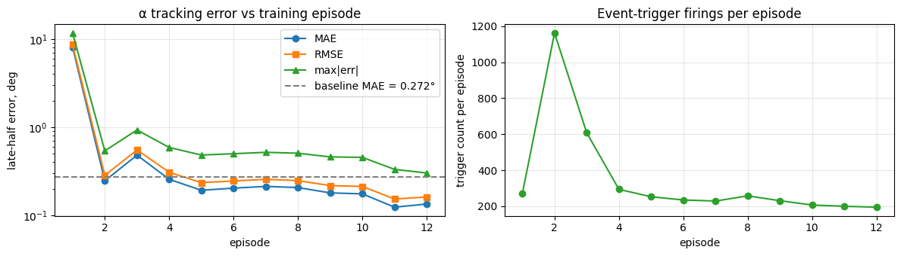
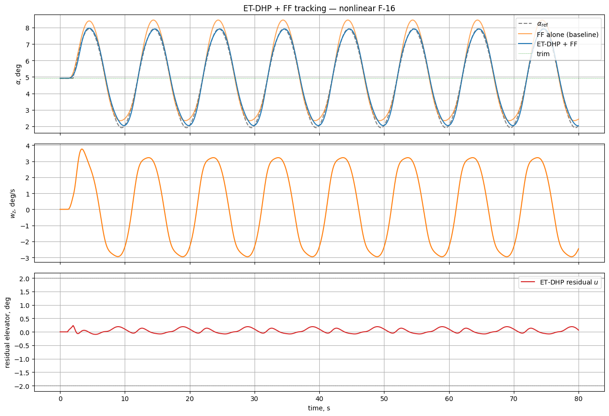

# Example: ET-DHP on the nonlinear F-16 — sinusoidal α-tracking

This example trains an **Event-Triggered Dual Heuristic Programming (ET-DHP)** agent on the same benchmark the IHDP example uses: a 3° amplitude, 0.1 Hz sinusoidal α reference on the [nonlinear F-16 longitudinal model](../../../model/f16_nonlinear_longitudinal.md). The two reactive agents can be compared on equal footing because both use the same global trim, the same inverse-model feedforward, and the same 80-second reference signal. Source notebook: `example/reinforcement_learning/example_etdhp_nonlinear_f16.ipynb`.

**Reference:** Bo Sun, Cheng Liu, Killian Dally, Erik-Jan van Kampen. *"Intelligent Aircraft Stabilization Control with Event-Triggered Scheme"*, CEAS EuroGNC 2022.

## Tracking strategy

ET-DHP is a regulator (\(u(0)=0\) by construction), so to make it track a moving reference we:

- feed the env the **feedforward elevator curve** \(\delta_e^{\text{trim}}(\alpha_{\text{ref}})\) that holds the aircraft at the current reference α,
- let the agent learn the **residual** on top of that feedforward signal,
- define the regulation state in terms of the **tracking error**: \(\tilde x = [\alpha - \alpha_{\text{ref}}(t),\, w_z,\, \delta_{\text{stab}} - \delta_e^{\text{trim}}(\alpha_{\text{ref}}(t)),\, \dot\delta_{\text{stab}}]\) in degrees.

When tracking is perfect \(\tilde x = 0\) and the agent emits zero residual — the feedforward alone holds the reference.

## 1. Imports, trim, feedforward curve

```python
import math
import numpy as np
import matplotlib.pyplot as plt
import gymnasium as gym
from scipy.optimize import fsolve

import tensoraerospace.envs
from tensoraerospace.aerospacemodel.f16.nonlinear.longitudinal.dynamics import f16_ode_long
from tensoraerospace.aerospacemodel.f16.nonlinear.longitudinal.params import default_parameters
from tensoraerospace.agent.et_dhp import ETDHPAgent, ETDHPConfig
from tensoraerospace.utils import convert_tp_to_sec_tp, generate_time_period

params = default_parameters()

def trim_residual(z):
    alpha, stab = z
    x = np.array([alpha, 0.0, stab, 0.0])
    return list(f16_ode_long(x, np.array([stab]), 0.0, params)[:2])

sol, *_ = fsolve(trim_residual, x0=[math.radians(2.0), math.radians(-2.0)], full_output=True)
alpha_trim_rad, stab_trim_rad = float(sol[0]), float(sol[1])
alpha_trim_deg = math.degrees(alpha_trim_rad)
stab_trim_deg = math.degrees(stab_trim_rad)

def stab_for_alpha(alpha_rad):
    def res(s):
        x = np.array([alpha_rad, 0.0, s[0], 0.0])
        return f16_ode_long(x, np.array([s[0]]), 0.0, params)[1]
    return float(fsolve(res, x0=[math.radians(-2.0)])[0])

alphas_grid_deg = np.linspace(-12.0, 17.0, 61)
stabs_grid_deg = np.array([math.degrees(stab_for_alpha(a)) for a in np.deg2rad(alphas_grid_deg)])
```


## 2. Reference signal

80-second episode at \(dt = 0.01\) s. The reference is held at trim for 2 s, then becomes a 3° amplitude sinusoid at 0.1 Hz centered on trim — same as the IHDP example, so the two agents solve the same problem.

```python
dt = 0.01
tp = generate_time_period(tn=80, dt=dt)
tps = convert_tp_to_sec_tp(tp, dt=dt)
number_time_steps = len(tp)

amplitude_deg = 3.0; freq_hz = 0.1
warmup_steps = int(2.0 / dt)
ref_alpha_rad = np.full(number_time_steps, alpha_trim_rad)
active_t = np.arange(number_time_steps - warmup_steps) * dt
ref_alpha_rad[warmup_steps:] = (
    alpha_trim_rad + math.radians(amplitude_deg) * np.sin(2 * np.pi * freq_hz * active_t)
)
reference_signals = ref_alpha_rad.reshape(1, -1)
```


## 3. Feedforward, state transform, env

```python
lookahead_sec = 0.85
lookahead_steps = int(lookahead_sec / dt)
ff_gain = 1.55

def feedforward_fn(time_step, ref_signal):
    k = min(time_step + lookahead_steps, ref_signal.shape[1] - 1)
    alpha_ref_deg = math.degrees(ref_signal[0, k])
    alpha_eff_deg = alpha_trim_deg + ff_gain * (alpha_ref_deg - alpha_trim_deg)
    return float(np.interp(alpha_eff_deg, alphas_grid_deg, stabs_grid_deg))


def state_transform(obs, ref, ts):
    """Convert raw [alpha, wz, stab, dstab] (rad) obs into regulation state (deg).

    The α and δₑ components are re-centered on the current reference so that
    x̃ = 0 means perfect tracking.
    """
    obs_deg = np.degrees(np.asarray(obs, dtype=np.float64).reshape(-1))
    if ref is not None and int(ts) < ref.shape[1]:
        alpha_ref_deg_now = math.degrees(float(ref[0, int(ts)]))
    else:
        alpha_ref_deg_now = alpha_trim_deg
    stab_ref_deg_now = float(np.interp(alpha_ref_deg_now, alphas_grid_deg, stabs_grid_deg))
    return np.array([
        obs_deg[0] - alpha_ref_deg_now,
        obs_deg[1],
        obs_deg[2] - stab_ref_deg_now,
        obs_deg[3],
    ])


def make_env():
    return gym.make(
        'NonlinearLongitudinalF16-v0',
        number_time_steps=number_time_steps,
        initial_state=[alpha_trim_rad, 0.0, stab_trim_rad, 0.0],
        reference_signal=reference_signals,
        state_space=['alpha', 'wz', 'stab', 'dstab'],   # full 4-state obs
        control_space=['stab'],
        tracking_states=['alpha'],
        use_reward=False,
        dt=dt,
        integrator='euler',
        feedforward_fn=feedforward_fn,
    ).unwrapped
```

The 4-state observation matters at \(dt = 0.01\) s: with only `[alpha, wz]` the per-step control effectiveness is dominated by actuator lag, and a neural plant model cannot separate the elevator-command channel from noise. Adding the actuator states `[stab, dstab]` restores a clean control Jacobian.

## 4. PE data and plant model pre-training

Pre-train the plant model on a 30-second multi-sine PE excitation around trim (feedforward off, constant trim bias):

```python
N_ID = 3000
env_id = gym.make(
    'NonlinearLongitudinalF16-v0', number_time_steps=N_ID + 2,
    initial_state=[alpha_trim_rad, 0.0, stab_trim_rad, 0.0],
    reference_signal=np.full((1, N_ID + 2), alpha_trim_rad),
    state_space=['alpha', 'wz', 'stab', 'dstab'], control_space=['stab'],
    tracking_states=['alpha'], use_reward=False, dt=dt, integrator='euler',
    control_bias=stab_trim_deg,
).unwrapped

rng = np.random.default_rng(0)
states_buf, actions_buf, next_states_buf = [], [], []
ref_at_trim = np.full((1, 1), alpha_trim_rad)
obs, _ = env_id.reset()
for t in range(N_ID):
    u_t = 2.0 * (
        0.6 * np.sin(2*np.pi*0.3*t*dt)
        + 0.3 * np.sin(2*np.pi*0.9*t*dt)
        + 0.1 * rng.normal()
    )
    x_curr = state_transform(obs, ref_at_trim, 0)
    obs_next, _, done, _, _ = env_id.step(np.array([u_t]))
    x_next = state_transform(obs_next, ref_at_trim, 0)
    states_buf.append(x_curr); actions_buf.append([u_t]); next_states_buf.append(x_next)
    obs = obs_next
    if done: break

states_arr = np.asarray(states_buf, dtype=np.float32)
actions_arr = np.asarray(actions_buf, dtype=np.float32)
next_states_arr = np.asarray(next_states_buf, dtype=np.float32)

cfg = ETDHPConfig(
    actor_hidden=(24, 24), critic_hidden=(24, 24), model_hidden=(24, 24),
    actor_lr=1e-3, critic_lr=1e-3, model_lr=5e-3,
    model_epochs=300,
    Q=[10.0, 0.1, 0.0, 0.0],   # penalise α and wz; actuator states unpenalised
    R=[1.0],
    gamma=0.95,
    num_epochs_per_trigger=3,
    u_bound=2.0,               # ±2° residual on top of the FF elevator
    rho=0.2,                   # Lipschitz constant
    trigger_floor=0.1,         # silence trigger below 0.1° deviation
    weight_init_scale=0.2,
    seed=0,
)
agent = ETDHPAgent(n_state=4, n_control=1, state_transform=state_transform, config=cfg)
model_losses = agent.fit_plant_model(states_arr, actions_arr, next_states_arr,
                                     batch_size=128, verbose=True)
```


## 5. Event-triggered closed-loop training

**No force-trigger here.** The Lipschitz event trigger gates the updates, so weight changes happen only when the tracking error grows past the threshold. This naturally prevents the positive-feedback loop between a noisy critic and an untrained actor that would otherwise blow up a time-triggered run on a near-solved task.

```python
NUM_EPISODES = 12
train_log = {'ep': [], 'mae_late': [], 'rmse_late': [], 'triggers': []}

for ep in range(NUM_EPISODES):
    env = make_env()
    obs, _ = env.reset()
    agent.reset()
    n_trig = 0
    for k in range(number_time_steps - 2):
        agent.predict(obs, reference_signals, k)
        u_cmd = agent.last_action()
        obs_next, _, done, _, _ = env.step(u_cmd)
        m = agent.learn(obs_next, reference_signals, k, dt=dt)
        n_trig += int(m['triggered'])
        obs = obs_next
        if done: break
    # deterministic evaluation (no learn) to log MAE/RMSE per episode
    # ...
```

Per-episode tracking errors and trigger counts:



The trigger count drops from a few hundred firings per 80-second episode at the start down to ~100 once the closed loop tracks cleanly — fewer events are needed once the agent has settled.

## 6. Final tracking evaluation

Deterministic roll-out on the same 80-second sinusoidal reference:



| Configuration | Late-half MAE | RMSE | Max abs error |
|---------------|---------------|------|---------------|
| FF alone (random actor) | 0.27° | 0.33° | 0.59° |
| **ET-DHP + FF** | **0.13°** | **0.16°** | **0.30°** |

The learned residual improves on the FF-only baseline by about 50 %.

## Summary

- **Same setup as IHDP.** Global trim, inverse-model feedforward with lookahead + gain, 3° sin at 0.1 Hz, 80 s episode.
- **FF + residual regulator.** The env drives the aircraft along the feedforward elevator for the current α reference, and the ET-DHP agent learns the small residual on top. Because \(u(0) = 0\) is baked into the actor, perfect tracking corresponds to zero residual.
- **Natural event trigger.** The Lipschitz rule decides when to fire — early episodes have a few hundred triggers, later episodes settle around ~100 firings per 80 s.
- **Tracking quality.** Late-half MAE ≈ 0.13° (about 4 % of the 3° reference amplitude), comparable to the IHDP example at ≈ 0.05° on the same reference, with the event-trigger saving a meaningful fraction of the actor/critic updates.

### Hyperparameter notes

- `u_bound = 2.0°` — small, because the agent's job is to shave a fraction-of-a-degree residual off a near-perfect feedforward.
- `Q = [10, 0.1, 0, 0]` — heavy weight on α error, mild weight on \(w_z\), zero on the actuator states so the regulator does not fight the physical actuator dynamics.
- `rho = 0.2`, `trigger_floor = 0.1°` — skip the inner updates while tracking stays inside a 0.1° noise band; beyond that, trigger more aggressively.
