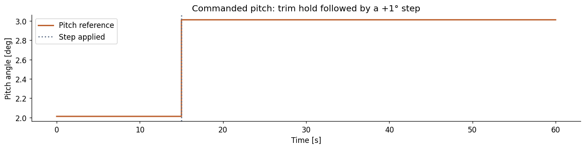
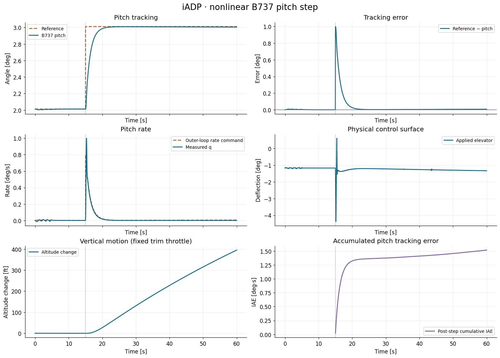
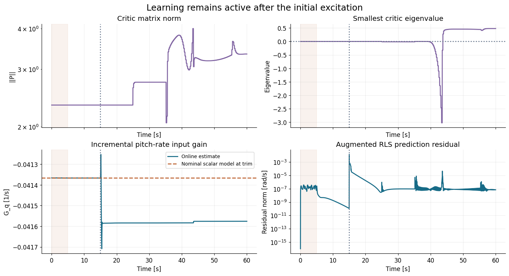
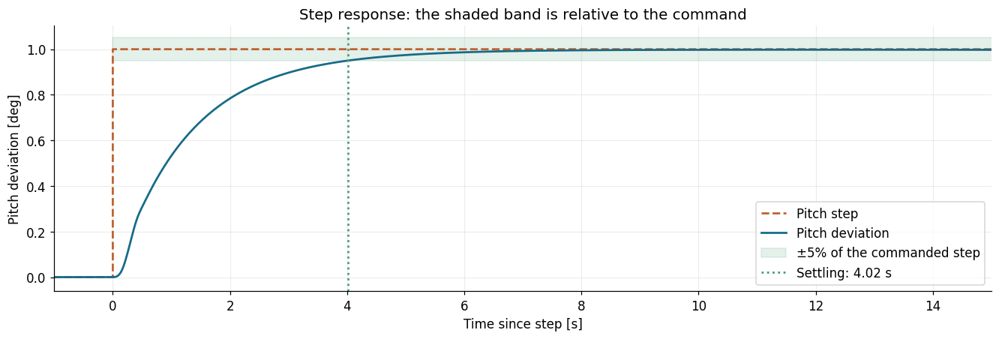
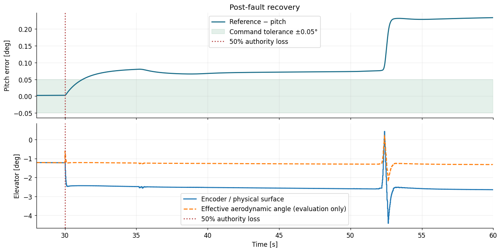
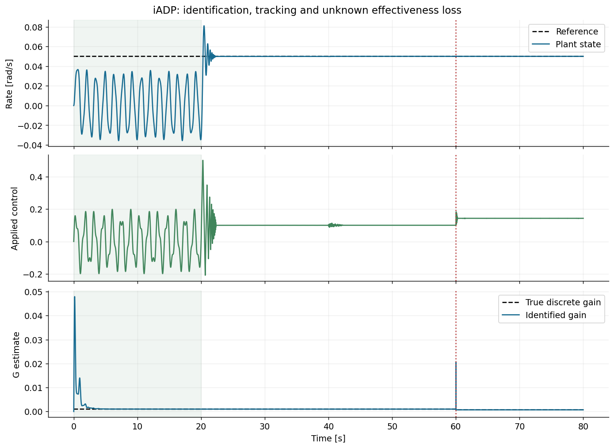

# Example: iADP on nonlinear B737 — pitch tracking, online adaptation and faults

This walkthrough initializes the incremental model and quadratic critic, runs
continuous iADP learning on a nonlinear aircraft, and evaluates both the pitch
step and an unknown loss of elevator authority. It shows every control-loop
operation and reports the residual tracking error as well as the learning diagnostics.

**Executed notebooks:** [healthy B737](https://github.com/TensorAeroSpace/TensorAeroSpace/blob/develop/example/reinforcement_learning/incremental_adp/example_iadp_nonlinear_b737.ipynb) · [B737 with elevator fault](https://github.com/TensorAeroSpace/TensorAeroSpace/blob/develop/example/reinforcement_learning/incremental_adp/example_iadp_fault_b737.ipynb).

The [iADP algorithm page](../../../agent/iadp.md) documents the current
implementation and its source papers. This is aircraft-specific tuning with a
nominal-model initialization; it does not reproduce the published flight tests.

The complete example below uses the public `tensoraerospace` API. Run its Python
blocks in order in a notebook or Python session with this revision installed.
In Jupyter, `%matplotlib inline` may be added to the first cell. The code imports
models, agents and benchmarks directly from the library; no adjacent example
module or `sys.path` modification is needed.

| Setting | Value |
|---|---|
| Aircraft | Nonlinear, 12-state B737 with B737-800 geometry/inertia |
| Cruise condition | 20,000 ft, 650 ft/s |
| Duration / control interval | 60 s / 0.02 s; 3,000 transitions |
| Integrator | RK4 |
| Pitch command | Trim until 15 s, then trim +1° |
| Outer pitch-to-rate gain | 0.8 s⁻¹; rate command limited to ±3°/s |
| Other controls | Aileron/rudder zero; throttle fixed at trim |
| Optional fault | 50% elevator aerodynamic effectiveness from 30 s |

The command, measured pitch and accumulated error are all displayed. Set
`USE_ELEVATOR_FAULT = False` for the healthy run; set it to `True` and rerun **all
blocks with a fresh environment and agent** for the fault case. The schedule is
passed only to the model, and adaptation stays active throughout.

The outer loop is

\[
q_{\mathrm{ref},k}=\operatorname{clip}
\left[0.8(\theta_{\mathrm{trim}}+\Delta\theta_{\mathrm{ref},k}-\theta_k),
-3^\circ/\mathrm{s},\;3^\circ/\mathrm{s}\right].
\]

It supplies the inner controller's reference. It does not separately control
altitude or airspeed.

### Imports and experiment selection


```python
import numpy as np
import pandas as pd
import matplotlib.pyplot as plt
from IPython.display import display
from tensoraerospace.benchmark import B737PitchStepBenchmark, ControlBenchmark
from tensoraerospace.agent.aa_indi import AircraftGeometry, FlightMeasurement
from tensoraerospace.aerospacemodel.b737.nonlinear import ElevatorEffectiveness

plt.rcParams.update(
    {
        "figure.dpi": 110,
        "font.size": 11,
        "axes.titlesize": 13,
        "axes.spines.top": False,
        "axes.spines.right": False,
        "lines.linewidth": 1.8,
        "savefig.bbox": "tight",
    }
)

USE_ELEVATOR_FAULT = False
fault = (
    ElevatorEffectiveness(time=30.0, effectiveness=0.5) if USE_ELEVATOR_FAULT else None
)
```

## 1. Trim, reference and nonlinear environment

The scenario follows [the IHDP B737 example](https://github.com/TensorAeroSpace/TensorAeroSpace/blob/develop/example/reinforcement_learning/incremental_adp/example_ihdp_nonlinear_b737.ipynb):
B737-800 configuration, 20,000 ft, 650 ft/s, 60 s, RK4 at 50 Hz, and a +1° pitch step at 15 s.
The initial 15 s are included in every full-flight plot. The step reference is shown explicitly.

The 12 states are body velocities `[u,v,w]` (ft/s), body rates `[p,q,r]` (rad/s),
Euler angles `[roll,pitch,yaw]` (rad), and NED position `[x,y,z]` (ft).
Virtual actions are **physical radians** `[elevator, aileron, rudder, throttle]`;
throttle is dimensionless. Aileron/rudder stay zero and throttle stays at trim.
These examples add a pitch-to-rate outer loop; its gain is separate from the adaptive inner loop.

This B737 runtime applies clipped surfaces with zero-order hold and has **no servo lag**.
Command slew limits below belong to the controllers. The B737-800 option scales geometry
and inertia while reusing the model's B737-100 aerodynamic tables. It is a simplified
cruise simulation, not a validated B737NG flight-test model.

```python
experiment = B737PitchStepBenchmark(
    elevator_fault=fault, duration=60.0, dt=0.02, step_time=15.0, step_deg=1.0
)
env, trim_result, trim_action = experiment.make_env()
state, _ = env.reset(seed=experiment.seed)
params = env.unwrapped.model.param
theta_trim = trim_result.alpha_rad
reference = experiment.reference
OUTER_PITCH_GAIN = 0.8  # q_ref = gain * (theta_ref - theta), clipped to ±3 deg/s

print(f"Trim residual: {trim_result.residual:.3e}")
print(
    f"Pitch: {np.rad2deg(theta_trim):.4f} deg; "
    f"elevator: {np.rad2deg(trim_action[0]):.4f} deg; "
    f"throttle: {trim_action[3]:.4f}"
)
print(
    f"{experiment.steps} transitions; {experiment.steps + 1} state samples; "
    f"final time {experiment.time[-1]:.1f} s"
)
experiment.plot_reference(theta_trim)
plt.show()
```



## 2. Configure the adaptive rate controller

The incremental identifier fits
\(\Delta X_{k+1}\approx F\Delta X_k+G\Delta u_k\), where
\(X=[q,q_{\mathrm{ref}}]^T\). A quadratic critic represents
\(V(X)=X^TPX\). Given the current model and critic, policy improvement solves

\[
(R+\gamma G^TPG)\Delta u_k=
-\left[Ru_{k-1}+\gamma G^TPX_k+\gamma G^TPF\Delta X_k\right].
\]

The requested residual is the preceding actual residual plus this increment,
subject to magnitude and slew limits. `learn` identifies the measured transition
and collects the information used by the next critic fit. The code below calls
these SDK operations directly.

The iADP observation is `q` and its reference is the outer-loop command `q_ref`.
Control is **elevator deviation from trim in radians**; the environment receives trim plus
that deviation. The cost weights rate error and residual elevator: `q_error² + R*u_residual²`.
A one-state rate model omits angle-of-attack and speed dynamics; the full plant still integrates all 12 states.

We compute nominal `a = ∂q_dot/∂q`, `b = ∂q_dot/∂elevator` **once at trim**, initialize
`F` and `G` with the exact discretization of that scalar local model, and initialize the
quadratic critic with a discounted Riccati solution for `[q, q_ref]`.

Settings chosen for this example: `gamma=0.2`, `R=0.001`, 5 s of small open-loop
multisine excitation, a 20 s critic window and 5 Hz critic fitting. These differ from the
paper's experiment settings. The first fit occurs after a full closed-loop window, around
25 s. RLS and critic updates then continue throughout the episode. There is no blending,
regularization or positive-eigenvalue projection of the learned critic.

```python
from scipy.linalg import solve_discrete_are
from tensoraerospace.agent.iadp import IADPAgent, IADPConfig

A_cont, B_cont = env.model.linearize(state, trim_action)
a, b = A_cont[4, 4], B_cont[4, 0]
A = np.diag([np.exp(a * experiment.dt), 1.0])
B = np.array([[b * np.expm1(a * experiment.dt) / a], [0.0]])
gamma = 0.2
R = np.array([[0.001]])
Q_augmented = np.array([[1.0, -1.0], [-1.0, 1.0]])
P_initial = solve_discrete_are(np.sqrt(gamma) * A, np.sqrt(gamma) * B, Q_augmented, R)
excitation_time = np.arange(round(5.0 / experiment.dt)) * experiment.dt
excitation = (
    np.deg2rad(0.02)
    * (
        np.sin(2 * np.pi * 0.8 * excitation_time)
        + 0.5 * np.sin(2 * np.pi * 1.7 * excitation_time)
    )[:, None]
)
agent = IADPAgent(
    1,
    1,
    IADPConfig(
        dt=experiment.dt,
        Q=np.eye(1),
        R=R,
        gamma=gamma,
        gamma_rls=0.999,
        phi_init=1e3,
        F_init=A,
        G_init=B,
        P_init=P_initial,
        learning_mode="continuous",
        model_learning_only_steps=len(excitation),
        excitation_signal=excitation,
        policy_eval_window=round(20.0 / experiment.dt),
        policy_eval_min_samples=round(20.0 / experiment.dt),
        policy_eval_every=round(0.2 / experiment.dt),
        u_magnitude_limit=np.deg2rad(4.0),
        u_rate_limit=np.deg2rad(20.0),
    ),
)
print(f"Nominal q damping: {a:.6f} 1/s; elevator effectiveness: {b:.6f} 1/s²")
print(
    f"Initial discrete G_q: {B[0, 0]:.6f}; initial ||P||: {np.linalg.norm(P_initial):.6f}"
)
```

## 3. Run all 3,000 plant transitions

The next rate reference is computed from the **next measured pitch** and the scheduled
pitch command, then supplied to `learn`. The applied elevator is read from the plant's
input history and converted back to the same trim-relative coordinate used by `predict`.
This keeps the critic cost and incremental identification consistent with the actual input.
A flight-envelope or horizon violation raises an error rather than scoring an incomplete run.

```python
states, actions, rate_commands, learning = [state.copy()], [], [], []
critic_changes = 0
try:
    for k in range(experiment.steps):
        q_ref = float(
            np.clip(
                OUTER_PITCH_GAIN * (theta_trim + reference[k] - state[7]),
                -np.deg2rad(3.0),
                np.deg2rad(3.0),
            )
        )
        residual = agent.predict(state[4:5], np.array([q_ref]))
        action = trim_action.copy()
        action[0] += residual[0]
        action = np.clip(action, env.action_space.low, env.action_space.high)
        next_state, _, terminated, truncated, _ = env.step(action)
        applied = env.model.applied_action
        experiment.validate_transition(next_state, terminated, truncated, k)
        next_q_ref = float(
            np.clip(
                OUTER_PITCH_GAIN * (theta_trim + reference[k + 1] - next_state[7]),
                -np.deg2rad(3.0),
                np.deg2rad(3.0),
            )
        )
        previous_P = agent.P.copy()
        diagnostics = agent.learn(
            next_state[4:5],
            np.array([[q_ref, next_q_ref]]),
            applied_action=applied[:1] - trim_action[:1],
        )
        critic_changes += int(not np.array_equal(previous_P, agent.P))
        learning.append(
            [
                np.linalg.norm(agent.P),
                np.linalg.eigvalsh(agent.P).min(),
                agent.G[0, 0],
                diagnostics["rls_pred_error_norm"],
            ]
        )
        states.append(next_state.copy())
        actions.append(applied)
        rate_commands.append(q_ref)
        state = next_state
finally:
    env.close()
states, actions, rate_commands, learning = map(
    np.asarray, (states, actions, rate_commands, learning)
)
assert np.isfinite(learning).all()
assert agent.rls.num_updates == experiment.steps - 1
assert critic_changes > 0
print(
    f"Completed {experiment.duration:.1f} s; RLS updates: {agent.rls.num_updates}; "
    f"critic matrix changes: {critic_changes}; final phase: {agent.phase}"
)
```

## 4. Tracking, accumulated error and online learning

Both pitch and rate references are drawn explicitly. The cumulative error starts at the
pitch step and uses degrees × seconds. The nominal discrete `G_q` is shown only as a
trim reference, not as the true effectiveness along the changing trajectory.
The critic's smallest eigenvalue is logged without modifying it.

```python
experiment.plot_response(
    states, actions, rate_commands, "iADP · nonlinear B737 pitch step"
)
plt.show()

fig, axes = plt.subplots(2, 2, figsize=(13, 7), sharex=True, constrained_layout=True)
axes[0, 0].semilogy(experiment.time[1:], learning[:, 0], color="#8064a2")
axes[0, 0].set(title="Critic matrix norm", ylabel="||P||")
axes[0, 1].plot(experiment.time[1:], learning[:, 1], color="#8064a2")
axes[0, 1].axhline(0, color="#64748b", linestyle=":")
axes[0, 1].set(title="Smallest critic eigenvalue", ylabel="Eigenvalue")
axes[1, 0].plot(
    experiment.time[1:], learning[:, 2], label="Online estimate", color="#176b87"
)
axes[1, 0].axhline(
    B[0, 0], label="Nominal scalar model at trim", color="#bd6230", linestyle="--"
)
axes[1, 0].set(title="Incremental pitch-rate input gain", ylabel="G_q [1/s]")
axes[1, 0].legend(fontsize=9)
axes[1, 1].semilogy(
    experiment.time[1:], np.maximum(learning[:, 3], 1e-16), color="#176b87"
)
axes[1, 1].set(
    title="Augmented RLS prediction residual", ylabel="Residual norm [rad/s]"
)
for axis in axes.ravel():
    axis.axvspan(0, 5, alpha=0.08, color="#bd6230")
    axis.axvline(experiment.step_time, color="#64748b", linestyle=":")
    axis.set_xlabel("Time [s]")
    axis.grid(alpha=0.22)
fig.suptitle("Learning remains active after the initial excitation", fontsize=16)
plt.show()
```





## 5. Step-response assessment with `ControlBenchmark`

`experiment.evaluate` calls `ControlBenchmark.benchmarking_step_response` with
**pitch deviations in radians**, a zero pre-step baseline, and one second of pre-step data.
It refuses partial or non-finite trajectories. The table converts angle-based metrics to degrees.
Two windows distinguish the initial transient from later adaptation: the first 15 s after
the step, and the complete 45 s post-step interval.

The benchmark computes overshoot and its ±5% settling band relative to the **estimated
final output**, not the requested pitch. We report those native metrics unchanged and
add separately labelled overshoot/settling metrics relative to the **command**. Settling
requires staying in the corresponding band for the rest of the selected window.
The shaded plot uses the command band. Rise time is the **10–90% duration relative to
the estimated final output**, not a timestamp or a test of reaching the command.
Static error uses the benchmark's steady tail; the separate final error is a single sample.
IAE sums absolute pitch error times `dt` using the benchmark's rectangle rule; the
cumulative plot uses the same convention. ISE integrates squared error; ITAE additionally
weights elapsed time after the step. Rate-loop error is not added to angle error because their units differ.

```python
windows, physical_metrics = experiment.evaluate(states, actions)
display(
    experiment.metric_table(windows).style.format(precision=5, na_rep="Not reached")
)
display(
    pd.Series(physical_metrics, name="Measured result")
    .to_frame()
    .style.format(precision=6)
)
experiment.plot_step(states, windows)
plt.show()
```



## 6. Interpretation

The executed healthy configuration produces the following results:

| Metric | Healthy B737, 60 s |
|---|---:|
| Post-step pitch RMSE, 15–60 s | 0.125508° |
| Final command error | +0.006817° |
| Settling relative to command, ±5% | 4.02 s |
| Altitude change | +395.465 ft |
| Airspeed change | −18.733 ft/s |

The complete post-step RMSE includes the initial one-degree tracking transient;
it measures a different interval from the post-fault metrics below.

All curves and tables above are generated by the saved run. A full finite episode and
small tracking error support this **selected ideal-sensor, 60 s test only**; they do not
establish global stability or fault tolerance. The default run has no fault; both modes keep learning active.
The altitude increase and airspeed reduction are expected with a sustained nose-up command
and fixed throttle: this experiment controls pitch, not altitude or speed.

The public `tensoraerospace` API supplies model analysis, measurements and
benchmark metrics. This notebook only defines the application reference, agent
configuration and control loop; it does not depend on sibling examples.


## 7. Repeat with 50% elevator-authority loss

Set `USE_ELEVATOR_FAULT = True` in the first block and repeat the complete run.
`ElevatorEffectiveness(time=30, effectiveness=0.5)` scales the elevator angle
seen by the B737 aerodynamic tables, consistently changing force and pitching
moment. The encoder still reports the physical surface angle. At a fault inside
an integration step, the native model splits integration at the event time.
There is no state jump or hidden change to the controller's nominal prior.

Assess the fault separately from the pitch step. The code below selects
**(30, 60] s**, whereas the preceding step metrics start at 15 s. Recovery means
remaining within ±0.05° of the pitch command for the rest of the fault window.
`None` means this criterion was not reached.

```python
if USE_ELEVATOR_FAULT:
    fault_metrics = ControlBenchmark().tracking_metrics(
        np.rad2deg(reference),
        np.rad2deg(states[:, 7] - theta_trim),
        experiment.dt,
        start=fault.time,
        tolerance=0.05,
    )
    print("Post-fault RMSE [deg]:", fault_metrics["combined_rmse"])
    print("Post-fault IAE [deg·s]:", fault_metrics["iae"])
    print("Final command error [deg]:", fault_metrics["final_error"][0])
    print("Recovery to ±0.05° [s]:", fault_metrics["recovery_time"])
```


In the saved fault run, iADP completes all 3,000 transitions and performs
2,999 incremental RLS updates; the first transition has no previous state increment.
The critic changes 176 times. Post-fault pitch RMSE is **0.129777°**, peak error
**0.233743°**, and final command error **+0.233743°**. Recovery within ±0.05° is
not reached. The trajectory remains inside this example's envelope, but that is
a different criterion from accurate command tracking.

The state supplied to iADP contains pitch rate only. The outer angle loop and
residual-control penalty do not guarantee zero pitch offset under an unmodeled
change. The example retains this outcome and continuous learning; no event-time
reset or frozen critic is used to improve the displayed trace.



## 8. Known-model verification with the paper timing

For a simpler identification check, the [80-second iADP notebook](https://github.com/TensorAeroSpace/TensorAeroSpace/blob/develop/example/reinforcement_learning/incremental_adp/example_iadp_paper.ipynb) uses

\[
\dot x=-2x+\eta u,\qquad
x_{k+1}=a x_k+\eta b u_k,\qquad
a=e^{-2\Delta t},\quad b=(1-a)/2.
\]

The plant coefficient changes from 1 to 0.7 at 60 s. The reference is 0.05, and
neither the model learner nor the critic receives the event schedule. This
analytic plant is an algebraic check, not an aircraft flight-test reproduction.

| Setting | Scalar verification |
|---|---|
| Control period | 0.001 s |
| Initial identification | 20 s of multisine excitation |
| Critic | Full 20 s window; 20 Hz fitting |
| Learning | Continuous RLS and critic updates |
| Weights / discount | `Q=100`, `R=0.0001`, `gamma=0.95` |
| Additional excitation | Cyclic 0.015-amplitude, 0.7 Hz sinusoid |

Open the [complete iADP notebook](https://github.com/TensorAeroSpace/TensorAeroSpace/blob/develop/example/reinforcement_learning/incremental_adp/example_iadp_paper.ipynb)
and execute the cells in order. It constructs `IADPConfig.paper` and `IADPAgent`,
shows every plant transition and `learn` call, then uses `ControlBenchmark` and
Matplotlib for the metrics and plots. The [agent guide](../../../agent/iadp.md)
also contains the full executable Python block.

The saved run reports the following values:

| Metric | Result |
|---|---:|
| Tracking RMSE, nominal window [40, 60) s | 2.7621 × 10⁻⁵ |
| Tracking RMSE, faulty window [65, 80) s | 1.1528 × 10⁻⁵ |
| Final identified discrete input gain | 0.000699300466138 |
| True final discrete input gain | 0.000699300466433 |
| RLS updates | 79,999 |
| Critic window length | 20,000 transitions |



The critic uses the unregularized least-squares update. There is no ridge term,
positive-semidefinite projection or blending of old/new critics. The B737 example
uses this same update law with its own timings and nominal Riccati initialization;
the scalar verification's performance does not transfer automatically to B737 or F-16.

## 9. F-16 SDK example and practical checks

For fault semantics, long-horizon completion and measured-servo feedback, follow
[the detailed F-16 fault example](example_iadp_small_fault_f16.md). Its current
integral tuning fails before the scheduled fault; historical results obtained
with the removed softened critic are not current results.

| Symptom | Check |
|---|---|
| Near-zero control throughout initialization | Excitation, the sign/scale of `G_init`, and model/critic initialization. |
| Sudden command jumps at critic fits | Feature scales, rank of the transition window and actuator authority; inspect the unmodified `P`. |
| Identifier sees the wrong input | Feed back the actual elevator minus trim, in radians for this B737 case. |
| Wrong cost or output dimensions | `Q` weights tracked outputs; `R` weights control; the reference is part of the augmented state. |
| Finite simulation but persistent pitch error | Examine the reduced rate model, outer-loop reference and command-relative metrics. |
| Early termination | Keep the completion/failure result; do not score it as the requested full horizon. |

- [iADP update equations and API](../../../agent/iadp.md).
- [Benchmark metrics and aircraft protocols](../../../benchmark/bench.md).
- [AA-INDI on the same nonlinear B737](../aa_indi/example_aaindi_nonlinear.md).
- [Cookbook: continuous adaptive learning and diagnostics](../../../cookbook/06_online_adaptive.md).
