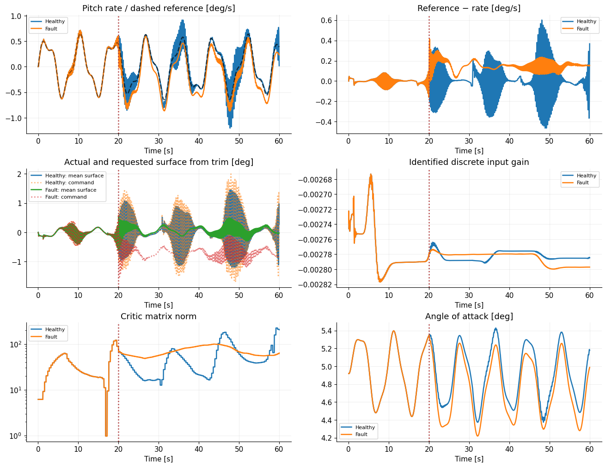
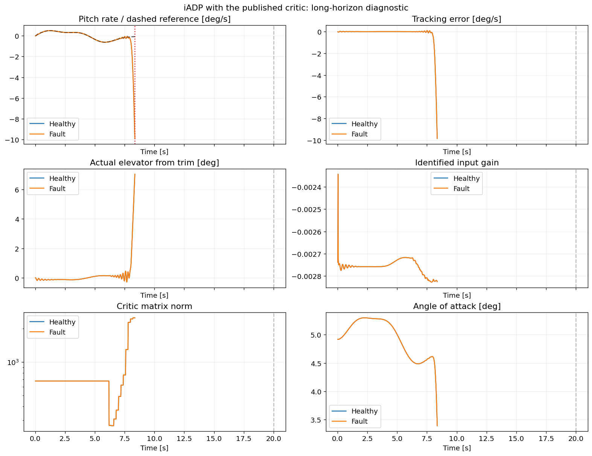

# Example: iADP on nonlinear F-16 — actuator faults and long-horizon diagnostics

This example explains how an actuator fault enters the nonlinear longitudinal
F-16, how to return measured servo position to iADP, and how to assess a run
without confusing a short finite response with successful long-term adaptation.
The controller uses the current unregularized critic and keeps learning online.

**Executed notebooks:**
[command-gain loss](https://github.com/TensorAeroSpace/TensorAeroSpace/blob/develop/example/reinforcement_learning/incremental_adp/example_iadp_small_fault_f16.ipynb)
· [aerodynamic effectiveness loss](https://github.com/TensorAeroSpace/TensorAeroSpace/blob/develop/example/reinforcement_learning/incremental_adp/example_iadp_aero_effectiveness_f16.ipynb).

The notebooks request 500 s with integral-augmented iADP. Their saved runs leave
the demonstration envelope after **8.36 s**, before either fault. The complete
60 s SDK example below uses the simpler scalar rate controller and reports its
own completion status. These are different controller configurations; results
from one must not be substituted for the other.

## 1. Distinguish the two physical faults

| Property | Servo command-gain loss | Aerodynamic effectiveness loss |
|---|---|---|
| Fault location | Input to the native stabilator servo | Surface-dependent force/moment terms |
| Example severity | 15% loss at 20 s | 30% loss at 137 s |
| Balance command affected? | Yes: gain acts on the total command, including trim | The force/moment contribution of the actual trim surface is reduced |
| Servo equations | Native servo responds to the attenuated command | Native servo equations unchanged |
| Encoder | Reports actual surface position | Reports actual surface position |
| Implementation | SDK `DamageEvent` / `DamageProfile` | Experimental aerodynamic variant linked below |

For a command-gain fault, the servo target is

\[
\delta_{\mathrm{target}}=\eta
\left(\delta_{\mathrm{trim}}+u_{\mathrm{residual}}\right).
\]

Scaling only the residual would preserve the trim command and define a different
experiment. In the one-channel longitudinal F-16, `stab_left` and `stab_right`
refer to the same collective channel. Use **one** event: applying the loss twice
would square its gain. This reduced model cannot represent the rolling moment
of a left-only stabilator failure.

The aerodynamic variant instead uses, for each coefficient \(C\in\{C_y,C_m\}\),

\[
C_{\mathrm{fault}}(\delta)=C(0)+\eta\,[C(\delta)-C(0)].
\]

It preserves the zero-surface contribution and native servo dynamics. This is a
parametric effectiveness experiment, not a calibrated structural-damage model.
Its [source application](https://github.com/TensorAeroSpace/TensorAeroSpace/blob/develop/example/reinforcement_learning/incremental_adp/example_iadp_aero_effectiveness_f16.py)
implements that experimental RHS; it is not a general SDK damage option. The
runnable code below uses the native command-gain fault.

## 2. Find the healthy equilibrium and initialize iADP

Run the following Python blocks in order with this revision of `tensoraerospace`
installed. The state is `[alpha, q, stabilator, stabilator_rate]`. Model angles
are **radians**, while the environment's residual stabilator command is in
**degrees**. The iADP state `q` is rad/s and its control is degrees from trim.
Those units determine the input derivative and the cost weights.

The scalar controller omits angle-of-attack and servo states; the plant still
integrates all four states. Its nominal model and Riccati initialization use the
healthy aircraft only, before either trajectory is simulated.

```python
import copy
import numpy as np
import pandas as pd
import matplotlib.pyplot as plt
from scipy.optimize import root
from scipy.linalg import solve_discrete_are

from tensoraerospace.aerospacemodel.f16.nonlinear.damage import (
    DamageEvent,
    DamageProfile,
)
from tensoraerospace.aerospacemodel.f16.nonlinear.longitudinal.dynamics import (
    f16_ode_long,
)
from tensoraerospace.aerospacemodel.f16.nonlinear.longitudinal.params import (
    default_parameters,
)
from tensoraerospace.envs.f16.nonlinear_longitudinal import NonlinearLongitudinalF16
from tensoraerospace.agent.iadp import IADPAgent, IADPConfig
from tensoraerospace.benchmark import ControlBenchmark

dt, duration, fault_time, loss = 0.02, 60.0, 20.0, 0.15
steps = round(duration / dt)
time = np.arange(steps + 1) * dt
reference = np.deg2rad(
    0.5 * np.sin(2 * np.pi * 0.12 * time) + 0.15 * np.sin(2 * np.pi * 0.31 * time)
)[None, :]
params = default_parameters()
solution = root(
    lambda z: f16_ode_long([z[0], 0.0, z[1], 0.0], [z[1]], 0.0, params)[:2],
    np.deg2rad([2.0, -2.0]),
)
if not solution.success or np.max(np.abs(solution.fun)) > 1e-10:
    raise RuntimeError(f"Trim did not converge: {solution.message}")
alpha_trim, surface_trim = solution.x
initial = np.array([alpha_trim, 0.0, surface_trim, 0.0])

# Local derivatives with respect to pitch rate and physical stabilator angle.
derivatives = []
for index in (1, 2):
    delta = np.eye(4)[index] * 1e-5
    plus = f16_ode_long(initial + delta, [surface_trim], 0.0, params)[1]
    minus = f16_ode_long(initial - delta, [surface_trim], 0.0, params)[1]
    derivatives.append((plus - minus) / 2e-5)
gain_per_degree = derivatives[1] * np.pi / 180
F = np.diag([1 + dt * derivatives[0], 1.0])
G = np.array([[dt * gain_per_degree], [0.0]])
R = np.array([[(abs(gain_per_degree) / 20) ** 2]])
gamma = 0.99
P = solve_discrete_are(
    np.sqrt(gamma) * F,
    np.sqrt(gamma) * G,
    np.array([[1.0, -1.0], [-1.0, 1.0]]),
    R,
)
config = IADPConfig(
    dt=dt,
    Q=np.eye(1),
    R=R,
    gamma=gamma,
    F_init=F,
    G_init=G,
    P_init=P,
    gamma_rls=0.9995,
    phi_init=1e3,
    policy_eval_window=300,
    policy_eval_every=20,
    policy_eval_warmup_updates=40,
    learning_mode="continuous",
    u_magnitude_limit=10.0,
    u_rate_limit=60.0,
)
print("Trim alpha / stabilator [deg]:", np.rad2deg(solution.x))
print("Trim residual:", solution.fun)
```

The controller limits are ±10° of residual command and 60°/s of command slew.
They do not replace the plant's own limits on actual servo angle and velocity.
A nominal prior is explicit model knowledge; this is not a model-free
initialization or a reproduction of the paper's full-state aircraft controller.

## 3. Run independent healthy and faulty aircraft

Both runs start from the same trim and fresh agent. Only the environment receives
the fault schedule. Each transition follows `predict → env.step → learn`, with
continuous model and critic updates even after the fault.

For a moving servo, the requested command differs from the surface that acted on
the aircraft during the interval. The feedback below approximates mean surface
position with the trapezoidal mean of its endpoints, converts it to degrees, and
subtracts the same trim used by the controller. With refined integration, use a
composite average across the substeps while retaining the 0.02 s control period.

```python
runs = {}
for label, failed in (("Healthy", False), ("Fault", True)):
    events = (
        [
            DamageEvent(
                trigger_time=fault_time,
                event_type="control_failure",
                payload={
                    "surface": "stab_left",
                    "mode": "efficiency_loss",
                    "efficiency": 1.0 - loss,
                },
                label="collective_stabilator_command_gain_loss",
            )
        ]
        if failed
        else []
    )
    env = NonlinearLongitudinalF16(
        initial_state=initial.copy(),
        reference_signal=reference,
        number_time_steps=steps + 1,
        state_space=["alpha", "wz", "stab", "dstab"],
        control_space=["stab"],
        tracking_states=["wz"],
        use_reward=False,
        dt=dt,
        integrator="rk4",
        airspeed=params.V,
        control_bias=float(np.rad2deg(surface_trim)),
        damage_profile=DamageProfile(events=events),
    )
    agent = IADPAgent(1, 1, copy.deepcopy(config))
    observation, _ = env.reset(seed=17)
    state = env.model.current_state
    states, commands, actual, learning = [state.copy()], [], [], []
    failure = None
    try:
        for k in range(steps):
            command = agent.predict(observation[1:2], reference, k)
            previous_surface = state[2]
            observation, _, terminated, truncated, _ = env.step(command)
            state = env.model.current_state
            applied = np.array(
                [np.rad2deg(0.5 * (previous_surface + state[2]) - surface_trim)]
            )
            agent.learn(observation[1:2], reference, k, applied_action=applied)
            if not all(np.isfinite(v).all() for v in (state, agent.P, agent.rls.theta)):
                raise FloatingPointError(f"Nonfinite state or learned parameter at {k}")
            if abs(state[1]) > np.deg2rad(10) or abs(
                state[0] - alpha_trim
            ) > np.deg2rad(10):
                raise RuntimeError(f"Left the demonstration flight envelope at {k}")
            if np.linalg.eigvalsh(agent.rls.Phi).min() <= 0 or agent.G[0, 0] >= 0:
                raise RuntimeError(f"Invalid identifier at {k}")
            if (
                abs(state[2]) > env.model.param.maxabsstab + 1e-10
                or abs(state[3]) > env.model.param.maxabsdstab + 1e-10
            ):
                raise RuntimeError(f"Servo limits exceeded at {k}")
            if (terminated or truncated) and k + 1 < steps:
                raise RuntimeError(f"Environment ended early at {k}")
            states.append(state.copy())
            commands.append(float(command[0]))
            actual.append(float(applied[0]))
            learning.append([agent.G[0, 0], np.linalg.norm(agent.P)])
    except (RuntimeError, ValueError, FloatingPointError, np.linalg.LinAlgError) as exc:
        failure = str(exc)
    finally:
        env.close()
    runs[label] = {
        "states": np.asarray(states),
        "commands": np.asarray(commands),
        "actual": np.asarray(actual),
        "learning": np.asarray(learning),
        "completed_s": len(commands) * dt,
        "failure": failure,
    }
    print(label, f"{len(commands)*dt:.2f}/{duration:.0f} s", failure or "Completed")

# A plant-only fault cannot change samples strictly before the event interval.
# This prefix excludes the boundary sample so it also works with endpoint events.
paired = min(round(fault_time / dt), *(len(run["states"]) for run in runs.values()))
np.testing.assert_allclose(
    runs["Healthy"]["states"][:paired],
    runs["Fault"]["states"][:paired],
    rtol=0,
    atol=1e-10,
)
```

Runtime guards define the demonstration envelope: |q| ≤10°/s, angle-of-attack
change within ±10° of trim, valid identification covariance, and native servo
limits. These are experiment guards, not a certified aircraft operating envelope.
If a guard fails, `completed_s` ends at the last accepted transition and the
failure remains visible.

## 4. Plot the command, physical motion and learning

```python
fig, axes = plt.subplots(3, 2, figsize=(13, 10), constrained_layout=True)
for label, run in runs.items():
    state = run["states"]
    t = time[: len(state)]
    q_deg_s = np.rad2deg(state[:, 1])
    ref_deg_s = np.rad2deg(reference[0, : len(state)])
    axes[0, 0].plot(t, q_deg_s, label=label)
    axes[0, 0].plot(t, ref_deg_s, "k--", alpha=0.4)
    axes[0, 1].plot(t, ref_deg_s - q_deg_s, label=label)
    axes[1, 0].plot(t[1:], run["actual"], label=f"{label}: mean surface")
    axes[1, 0].plot(t[1:], run["commands"], ":", alpha=0.6, label=f"{label}: command")
    if len(run["learning"]):
        axes[1, 1].plot(t[1:], run["learning"][:, 0], label=label)
        axes[2, 0].semilogy(
            t[1:], np.maximum(run["learning"][:, 1], 1e-20), label=label
        )
    axes[2, 1].plot(t, np.rad2deg(state[:, 0]), label=label)
for ax, title in zip(
    axes.flat,
    [
        "Pitch rate / dashed reference [deg/s]",
        "Reference − rate [deg/s]",
        "Actual and requested surface from trim [deg]",
        "Identified discrete input gain",
        "Critic matrix norm",
        "Angle of attack [deg]",
    ],
):
    ax.set(title=title, xlabel="Time [s]")
    ax.axvline(fault_time, color="#b44040", linestyle=":")
    ax.grid(alpha=0.2)
    ax.legend(fontsize=8)
plt.show()
```

Requested control, actual servo position and the integral/critic diagnostics
answer different questions. A low rate error alone does not establish correct
parameter identification or healthy actuator behavior. A time-varying reference
also requires whole-window tracking metrics rather than step-response metrics.

## 5. Calculate metrics only over completed samples

```python
rows = []
for label, run in runs.items():
    row = {
        "Scenario": label,
        "Completed [s]": run["completed_s"],
        "Requested [s]": duration,
        "Failure": run["failure"] or "None",
    }
    if run["completed_s"] > fault_time:
        measured = np.rad2deg(run["states"][:, 1])
        metrics = ControlBenchmark().tracking_metrics(
            np.rad2deg(reference[0, : len(measured)]),
            measured,
            dt,
            start=fault_time,
            actions=run["actual"],
        )
        row.update(
            {
                "Post-event RMSE [deg/s]": metrics["combined_rmse"],
                "Post-event IAE [deg]": metrics["iae"],
                "Surface RMS [deg]": metrics["control_rms"],
            }
        )
    rows.append(row)
print(pd.DataFrame(rows).to_string(index=False))
```

The assessment interval is `(fault_time, completed_s]` for each run. Rate IAE has
units of degrees because it integrates a deg/s error over seconds. If completion
is before the event, a post-fault metric is unavailable; it is not zero. Compare
controllers over a common completed window and report any missing horizon.

The direct SDK example above was executed with both agents continuously learning:

| Scalar rate controller | Completed | RMSE over (20, 60] s | IAE over (20, 60] s | Mean-surface RMS |
|---|---:|---:|---:|---:|
| Healthy aircraft | 60.00 s | 0.144936°/s | 3.643438° | 0.412562° |
| 15% command-gain loss | 60.00 s | 0.158714°/s | 6.061936° | 0.156181° |



These runs complete the short comparison but retain noticeable tracking error.
They do not establish superiority over PID or successful 500-second operation.
The lower surface RMS in the faulty run is an observed outcome, not a measure of
better control: tracking IAE increases after the loss.

## 6. What the 500-second integral example currently shows

The two linked long-horizon notebooks use the state features

\[
x_k=[q_k,z_k]^T,\qquad
z_{k+1}=z_k+\Delta t(q_{\mathrm{ref},k}-q_k),\qquad
x_k^r=[q_{\mathrm{ref},k},0]^T.
\]

The added integral is a controller feature, not a new aircraft state. Its update
is causal: it uses the current measured rate and command. The cost penalizes
rate and integral error. The saved `INTEGRAL_TUNING` uses integral weight 30,
`gamma=0.99`, R scale 0.5, RLS forgetting 0.9995, initial covariance 20,000,
a 300-sample critic window and a fit every 10 steps.

| Saved notebook run | Requested | Last valid time | Fault time | Outcome |
|---|---:|---:|---:|---|
| Healthy, command-fault notebook | 500 s | 8.36 s | No fault | Envelope exit |
| 15% command-gain loss | 500 s | 8.36 s | 20 s | Stops before the fault |
| Healthy, aerodynamic-fault notebook | 500 s | 8.36 s | No fault | Envelope exit |
| 30% aerodynamic effectiveness loss | 500 s | 8.36 s | 137 s | Stops before the fault |



Identical healthy/fault histories before the event show that this failure cannot
be attributed to the injected fault. Neither configuration establishes 500-second
fault recovery. The notebooks save `summary.json`, per-scenario telemetry CSVs
and `diagnostic.png` under `outputs/paper-iadp-f16-long-command` or
`outputs/paper-iadp-f16-long-aerodynamic`. The CSVs contain time, reference, rate,
angle of attack, actual surface and rate, command, mean surface, integral feature,
identified F/G, critic norm, parameter-change diagnostics and covariance checks.
They have no header; the notebook's column indexing follows that order.

The earlier softened-critic tuning and plots used different algorithm updates.
Their error values cannot be restored as current performance claims. The current
critic has no ridge term, PSD projection or soft blend; changing its update law
to recover an old curve would change the algorithm being evaluated.

## 7. Reproduce the diagnostics and tune on healthy data

To rerun the saved notebook, use Jupyter or execute it from the repository root:

```bash
.venv/bin/jupyter nbconvert --to notebook --execute --ExecutePreprocessor.timeout=600 --output /tmp/iadp-f16-command-executed.ipynb example/reinforcement_learning/incremental_adp/example_iadp_small_fault_f16.ipynb
```

For the experimental aerodynamic comparison application:

```bash
.venv/bin/python -m example.reinforcement_learning.incremental_adp.example_iadp_aero_effectiveness_f16 --duration 500 --fault-time 137 --effectiveness 0.7 --output /tmp/iadp-f16-aerodynamic
```

This command uses the source-tree experiment and may stop at its runtime guard.
A requested duration does not imply a complete result. The long-horizon notebooks
retain partial telemetry and report that condition explicitly.

The older `example_iadp_small_fault_f16` CLI also includes event-time-frozen arms
as an ablation. Those arms intentionally use the event boundary and are not the
continuous controller illustrated here. Use the two continuously adapting
notebook trajectories or the direct SDK loop above when assessing an unknown
fault; do not present a frozen arm as a deployment option.

For renewed tuning:

1. Evaluate the healthy aircraft first and require the full requested horizon.
2. Inspect feature scales, excitation, critic-window rank, `G` sign, covariance
   and available servo bandwidth before comparing tracking error.
3. Tune on a separate healthy reference. The comparison examples use frequencies
   0.10/0.23 Hz for tuning and 0.12/0.31 Hz for evaluation.
4. Fix the selected configuration, then vary fault time, severity and reference
   phase without passing the event schedule to the controller.
5. Repeat with refined physics integration while keeping the control period
   fixed; compare actual servo motion as well as error metrics.
6. Retain all failed runs and their completion times alongside successful runs.

## See also

- [Complete iADP B737 pitch-step and fault example](example_iadp_nonlinear.md).
- [iADP equations, measurement feedback and current configuration](../../../agent/iadp.md).
- [Nonlinear longitudinal F-16 model](../../../model/f16_nonlinear_longitudinal.md).
- [AA-INDI B737 and simultaneous sensor/actuator faults](../aa_indi/example_aaindi_nonlinear.md).
- [Benchmark tracking-window API](../../../benchmark/bench.md).
