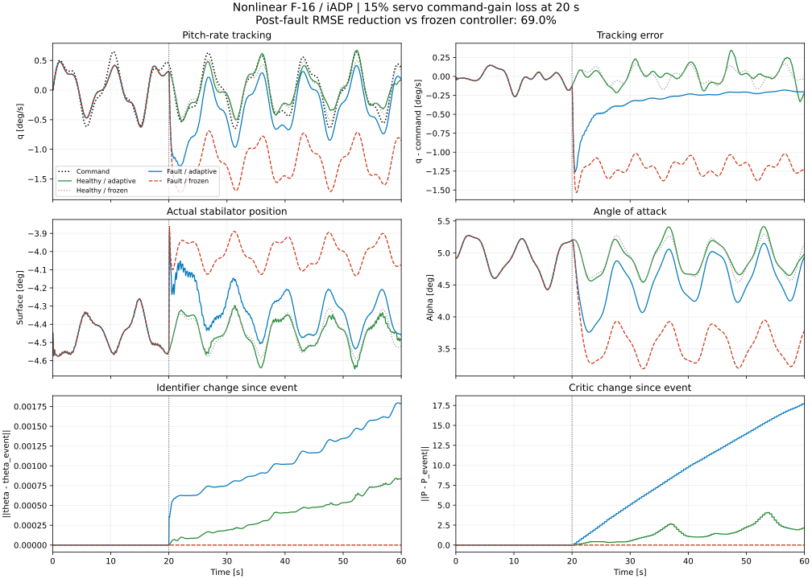
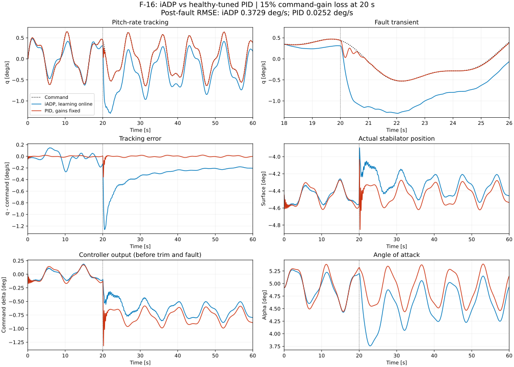
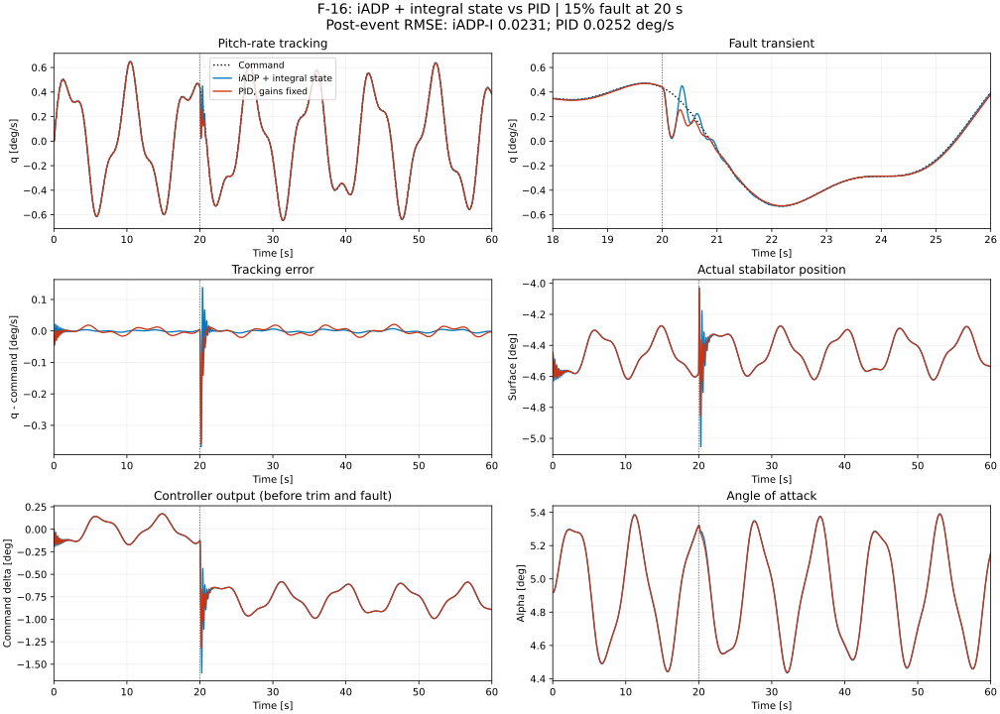
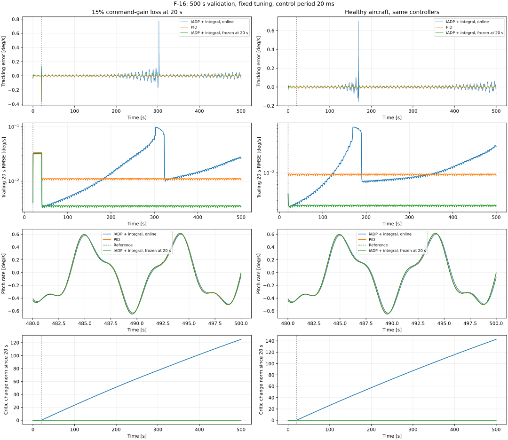
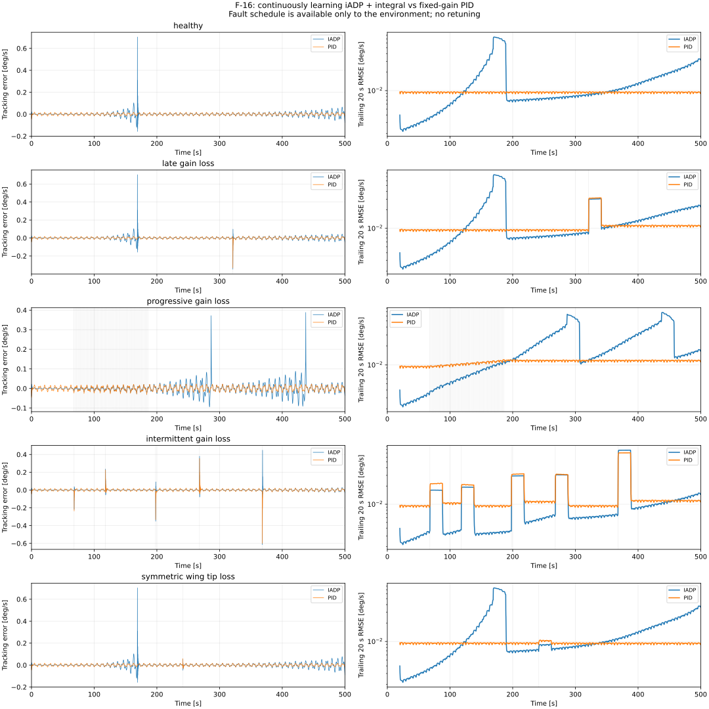
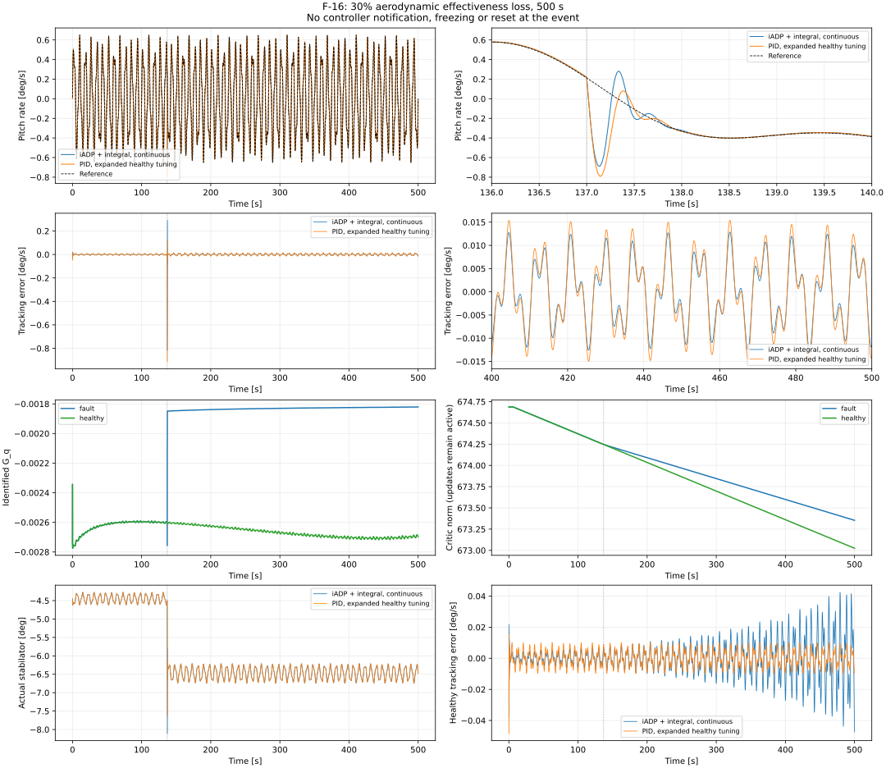

# F-16: iADP with a small actuator fault

This example shows an **adaptive controller** responding to a **15% reduction in stabilator command gain** at 20 s. The notebook now runs for **500 s**. The original 60 s tables below are retained for comparison; the long-horizon results appear in a separate section.

- Executed notebook: `example/reinforcement_learning/incremental_adp/example_iadp_small_fault_f16.ipynb`.
- Script: `example/reinforcement_learning/incremental_adp/example_iadp_small_fault_f16.py`.
- Controller: [iADP](../../../agent/iadp.md); plant: [nonlinear longitudinal F-16](../../../model/f16_nonlinear_longitudinal.md).

## Run

From the repository root, with the project dependencies installed:

```bash
python -m example.reinforcement_learning.incremental_adp.example_iadp_small_fault_f16
```

The default output directory is `outputs/f16-small-fault/`: PNG/SVG figures, JSON metrics and full CSV traces for all four scenarios. Add `--show` to display the figure or `--output /tmp/f16-demo` to change the directory.

```bash
python -m example.reinforcement_learning.incremental_adp.example_iadp_small_fault_f16 \
  --loss 0.10 --substeps 2 --output /tmp/f16-demo-10
```

Options include `--loss` in [0, 0.20], `--fault-time`, `--duration`, `--phase` and `--substeps`. Event time and duration must be multiples of 0.02 s.

## Fault semantics and physics

The native `DamageProfile` applies a `control_failure / efficiency_loss` event:

\[
\delta_{\mathrm{target}} = \eta\,\operatorname{clip}
  (\delta_{\mathrm{trim}} + u, -25^\circ,25^\circ),
\qquad \eta = 1\ \text{before the event},\quad 0.85\ \text{after}.
\]

The **total command, including trim**, is attenuated. The actual surface follows the native second-order actuator, with 25° position and 60°/s rate limits. Aerodynamic tables, mass and inertia remain unchanged. This represents a simplified actuator command-gain fault, not a loss of 15% of the stabilator area.

Both `stab_left` and `stab_right` address the same collective channel in the longitudinal model. One event targets `stab_left` to attenuate that channel once; this does not represent an asymmetric left-side failure. Applying both events would compound their gains.

Numerical trim gives approximately 4.918° angle of attack and −4.447° stabilator position. Airspeed and altitude are fixed at 150 m/s and 3000 m. The controlled output is pitch rate, not altitude or a full spatial flight path:

\[
q_{\mathrm{cmd}}(t)=0.5\sin(2\pi\,0.12t)
+0.15\sin(2\pi\,0.31t+\varphi)\quad [\mathrm{deg/s}].
\]

## Paired comparison

Four runs combine healthy/faulty aircraft with adaptive/frozen controllers. Their initial parameters and pre-event histories agree. At 20 s the frozen arms retain their RLS parameters, covariance and critic matrix `P`; measurement feedback, transition history and control computation remain active.

The adaptive controller receives pitch-rate observations and the mean actual surface position over each transition. Composite trapezoidal averaging approximates the effective input despite actuator lag. Neither fault time nor severity is passed to the adaptive controller.

The initial `F`, `G` and `P` come from a **healthy** local linearization and discounted DARE. This is online learning from an initialized policy, not learning from scratch. The incremental-model/RLS/quadratic-value approach follows [Konatala et al., 2024](https://doi.org/10.2514/6.2024-2402), Section II. The present scenario and actuator fault are our own experiment, not a reproduction of those flight tests.

## Default results



| Aircraft and controller | RMSE, 20–60 s, deg/s | RMSE, 40–60 s, deg/s |
|---|---:|---:|
| Healthy, adaptive | 0.1240 | 0.1478 |
| Healthy, frozen | 0.0889 | 0.0905 |
| Fault 15%, adaptive | 0.3729 | 0.2170 |
| Fault 15%, frozen | 1.2048 | 1.1994 |

Under the fault, adaptation reduces RMSE by **69.0%** over the full post-event interval and **81.9%** in the late window. Residual tracking error remains. On the healthy aircraft, continued learning is less accurate than the frozen controller; the plot includes this outcome.

The lower panels show model and critic changes since the event, not an estimated percentage of damage. Identification uses actual surface feedback; aerodynamic effectiveness relative to that surface position has not changed in this fault model.

## iADP versus PID tuned on the healthy aircraft

The notebook also compares **two different controllers**. Run it separately with:

```bash
python -m example.reinforcement_learning.incremental_adp.example_iadp_vs_pid_f16
# Reproduce PID fitting using ONLY the healthy F-16:
python -m example.reinforcement_learning.incremental_adp.example_iadp_vs_pid_f16 --retune-pid
```

Outputs go to `outputs/f16-iadp-vs-pid/`. The default uses the completed healthy-only fit: **Kp = −183.558823, Ki = −500, Kd = −0.001307727**. The PID input is pitch rate in rad/s and output is command deviation from trim in degrees. Gain units are deg/(rad/s), deg/rad and deg/(rad/s²), respectively.

The library `PID` uses derivative on measurement and conditional-integration anti-windup. Negative gains match the negative stabilator-to-pitch-acceleration response. The fitting manoeuvre is a separate **20 s healthy flight** at reference frequencies 0.10 and 0.23 Hz. The objective is `mean(error_rad_s² + R * applied_delta_deg²)`, using the same `R = 4.6861212294e-5` as iADP. Bounded Nelder–Mead converged after 60 evaluations; magnitude bounds are [0.5, 300], [0.5, 500] and [0.001, 50]. Ki reached its search bound; global optimality is not claimed.

Evaluation uses held-out frequencies 0.12 and 0.31 Hz. The same fault occurs at 20 s. **PID gains remain fixed**, while its integral continues evolving; iADP continues updating its model and critic. Neither controller receives fault information. Initial state, reference, ±10° command limit, 60°/s increment constraint relative to previous measured input, and physical actuator are identical. This compares control performance, without equalizing prior training/tuning budgets.



| Pitch-rate error metric | iADP | PID |
|---|---:|---:|
| RMSE before fault, 0–20 s, deg/s | 0.0968 | 0.0095 |
| Transient RMSE, 20–25 s, deg/s | 0.7675 | 0.0647 |
| Post-fault RMSE, 20–60 s, deg/s | 0.3729 | 0.0252 |
| Late RMSE, 40–60 s, deg/s | 0.2170 | 0.0112 |
| Peak post-fault error, deg/s | 1.2613 | 0.3585 |

**The healthy-tuned PID outperforms this iADP configuration in this scenario.** Improvement over frozen iADP does not imply superiority to PID. Fixed PID gains still allow the integral term to change the command and compensate the offset.

Checks also cover 10%/20% losses, another reference phase, zero loss and a 10 ms plant integration step with 20 ms control updates. The full tuning history and metrics are retained in `reports/iadp-vs-pid-f16-validation.json`.

## Tuned iADP and an integral-state variant

The notebook now separates parameter tuning from an explicit extension of the controller state:

```bash
python -m example.reinforcement_learning.incremental_adp.example_iadp_tuned_f16
# Reproduce the final 27-candidate healthy-only search:
python -m example.reinforcement_learning.incremental_adp.example_iadp_tuned_f16 --search
```

Outputs go to `outputs/f16-iadp-tuned/`. PID retains its previous healthy-only fitted gains.

A 61-candidate search improves the original rate-only iADP, but leaves a persistent post-fault offset. Attenuating the total command, including trim, requires a steady compensating command. The original experiment's controller state contains only pitch rate, without accumulated error.

The *Fine-Tuning Controller Performance* discussion in [Konatala et al., 2024](https://doi.org/10.2514/6.2024-2402) notes missing integral information in the base cost and discusses state/cost extensions. Our experiment uses the following **integral-state formulation** with unchanged `IADPAgent` equations and no external PID correction:

\[
z_{k+1}=z_k+\Delta t(q_k^{\mathrm{ref}}-q_k),\qquad
x_k=[q_k,z_k]^T,\qquad x_k^{\mathrm{ref}}=[q_k^{\mathrm{ref}},0]^T.
\]

The integral update is causal and uses current measurements/reference, not future samples. Selected settings are `Q=diag(1,30)`, `R=2.3430606147e-5`, `gamma=0.99`, `gamma_rls=0.9995`, `phi_init=20000`, window/minimum samples 300, critic update every 10 ticks, and blend `0.0001`. Control runs at 20 ms.

All candidates are ranked using a common external rate-error/control cost, independent of their internal hyperparameters. After exploratory integral-weight trials, a final 27-candidate search uses a **60 s healthy manoeuvre** to expose degradation that short episodes missed. Post-fault errors are not part of the tuning objective. `--search` reproduces this final stage.



| Controller | RMSE 20–60 s, deg/s | RMSE 40–60 s, deg/s |
|---|---:|---:|
| Original iADP | 0.372911 | 0.216974 |
| Rate-only iADP, tuned | 0.172925 | 0.167507 |
| iADP + integral state | **0.023084** | **0.003771** |
| PID | 0.025177 | 0.011156 |
| Integral iADP, parameters frozen after 20 s | 0.022632 | 0.003499 |

For the 15% fault, integral-state iADP reduces post-event RMSE by **93.8%** versus the original configuration and **8.3%** versus PID. Late-window RMSE is about three times smaller than PID's. Entry into ±0.05 deg/s takes **0.70 s**, versus **0.74 s** for PID, requiring the band to hold to the end with at least five seconds remaining. Peak error is slightly higher: 0.368 versus 0.359 deg/s.

**The improvement comes primarily from tuning and integral-state design; it does not establish a benefit from continued adaptation.** Freezing the improved controller's parameters at the event gives a slightly better result. Its integral remains active in that ablation.

Integral-state iADP also wins the 10% fault comparison, but PID has lower overall transient error for the 20% fault. Long episodes, integrator refinement, losses and full search history are retained in `reports/iadp-f16-tuning-validation.json`.

## Validation and limits

The script rejects nonfinite states/parameters, nonpositive identifier covariance, a reversed control-gain sign, violated servo limits, early environment termination and departure from the selected pitch-rate/angle-of-attack envelope. Tests cover matched histories, frozen parameters with active feedback, event timing and zero-loss equivalence.

Additional runs cover 10%/20% losses, another reference phase and a 120 s episode. Results, including an unsuccessful exploratory configuration, are retained in `reports/iadp-f16-small-fault-validation.json`.

**The controller period is fixed at 20 ms.** `--substeps 2`/`4` refine plant integration to 10/5 ms without changing the controller or learning frequency. Simply halving the controller period without retuning nearly removes the adaptation benefit: it changes the learning window and command-increment constraint, among other settings. That configuration is outside the supported example settings.

These results apply to the stated model, trim and tuning. There is no measurement noise, turbulence or full spatial flight dynamics, and critic convergence over arbitrary horizons has not been established.

## Long-horizon validation: 500 seconds

```bash
python -m example.reinforcement_learning.incremental_adp.example_iadp_long_horizon_f16
```

The same settings and 15% command-gain fault at 20 s are used without retuning. Consecutive-window metrics, trailing RMSE and learning-parameter histories are saved to `outputs/f16-iadp-500s/`.



| Controller | RMSE 20–500 s, deg/s | RMSE 400–500 s, deg/s |
|---|---:|---:|
| iADP + integral, continuous learning | 0.027711 | 0.021719 |
| PID | 0.012796 | 0.011003 |
| iADP + integral, parameters frozen at 20 s | **0.007337** | **0.003484** |

**The continuously learning iADP advantage at 60 s does not persist to 500 s.** A late tracking-error peak reaches 0.776325 deg/s at 302.74 s. The healthy aircraft also exhibits degradation: final-100-second RMSE is 0.023597 deg/s versus PID's 0.009361 and frozen iADP's 0.002388. Integral feedback remains active in the frozen controller.

Refining the physics step to 10 ms while retaining the 20 ms control period reproduces the finding: post-event RMSE is 0.027904 deg/s and the late peak is 0.779260 deg/s at 302.72 s. State and actuator limits hold and parameters remain finite. Tracking nonetheless deteriorates while model and critic parameters change; long-term convergence is not established.

The interpretation was checked against the identification-sensitivity and parameter-monitoring discussion in section IV.C of [Konatala et al., 2024](https://doi.org/10.2514/6.2024-2402). This experiment alone neither proves an implementation defect nor isolates identifier versus critic updates as the cause. Full metrics and limitations: `reports/iadp-f16-500s-validation.md` and `.json`.

## Unknown failure time: continuous learning

Freezing at the known event time above is a diagnostic control only. A new example compares **continuously learning iADP** with fixed-gain PID. Only the environment receives the damage schedule.

```bash
python -m example.reinforcement_learning.incremental_adp.example_iadp_fault_scenarios_f16
```

The scenarios cover a late 15% command-gain loss, progressive degradation to 20%, intermittent losses and recovery, and symmetric 30% loss of both wing-tip sections. Two schedules were declared before evaluation: 20 runs of 500 s with unchanged controller settings.



PID is more accurate for the late, progressive and wing-damage cases in both schedules. For intermittent faults, iADP's overall RMSE is lower by 0.13% and 2.26%, but its final 100 s are worse in both cases. A sustained advantage of this tuning has not been demonstrated.

The next priorities are separate models of reduced aerodynamic stabilator effectiveness with actual-angle feedback, and actuator slowdown. The aerodynamic case is evaluated in the next section; actuator slowdown remains untested. The sectional wing-damage model is a demonstration approximation, not validated against a damaged real F-16.

Full protocol, physical interpretation and both schedules: `reports/iadp-f16-unknown-faults-validation.md` and `.json`.

## A verified win: aerodynamic effectiveness loss with continuous learning

Executed notebook: `example/reinforcement_learning/incremental_adp/example_iadp_aero_effectiveness_f16.ipynb`.

```bash
python -m example.reinforcement_learning.incremental_adp.example_iadp_aero_effectiveness_f16
```

In a 500 s run, the aerodynamic action of the measured stabilator deflection decreases by 30% at 137 s. Both iADP learning loops remain active. Only the environment receives the schedule; the controller is neither reset nor switched at the event.



| Metric, deg/s | iADP + integral | Stronger PID |
|---|---:|---:|
| RMSE 137–500 s | **0.017749** | 0.020507 |
| RMSE 400–500 s | **0.006591** | 0.007840 |
| Peak post-event error | **0.818458** | 0.913131 |

RMSE decreases by **13.45%** after the event and **15.94%** in the final 100 s. iADP was selected from six configurations using only a healthy 500 s task: `policy_eval_blend=1e-6`, `gamma_rls=0.9999`. Critic updates are slow but remain active; the identified input gain changes by about 30% after the fault. PID was retuned on healthy data with expanded bounds: Kp = −135.606952, Ki = −982.693451, Kd = −0.002070702. Its previous Ki bound of 500 no longer limits the comparison. Tuning budgets were not equalized.

The 30% fault advantage persists with different event times, another reference phase, and physics steps of 10 and 5 ms. **PID is better on the healthy aircraft and at 40% loss.** This is a conditional win for this configuration, not a universal iADP advantage.

The fault follows `C_fault(delta)=C(0)+eta*(C(delta)-C(0))` for lift and moment coefficients. The native servo and its actual-position measurement remain intact. This is a parametric effectiveness test, not a validated model of a particular damaged aircraft.

Full protocol, physical checks, tuning histories and losses: `reports/iadp-f16-effectiveness-validation.md` and `.json`.
