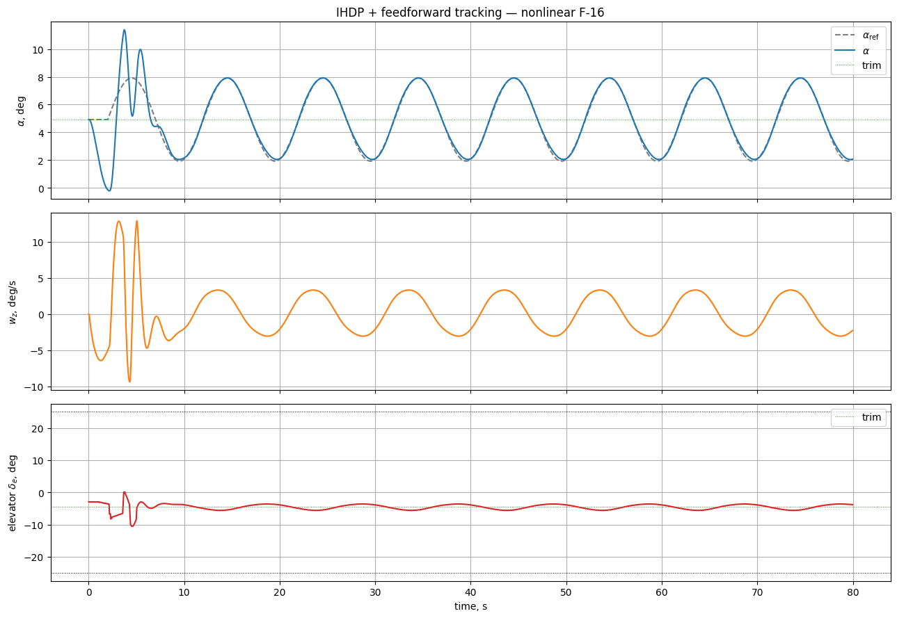

# Example: IHDP on the nonlinear F-16 — sinusoidal α-tracking

This example trains an **Incremental Heuristic Dynamic Programming (IHDP)** agent to track a sinusoidal angle-of-attack reference on the pure-NumPy [nonlinear F-16 longitudinal model](../../../model/f16_nonlinear_longitudinal.md). The source notebook lives at `example/reinforcement_learning/incremental_adp/example_ihdp_nonlinear_f16.ipynb`.

## Key idea: feedforward + IHDP residual

IHDP is a reactive algorithm — it only sees the current state and the current reference. For a sinusoidal reference, by the time the agent reacts the target has already moved, which gives a 60–90° phase lag (cosine in response to sine). The fix is to have the env inject an **inverse-model feedforward** that does the bulk of the tracking, leaving IHDP only a small dynamic residual to learn:

\[
\delta_e(t) \;=\; \mathrm{ff}\bigl(\alpha_{\text{ref}}(t+\tau)\bigr) \;+\; \mathrm{agent\_residual}(t)
\]

Three ingredients make the feedforward work:

1. **Static trim curve** \(\alpha \to \delta_e^{\text{trim}}\). For each candidate \(\alpha\) we precompute the elevator deflection that zeroes the pitching moment via `fsolve`.
2. **Lookahead** \(\tau \approx 0.85\,\text{s}\). Instead of `α_ref(t)`, we feed `α_ref(t + τ)` into the trim curve — this compensates for the actuator + airframe lag (roughly the F-16 short-period time constant at \(V=150\) m/s).
3. **Amplitude gain** \(g = 1.55\). On a moving reference, equilibrium isn't enough — the elevator must overshoot the static target to inject the pitch acceleration that keeps α in phase with \(\dot\alpha_{\text{ref}}\). We scale the deviation from the global trim before the trim-curve lookup.

With this feedforward in place, IHDP only has to learn a small residual correction.

## 1. Imports and trim

```python
import math

import gymnasium as gym
import matplotlib.pyplot as plt
import numpy as np
from scipy.optimize import fsolve
from tqdm import tqdm

import tensoraerospace  # registers gymnasium envs
from tensoraerospace.aerospacemodel.f16.nonlinear.longitudinal.dynamics import f16_ode_long
from tensoraerospace.aerospacemodel.f16.nonlinear.longitudinal.params import default_parameters
from tensoraerospace.agent.ihdp.model import IHDPAgent
from tensoraerospace.utils import convert_tp_to_sec_tp, generate_time_period
```

Solve for \((\alpha_{\text{trim}}, \delta_{e,\text{trim}})\) such that \(\dot\alpha=0\) and \(\dot\omega_z=0\) at zero pitch rate:

```python
params = default_parameters()

def trim_residual(z):
    alpha, stab = z
    x = np.array([alpha, 0.0, stab, 0.0])
    return list(f16_ode_long(x, np.array([stab]), 0.0, params)[:2])

sol, _info, ier, _ = fsolve(
    trim_residual, x0=[math.radians(2.0), math.radians(-2.0)], full_output=True
)
alpha_trim_rad, stab_trim_rad = float(sol[0]), float(sol[1])
alpha_trim_deg = math.degrees(alpha_trim_rad)
stab_trim_deg = math.degrees(stab_trim_rad)
# global trim: alpha = +4.9184 deg, elevator = -4.4467 deg
```

## 2. Build the feedforward trim curve

For each candidate \(\alpha\) in \([-12°, 17°]\), find the elevator deflection that zeroes the pitching moment:

```python
def stab_for_alpha(alpha_rad: float) -> float:
    def res(s):
        x = np.array([alpha_rad, 0.0, s[0], 0.0])
        return f16_ode_long(x, np.array([s[0]]), 0.0, params)[1]  # dwz
    return float(fsolve(res, x0=[math.radians(-2.0)])[0])

alphas_grid_deg = np.linspace(-12.0, 17.0, 61)
alphas_grid_rad = np.deg2rad(alphas_grid_deg)
stabs_grid_deg = np.array([math.degrees(stab_for_alpha(a)) for a in alphas_grid_rad])
```


## 3. Reference signal

80-second episode at \(dt = 0.01\) s. The reference is held at \(\alpha_{\text{trim}}\) for 2 s so the IHDP incremental model can identify a usable linearisation, then becomes a 3° amplitude sinusoid at 0.1 Hz centered on trim.

```python
dt = 0.01
tp = generate_time_period(tn=80, dt=dt)
tps = convert_tp_to_sec_tp(tp, dt=dt)
number_time_steps = len(tp)

amplitude_deg = 3.0
freq_hz = 0.1
warmup_steps = int(2.0 / dt)

ref_alpha_rad = np.full(number_time_steps, alpha_trim_rad)
active_t = np.arange(number_time_steps - warmup_steps) * dt
ref_alpha_rad[warmup_steps:] = (
    alpha_trim_rad + math.radians(amplitude_deg) * np.sin(2 * np.pi * freq_hz * active_t)
)
reference_signals = ref_alpha_rad.reshape(1, -1)
```


## 4. Feedforward function and env

```python
lookahead_sec = 0.85
lookahead_steps = int(lookahead_sec / dt)
ff_gain = 1.55

def feedforward_fn(time_step: int, ref_signal: np.ndarray) -> float:
    k = min(time_step + lookahead_steps, ref_signal.shape[1] - 1)
    alpha_ref_deg = math.degrees(ref_signal[0, k])
    alpha_eff_deg = alpha_trim_deg + ff_gain * (alpha_ref_deg - alpha_trim_deg)
    return float(np.interp(alpha_eff_deg, alphas_grid_deg, stabs_grid_deg))

env = gym.make(
    "NonlinearLongitudinalF16-v0",
    number_time_steps=number_time_steps,
    initial_state=[alpha_trim_rad, 0.0, stab_trim_rad, 0.0],
    reference_signal=reference_signals,
    state_space=["alpha", "wz"],
    control_space=["stab"],
    tracking_states=["alpha"],
    use_reward=False,
    dt=dt,
    integrator="euler",
    feedforward_fn=feedforward_fn,
)
```

## 5. IHDP agent configuration

Two changes versus the canonical linear-F-16 IHDP example matter here:

- **`Q_weights = [200]`** (vs. 8 in the linear example). The FF covers most of the tracking, so the residual error is small. A higher Q amplifies that small error to give the actor a usable gradient.
- **`NN_initial = 47`** is the best seed from a sweep over `[1, 100]` with `Q=200, lr=2`: it gives MAE ≈ 0.05° on this exact reference. `NN_initial=120` is a safe middle (~0.14°).

```python
actor_settings = {
    "start_training": 5,
    "layers": (25, 1),
    "activations": ("tanh", "tanh"),
    "learning_rate": 2,
    "learning_rate_exponent_limit": 10,
    "type_PE": "combined",
    "amplitude_3211": 3,
    "pulse_length_3211": 5 / dt,
    "maximum_input": 15,
    "maximum_q_rate": 20,
    "WB_limits": 30,
    "NN_initial": 47,
    "cascade_actor": False,
    "learning_rate_cascaded": 1.2,
}

critic_settings = {
    "Q_weights": [200],
    "start_training": -1,
    "gamma": 0.99,
    "learning_rate": 15,
    "learning_rate_exponent_limit": 10,
    "layers": (25, 1),
    "activations": ("tanh", "linear"),
    "WB_limits": 30,
    "NN_initial": 47,
    "indices_tracking_states": env.unwrapped.indices_tracking_states,
}

incremental_settings = {
    "number_time_steps": number_time_steps,
    "dt": dt,
    "input_magnitude_limits": 15,
    "input_rate_limits": 60,
}

agent = IHDPAgent(
    actor_settings, critic_settings, incremental_settings,
    env.unwrapped.tracking_states,
    env.unwrapped.state_space,
    env.unwrapped.control_space,
    number_time_steps,
    env.unwrapped.indices_tracking_states,
)
```

## 6. Online training loop

IHDP is fully online: at every step the actor proposes a residual control, the env adds the feedforward and advances, and the actor / critic / incremental model are updated using the resulting transition.

```python
obs, _ = env.reset()
xt = np.asarray(obs, dtype=float).reshape(-1, 1)

for step in tqdm(range(number_time_steps - 3)):
    ut = agent.predict(xt, reference_signals, step)
    xt, _reward, terminated, truncated, _info = env.step(np.asarray(ut))
    xt = np.asarray(xt, dtype=float).reshape(-1, 1)
    if terminated or truncated:
        break
```

## 7. Tracking result



Late-half metrics (40 s → 80 s, after the agent has settled):

| Metric | Value |
|--------|-------|
| Mean absolute error | **0.053°** (1.77 % of amplitude) |
| RMS error | 0.074° |
| Max abs error | 0.174° (5.81 % of amplitude) |

## 8. Ablation — what each ingredient buys you

Running the same simulation with increasingly-stripped configurations:

| Configuration | Late MAE |
|---------------|----------|
| No FF, IHDP only (Q=8) | 1.91° |
| FF lookahead only (Q=8) | 0.67° |
| FF lookahead + gain (Q=8) | 0.22° |
| FF lookahead + gain (**Q=200**) | **0.053°** |

The phase-compensating lookahead does most of the work. The amplitude gain closes the remaining undershoot. The higher Q is only useful once the residual is already small.

## Notes

- **Why the gain helps.** The static FF assumes equilibrium; for a moving reference the elevator must overshoot the static target by exactly the amount needed to accelerate α. The optimal gain depends on the reference frequency; for slower references it approaches 1.0.
- **NN_initial sweep.** IHDP is sensitive to weight initialisation. A sweep over `NN_initial ∈ [1, 100]` with `Q=200, lr=2` gave best MAE 0.049° (seed 47), median ~0.12°, and ~17 seeds diverged. Picking a seed is part of IHDP tuning — re-sweep if you change the reference.
- **Switching integrator.** Use `integrator="rk4"` for higher numerical fidelity on larger reference amplitudes. For this 3° test the difference is marginal.
- **Stronger reference.** Amplitudes up to 5–8° stay inside the FF curve range \([-12°, 17°]\); reduce `ff_gain` slightly (toward 1.4) and IHDP will compensate a larger nonlinear residual.
