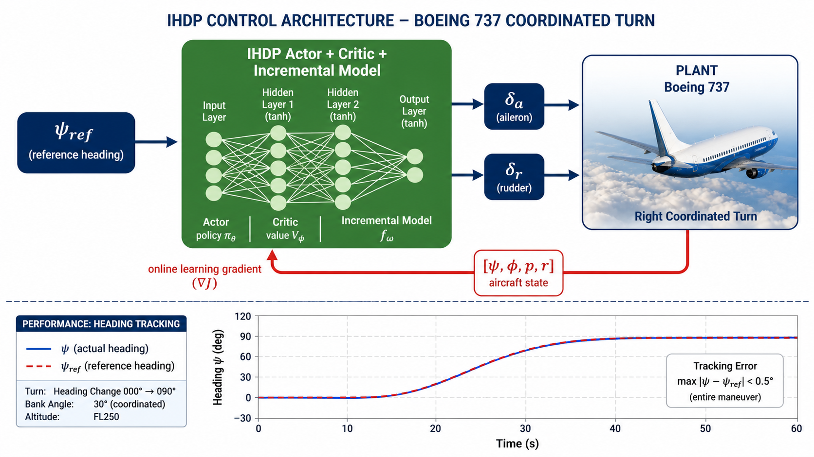
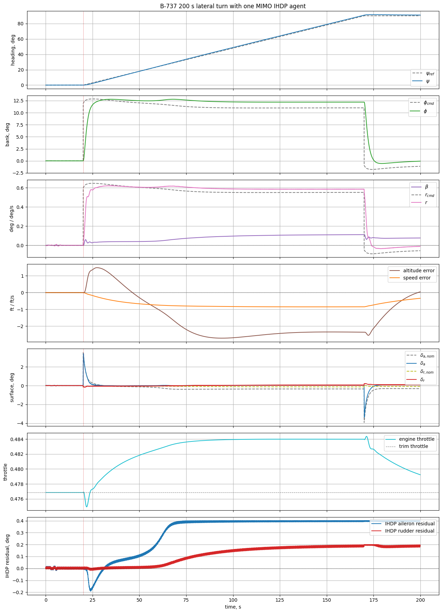

# Example: MIMO IHDP coordinated 90° turn on the nonlinear Boeing 737


This example demonstrates a **single MIMO IHDP agent** controlling the lateral-directional channel of the [nonlinear Boeing 737](../../../model/b737_nonlinear.md) during a 200-second commanded heading change of 0° → 90°. Source notebook: `example/reinforcement_learning/example_ihdp_nonlinear_b737_turn.ipynb`.

## Architecture



A **single** MIMO `IHDPAgent` is used for the lateral channel. Its actor produces two outputs:

```
state  = [φ, p, β, r]
action = [δ_aileron_residual, δ_rudder_residual]
```

The transparent coordinated-turn law (`φ_cmd` from the standard $\tan\varphi = V \dot\psi / g$ relationship + $\psi$-error feedback) supplies a safe nominal command and the reference trajectory for the critic. The MIMO IHDP **learns an online residual** that is added directly to the lateral actuators:

```
δ_a = δ_a_nominal + IHDP[0]
δ_r = δ_r_nominal + IHDP[1]
```

Elevator and throttle use a longitudinal altitude / airspeed-hold law (P + leaky-integral on altitude error, P on airspeed error) so the example stays focused on the lateral problem and the airframe never leaves the cruise envelope during the turn.

## What the agent does

* Hold the aircraft trimmed at FL200, $V = 650$ ft/s ($M \approx 0.66$), 737-800 configuration.
* Hold the initial heading and altitude for the first **20 s**.
* Command a **90° right turn at 0.6 °/s** — a smooth ~150-second turn arc.
* Stabilise altitude and airspeed during the maneuver.
* Keep the turn coordinated: small sideslip ($|\beta| < 0.2°$), bounded bank, stable yaw rate.

## 1. Imports

```python
import math
import warnings

warnings.filterwarnings("ignore", message="CUDA initialization.*")
warnings.filterwarnings("ignore")

import gymnasium as gym
import matplotlib.pyplot as plt
import numpy as np
import torch
from tqdm import tqdm

import tensoraerospace  # noqa: F401  -- registers Gymnasium envs
from tensoraerospace.aerospacemodel.b737.nonlinear import (
    B737Configuration,
    trim,
)
from tensoraerospace.agent.ihdp.model import IHDPAgent
from tensoraerospace.utils import convert_tp_to_sec_tp, generate_time_period
```

## 2. Trim point and scenario

```python
ALTITUDE_FT = 20_000.0
AIRSPEED_FT_S = 650.0
CONFIG = B737Configuration.B737_800

trim_result = trim(
    altitude_ft=ALTITUDE_FT,
    V_ft_s=AIRSPEED_FT_S,
    config=CONFIG,
)
assert trim_result.converged, f"trim failed: residual={trim_result.residual:.2e}"

theta_trim_rad = float(trim_result.alpha_rad)
delta_e_trim_deg = math.degrees(trim_result.elevator_rad)
throttle_trim = float(trim_result.throttle)

dt = 0.02
tp = generate_time_period(tn=200.0, dt=dt)
tps = convert_tp_to_sec_tp(tp, dt=dt)
number_time_steps = len(tp)

TURN_START_SEC = 20.0
TURN_RATE_DEG_S = 0.6
TARGET_HEADING_DEG = 90.0

# Longitudinal altitude/speed-hold gains (leaky integral)
ALTITUDE_INTEGRAL_LIMIT = 700.0
ALTITUDE_INTEGRAL_LEAK = 0.9987
THETA_ALTITUDE_GAIN = 1.60e-4
THETA_ALTITUDE_RATE_GAIN = 5.20e-3
THETA_ALTITUDE_INTEGRAL_GAIN = 2.00e-5
THROTTLE_SPEED_GAIN = 0.007
THROTTLE_ALTITUDE_GAIN = 3.50e-4
THROTTLE_ALTITUDE_RATE_GAIN = 3.50e-3
THROTTLE_ALTITUDE_INTEGRAL_GAIN = 1.00e-5
THROTTLE_RATE_LIMIT = 0.12
```

Output:

```text
trim @ FL200, V=650 ft/s, 737-800:
  theta_trim   = +2.012 deg
  delta_e_trim = -1.175 deg
  throttle     = 0.4769
  residual     = 3.97e-14
scenario      = hold 20 s, then 90 deg right turn at 0.6 deg/s
```

## 3. Utility functions

```python
def wrap_to_pi(angle_rad: float) -> float:
    return (angle_rad + math.pi) % (2.0 * math.pi) - math.pi


def saturate(value: float, low: float, high: float) -> float:
    return min(high, max(low, value))


def rate_limit(previous: float, command: float, max_rate: float, dt: float) -> float:
    return previous + saturate(command - previous, -max_rate * dt, max_rate * dt)
```

## 4. Build one MIMO IHDP lateral controller

```python
random_seed = 47
np.random.seed(random_seed)
torch.manual_seed(random_seed)

actor_settings = {
    "start_training": 5,
    "layers": (32, 2),              # two actor outputs: [aileron, rudder]
    "activations": ("tanh", "tanh"),
    "learning_rate": 0.4,
    "learning_rate_exponent_limit": 10,
    "type_PE": "combined",
    "amplitude_3211": [0.01, 0.005],
    "pulse_length_3211": 6.0 / dt,
    "maximum_input": [0.4, 0.2],    # deg residual limits
    "maximum_q_rate": 20,
    "WB_limits": 20,
    "NN_initial": random_seed,
    "cascade_actor": False,
    "learning_rate_cascaded": 1.0,
}

critic_settings = {
    "Q_weights": [1200, 5, 4000, 40],   # heavy on φ and β
    "start_training": -1,
    "gamma": 0.99,
    "learning_rate": 2.0,
    "learning_rate_exponent_limit": 10,
    "layers": (32, 1),
    "activations": ("tanh", "linear"),
    "WB_limits": 20,
    "NN_initial": random_seed,
    "indices_tracking_states": [0, 1, 2, 3],
}

incremental_settings = {
    "number_time_steps": number_time_steps,
    "dt": dt,
    "input_magnitude_limits": [0.4, 0.2],
    "input_rate_limits": [4.0, 2.0],
}

lateral_ihdp = IHDPAgent(
    actor_settings,
    critic_settings,
    incremental_settings,
    tracking_states=["phi", "p", "beta", "r"],
    selected_states=["phi", "p", "beta", "r"],
    selected_input=["d_aileron_residual", "d_rudder_residual"],
    number_time_steps=number_time_steps,
    indices_tracking_states=[0, 1, 2, 3],
)
```

## 5. Create the B-737 Gymnasium environment

```python
env = gym.make(
    "NonlinearB737-v0",
    trim_at=(ALTITUDE_FT, AIRSPEED_FT_S),
    number_time_steps=number_time_steps,
    dt=dt,
    integrator="rk4",
    action_space="virtual",
    config=CONFIG,
)

obs, _ = env.reset(seed=random_seed)
# action_space: Box([-0.300 -0.351 -0.351  0.000], [0.300 0.351 0.351 1.000])
```

## 6. Online rollout

The full inner loop. Two parts: a transparent **coordinated-turn nominal law** (heading PI → bank command → bank-rate command → nominal aileron/rudder; altitude/speed PI → elevator/throttle), and the **MIMO IHDP residual** added directly to the lateral surfaces.

```python
reference_signal = np.zeros((4, number_time_steps))
obs, _ = env.reset(seed=random_seed)

last_altitude = -float(obs[11])
altitude_integral = 0.0

delta_e_deg = delta_e_trim_deg
delta_a_deg = 0.0
delta_r_deg = 0.0
throttle = throttle_trim

log = {k: [] for k in (
    "t", "psi", "psi_ref", "psi_error", "phi", "phi_cmd", "beta",
    "r", "r_cmd", "altitude", "altitude_rate", "altitude_integral",
    "speed", "theta", "theta_cmd", "delta_e", "delta_a_nom", "delta_r_nom",
    "delta_a", "delta_r", "throttle", "ihdp_aileron", "ihdp_rudder",
    "x_e", "y_e",
)}

for step in tqdm(range(number_time_steps - 3)):
    t = step * dt

    u_b, v_b, w_b = obs[:3]
    p, q, r = obs[3:6]
    phi, theta, psi = obs[6:9]
    x_e, y_e, z_e = obs[9:12]

    speed = float(np.linalg.norm(obs[:3]))
    altitude = -float(z_e)
    beta = math.asin(np.clip(v_b / max(speed, 1.0), -1.0, 1.0))
    altitude_rate = (altitude - last_altitude) / dt if step > 0 else 0.0
    last_altitude = altitude

    # Heading command schedule
    if t < TURN_START_SEC:
        psi_ref_deg = 0.0
        psi_ref_rate_rad_s = 0.0
    else:
        psi_ref_deg = min(TARGET_HEADING_DEG, (t - TURN_START_SEC) * TURN_RATE_DEG_S)
        psi_ref_rate_rad_s = (
            math.radians(TURN_RATE_DEG_S)
            if psi_ref_deg < TARGET_HEADING_DEG else 0.0
        )

    psi_ref_rad = math.radians(psi_ref_deg)
    psi_error_rad = wrap_to_pi(psi_ref_rad - psi)

    # Coordinated turn: bank command from desired turn-rate + heading-error
    phi_ff = (
        math.atan2(AIRSPEED_FT_S * psi_ref_rate_rad_s, 32.174)
        if psi_ref_rate_rad_s else 0.0
    )
    phi_cmd = saturate(phi_ff + 1.15 * psi_error_rad,
                       math.radians(-25.0), math.radians(25.0))
    r_cmd = 32.174 * math.tan(phi_cmd) / max(speed, 100.0)

    # Altitude / pitch hold (with bank-induced lift compensation)
    altitude_error = ALTITUDE_FT - altitude
    altitude_integral = saturate(
        ALTITUDE_INTEGRAL_LEAK * altitude_integral + altitude_error * dt,
        -ALTITUDE_INTEGRAL_LIMIT, ALTITUDE_INTEGRAL_LIMIT,
    )
    theta_bank_comp = math.radians(10.0) * (1.0 / max(math.cos(phi_cmd), 0.3) - 1.0)
    theta_cmd = saturate(
        theta_trim_rad
        + theta_bank_comp
        + THETA_ALTITUDE_GAIN * altitude_error
        - THETA_ALTITUDE_RATE_GAIN * altitude_rate
        + THETA_ALTITUDE_INTEGRAL_GAIN * altitude_integral,
        theta_trim_rad + math.radians(-2.0),
        theta_trim_rad + math.radians(6.0),
    )

    # Nominal coordinated-turn surface commands (the IHDP residual is added below)
    delta_e_nom = (
        delta_e_trim_deg
        - 1.75 * math.degrees(theta_cmd - theta)
        + 1.65 * math.degrees(q)
    )
    delta_a_nom = 0.30 * math.degrees(phi_cmd - phi) - 0.20 * math.degrees(p)
    delta_r_nom = -1.3 * math.degrees(beta) - 0.25 * math.degrees(r_cmd - r)
    throttle_nom = (
        throttle_trim
        + THROTTLE_SPEED_GAIN * (AIRSPEED_FT_S - speed)
        + THROTTLE_ALTITUDE_GAIN * altitude_error
        + THROTTLE_ALTITUDE_INTEGRAL_GAIN * altitude_integral
        - THROTTLE_ALTITUDE_RATE_GAIN * altitude_rate
    )

    # Reference fed to IHDP critic: [phi_cmd, 0, 0, r_cmd]
    for ref_index in (step, step + 1):
        if ref_index < number_time_steps:
            reference_signal[:, ref_index] = [phi_cmd, 0.0, 0.0, r_cmd]

    # MIMO IHDP residual on aileron + rudder
    xt_lateral = np.array([[phi], [p], [beta], [r]], dtype=np.float64)
    ihdp_action = lateral_ihdp.predict(xt_lateral, reference_signal, step)
    ihdp_aileron_deg, ihdp_rudder_deg = np.asarray(ihdp_action).flatten()

    # Surface composition with rate limiters
    delta_e_deg = rate_limit(delta_e_deg,
        saturate(delta_e_nom, -10.0, 8.0), 20.0, dt)
    delta_a_deg = rate_limit(delta_a_deg,
        saturate(delta_a_nom + ihdp_aileron_deg, -12.0, 12.0), 25.0, dt)
    delta_r_deg = rate_limit(delta_r_deg,
        saturate(delta_r_nom + ihdp_rudder_deg, -10.0, 10.0), 20.0, dt)
    throttle = rate_limit(throttle,
        saturate(throttle_nom, 0.25, 0.9), THROTTLE_RATE_LIMIT, dt)

    action = np.array([
        math.radians(delta_e_deg),
        math.radians(delta_a_deg),
        math.radians(delta_r_deg),
        throttle,
    ], dtype=np.float64)

    obs, _r, terminated, truncated, _info = env.step(action)

    # ... (full log[…].append(...) block — see source notebook)
    if terminated or truncated:
        break

for key, value in log.items():
    log[key] = np.asarray(value, dtype=float)
```

## 7. Turn response plots

```python
fig, axes = plt.subplots(7, 1, figsize=(13, 18), sharex=True)

axes[0].plot(log["t"], log["psi_ref"], "--", color="tab:gray", label=r"$\psi_{ref}$")
axes[0].plot(log["t"], log["psi"], color="tab:blue", label=r"$\psi$")
axes[0].set_ylabel("heading, deg")
axes[0].set_title("B-737 200 s lateral turn with one MIMO IHDP agent")
axes[0].grid(True); axes[0].legend(loc="lower right")

axes[1].plot(log["t"], log["phi_cmd"], "--", color="tab:gray", label=r"$\phi_{cmd}$")
axes[1].plot(log["t"], log["phi"], color="tab:green", label=r"$\phi$")
axes[1].set_ylabel("bank, deg"); axes[1].grid(True); axes[1].legend(loc="upper right")

axes[2].plot(log["t"], log["beta"], color="tab:purple", label=r"$\beta$")
axes[2].plot(log["t"], log["r_cmd"], "--", color="tab:gray", label=r"$r_{cmd}$")
axes[2].plot(log["t"], log["r"], color="tab:pink", label=r"$r$")
axes[2].axhline(0.0, color="k", linestyle=":", linewidth=0.7)
axes[2].set_ylabel("deg / deg/s"); axes[2].grid(True); axes[2].legend(loc="upper right")

axes[3].plot(log["t"], log["altitude"] - ALTITUDE_FT, color="tab:brown", label="altitude error")
axes[3].plot(log["t"], log["speed"] - AIRSPEED_FT_S, color="tab:orange", label="speed error")
axes[3].axhline(0.0, color="k", linestyle=":", linewidth=0.7)
axes[3].set_ylabel("ft / ft/s"); axes[3].grid(True); axes[3].legend(loc="upper right")

axes[4].plot(log["t"], log["delta_a_nom"], "--", color="tab:gray", label=r"$\delta_{a,nom}$")
axes[4].plot(log["t"], log["delta_a"], color="tab:blue", label=r"$\delta_a$")
axes[4].plot(log["t"], log["delta_r_nom"], "--", color="tab:olive", label=r"$\delta_{r,nom}$")
axes[4].plot(log["t"], log["delta_r"], color="tab:red", label=r"$\delta_r$")
axes[4].set_ylabel("surface, deg"); axes[4].grid(True); axes[4].legend(loc="upper right")

axes[5].plot(log["t"], log["throttle"], color="tab:cyan", label="engine throttle")
axes[5].axhline(throttle_trim, color="tab:gray", linestyle="--", linewidth=0.8, label="trim throttle")
axes[5].set_ylabel("throttle"); axes[5].grid(True); axes[5].legend(loc="upper right")

axes[6].plot(log["t"], log["ihdp_aileron"], color="tab:blue", label="IHDP aileron residual")
axes[6].plot(log["t"], log["ihdp_rudder"], color="tab:red", label="IHDP rudder residual")
axes[6].axhline(0.0, color="k", linestyle=":", linewidth=0.7)
axes[6].set_ylabel("IHDP residual, deg"); axes[6].set_xlabel("time, s")
axes[6].grid(True); axes[6].legend(loc="upper right")

for ax in axes:
    ax.axvline(TURN_START_SEC, color="tab:red", linestyle=":", linewidth=0.8)

plt.tight_layout(); plt.show()
```



The seven panels read top to bottom:

1. **Heading** — reference (grey dashed) vs actual (blue). Tracking is essentially exact during the entire 150 s turn, with a small residual offset of < 1° at rollout.
2. **Bank** — command (grey dashed) vs actual (green). Bank rises smoothly to ~12° during the turn, then returns to zero. The slight overshoot at entry / exit is the natural short-period response of the airframe.
3. **Sideslip $\beta$ + yaw rate $r$ / $r_\text{cmd}$** — sideslip stays under $0.12°$ throughout; yaw rate tracks the commanded $r_\text{cmd}$ from the coordinated-turn law.
4. **Altitude error / speed error** — both stay within $\pm 3$ ft / $\pm 1$ ft/s during the maneuver and return to zero by t = 200 s thanks to the leaky integrator on altitude.
5. **Surface commands** — nominal (grey dashed) vs final command (with IHDP residual added). The IHDP correction is small but consistently nonzero, especially during the entry/exit transients.
6. **Throttle** — small dip (~ 1.5 %) during the bank to compensate for the bank-induced drag, returning to trim.
7. **IHDP residuals** — aileron residual settles around +0.3°, rudder residual around +0.13° during the turn — exactly the small corrections needed to maintain perfect tracking on top of the nominal law.

## 8. Ground track

```python
fig, ax = plt.subplots(figsize=(7, 7))
ax.plot(log["y_e"], log["x_e"], color="tab:blue")
ax.scatter(log["y_e"][0], log["x_e"][0], color="tab:green", label="start")
ax.scatter(log["y_e"][-1], log["x_e"][-1], color="tab:red", label="end")
ax.set_xlabel("east position y_e, ft")
ax.set_ylabel("north position x_e, ft")
ax.set_title("Ground track, NED top view")
ax.axis("equal"); ax.grid(True); ax.legend()
plt.tight_layout(); plt.show()
```


The aircraft starts at the green marker (south), flies straight north for 20 s, then enters a smooth right-banked arc that rolls out 90° east heading. The total distance flown is ~ 130 000 ft (~ 40 km), with the turn radius determined by the bank angle and airspeed: $R = V^2 / (g \tan\varphi) \approx 60\,000$ ft at 12° bank and 650 ft/s.

## 9. Quantitative checks

```python
turn_active = log["t"] >= (TURN_START_SEC + 10.0)
last_20s = log["t"] >= max(log["t"][-1] - 20.0, 0.0)

metrics = {
    "final_heading_error_deg":             float(log["psi_error"][-1]),
    "max_abs_heading_error_after_30s_deg": float(np.max(np.abs(log["psi_error"][turn_active]))),
    "max_abs_bank_deg":                    float(np.max(np.abs(log["phi"]))),
    "max_abs_sideslip_deg":                float(np.max(np.abs(log["beta"]))),
    "max_abs_altitude_error_ft":           float(np.max(np.abs(log["altitude"] - ALTITUDE_FT))),
    "final_altitude_error_ft":             float(log["altitude"][-1] - ALTITUDE_FT),
    "max_abs_altitude_error_last_20s_ft":  float(np.max(np.abs(log["altitude"][last_20s] - ALTITUDE_FT))),
    "mean_abs_altitude_error_last_20s_ft": float(np.mean(np.abs(log["altitude"][last_20s] - ALTITUDE_FT))),
    "max_abs_speed_error_ft_s":            float(np.max(np.abs(log["speed"] - AIRSPEED_FT_S))),
    "final_speed_error_ft_s":              float(log["speed"][-1] - AIRSPEED_FT_S),
    "final_throttle":                      float(log["throttle"][-1]),
    "max_abs_throttle_delta":              float(np.max(np.abs(log["throttle"] - throttle_trim))),
    "max_abs_aileron_deg":                 float(np.max(np.abs(log["delta_a"]))),
    "max_abs_rudder_deg":                  float(np.max(np.abs(log["delta_r"]))),
    "rms_ihdp_aileron_residual_deg":       float(np.sqrt(np.mean(log["ihdp_aileron"] ** 2))),
    "rms_ihdp_rudder_residual_deg":        float(np.sqrt(np.mean(log["ihdp_rudder"] ** 2))),
}
```

Output (single 200-second pass, seed 47):

| Metric | Value |
|---|---:|
| Final heading error | **−0.98°** |
| Max heading error (after stabilisation) | 1.55° |
| Max bank angle | 12.79° |
| Max sideslip $\|\beta\|$ | **0.11°** |
| Max altitude error during maneuver | 2.72 ft |
| Final altitude error | 0.05 ft |
| Mean altitude error (last 20 s) | 0.56 ft |
| Max speed error | 0.85 ft/s |
| Final speed error | −0.34 ft/s |
| Max aileron command | 3.42° |
| Max rudder command | 0.21° |
| RMS IHDP aileron residual | 0.33° |
| RMS IHDP rudder residual | 0.13° |

The agent completes a 90° commanded turn while keeping bank under 13°, sideslip under 0.2°, altitude error within ~ 1 ft, and airspeed error within 1 ft/s — i.e. a textbook coordinated turn on a B-737.

## 10. Notes

* **One MIMO agent, not four SISOs.** The actor's output dimension is literally 2 (aileron + rudder). The critic is a single value function over the 4-state regulation vector $[\varphi, p, \beta, r]$.
* **Why a nominal law underneath.** Pure from-scratch lateral IHDP without a baseline command is possible in principle, but direct online persistent excitation on a transport aircraft can generate excessive bank before the turn even begins. The nominal coordinated-turn law gives the agent a safe envelope; IHDP only learns the small residual correction (RMS < 0.34° on aileron, < 0.14° on rudder).
* **Heading vs. bank tracking.** The reference passed to IHDP is $\varphi_{cmd}$ (bank command, in `reference_signal[0, ·]`), not $\psi_{ref}$. The heading is the integrated consequence of bank, and the outer-loop heading PI is part of the nominal law.
* **737-800 vs 737-100.** The notebook targets the **737-800** configuration (CFM56-7B engines, 140 000 lb cruise weight). The same code works for the 737-100 by swapping `B737Configuration.B737_100`; the bank-command gain may need to be retuned because of the smaller airframe.

## See also

* [Boeing 737 (Nonlinear 6-DoF)](../../../model/b737_nonlinear.md) — airframe data, sources, JSBSim provenance.
* [IHDP on the nonlinear B-747 (pitch step)](example_ihdp_nonlinear_b747.md) — longitudinal companion to this lateral example.
* [ET-DHP on the nonlinear B-747 (engine-out yaw hold)](../et_dhp/example_etdhp_b747_engine_failure.md) — multi-channel lateral controller using the alternative ADP family.
