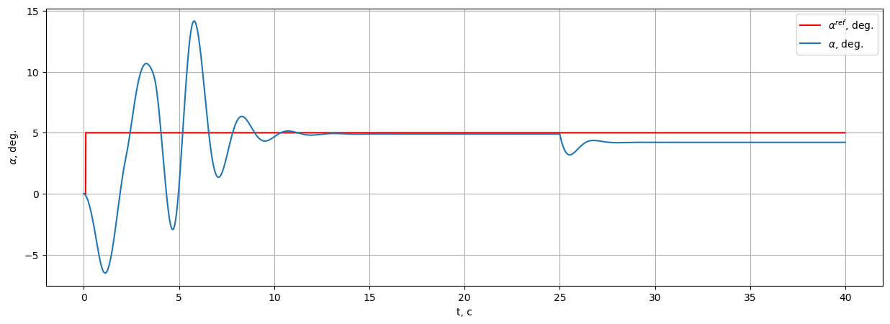

# IHDP with a mid-flight failure injection

Demonstrates how the **Incremental Heuristic Dynamic Programming (IHDP)** controller adapts when the aircraft dynamics change mid-flight. We train on `LinearLongitudinalF16-v0` for 40 seconds, then at \(t=25\) s mutate an element of the discrete-time A-matrix to simulate a control-surface or airflow fault.

Source notebook: `example/general_examples/example-ihdp-failure.ipynb`.

## 1. Imports

```python
import warnings
warnings.filterwarnings('ignore')

import gymnasium as gym
import numpy as np
import pandas as pd
from tqdm import tqdm

import tensoraerospace  # registers Gymnasium envs
from tensoraerospace.agent.ihdp.model import IHDPAgent
from tensoraerospace.signals.standart import unit_step
from tensoraerospace.utils import convert_tp_to_sec_tp, generate_time_period
```

## 2. Experiment configuration

```python
CONFIG = {
    "dt": 0.01,              # integration step [s]
    "tn": 40,                # total simulation time [s]
    "step_amplitude_deg": 5, # α step reference [deg]
    "step_time": 10,         # when the step occurs [s]
    "failure_step": 2500,    # k at which we inject the failure
    "failure_value": 0.98,   # new A[1][1] after the failure
    "tracking_state": "alpha",
}
```

## 3. Environment

```python
tp = generate_time_period(tn=CONFIG["tn"], dt=CONFIG["dt"])
tps = convert_tp_to_sec_tp(tp, dt=CONFIG["dt"])
number_time_steps = len(tp)

reference_signals = np.reshape(
    unit_step(
        tp=np.asarray(tps, dtype=np.float32),
        degree=CONFIG["step_amplitude_deg"],
        time_step=CONFIG["step_time"],
        output_rad=True,
    ),
    (1, -1),
)

env = gym.make(
    'LinearLongitudinalF16-v0',
    number_time_steps=number_time_steps,
    initial_state=[[0], [0], [0], [0]],
    reference_signal=reference_signals,
    tracking_states=[CONFIG["tracking_state"]],
)
env.reset()
```

The discrete-time state matrix of the linearised F-16 is:

|        | theta | alpha    | q        | ele       |
|--------|-------|----------|----------|-----------|
| theta  | 1.000 | 0.000016 | 0.009959 | -0.000003 |
| alpha  | 0.000 | 0.994583 | 0.009090 | -0.000013 |
| q      | 0.000 | 0.003281 | 0.991879 | -0.000514 |
| ele    | 0.000 | 0.000000 | 0.000000 | 0.817095  |

The failure we inject overwrites `A[1][1]` (the self-coupling of α) from `0.994583` to `0.98`.

## 4. IHDP agent configuration

```python
actor_settings = {
    "start_training": 5,
    "layers": (25, 1),
    "activations": ('tanh', 'tanh'),
    "learning_rate": 2,
    "learning_rate_exponent_limit": 10,
    "type_PE": "combined",
    "amplitude_3211": 15,
    "pulse_length_3211": 5 / CONFIG["dt"],
    "maximum_input": 25,
    "maximum_q_rate": 20,
    "WB_limits": 30,
    "NN_initial": 120,
    "cascade_actor": False,
    "learning_rate_cascaded": 1.2,
}

critic_settings = {
    "Q_weights": [8],
    "start_training": -1,
    "gamma": 0.99,
    "learning_rate": 15,
    "learning_rate_exponent_limit": 10,
    "layers": (25, 1),
    "activations": ("tanh", "linear"),
    "WB_limits": 30,
    "NN_initial": 120,
    "indices_tracking_states": env.unwrapped.indices_tracking_states,
}

incremental_settings = {
    "number_time_steps": number_time_steps,
    "dt": CONFIG["dt"],
    "input_magnitude_limits": 25,
    "input_rate_limits": 60,
}

agent = IHDPAgent(
    actor_settings, critic_settings, incremental_settings,
    env.unwrapped.tracking_states,
    env.unwrapped.state_space,
    env.unwrapped.control_space,
    number_time_steps,
    env.unwrapped.indices_tracking_states,
)
```

## 5. Simulation with failure injection

```python
xt = np.array([[0], [0]])

for step in tqdm(range(number_time_steps - 1)):
    if step == CONFIG["failure_step"]:
        # Mutate the plant A-matrix at t = 25 s. The controller is not told.
        env.unwrapped.model.filt_A[1][1] = CONFIG["failure_value"]

    ut = agent.predict(xt, reference_signals, step)
    xt, reward, terminated, truncated, info = env.step(np.array(ut))
    if terminated or truncated:
        break
```

## 6. Results

**Angle-of-attack tracking.** The failure at \(t = 25\) s creates a small transient; IHDP's incremental model picks up the new local linearisation within a couple of seconds and the tracking resumes.



**Pitch rate.** Brief spike at the failure instant, quickly damped.


**Elevator command.** The controller shifts to a new steady-state deflection to compensate for the changed dynamics.


## Summary

| Phase | Time | Behaviour |
|-------|------|-----------|
| Normal | 0 – 25 s | α tracks the 5° step |
| Failure injection | \(t = 25\) s | `A[1][1]` → 0.98 |
| Adaptation | 25 – 40 s | IHDP's incremental model re-identifies, tracking recovers |

Key takeaway: IHDP's online incremental identification lets the controller recover from an unannounced change in plant dynamics without any retuning or restart.

## Optional: quantitative benchmark

```python
from tensoraerospace.benchmark import ControlBenchmark

benchmark = ControlBenchmark()
metrics = benchmark.plot(
    np.rad2deg(reference_signals[0]),
    env.unwrapped.model.state_history['alpha'],
    dt=CONFIG['dt'],
    tps=tps,
    title="IHDP F-16 failure response",
)
```
