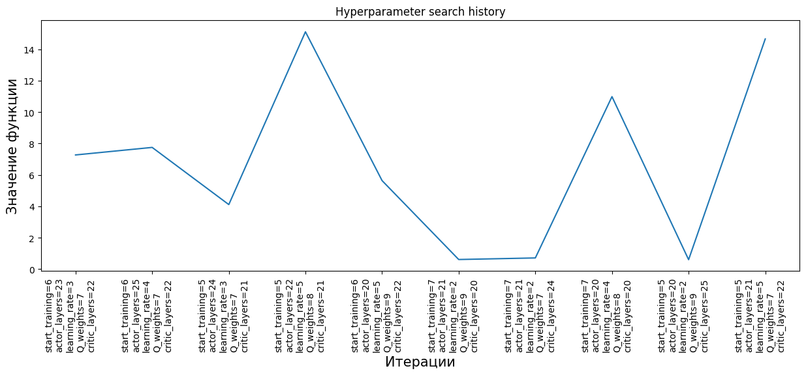

# Example: Hyperparameter search with Optuna

This example shows how to tune an [IHDP agent](../../agent/ihdp.md) on `LinearLongitudinalF16-v0` using TensorAeroSpace's thin wrapper around [Optuna](https://optuna.org/). The wrapper (`HyperParamOptimizationOptuna`) standardises the API so the same search loop drops in for other agents, but if you need anything Optuna offers that the wrapper doesn't expose, use Optuna directly — `self.study` is right there.

Source notebook: `example/optimization/example_optimization.ipynb`.

## What we are optimizing

- **Agent**: `IHDPAgent` — an online adaptive critic with a neural actor, neural critic, and an incremental plant model.
- **Env**: `LinearLongitudinalF16-v0` with a 5° α step reference at \(t = 10\) s over a 20-second episode.
- **Search space** (5 integer hyperparameters):

| Parameter | Range | Role |
|---|---|---|
| `start_training` | 5–7 (log) | Steps before the actor starts updating |
| `actor_layers` | 20–25 (log) | Hidden size of the actor MLP |
| `learning_rate` (actor) | 2–5 (log) | Actor learning-rate exponent |
| `Q_weights` | 7–9 | Critic tracking-error penalty |
| `critic_layers` | 20–25 (log) | Hidden size of the critic MLP |

- **Objective**: mean absolute tracking error on the second half of the episode, minimised.

## 1. Imports

```python
import gymnasium as gym
import numpy as np

import tensoraerospace  # registers Gymnasium environments
from tensoraerospace.agent.ihdp.model import IHDPAgent
from tensoraerospace.optimization import HyperParamOptimizationOptuna
from tensoraerospace.signals import unit_step
from tensoraerospace.utils import generate_time_period
```

## 2. Create the optimizer

```python
opt = HyperParamOptimizationOptuna(direction='minimize')
```

`HyperParamOptimizationOptuna` wraps `optuna.create_study(direction=...)`. The Optuna study is stored on `opt.study` if you need to plug in pruners, samplers, or resume from storage.

## 3. Shared simulation setup

Everything that does **not** depend on the trial lives outside the objective, so each trial reuses the same time grid and reference signal.

```python
dt = 0.01
tp = generate_time_period(tn=20, dt=dt)
number_time_steps = len(tp)

reference_signals = np.reshape(
    unit_step(degree=5, tp=tp, time_step=10, output_rad=True),
    [1, -1],
)
initial_state = np.array([[0.0], [0.0], [0.0]], dtype=np.float32)
```

## 4. Objective function

The objective builds a fresh env + agent from the `trial`-suggested hyperparameters, runs one 20-second episode, and returns the **mean absolute tracking error on the late half** — a more meaningful metric than a single-step reward (a last-step value is dominated by whichever instant you happen to stop at).

```python
def objective(trial):
    env = gym.make(
        'LinearLongitudinalF16-v0',
        number_time_steps=number_time_steps,
        initial_state=initial_state,
        reference_signal=reference_signals,
        state_space=["theta", "alpha", "q"],
        output_space=["theta", "alpha", "q"],
        control_space=["ele"],
        tracking_states=["alpha"],
        use_reward=False,  # reward is unused; we compute our own metric below
    )
    obs, info = env.reset()

    # ----- trial-suggested hyperparameters -----
    actor_settings = {
        "start_training": trial.suggest_int("start_training", 5, 7, log=True),
        "layers": (trial.suggest_int("actor_layers", 20, 25, log=True), 1),
        "activations": ('tanh', 'tanh'),
        "learning_rate": trial.suggest_int("learning_rate", 2, 5, log=True),
        "learning_rate_exponent_limit": 10,
        "type_PE": "combined",
        "amplitude_3211": 15,
        "pulse_length_3211": 5 / dt,
        "maximum_input": 25,
        "maximum_q_rate": 20,
        "WB_limits": 30,
        "NN_initial": 120,
        "cascade_actor": False,
        "learning_rate_cascaded": 1.2,
    }
    critic_settings = {
        "Q_weights": [trial.suggest_int('Q_weights', 7, 9)],
        "start_training": -1,
        "gamma": 0.99,
        "learning_rate": 15,
        "learning_rate_exponent_limit": 10,
        "layers": (trial.suggest_int("critic_layers", 20, 25, log=True), 1),
        "activations": ("tanh", "linear"),
        "WB_limits": 30,
        "NN_initial": 120,
        "indices_tracking_states": env.unwrapped.indices_tracking_states,
    }
    incremental_settings = {
        "number_time_steps": number_time_steps,
        "dt": dt,
        "input_magnitude_limits": 25,
        "input_rate_limits": 60,
    }

    agent = IHDPAgent(
        actor_settings, critic_settings, incremental_settings,
        env.unwrapped.tracking_states,
        env.unwrapped.state_space,
        env.unwrapped.control_space,
        number_time_steps,
        env.unwrapped.indices_tracking_states,
    )

    # ----- simulation -----
    xt = np.asarray(obs, dtype=np.float32).reshape(-1, 1)
    for step in range(number_time_steps - 1):
        ut = agent.predict(xt, reference_signals, step)
        obs, _, terminated, truncated, _ = env.step(np.array(ut))
        xt = np.asarray(obs, dtype=np.float32).reshape(-1, 1)
        if terminated or truncated:
            break

    # ----- episode-level metric: late-half α MAE (deg) -----
    alpha_hist_deg = env.unwrapped.model.get_state('alpha', to_deg=True)
    ref_deg = np.rad2deg(reference_signals[0, :len(alpha_hist_deg)])
    half = len(alpha_hist_deg) // 2
    return float(np.mean(np.abs(alpha_hist_deg[half:] - ref_deg[half:])))
```

!!! tip "Why late-half MAE?"
    Single-step rewards are noisy (they depend on *when* the episode ends and whether the last sample happens to be near the reference), while a mean over the second half of the episode smooths out the transient and reflects the controller's steady-state tracking quality. For step references, half the episode is a reasonable choice; for sinusoidal references, use the full episode after an initial warm-up.

## 5. Run the search

```python
opt.run_optimization(objective, n_trials=10)
```

10 trials is enough to see the shape of the landscape on this small search space; scale up to 50–100 for a production-quality sweep. Each trial runs one full 20-second simulation (~1–2 s on CPU), so a 100-trial sweep completes in ~2–3 minutes.

## 6. Inspect the result

```python
best = opt.get_best_param()
print(best)
```

Typical output (seed-dependent):

```
{'start_training': 5,
 'actor_layers': 25,
 'learning_rate': 5,
 'Q_weights': 8,
 'critic_layers': 25}
```

Plot the history of trial values to see convergence:

```python
fig = opt.plot_parms(figsize=(15, 5))
fig.show()
```



Each point on the curve is one trial; the x-axis label lists the hyperparameter combination for that trial, and the y-axis is the objective value (late-half α MAE in degrees).

## 7. Drop down to Optuna if you need more

The wrapper exposes the underlying study on `opt.study`, so the full Optuna ecosystem — pruners, samplers, RDB storage, distributed search — is one attribute away:

```python
import optuna

# Add a median pruner retrospectively:
print(opt.study.pruner)

# Get all trials as a dataframe:
df = opt.study.trials_dataframe()
print(df.head())

# Launch the interactive Optuna dashboard on this study:
# $ optuna-dashboard sqlite:///my_study.db
```

To persist the study between runs, build it with RDB storage and feed it into the wrapper yourself:

```python
import optuna
from tensoraerospace.optimization import HyperParamOptimizationOptuna

opt = HyperParamOptimizationOptuna(direction='minimize')
opt.study = optuna.create_study(
    direction='minimize',
    storage='sqlite:///ihdp_sweep.db',
    study_name='ihdp_f16_alpha_step',
    load_if_exists=True,
)
```

## See also

- [`HyperParamOptimizationRay`](../../optimization/optuna_based.md) — the Ray-Tune backend (same API surface, distributed execution).
- [`IHDP agent documentation`](../../agent/ihdp.md) — the hyperparameter reference for all the fields we tune above.
- [`IHDP on the linear F-16`](../agent/ihdp/example_ihdp.md) — the untuned baseline of the very same control task.
