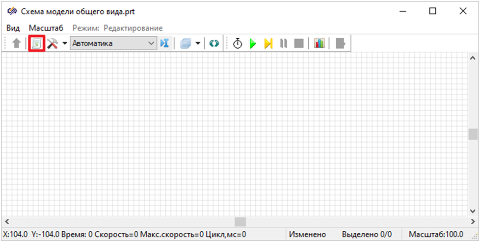
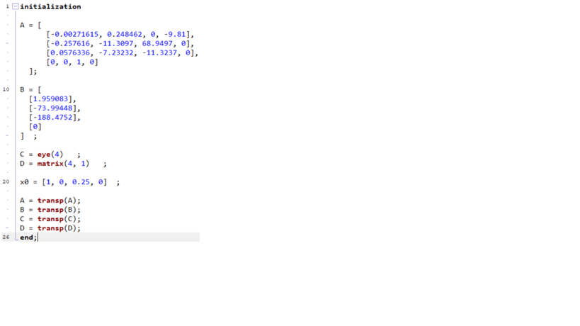
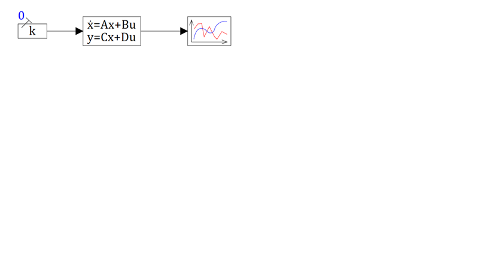
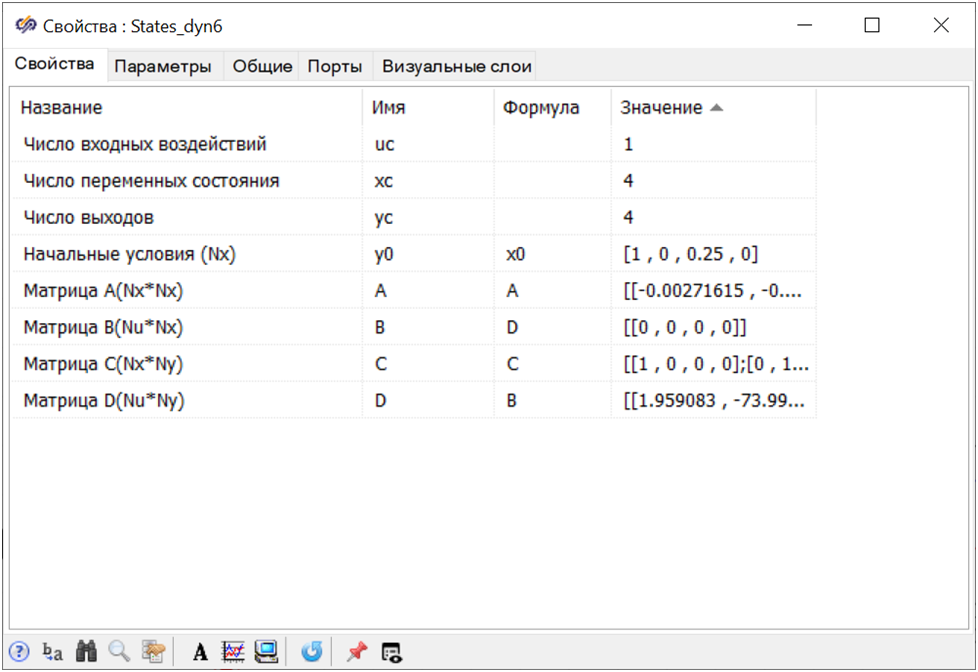
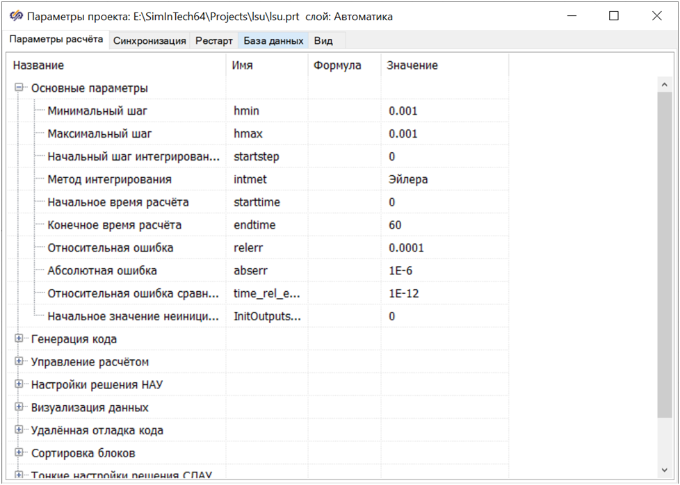

# SimInTech: что это и как быстро создать пример

SimInTech — это среда визуального моделирования и имитации динамических систем с блочным редактором и встроенным скриптовым языком. Она позволяет собирать схемы из стандартных блоков, описывать математику в скриптах и запускать численное моделирование с сохранением и визуализацией результатов.

Цели и требования
------------------

- Что вы сделаете:
  - Создадите проект и минимальную схему.
  - Напишете скрипт с параметрами и переменными состояния.
  - Настроите блоки и параметры расчета.
  - Запустите моделирование и увидите графики.
- Что потребуется:
  - Установленный SimInTech (актуальная версия).
  - Базовое понимание линейных моделей/состояний (опционально).

Шаг 1. Создайте проект
----------------------

В главном окне SimInTech нажмите «Файл» → «Новый проект» → «Схема модели общего вида».

Шаг 2. Добавьте скрипт проекта
-------------------------------

Нажмите кнопку «Скрипт» в окне проекта и создайте скрипт. В нем удобно объявлять параметры (например, матрицы `A`, `B`, вектор начальных условий `x0`, шаг интегрирования и т.д.).

Шаг 3. Соберите минимальную схему
----------------------------------

Разместите на поле проекта необходимые блоки:

- «Константа» из группы «Источники» — задание входного воздействия;
- «Переменные состояния» из группы «Динамические» — реализация состояния системы (ẋ = Ax + Bu);
- «Временной график» из группы «Вывод данных» — визуализация сигналов.

Соедините блоки линиями сигналов согласно вашей структуре (например, вход U → «Переменные состояния» → выходы X на график).

Шаг 4. Настройте блок «Переменные состояния»
--------------------------------------------

Откройте параметры блока и инициализируйте поля значениями из скрипта:

- «Начальные условия» → `x0`;
- «Матрица A (Nx*Ny)» → `A`;
- «Матрица B (Nx*Nu)» → `B` (и при необходимости `C`, `D`).

Проверьте размерности матриц и согласованность со схемой.

Шаг 5. Задайте параметры расчета
---------------------------------

В окне проекта откройте «Параметры расчета» и настройте:

- Временной интервал моделирования (t0, t_end);
- Шаг интегрирования/метод (фиксированный/переменный);
- Частоту сохранения результатов.

Шаг 6. Запустите моделирование
-------------------------------

Нажмите кнопку «Пуск». Убедитесь, что графики показывают ожидаемое поведение. При необходимости корректируйте параметры и снова запускайте расчет.

!!! tip "Полезно помнить"
    - Сохраняйте проект перед запуском, чтобы зафиксировать изменения скрипта.
    - При «жестких» системах уменьшайте шаг интегрирования или меняйте метод.
    - Подписывайте сигналы и оси — это облегчит анализ результатов.

Распространенные проблемы и решения
-----------------------------------

- «Переменная не найдена» при запуске:
  - Проверьте, что имя переменной точно совпадает и задано в скрипте до запуска.
- Пустые графики:
  - Убедитесь в правильности соединений между блоками и выборе отображаемых сигналов.
- Ошибка размерностей матриц:
  - Сверьте размеры `A`, `B`, `C`, `D` с количеством входов/выходов блока «Переменные состояния».
- Слишком медленный расчет:
  - Увеличьте шаг (если допустимо) или сократите модель до необходимого минимума.

Что дальше
----------

- Интеграция результатов и моделей с Python: см. раздел «Simintech to Python» — [simintechToPython.md](simintechToPython.md).
- Примеры систем и контроллеров в TensorAeroSpace — раздел «Examples» в документации.
