# Simulink → Python

> Интегрируйте модели Simulink в Python через динамические библиотеки, используя Embedded Coder и `ctypes`.

## Быстрый старт

1. В Simulink включите Embedded Coder и установите System target file: `ert_shrlib.tlc`.
2. Соберите модель (Ctrl+B) — появятся исходники и `MODEL_NAME.mk`.
3. Соберите библиотеку:

   ```bash
   make -f MODEL_NAME.mk
   ```

4. В Python загрузите библиотеку и вызовите `initialize → step → terminate`.

> Совет: держите библиотеки рядом с моделью (например, `simulinkModel/<model_name>`), чтобы не зависеть от текущего каталога.

---

## Кросс‑платформенная загрузка библиотеки

=== "Windows"

    ```python
    import ctypes
    from pathlib import Path

    path = Path("../tensoraerospace/aerospacemodel/model/simulinkModel/b747/b747_model_win64.dll")
    lib = ctypes.WinDLL(str(path))
    ```

=== "Linux"

    ```python
    import ctypes
    from pathlib import Path

    path = Path("../tensoraerospace/aerospacemodel/model/simulinkModel/b747/b747_model_glnxa64.so")
    lib = ctypes.CDLL(str(path))
    ```

=== "macOS"

    ```python
    import ctypes
    from pathlib import Path

    path = Path("../tensoraerospace/aerospacemodel/model/simulinkModel/b747/b747_model_maci64.dylib")
    lib = ctypes.CDLL(str(path))
    ```

Или используйте универсальную функцию:

```python
import sys
import ctypes
from pathlib import Path


def load_simulink_lib(folder: str | Path, basename: str) -> ctypes.CDLL:
    """Загрузка *.dll/*.so/*.dylib с учётом платформы и типичных суффиксов MATLAB.

    folder   — каталог с библиотекой
    basename — базовое имя (например, 'b747_model', 'f16_model')
    """
    folder = Path(folder)
    is_win = sys.platform.startswith("win")
    is_mac = sys.platform == "darwin"

    ext = "dll" if is_win else ("dylib" if is_mac else "so")

    # Типичные варианты имён, генерируемых Embedded Coder
    candidates = [
        f"{basename}.{ext}",           # model.dll / model.so / model.dylib
        f"{basename}_win64.dll",
        f"{basename}_glnxa64.so",
        f"{basename}_maci64.dylib",
    ]

    for name in candidates:
        path = folder / name
        if path.exists():
            return ctypes.WinDLL(str(path)) if is_win else ctypes.CDLL(str(path))

    raise FileNotFoundError(
        f"Не найдена библиотека для {basename} в {folder} (пробовал: {', '.join(candidates)})"
    )
```

!!! note "Типы данных"
    Типы `real32_T`, `ExtY_T`, `ExtY_T_r` находятся в `tensoraerospace/aerospacemodel/utils/rtwtypes.py` и соответствуют сгенерированным структурам/типам модели.

---

## Генерация C/С++ кода (Embedded Coder)

Для интеграции моделей Simulink в Python требуется надстройка Simulink — Embedded Coder.

1. Откройте настройки модели в Simulink и выберите Code Generation → System target file: `ert_shrlib.tlc`.

   { width=400 }

2. Соберите модель сочетанием клавиш Ctrl+B (или меню Build model). В каталоге модели появится папка с сгенерированным кодом и make‑файлом с расширением `.mk`.
3. Соберите динамическую библиотеку командой:

   ```bash
   make -f MODEL_NAME.mk
   ```

   В результате будет создана динамическая библиотека: на Windows — `.dll`, на Linux — `.so`, на macOS — `.dylib`.

!!! tip "Windows"
    Сборка может требовать инструменты MSVC (`Developer Command Prompt`) или MinGW/MSYS. Убедитесь, что компилятор и `make/nmake` доступны в PATH.

---

## Создание ОУ в Simulink

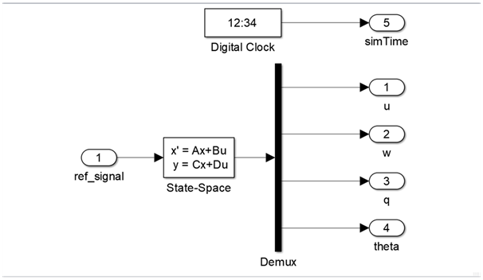{ width=400 }

Для создания объекта управления (ОУ) в Simulink добавьте элементы:

- Simulink/Continuous/State‑Space
- Simulink/Sources/Digital Clock
- Simulink/Commonly Used Blocks/In1
- Simulink/Commonly Used Blocks/Out1

Далее:

1. Переименуйте блоки `In1`/`Out1` в осмысленные имена.
2. В блоке State‑Space задайте параметры (для удобства можно использовать MATLAB Script).

   { width=400 }

3. Пример MATLAB‑скрипта для запуска модели:

   ```matlab
   flag = 1;

   % Инициализация параметров
   [A, B, C, D] = b747_model(flag);

   init = [0, -0.0, -0.0, 0];
   ref_signal = -0.10;

   % Время начала/конца/шага моделирования
   t_s = 0;
   t_e = 500;
   dt  = 0.1;

   % Запуск Simulink модели
   simOut = sim('aircraft_sim.slx');

   y = simOut.get('yout');

   u     = y.getElement(1).Values.Data;
   w     = y.getElement(2).Values.Data;
   q     = y.getElement(3).Values.Data;
   theta = y.getElement(4).Values.Data;
   t     = y.getElement(5).Values.Data;
   ```

---

## Интеграция с Python (ctypes)

Интеграция выполняется через динамическую библиотеку, скомпилированную из модели. В библиотеке, как правило, есть три функции:

- `MODEL_NAME_initialize` — инициализация модели
- `MODEL_NAME_step` — расчёт следующего шага (шаг равен `dt`, заданному в MATLAB‑скрипте)
- `MODEL_NAME_terminate` — освобождение ресурсов

Для согласования типов используйте `ctypes` и преобразователи типов из `tensoraerospace`: `tensoraerospace/aerospacemodel/utils/rtwtypes.py`.

### Пример: Boeing‑747

```python
import matplotlib.pyplot as plt
from pathlib import Path
from tensoraerospace.aerospacemodel.utils.rtwtypes import real32_T, ExtY_T

# Загрузка библиотеки
b747_folder = Path("../tensoraerospace/aerospacemodel/model/simulinkModel/b747")
b747 = load_simulink_lib(b747_folder, "b747_model")

# Точки входа
b747_initialize = b747.b747_model_initialize
b747_step       = b747.b747_model_step
b747_terminate  = b747.b747_model_terminate

# Параметры/входы (пример: единичный вход в виде real32_T)
ref_signal = real32_T.in_dll(b747, "b747_model_U")  # зависит от структуры входов конкретной модели

# Выходная структура
b747_Y = ExtY_T.in_dll(b747, "b747_model_Y")

# Цикл моделирования
b747_initialize()

time, u, w, q, theta = [], [], [], [], []
for _ in range(int(2100)):
    b747_step()
    time.append(float(b747_Y.time))
    u.append(float(b747_Y.u))
    w.append(float(b747_Y.w))
    q.append(float(b747_Y.q))
    theta.append(float(b747_Y.theta))

b747_terminate()

# Визуализация
plt.plot(time, u)
plt.xlabel('t, [сек]')
plt.ylabel('u, [м/c]')
plt.show()
```

Примеры графиков:

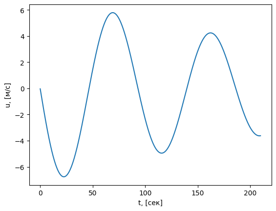{ width=400 }
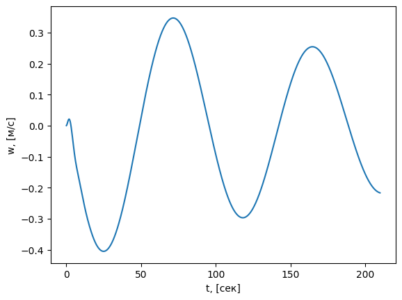{ width=400 }
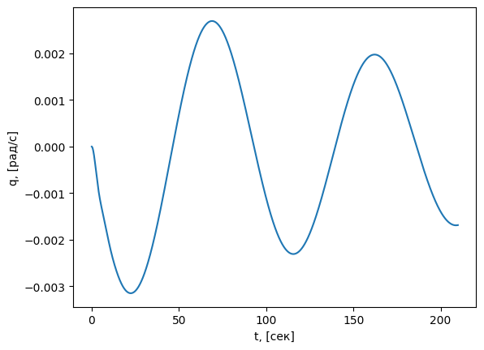{ width=400 }
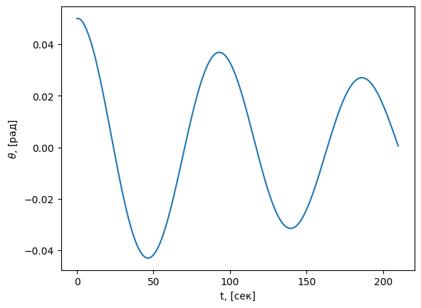{ width=400 }

---

### Пример: F‑16

```python
import matplotlib.pyplot as plt
from pathlib import Path
from tensoraerospace.aerospacemodel.utils.rtwtypes import real32_T, ExtY_T

f16_folder = Path("../tensoraerospace/aerospacemodel/model/simulinkModel/f16")
f16 = load_simulink_lib(f16_folder, "f16_model")

f16_initialize = f16.f16_model_initialize
f16_step       = f16.f16_model_step
f16_terminate  = f16.f16_model_terminate

ref_signal = real32_T.in_dll(f16, "f16_model_U")
f16_Y = ExtY_T.in_dll(f16, "f16_model_Y")

f16_initialize()

time, u, w, q, theta = [], [], [], [], []
for _ in range(int(2100)):
    f16_step()
    time.append(float(f16_Y.time))
    u.append(float(f16_Y.u))
    w.append(float(f16_Y.w))
    q.append(float(f16_Y.q))
    theta.append(float(f16_Y.theta))

f16_terminate()

plt.plot(time, u)
plt.xlabel('t, [сек]')
plt.ylabel('u, [м/c]')
plt.show()
```

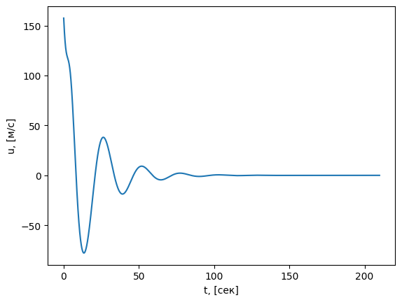{ width=400 }
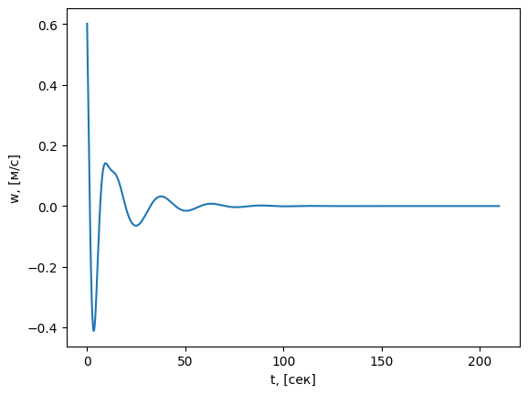{ width=400 }
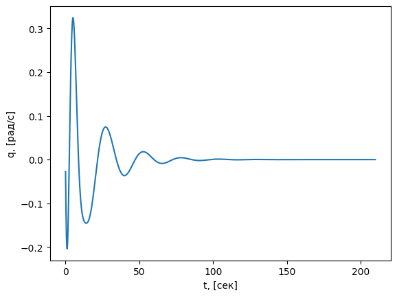{ width=400 }
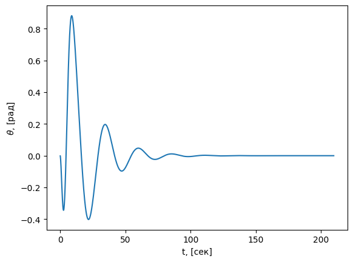{ width=400 }

---

### Пример: ELV (ракета)

```python
import matplotlib.pyplot as plt
from pathlib import Path
from tensoraerospace.aerospacemodel.utils.rtwtypes import real32_T, ExtY_T_r

elv_folder = Path("../tensoraerospace/aerospacemodel/model/simulinkModel/elv")
elv = load_simulink_lib(elv_folder, "elv_model")

elv_initialize = elv.elv_model_initialize
elv_step       = elv.elv_model_step
elv_terminate  = elv.elv_model_terminate

ref_signal = real32_T.in_dll(elv, "elv_model_U")
elv_Y = ExtY_T_r.in_dll(elv, "elv_model_Y")

elv_initialize()

time, w, q, theta = [], [], [], []
for _ in range(int(20)):
    elv_step()
    time.append(float(elv_Y.time))
    w.append(float(elv_Y.w))
    q.append(float(elv_Y.q))
    theta.append(float(elv_Y.theta))

elv_terminate()

plt.plot(time, w)
plt.xlabel('t, [сек]')
plt.ylabel('w, [рад/c]')
plt.show()
```

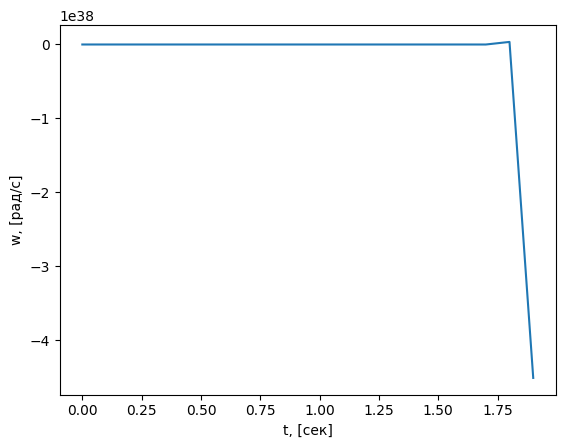{ width=400 }
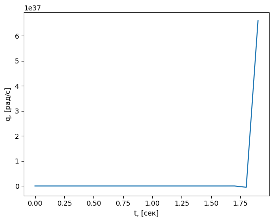{ width=400 }
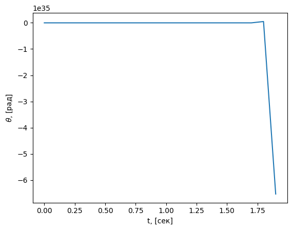{ width=400 }

---

### Пример: Typical Rocket

```python
import matplotlib.pyplot as plt
from pathlib import Path
from tensoraerospace.aerospacemodel.utils.rtwtypes import real32_T, ExtY_T

rocket_folder = Path("../tensoraerospace/aerospacemodel/model/simulinkModel/rocket")
rocket = load_simulink_lib(rocket_folder, "rocket_model")

rocket_initialize = rocket.rocket_model_initialize
rocket_step       = rocket.rocket_model_step
rocket_terminate  = rocket.rocket_model_terminate

ref_signal = real32_T.in_dll(rocket, "rocket_model_U")
rocket_Y = ExtY_T.in_dll(rocket, "rocket_model_Y")

rocket_initialize()

time, u, w, q, theta = [], [], [], [], []
for _ in range(int(2100)):
    rocket_step()
    time.append(float(rocket_Y.time))
    u.append(float(rocket_Y.u))
    w.append(float(rocket_Y.w))
    q.append(float(rocket_Y.q))
    theta.append(float(rocket_Y.theta))

rocket_terminate()

plt.plot(time, u)
plt.xlabel('t, [сек]')
plt.ylabel('u, [м/c]')
plt.show()
```

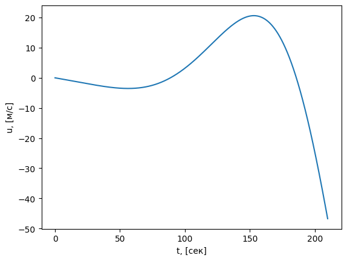{ width=400 }
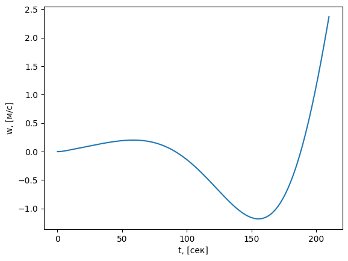{ width=400 }
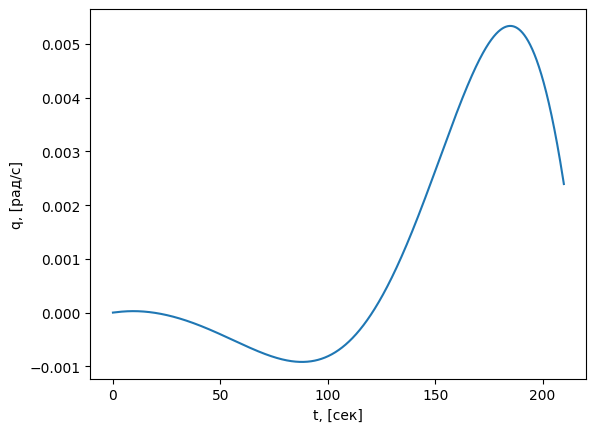{ width=400 }
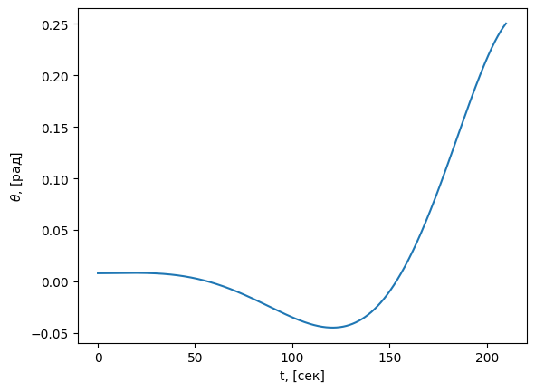{ width=400 }

---

## Частые проблемы и решения

- «Не найдена библиотека …»: проверьте имя файла, платформенный суффикс (`_win64.dll`, `_glnxa64.so`, `_maci64.dylib`) и путь.
- «undefined symbol / entry point not found»: используйте правильные имена функций (`<model>_initialize/step/terminate`).
- Windows: запустите сборку из `Developer Command Prompt for VS` или установите MinGW/MSYS. Проверьте PATH (`cl`, `nmake` или `gcc`, `make`).
- Linux/macOS: убедитесь, что `LD_LIBRARY_PATH`/`DYLD_LIBRARY_PATH` включает каталог библиотеки, либо используйте абсолютный путь при загрузке.

```bash
# Linux
export LD_LIBRARY_PATH=$(pwd):$LD_LIBRARY_PATH
# macOS
export DYLD_LIBRARY_PATH=$(pwd):$DYLD_LIBRARY_PATH
```

!!! warning "Совместимость типов"
    Поля структур `*_Y` и `*_U` должны соответствовать сгенерированным в вашей модели. Если имена/состав отличаются, обновите обращения в Python.

---

## Чек‑лист для ваших моделей

- [ ] Включён `ert_shrlib.tlc` и собран `.mk` файл
- [ ] Библиотека успешно собралась (`.dll`/`.so`/`.dylib`)
- [ ] Известны имена функций `<model>_initialize/step/terminate`
- [ ] Определены типы и имена глобальных переменных `*_U`, `*_Y`
- [ ] Python‑скрипт загружает библиотеку и выполняет цикл шага

---

## Полезное

- Типы `real32_T`, `ExtY_T`, `ExtY_T_r` определены в `tensoraerospace/aerospacemodel/utils/rtwtypes.py`.
- Имена глобальных переменных входов/выходов в библиотеке (`*_U`, `*_Y`) зависят от сгенерированного кода и могут отличаться для разных моделей.
- См. также: «Ваши модели Simulink в Python» — `your_sim.md` в этом разделе.
