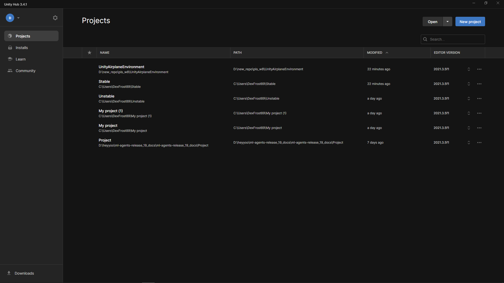
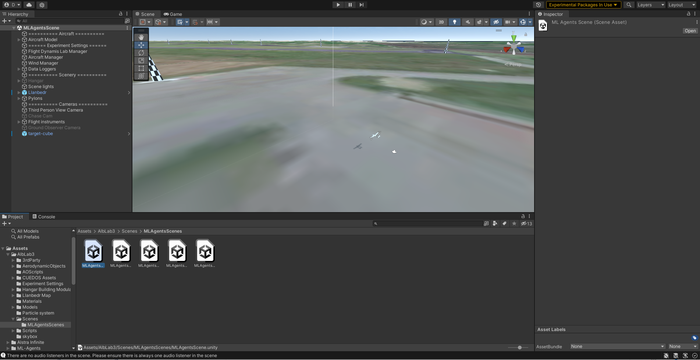

# Setting up the Unity environment

> A quick, visual guide to launching the Unity environment and connecting from Python (TensorAeroSpace + ML‑Agents).

<div class="grid cards" markdown>

-   :material-rocket-launch-outline: **Quick start**

    Clone the project, install dependencies, open a scene, and run.

    [:octicons-arrow-right-24: Jump in](#quick-start)

-   :material-cube-outline: **Build the environment**

    How to build a standalone player and launch in headless mode.

    [:octicons-arrow-right-24: Jump in](#build-the-environment)

-   :material-connection: **Python connection**

    Example via `gym-unity`: build and (optionally) Editor.

    [:octicons-arrow-right-24: Jump in](#connect-from-python)

-   :material-lifebuoy: **Troubleshooting**

    Common problems and how to solve them.

    [:octicons-arrow-right-24: Jump in](#common-problems-and-solutions)

</div>

---

## Requirements

- **Unity Hub** and **Unity 2021.3.5f1** (tested)
- **Python 3.8+** (3.10–3.11 recommended) with `pip`
- Access to the `UnityAirplaneEnvironment` repository

!!! note "Version compatibility"
    The examples rely on Unity 2021.3.5f1 + `gym-unity==0.28.0`. Check the ML‑Agents docs for other versions.

---

## Quick start {#quick-start}

### 1) Clone the repository

```shell
git clone git@github.com:tensoraerospace/UnityAirplaneEnvironment.git
cd UnityAirplaneEnvironment
```

!!! info "HTTPS alternative"
    ```shell
    git clone https://github.com/TensorAeroSpace/UnityAirplaneEnvironment.git
    ```

### 2) Python dependencies

Install the packages that bridge Unity and Python:

```shell
pip install gym==0.20.0 gym-unity==0.28.0 mlagents_envs==0.28.0
```

!!! tip "Isolated environment"
    Using `venv`/`conda` is recommended.

### 3) Install Unity

- Install Unity Hub: `https://unity.com/download`
- In the Hub add the **Unity 2021.3.5f1** editor: `https://unity.com/releases/editor/archive`

!!! warning "Important"
    Use the specified editor version. Mismatched versions can break packages/scenes.

### 4) Open the project in Unity Hub

1) Launch Unity Hub → "Open" → point to the project directory.  
2) Select the project and open it.

{ width=800 }
{ width=800 }
{ width=800 }

### 5) Choose a scene and run it

In Unity Editor open `Assets/AlbLab3/Scenes/MLAgentsScenes` → e.g. `MLAgentsScene`.

{ width=800 }

Press ▶ (Play) — the scene should start without errors.

!!! success "All set"
    If Play runs and agents activate, you can proceed to the Python connection.

---

## Build the environment {#build-the-environment}

Recommended for stable runs and headless mode:

1) In Unity go to File → Build Settings…  
2) Select the platform (Windows/Mac/Linux) and add the scene to "Scenes In Build".  
3) (Optional) Player Settings → enable "Run In Background".  
4) Click "Build" and choose a path (e.g. `./Builds/AirplaneEnv/AirplaneEnv`).

!!! note "Headless"
    For servers and CI use a build without graphics and set `no_graphics=True` when initializing the environment from Python.

---

## Connect from Python {#connect-from-python}

=== "Build"

```python
from gym_unity.envs import UnityToGymWrapper
from mlagents_envs.environment import UnityEnvironment

# Path to the built environment
env_path = "./Builds/AirplaneEnv/AirplaneEnv"
unity_env = UnityEnvironment(file_name=env_path, no_graphics=True)
env = UnityToGymWrapper(unity_env, uint8_visual=False)

obs = env.reset()
done = False
total_reward = 0.0

while not done:
    action = env.action_space.sample()
    obs, reward, done, info = env.step(action)
    total_reward += reward

print("Episode reward:", total_reward)
env.close()
```

=== "Editor (optional)"

```python
from gym_unity.envs import UnityToGymWrapper
from mlagents_envs.environment import UnityEnvironment

# Connect to the Editor: run the scene in Play mode and allow the connection
unity_env = UnityEnvironment(file_name=None)
env = UnityToGymWrapper(unity_env, uint8_visual=False)

obs = env.reset()
action = env.action_space.sample()
obs, reward, done, info = env.step(action)
env.close()
```

!!! info "Editor vs Build"
    - Editor is convenient for debugging; the connection may not always be stable.  
    - Build is preferable for experiments/servers (no graphics).

---

## Common problems and solutions {#common-problems-and-solutions}

- **Package version mismatch**  
  Ensure you installed compatible versions: `gym==0.20.0`, `gym-unity==0.28.0`, `mlagents_envs==0.28.0`.

- **Scene fails to run (Editor)**  
  Check the Unity console, the packages listed in `Packages/manifest.json`, and that the scene is added to Build Settings.

- **Python cannot find the environment**  
  Verify the `file_name` path to the build (for Build) or that the Editor is in Play mode (for Editor).  
  On Linux make sure the binary is executable (`chmod +x`).

- **Port conflicts**  
  If the port is busy, close other environment/Editor instances. Restart the Python process.

---

## What's next

- Run TensorAeroSpace examples and agents (see the "Models" and "Agents" sections)
- Integrate the Unity environment into benchmarks/training scripts
- Build your own controllers and rewards, assemble scenes for your tasks
