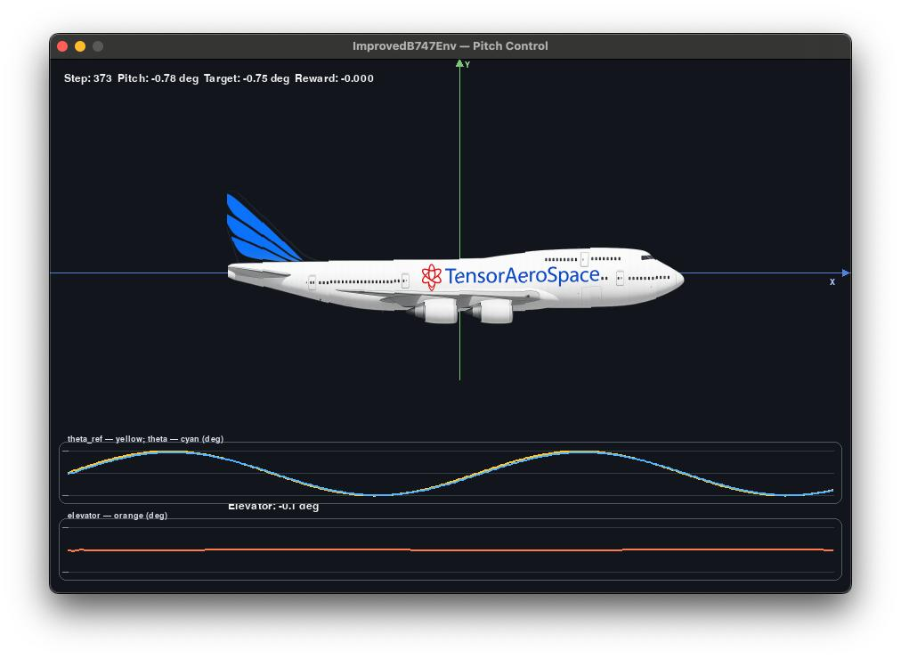

---
hide:
  - navigation
  - toc
---

<div class="hero">
  <h1>TensorAeroSpace</h1>
  <p class="tagline">Realistic aerospace environments and RL algorithms for training control systems</p>
  <p>
    <a href="guide/installation.md" class="md-button md-button--primary">Installation</a>
    <a href="lesson/0intro.md" class="md-button">Tutorials</a>
    <a href="agent/sac.md" class="md-button">Algorithms</a>
    <a href="model/f16.md" class="md-button">Models</a>
  </p>
  <p>
    <a href="https://github.com/TensorAeroSpace/TensorAeroSpace"></a>
    <a href="https://pypi.org/project/tensoraerospace/"></a>
    <a href="https://huggingface.co/TensorAeroSpace"></a>
    <a href="https://pypi.org/project/tensoraerospace/"></a>
    <a href="https://pypi.org/project/tensoraerospace/"></a>
    <a href="https://github.com/TensorAeroSpace/TensorAeroSpace/blob/develop/LICENSE"></a>
    <a href="https://deepwiki.com/TensorAeroSpace/TensorAeroSpace"></a>
  </p>
</div>

<style>
.hero {
  text-align: center;
  margin: 2rem 0 2.5rem 0;
  padding: 2.2rem 1rem;
  background: linear-gradient(120deg, rgba(59,130,246,.18), rgba(59,130,246,0) 50%),
              radial-gradient(60rem 60rem at 10% -20%, rgba(59,130,246,.25), transparent 40%),
              radial-gradient(50rem 50rem at 90% 120%, rgba(59,130,246,.18), transparent 40%),
              linear-gradient(135deg, rgba(59,130,246,.08), rgba(59,130,246,0));
  background-size: 200% 200%, auto, auto, auto;
  animation: gradientShift 12s ease-in-out infinite alternate;
  border-radius: 16px;
}
@keyframes gradientShift {
  0% { background-position: 0% 50%, 0 0, 0 0, 0 0; }
  100% { background-position: 100% 50%, 0 0, 0 0, 0 0; }
}
.hero .tagline {
  font-size: 1.08rem;
  color: var(--md-default-fg-color--light);
  margin-top: .3rem;
}
.hero .md-button { margin: .25rem .25rem; }
.hero a img { vertical-align: middle; margin: 0 .22rem; }
.cards .card-icon { font-size: 1.6rem; }
.stats { text-align: center; margin: 1.5rem 0 0; color: var(--md-default-fg-color--light); }
.logos { display: flex; gap: 1.2rem; align-items: center; justify-content: center; flex-wrap: wrap; margin: 1rem 0; }
.logos img { height: 42px; opacity: .9; filter: saturate(0) contrast(1.1); }
</style>

<div class="grid cards" markdown>

-   :material-rocket-launch-outline: **Quick start**

    Install the library, choose a model, and run your first agent.

    [:octicons-arrow-right-24: Installation](guide/installation.md)

-   :material-robot-outline: **RL algorithms**

    Modern algorithms: DQN, A3C/A2C‑NARX, PPO, SAC, DDPG, GAIL.

    [:octicons-arrow-right-24: Explore](agent/sac.md)

-   :material-airplane-takeoff: **Models**

    F‑16, Boeing‑747, X‑15, satellites and rockets with ready‑to‑use environments.

    [:octicons-arrow-right-24: Browse](model/f16.md)

-   :material-cog-outline: **Gym integration**

    Compatible environments and a simple API for training and evaluation.

    [:octicons-arrow-right-24: Learn more](example/environment/gymnasium.md)

-   :material-school-outline: **Tutorials**

    Hands‑on practice with XFLR5, Simulink, SimInTech, and control theory.

    [:octicons-arrow-right-24: Go to tutorials](lesson/0intro.md)

-   :material-chart-line: **Benchmarking**

    Metrics, agent comparisons, and experiment examples.

    [:octicons-arrow-right-24: Metrics](benchmark/metrics.md)

</div>

---

## Key benefits

<div class="grid cards" markdown>

-   :material-speedometer: **Performance**

    Lightweight environments and fast experiments — less code, more results.

-   :material-brain: **Modern RL stack**

    DDPG, SAC, PPO, GAIL, etc. with a convenient API and examples.

-   :material-cube-outline: **Physically accurate models**

    Linear longitudinal models, rockets, aircraft, satellites.

-   :material-puzzle-outline: **Integrations**

    Gymnasium, Simulink/MATLAB, SimInTech — ready‑to‑use integrations.

-   :material-book-open-variant: **Clear documentation**

    Step‑by‑step tutorials, recipes, best practices, and typical problem walkthroughs.

-   :material-chart-areaspline: **Benchmarking**

    Metrics, comparisons, and reproducible experiments.

</div>

## Feature overview

=== "Agents"

    - IHDP, DQN, A3C/A2C‑NARX, PPO, SAC, DDPG, GAIL
    - Experience buffers, OU noise, stochastic/deterministic policies
    - GAE, PPO update, GAIL discriminator

=== "Models"

    - F‑16, B747, X‑15, generic rocket, satellites
    - State-space matrices, linear/linearized models
    - Examples with controller training

=== "Documentation"

    - Step‑by‑step lessons for XFLR5/Simulink/SimInTech
    - Guides and integration examples
    - Links to examples and benchmarks

---

## Installation

=== "pip"

    ```bash
    pip install tensoraerospace
    ```

=== "poetry"

    ```bash
    poetry add tensoraerospace
    ```

=== "conda"

    ```bash
    conda create -n tas python=3.10
    conda activate tas
    pip install tensoraerospace
    ```

## Quick examples

=== "Pretrained SAC Agent"

    Run a pretrained Soft Actor-Critic agent on Boeing 747 pitch control:

    

    ```bash
    python example/reinforcement_learning/sac-b747-render.py \
        --render \
        --dt 0.1 \
        --tn 200 \
        --repo TensorAeroSpace/sac-b747 \
        --device cuda  # Optional: auto-detects GPU if available
    ```

    Or use the Python API:

    ```python
    import torch
    from tensoraerospace.agent.sac import SAC
    from tensoraerospace.envs.b747 import ImprovedB747Env

    # Auto-detect device (CUDA/MPS/CPU)
    device = torch.device("cuda" if torch.cuda.is_available() else 
                         ("mps" if hasattr(torch.backends, "mps") and 
                          torch.backends.mps.is_available() else "cpu"))

    # Load pretrained agent from Hugging Face
    agent = SAC.from_pretrained("TensorAeroSpace/sac-b747")
    
    # Move agent to GPU if available
    if agent.device != device:
        agent.device = device
        agent.critic = agent.critic.to(device)
        agent.critic_target = agent.critic_target.to(device)
        agent.policy = agent.policy.to(device)

    # Create environment
    env = ImprovedB747Env(dt=0.1, number_time_steps=200)
    
    # Run evaluation
    obs, info = env.reset()
    done = False
    while not done:
        action = agent.select_action(obs, evaluate=True)
        obs, reward, terminated, truncated, info = env.step(action)
        env.render(mode="human")
        done = terminated or truncated
    ```

    [:octicons-arrow-right-24: Full SAC B747 tutorial](example/agent/sac/example-sac-b747.md)

=== "PID Controller"

    ```python
    import gymnasium as gym
    import numpy as np

    from tensoraerospace.agent.pid import PID
    from tensoraerospace.utils import generate_time_period
    from tensoraerospace.signals.standard import unit_step

    # Simulation setup
    dt = 0.01
    tp = generate_time_period(tn=10, dt=dt)  # 10 seconds
    N = len(tp)

    # Reference signal for alpha tracking (5 deg step in radians)
    reference = unit_step(
        degree=5, tp=tp, time_step=100, output_rad=True
    ).reshape(1, -1)

    # Create F-16 longitudinal environment
    env = gym.make(
        'LinearLongitudinalF16-v0',
        number_time_steps=N,
        initial_state=[[0], [0]],
        reference_signal=reference,
        use_reward=False,
    )

    # PID controller with tuned coefficients
    pid = PID(
        env,
        kp=-14.290139135229715,
        ki=-8.240470780203491,
        kd=-1.2991634935096958,
        dt=dt
    )

    obs, info = env.reset()
    for t in range(N - 1):
        setpoint = reference[0, t]
        alpha = float(obs[0])
        u = pid.select_action(setpoint, alpha)
        action = np.array([[float(u)]], dtype=np.float32)
        obs, reward, terminated, truncated, info = env.step(action)
        if terminated or truncated:
            break
    ```

## Why TensorAeroSpace?

- Realistic aerodynamic models and state-space matrices
- Integration with MATLAB/Simulink and SimInTech
- Ready environments and controller training templates

## Useful links

- Guide: [guide/installation](guide/installation.md)
- Lessons: [lesson/0intro](lesson/0intro.md)
- Models: [model/f16](model/f16.md), [model/b747](model/b747.md)
- Algorithms: [agent/sac](agent/sac.md), [agent/ppo](agent/ppo.md), [agent/ddpg](agent/ddpg.md)
- Examples: [example/environment/gymnasium](example/environment/gymnasium.md)

---

Need help? Open an issue on GitHub or check the tutorials section.

---

## Some numbers

<div class="grid cards" markdown>

-   :material-brain: **RL algorithms**

    8+ implemented methods: IHDP, DQN, A3C/A2C‑NARX, PPO, SAC, DDPG, GAIL

-   :material-airplane: **Aerospace models**

    10+ models: F‑16, B747, X‑15, rockets and satellites

-   :material-python: **Python support**

    3.10 — 3.12, compatible with the Gymnasium ecosystem

-   :material-license: **License**

    MIT — free for academia and industry

</div>

## Who uses it

<div class="logos">
  
  <span>… plus research groups and enthusiasts</span>
  
</div>

<div style="text-align:center; margin: 1.2rem 0 0.2rem;">
  <a href="guide/installation.md" class="md-button md-button--primary">Get started</a>
  <a href="example/environment/gymnasium.md" class="md-button">View examples</a>
</div>
