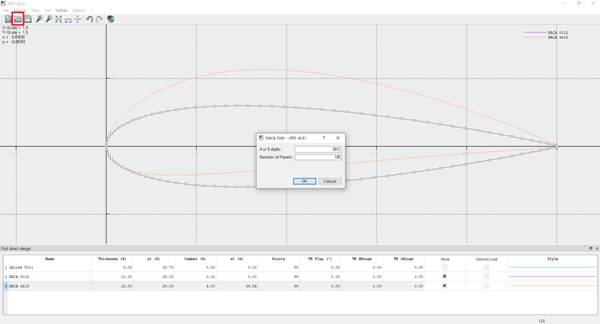
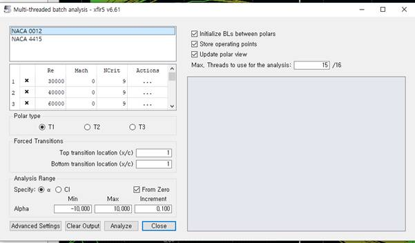
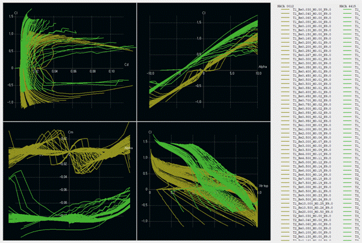

# Airfoil Analysis

## Goal

Prepare and analyze the aerodynamic characteristics of a wing profile in XFLR5: select or create a profile, compute Cl, Cd, and Cm across ranges of angles of attack, Reynolds numbers, and Mach numbers, and save the polar curves for subsequent aircraft analysis.

## Step-by-Step Plan

1. Open the Direct Foil Design tab (Ctrl+1).
2. Create a NACA profile (Alt+N) or load your own profile from a .dat file.
3. Go to XFoil Direct Analysis → Analysis → Batch Analysis.
4. Set the ranges: Reynolds numbers, Mach numbers, angles of attack (start, end, step).
5. Run the analysis and review the polar curves. Save the results.

## Analysis Parameters — Summary

- Re (Reynolds number): defines the flow regime (laminar/turbulent) and model scale.
- M (Mach number): important at high speeds (compressibility effects).
- α (angle of attack): range used to build polars and find maximum efficiency.

## Notes and Tips

> Tip: For aircraft-level analysis, it is best to have polars for several Reynolds numbers (e.g., different flight speeds). This increases the fidelity of the final model.
> Note: If the profile is non-standard, verify the .dat file (number of points, ordering). Errors in the file lead to incorrect polar curves.

For the first stage, press `Ctrl+1` or select `Direct Foil Design` from the tab panel. Then press `Alt+N` to create NACA profiles. For a custom profile, use the `.dat` loader (highlighted in red in the figure).

{ width=800 }

{ width=800 }

After defining the profiles, compute the aerodynamics in `XFoil Direct Analysis`. In the `Analysis` → `Batch Analysis` tab, set Re, M, and angles of attack. Aircraft analysis requires data for multiple Re values.

{ width=800 }

{ width=800 }
