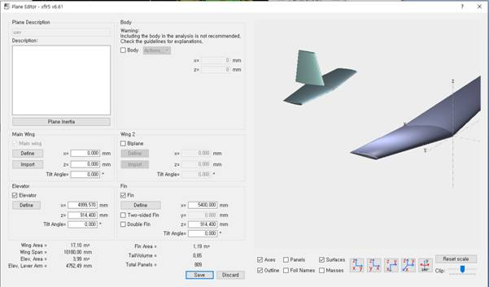
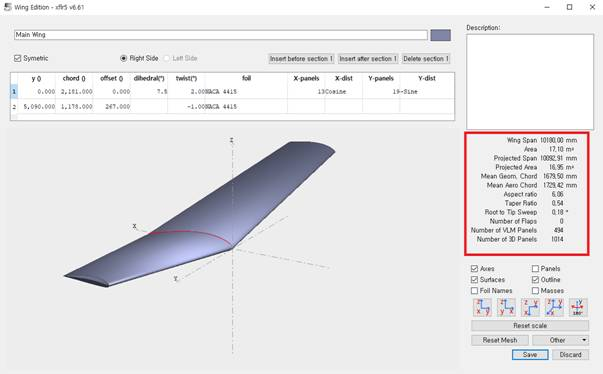
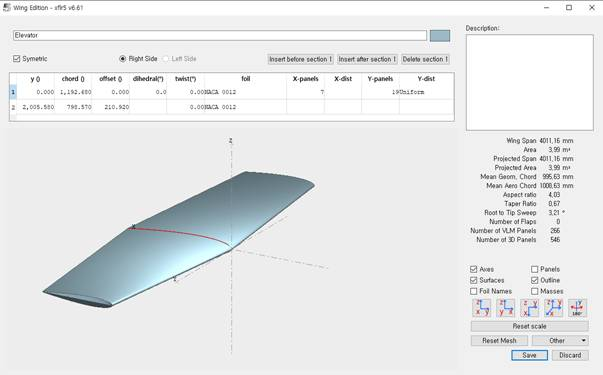
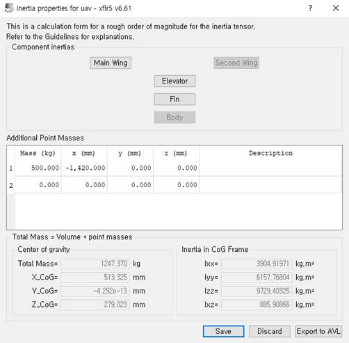

# Plane Analysis: Aerodynamic Analysis

## Goal

Build the aircraft geometry (wing/tail), set the inertial characteristics, and perform an aerodynamic computation to obtain polars and integral coefficients.

## Step-by-Step Plan

1. Open Wing and Plane Design → Define New Plane (or press F3).
2. In the Define section, specify span, chords, sweep, airfoils, and the position of components along the x/y/z axes.
3. Go to Plane inertia and set the mass; moments of inertia will be calculated automatically (override manually if needed).
4. Open Analysis → Define an Analysis and set the calculation parameters: Polar Type, Method, Inertia/Ref dimension, density/viscosity (Aero data), additional drag (Extra drag).
5. Run the analysis, review the polar curves and key metrics (efficiency, moment coefficients, neutral point location).

## Tips

> Tip: If the aircraft will operate in different regimes, create several analyses with distinct settings (mass, Re, M) and compare the results.

To build the aircraft, go to `Wing and Plane Design` and press `F3` or select `Define New Plane`.

{ width=800 }

`Define` is used to specify wing span, chord length, sweep, and airfoil; it also provides the main parameters (area, aspect ratio, mean aerodynamic chord) for the Main Wing, Elevator, Fin, as well as the position of the components along the x, y, and z axes.

{ width=800 }

{ width=800 }

{ width=800 }

To compute the aerodynamic characteristics, set the mass and (if necessary) the moments of inertia on the Plane inertia tab. After the mass is specified, inertia values are calculated automatically; the aircraft sketch appears in the workspace along with the primary physical and geometric characteristics on the left.

{ width=800 }

{ width=800 }

Next, in the `Analysis` tab → `Define an Analysis`, configure the run parameters.

{ width=800 }

`Polar Type` selects the type of polars, `Analysis` — the computation method, `Inertia` — the option to set custom moments of inertia, `Ref dimension` — the similarity criterion, `Aero data` — density and kinematic viscosity, `Extra drag` — additional drag.

From the results you can see whether the aircraft is statically stable, at which angles the maximum efficiency is achieved, and how the pitching moment behaves.

{ width=800 }
