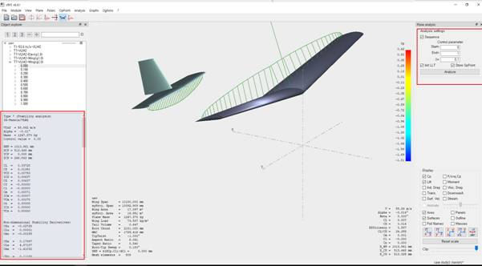

# Plane Analysis: Stability Analysis

## Goal

Compute the longitudinal and lateral dynamics (static and dynamic stability), obtain the state matrices, and evaluate sensitivity to control surface deflections.

## Step-by-Step Plan

1. Open Analysis → Define a Stability Analysis (Shift+F6).
2. Configure the parameters (method, angle steps, modes).
3. In the top-right section, set the range of control surface deflections: start, end, step.
4. Run the analysis for longitudinal and lateral motion.
5. Review the results: state matrices, mode frequencies/damping ratios, and plots.

## Tips

> Use the calculation history (press `L`) and save the matrices for export to other tools (e.g., Simulink).

To perform a stability analysis, go to `Analysis` → `Define a Stability Analysis` or press `Shift+F6`.

{ width=800 }

The computation uses the panel method. After setting the parameters, choose the deflection angles for the lifting surfaces in the top-right section (start, end, step). The analysis runs for both longitudinal and lateral motion.

Finally, you obtain the required characteristics for each operating point. You can review the results by parameters or through the history (`L`). Below is an example of a state matrix for the control system with a 2° elevator deflection at α = 0°.

{ width=800 }

{ width=800 }
